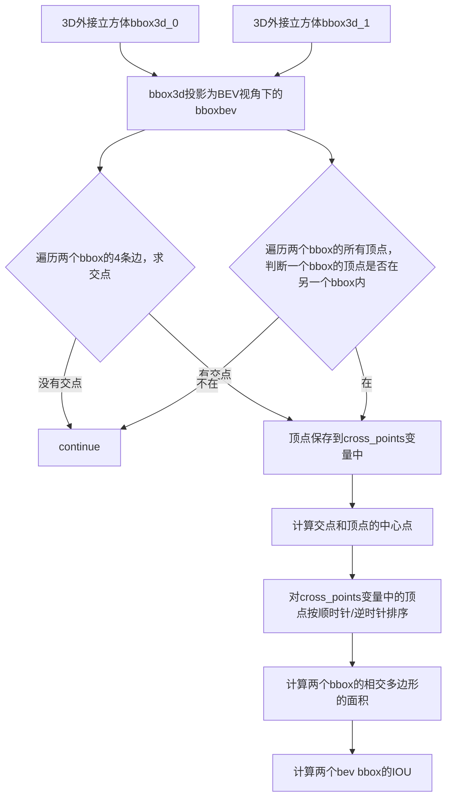

# Introduction 介绍
This is a code explaination of the IOU3D calculation in the codes.In fact the codes simplified the calculation of 3D iou by projecting 3D bbox to the ground plane and calculating the IOU of the 2D BEV bbox.
这是代码中IOU3D计算的代码解释。实际上，代码通过将3D bbox投影到地面平面并计算2D BEV bbox的IOU来简化了3D iou的计算。

# The whole pipeline & pseudo-code 整体流程伪代码
Without concern for the NMS operation, 3D bboxes in  codes can be split into modules below which can also be summarized with the pseudo-codes below. 
不考虑NMS操作，代码中3D bbox可以分为以下模块，也可以用下面的伪代码总结。
```
func IOU3D(bbox3d_0, bbox3d_1) 
{
    bboxbev_0 = bbox3d_to_bboxbev(bbox3d_0);
    bboxbev_1 = bbox3d_to_bboxbev(bbox3d_1);
    
    if(if_intersects(bboxbev_0, bboxbev_1))
    {
        intersects_points = get_intersects_points(bbobbev_0,bboxbev_1);
        points_in_another_bbox = get_points_in_another_bbox(bboxbev_0, bboxbev_1);

        points_intersect_polygon = intersects_points + points_in_another_bbox;

        intersection_area = calculate_intersection_area(points_intersect_polygon);
        area_0 = calculate_area(bboxbev_0);
        area_1 = calculate_area(bboxbev_1);
        return IOU = intersection_area / (area_0 + area_1 - intersection_area);
    }
}
```
# principle & codes explaination 原理和代码解释
## 1. bbox3d_to_bboxbev
Only x and y coordinates are needed for calculating IOU, so we can convert 3D bbox to 2D bbox by projecting 3D bbox to the ground plane.
只需要x和y坐标来计算IOU，所以我们可以通过将3D bbox投影到地面平面来将3D bbox转换为2D bbox。

```c++
double box_overlap(const double* box_a, const double* box_b) {
  // params: box_a (7) [x, y, z, dx, dy, dz, heading]
  // params: box_b (7) [x, y, z, dx, dy, dz, heading]

  double a_angle = box_a[6], b_angle = box_b[6];
  double a_dx_half = box_a[3] / 2, b_dx_half = box_b[3] / 2, a_dy_half = box_a[4] / 2,
         b_dy_half = box_b[4] / 2;
  double a_x1 = box_a[0] - a_dx_half, a_y1 = box_a[1] - a_dy_half;
  double a_x2 = box_a[0] + a_dx_half, a_y2 = box_a[1] + a_dy_half;
  double b_x1 = box_b[0] - b_dx_half, b_y1 = box_b[1] - b_dy_half;
  double b_x2 = box_b[0] + b_dx_half, b_y2 = box_b[1] + b_dy_half;

  Point center_a(box_a[0], box_a[1]);
  Point center_b(box_b[0], box_b[1]);

  Point box_a_corners[5];
  box_a_corners[0].set(a_x1, a_y1);
  box_a_corners[1].set(a_x2, a_y1);
  box_a_corners[2].set(a_x2, a_y2);
  box_a_corners[3].set(a_x1, a_y2);

  Point box_b_corners[5];
  box_b_corners[0].set(b_x1, b_y1);
  box_b_corners[1].set(b_x2, b_y1);
  box_b_corners[2].set(b_x2, b_y2);
  box_b_corners[3].set(b_x1, b_y2);

  // get oriented corners
  double a_angle_cos = cos(a_angle), a_angle_sin = sin(a_angle);
  double b_angle_cos = cos(b_angle), b_angle_sin = sin(b_angle);
}
```
## 2.calculate the polygon of the intersecting area of the two bbox if intersect 如果两个bbox相交，计算两个bbox相交区域的多边形 
If two 2D bbox intersect, then their 3D bbox may intersect. So we can use 2D bbox to filter out some 3D bbox pairs which do not intersect.In facts, we regard the 3D bboxes as intersected bboxes if there bev2d bboxes intersect.
如果两个2D bbox相交，则它们的3D bbox可能相交。因此，我们可以使用2D bbox来过滤掉一些不相交的3D bbox对。事实上，为了简化计算，如果bev2d bbox相交，则我们将3D bbox视为相交的bbox。

### 2.1 calculate the vertices of rotated bev bbox2d 计算带旋转角度的2D bbox的八个顶点
Rotated bbox are not axis-aligned, so we need to calculate the vertices of rotated bbox.The rotated bbox can be regarded as a rectangle, so we can calculate the vertices of the rectangle and then rotate them around the center of the bbox.
旋转bbox不是轴对齐的，因此我们需要计算旋转bbox的顶点。旋转bbox可以看作是一个矩形，因此我们可以计算矩形的顶点，然后将它们绕bbox的中心旋转。

```c++
  double a_angle = box_a[6], b_angle = box_b[6];
  double a_dx_half = box_a[3] / 2, b_dx_half = box_b[3] / 2, a_dy_half = box_a[4] / 2,
         b_dy_half = box_b[4] / 2;
  double a_x1 = box_a[0] - a_dx_half, a_y1 = box_a[1] - a_dy_half;
  double a_x2 = box_a[0] + a_dx_half, a_y2 = box_a[1] + a_dy_half;
  double b_x1 = box_b[0] - b_dx_half, b_y1 = box_b[1] - b_dy_half;
  double b_x2 = box_b[0] + b_dx_half, b_y2 = box_b[1] + b_dy_half;

  Point center_a(box_a[0], box_a[1]);
  Point center_b(box_b[0], box_b[1]);

  Point box_a_corners[5];
  box_a_corners[0].set(a_x1, a_y1);
  box_a_corners[1].set(a_x2, a_y1);
  box_a_corners[2].set(a_x2, a_y2);
  box_a_corners[3].set(a_x1, a_y2);

  Point box_b_corners[5];
  box_b_corners[0].set(b_x1, b_y1);
  box_b_corners[1].set(b_x2, b_y1);
  box_b_corners[2].set(b_x2, b_y2);
  box_b_corners[3].set(b_x1, b_y2);

  // get oriented corners
  double a_angle_cos = cos(a_angle), a_angle_sin = sin(a_angle);
  double b_angle_cos = cos(b_angle), b_angle_sin = sin(b_angle);

  for (int k = 0; k < 4; k++) {
    rotate_around_center(center_a, a_angle_cos, a_angle_sin, &box_a_corners[k]);
    rotate_around_center(center_b, b_angle_cos, b_angle_sin, &box_b_corners[k]);
  }

  box_a_corners[4] = box_a_corners[0];
  box_b_corners[4] = box_b_corners[0];
``` 

### 2.2 To judge if two 2D bbox intersect 判断两个2D bbox是否相交
In fact, to judge if two 2D bbox intersect is to judge if :1. there are intersecting points between any of two edges of the two bbox; 2. one bbox is inside another bbox.So we just need to find the all the intersecting points and the points inside another bbox to get the intersecting polygon of the two bbox.
实际上，判断两个2D bbox是否相交是判断：1.两个bbox的任意两条边之间是否有相交点；2.一个bbox是否在另一个bbox内。因此，我们只需要找到所有相交点和另一个bbox内的点，就可以得到两个bbox的相交多边形。

#### 2.2.1 To judge if two edges intersect and calculate crosspoint 判断两条边是否相交并求交点
##### 2.2.1.1 To judge if two edges intersect 判断两条边是否相交
The relation of two edges have three cases:1. without intersection; 2. one endpoint of an edge is inside another edge; 3. intersecting. Which is shown as follows:
两条边的关系有三种情况：1.没有相交；2.一条边的端点在另一条边内；3.相交。如下所示：

As we can see, if two edges intersect, then the angle between (AC, AD)  and the angle between (BC, BD) should have different signs.
可以看到，如果两个边相交，那么(AC, AD)的角度和(BC, BD)的角度应该有不同的符号。
Here the check_rect_cross function is used to check if two edges intersect quickly as the following calculation are time-consuming.
这里使用check_rect_cross函数来快速检查两条边是否相交，因为下面的计算是耗时的。
```c++
inline int check_rect_cross(const Point& p1, const Point& p2, const Point& q1, const Point& q2) {
  int ret = min(p1.x, p2.x) <= max(q1.x, q2.x) && min(q1.x, q2.x) <= max(p1.x, p2.x) &&
            min(p1.y, p2.y) <= max(q1.y, q2.y) && min(q1.y, q2.y) <= max(p1.y, p2.y);
  return ret;
}

inline int intersection(const Point& p1, const Point& p0, const Point& q1, const Point& q0,
                        Point* ans) {
  // fast exclusion
  if (check_rect_cross(p0, p1, q0, q1) == 0) return 0;

  // check cross standing
  double s1 = cross(q0, p1, p0);
  double s2 = cross(p1, q1, p0);
  double s3 = cross(p0, q1, q0);
  double s4 = cross(q1, p1, q0);

  if (!(s1 * s2 > 0 && s3 * s4 > 0)) return 0; // not cross
```
##### 2.2.1.2 To calculate crosspoint 计算交点
If two edges intersect, then we can calculate the crosspoint of the two edges.
如果两条边相交，则可以计算两条边的交点。
```c++
  // calculate intersection of two lines
  double s5 = cross(q1, p1, p0);
  if (fabs(s5 - s1) > EPS) {
    ans->x = (s5 * q0.x - s1 * q1.x) / (s5 - s1);
    ans->y = (s5 * q0.y - s1 * q1.y) / (s5 - s1);

  } else {
    double a0 = p0.y - p1.y, b0 = p1.x - p0.x, c0 = p0.x * p1.y - p1.x * p0.y;
    double a1 = q0.y - q1.y, b1 = q1.x - q0.x, c1 = q0.x * q1.y - q1.x * q0.y;
    double D = a0 * b1 - a1 * b0;

    ans->x = (b0 * c1 - b1 * c0) / D;
    ans->y = (a1 * c0 - a0 * c1) / D;
  }
```
The crosspoints and the following referred vertices in another bbox will be saved into polygon points vector.
交点和另一个bbox中的以下顶点将保存在多边形点向量中。
#### 2.2.2 To judge if one vertice is in another bbox 判断一个顶点是否在另一个bbox内
The function ```check_in_box2d``` receives a unrotated bbox and a rotated point, and returns if the point is in the bbox.The logic is that we rotate the point in the opposite direction of the bbox and then check if the rotated point is in the unrotated bbox, in short we rotate the point to avoid rotation of the bbox.
函数```check_in_box2d```接收一个未旋转的bbox和一个旋转的点，返回点是否在bbox内。逻辑是我们将点旋转到bbox的相反方向，然后检查旋转后的点是否在未旋转的bbox内，简而言之，我们旋转点以避免旋转bbox。
```c++
inline int check_in_box2d(const double* box, const Point& p) {
  // params: (7) [x, y, z, dx, dy, dz, heading]
  const double MARGIN = 1e-2;

  double center_x = box[0], center_y = box[1];
  double angle_cos = cos(-box[6]),
         angle_sin = sin(-box[6]);  // rotate the point in the opposite direction of box
  double rot_x = (p.x - center_x) * angle_cos + (p.y - center_y) * (-angle_sin);
  double rot_y = (p.x - center_x) * angle_sin + (p.y - center_y) * angle_cos;

  return (fabs(rot_x) < box[3] / 2 + MARGIN && fabs(rot_y) < box[4] / 2 + MARGIN);
}

// check corners
  for (int k = 0; k < 4; k++) {
    if (check_in_box2d(box_a, box_b_corners[k])) {
      poly_center = poly_center + box_b_corners[k];
      cross_points[cnt] = box_b_corners[k];
      cnt++;
    }
    if (check_in_box2d(box_b, box_a_corners[k])) {
      poly_center = poly_center + box_a_corners[k];
      cross_points[cnt] = box_a_corners[k];
      cnt++;
    }
  }

```
The vertices in another bbox and the crosspoints referred above will be saved into polygon points vector.
另一个bbox中的以下顶点和上面的交点将保存在多边形点向量中。

### 2.3 calculate the area of intersecting polygon of the two bbox 计算两个bbox的相交多边形的面积
The vertices of the intersecting polygon is composed of the crosspoints and the vertices in another bbox, which is saved in the cross_points vector.The poly_center saves the center of the intersecting polygon calculated with the mean-value of accordinations of the vertices.
相交多边形的顶点由交点和另一个bbox中的顶点组成，保存在cross_points向量中。poly_center保存相交多边形的中心，该中心是由顶点的坐标的平均值计算得出的。
```c++
Point cross_points[16];
  Point poly_center;
  int cnt = 0, flag = 0;

  poly_center.set(0, 0);
  for (int i = 0; i < 4; i++) {
    for (int j = 0; j < 4; j++) {
      flag = intersection(box_a_corners[i + 1], box_a_corners[i], box_b_corners[j + 1],
                          box_b_corners[j], &cross_points[cnt]);
      if (flag) {
        poly_center = poly_center + cross_points[cnt];
        cnt++;
      }
    }
  }

  // check corners
  for (int k = 0; k < 4; k++) {
    if (check_in_box2d(box_a, box_b_corners[k])) {
      poly_center = poly_center + box_b_corners[k];
      cross_points[cnt] = box_b_corners[k];
      cnt++;
    }
    if (check_in_box2d(box_b, box_a_corners[k])) {
      poly_center = poly_center + box_a_corners[k];
      cross_points[cnt] = box_a_corners[k];
      cnt++;
    }
  }

  poly_center.x /= cnt;
  poly_center.y /= cnt;

  // sort the points of polygon
  Point temp;
  for (int j = 0; j < cnt - 1; j++) {
    for (int i = 0; i < cnt - j - 1; i++) {
      if (point_cmp(cross_points[i], cross_points[i + 1], poly_center)) {
        temp = cross_points[i];
        cross_points[i] = cross_points[i + 1];
        cross_points[i + 1] = temp;
      }
    }
  }
```
The area of the intersecting polygon of the two bbox can be calculated by the Triangulation method.
两个bbox的相交多边形的面积可以通过三角剖分法计算。
First, we sort the vertices of the polygon to make sure that the vertices are in the clockwise/anti-clockwise order.
首先，我们对多边形的顶点进行排序，以确保顶点按顺时针/逆时针顺序排列。
```c++
  poly_center.x /= cnt;
  poly_center.y /= cnt;

  // sort the points of polygon
  Point temp;
  for (int j = 0; j < cnt - 1; j++) {
    for (int i = 0; i < cnt - j - 1; i++) {
      if (point_cmp(cross_points[i], cross_points[i + 1], poly_center)) {
        temp = cross_points[i];
        cross_points[i] = cross_points[i + 1];
        cross_points[i + 1] = temp;
      }
    }
  }
```
Then we calculate the area of the polygon by the Triangulation method.The function ```cross``` is used to calculate the cross product of two vectors which is the area of the parallelogram composed of the two vectors, and then we calculate the area of the triangle by the half of the parallelogram.
然后通过将多边形三角剖分法计算多边形的面积。```cross```函数用于计算两个向量的叉积，它是由两个向量组成的平行四边形的面积，然后我们通过平行四边形的一半计算三角形的面积。
```c++
inline double cross(const Point& a, const Point& b) { return a.x * b.y - a.y * b.x; }
// get the overlap areas
  double area = 0;
  for (int k = 0; k < cnt - 1; k++) {
    area += cross(cross_points[k] - cross_points[0], cross_points[k + 1] - cross_points[0]);
  }

  return fabs(area) / 2.0;
```
## 3. calculate the IOU of the two bev bboxes 计算两个bev bbox的IOU
$ IoU(bbox_0, bbox_1) = \frac {Area(IntersectPolygon(bbox_0, bbox_1))}{(Area(bbox_0)+Area(bbox_1)-Area(IntersectPolygon(bbox_0, bbox_1)))} $
The IoU of the two bev bboxes can be calculated by the formula above.The variables in the formula are calculated in the previous steps.
两个bev bbox的IoU可以通过上面的公式计算。公式中的变量在前面的步骤中计算。
```c++
double iou_bev(const double* box_a, const double* box_b) {
  // params: box_a (7) [x, y, z, dx, dy, dz, heading]
  // params: box_b (7) [x, y, z, dx, dy, dz, heading]
  double sa = box_a[3] * box_a[4];
  double sb = box_b[3] * box_b[4];
  double s_overlap = box_overlap(box_a, box_b);
  return s_overlap / fmaxf(sa + sb - s_overlap, EPS);
}
```
# Flowchart 流程图

