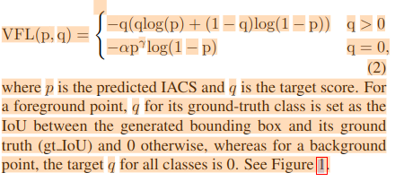

Code Project: new-YOLOv1_PyTorch
BaseLine：原代码中的初始模型

改进方式一：FPN

1. 加入FPN模块，在多个尺度的特征图上进行预测；
2. BiFPN实现
3. AugFPN实现

改进方式二：Loss

1. FocalLoss实现+应用:

   [Focal Loss在分类loss中的应用](/content/posts/experiments_for_papers/focalloss.md)

   1.1 PolyFocalLoss

   1.2 VariFocalLoss:
2. IoULoss:

   [IoU及其改进形式](https://learnopencv.com/iou-loss-functions-object-detection/#iou-based-loss-functions)

   2.1 GIoULoss

改进方式三：Attention

改进方式四：layer、算子结构优化

其他改进方式：

1. EMA
2. DHSA
3. IoU Aware
   FCOS?ATSS?CenterNet

# Multi Head FPN VS BaseLine Table

## Based on new-YOLOv1_PyTorch

## 0.Baseline

| Model    | mAP(07test) | LogFile                                |
| -------- | ----------- | -------------------------------------- |
| BaseLine | 0.6709      | eval_log/log_eval_416X416_160_baseline |

## 1.FPNs

### 1.1 Origin FPN

| Model            | mAP(07test) | LogFile                                                          |
| ---------------- | ----------- | ---------------------------------------------------------------- |
| BaseLine         | 0.6709      | eval_log/log_eval_416X416_160_baseline                           |
| FPN/MultiHeadFPN | 0.7149      | eval_log/log_eval_myYOLOWithFPNMultiPred_with_sam_for_3_head_142 |

### 1.2 BiFPN

| Model                                                    | mAP(07test) | LogFile                                                                    |
| -------------------------------------------------------- | ----------- | -------------------------------------------------------------------------- |
| BaseLine                                                 | 0.6709      | eval_log/log_eval_416X416_160_baseline                                     |
| FPN/MultiHeadFPN                                         | 0.7149      | eval_log/log_eval_myYOLOWithFPNMultiPred_with_sam_for_3_head_142           |
| FPN/MultiHeadBiFPN upsample nearest                      | 0.7211      | eval_log/log_eval_myYOLOWithBiFPNMultiPred_with_sam_for_3_head_140         |
| FPN/MultiHeadBiFPNFocalLoss alpha=0.25 upsample bilinear | 0.7112      | eval_log/log_myYOLOWithBiFPNMultiPredFocalLoss_alpha0.25_bilinear_yolo_140 |

### 1.3 AugFPN

| Model                                                     | mAP(07test) | LogFile                                                                     |
| --------------------------------------------------------- | ----------- | --------------------------------------------------------------------------- |
| FPN/MultiHeadFPN                                          | 0.7149      | eval_log/log_eval_myYOLOWithFPNMultiPred_with_sam_for_3_head_142            |
| FPN/MultiHeadAugFPN upsample nearest                      | 0.7170      | eval_log/log_myYOLOWithAugFPNMultiPred_yolo_150                             |
| FPN/MultiHeadAugFPNFocalLoss alpha=0.25 upsample bilinear | 0.7180      | eval_log/log_myYOLOWithAugFPNMultiPredFocalLoss_alpha0.25_bilinear_yolo_150 |

- When BiFPN's upsample's mode changed from nearest to bilinear, the mAP dropped. When AugFPN, mAP increased. So the code of BiFPN remains as nearest mode, AugFPN bilinear.

# Different Losses

## 2.Losses

### 2.1 FocalLoss: PaperMode blog

- MultiHeadFPN+FocalLoss

| Model                                 | mAP(07test) | LogFile                                                          |
| ------------------------------------- | ----------- | ---------------------------------------------------------------- |
| FPN/MultiHeadFPN                      | 0.7149      | eval_log/log_eval_myYOLOWithFPNMultiPred_with_sam_for_3_head_142 |
| Loss/MultiHeadFPNFocalloss alpha=0.75 | 0.6742      | eval_log/                                                        |
| Loss/MultiHeadFPNFocalloss alpha=0.5  | 0.6964      | eval_log/log_myYOLOWithFPNMultiPredFocalLoss_yolo_143_new        |
| Loss/MultiHeadFPNFocalloss alpha=0.25 | 0.7121      | eval_log/log_myYOLOWithFPNMultiPredFocalLoss_alpha0.25_yolo_154  |

- BiFPN+FocalLoss

| Model                                   | mAP(07test) | LogFile                                                           |
| --------------------------------------- | ----------- | ----------------------------------------------------------------- |
| FPN/MultiHeadFPN                        | 0.7149      | eval_log/log_eval_myYOLOWithFPNMultiPred_with_sam_for_3_head_142  |
| Loss/MultiHeadBiFPNFocalLoss alpha=0.5  | 0.6975      | eval_log/log_myYOLOWithBiFPNMultiPredFocalLoss_yolo_152           |
| Loss/MultiHeadBiFPNFocalLoss alpha=0.25 | 0.7201      | eval_log/log_myYOLOWithBiFPNMultiPredFocalLoss_alpha0.25_yolo_141 |

- AugFPN+FocalLoss

| Model                                    | mAP(07test) | LogFile                                                            |
| ---------------------------------------- | ----------- | ------------------------------------------------------------------ |
| FPN/MultiHeadFPN                         | 0.7149      | eval_log/log_eval_myYOLOWithFPNMultiPred_with_sam_for_3_head_142   |
| Loss/MultiHeadAugFPNFocalLoss alpha=0.5  | 0.6922      | eval_log/log_myYOLOWithAugFPNMultiPredFocalLoss_yolo_143           |
| Loss/MultiHeadAugFPNFocalLoss alpha=0.25 | 0.7128      | eval_log/log_myYOLOWithAugFPNMultiPredFocalLoss_alpha0.25_yolo_154 |

### 2.2 PolyFocalLoss

| Model                                                | mAP(07test) | LogFile                                                          |
| ---------------------------------------------------- | ----------- | ---------------------------------------------------------------- |
| FPN/MultiHeadFPN                                     | 0.7149      | eval_log/log_eval_myYOLOWithFPNMultiPred_with_sam_for_3_head_142 |
| Loss/MultiHeadFPNPolyLossFL poly_scale=1 poly_pow=1  | 0.7182      |                                                                  |
| Loss/MultiHeadFPNPolyLossFL poly_scale=1 poly_pow=2  | 0.7187      |                                                                  |
| Loss/MultiHeadFPNPolyLossFL poly_scale=1 poly_pow=3  | 0.7199      |                                                                  |
| Loss/MultiHeadFPNPolyLossFL poly_scale=-1 poly_pow=1 | 0.7073      |                                                                  |
| Loss/MultiHeadFPNPolyLossFL poly_scale=-1 poly_pow=2 | 0.7204      |                                                                  |
| Loss/MultiHeadFPNPolyLossFL poly_scale=-1 poly_pow=3 | 0.7212      |                                                                  |

### 2.3 VariFocalLoss

最终预测生成的IACS兼顾了模型的IoU和Probablity两个条件，可以更好地应用于NMS，作为NMS中的排序指标。

### 2.4 IoU Loss

IoU Loss

| Model                                                                                                                 | mAP(07test) | LogFile                                                                             |
| --------------------------------------------------------------------------------------------------------------------- | ----------- | ----------------------------------------------------------------------------------- |
| FPN/MultiHeadFPN                                                                                                      | 0.7149      | eval_log/log_eval_myYOLOWithFPNMultiPred_with_sam_for_3_head_142                    |
| IoULoss replace origin txtytwth loss                                                                                  | 0.558       | log_myYOLOWithFPNMultiPredWithIoULoss_iouweight10_yolo_160                          |
| 添加中心点距离最近的target assign机制，避免按label顺序匹配gt object对应的特征点，IoULoss replace origin txtytwth loss | 0.571       | log_myYOLOWithFPNMultiPredWithIoULoss_iouweight10_targetassian_by_min_dist_yolo_160 |

GIoULoss

| Model                                 | mAP(07test) | LogFile                                                                                                 |
| ------------------------------------- | ----------- | ------------------------------------------------------------------------------------------------------- |
| FPN/MultiHeadFPN                      | 0.7149      | eval_log/log_eval_myYOLOWithFPNMultiPred_with_sam_for_3_head_142                                        |
| GIoULoss replace origin txtytwth loss | 0.6674      | log_myYOLOWithFPNMultiPredWithGIoULoss_SGD_iouweight1_tvgiouloss_sum_target_assign_by_min_dist_yolo_130 |

DIoULoss

CIoULoss

SIoULoss

 EIoULoss

Luxury IoU Loss:

|                                                             |     |
| ----------------------------------------------------------- | --- |
| condition                                                   | mAP |
| txtytwth_iou_weightsum_loss = txtytwth_loss + giou_loss * 1 |     |

### 2.5 IoU Aware OD
