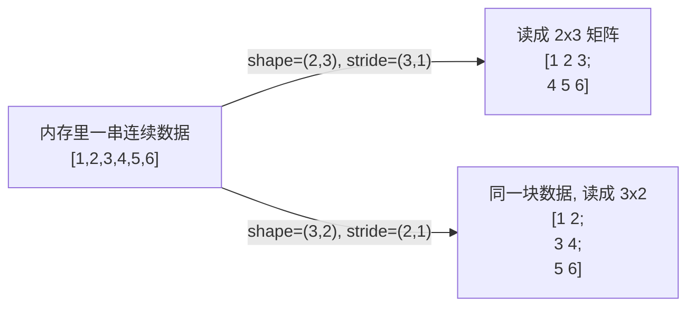

> 这份笔记聚焦**实战中真正会踩的坑 + 面试高频问的 Python / PyTorch 基础**，不堆 API 文档。
> 核心四件套：`transpose` / `permute` / `reshape` / `view`（§1 精准对比），Python 易错基础（§2），PyTorch 工程坑（§3），面试速答（§4）。

---

# 1. shape 四兄弟：transpose / permute / reshape / view

## 1.1 先建直觉：tensor = 一块连续数据 + "怎么读"的描述

PyTorch（和 NumPy）的 tensor 在内存里就是**一串连续的数**，外加两个元信息：

- **shape**：每一维多大
- **stride**：沿每一维前进一格，要在内存里跳多少个元素



**关键**：很多 shape 操作**不动数据**，只改 `shape`/`stride`（即改"怎么读"）→ 这种操作返回的是 **view（视图，共享同一块内存）**。理解了这点，下面四兄弟就通了。

## 1.2 `transpose` vs `permute`（都是"改维度顺序"，返回 view）

| | `transpose(dim0, dim1)` | `permute(*dims)` |
|---|---|---|
| 作用 | **只交换两个维度** | **重排所有维度**（给出完整新顺序） |
| 参数 | 2 个（要交换的两轴） | 必须列出**全部**维度的新顺序 |
| 返回 | view（共享数据） | view（共享数据） |
| 是否复制数据 | 否 | 否 |
| 典型用途 | 2D 转置、交换某两个轴 | NCHW↔NHWC 等任意维度重排 |

```python
x = torch.randn(2, 3, 4)          # 比如 (N, C, H)
# 只交换第 0、1 维:
t = x.transpose(0, 1)             # (3, 2, 4)
# 把 (N,C,H) 变成 (N,H,C) —— 一次 permute 全指定:
p = x.permute(0, 2, 1)            # (2, 4, 3)
# ⚠ permute 必须列全所有维度, 不能只写要换的
```

**关系**：`transpose` 是 `permute` 的特例（只换两维）；要换多个维度只能用 `permute` 或多次 `transpose`。

**两个都会让 tensor 变 non-contiguous**（因为读的顺序被打乱了），后面想 `view` 就会报错（见 §1.4）。

**易混 `.T`**：`.T` 是把**所有维度逆序**（不只最后两维！）。对 2D 等于矩阵转置；但对 `>2D` 会把整条顺序反过来，常和"只想转最后两维"的预期冲突 → 想转最后两维用 `.mT`（PyTorch≥1.9）。

## 1.3 `reshape` vs `view`（都是"改形状"，元素总数不变）

| | `view(*shape)` | `reshape(*shape)` |
|---|---|---|
| 返回 | **一定是 view**（绝不复制） | **能 view 就 view，不能就 copy** |
| contiguous 要求 | **要求 tensor 是 contiguous 的**，否则报错 | 不要求，会自动处理 |
| 是否可能复制数据 | 否 | 是（不 contiguous 时会 copy） |
| 建议 | 确定要 view 且确认 contiguous 时用 | **默认用 reshape**，更安全不报错 |

```python
x = torch.randn(6, 4)             # contiguous
v = x.view(3, 8)                 # OK, 共享数据
r = x.reshape(2, 12)             # OK

# 把 x 变 non-contiguous:
y = x.transpose(0, 1)           # y 是 non-contiguous
# y.view(24)                    # ❌ RuntimeError: view size is not compatible...
y.reshape(24)                   # ✅ 自动 copy 一份
y.contiguous().view(24)         # ✅ 先显式 copy 成 contiguous 再 view
```

**`contiguous()`**：如果已经是 contiguous 就原样返回；否则**拷一份**重排成内存连续。`reshape` 内部就是这么做的。

**坑**：`reshape` **不保证**返回的是 view（不 contiguous 时是 copy）→ **别假设它和原 tensor 共享内存**，改了一个别指望另一个跟着变。

## 1.4 四兄弟总表 + 高频坑

| 函数 | 改的是 | 参数 | 返回 | contiguous 要求 | 复制数据? |
|---|---|---|---|---|---|
| `transpose(d0,d1)` | 维度顺序 | 2 维 | view | — | 否 |
| `permute(*dims)` | 维度顺序 | 全部维 | view | — | 否 |
| `view(*shape)` | 形状 | 形状 | view | **要求 contiguous** | 否 |
| `reshape(*shape)` | 形状 | 形状 | view 或 copy | 不要求 | 可能 |

**高频坑**：

1. **permute/transpose 之后立刻 view → 报错**：因为变 non-contiguous 了。→ 用 `reshape` 或先 `.contiguous()`。
2. **以为 reshape 是 view**：改了 reshape 出来的 tensor，原 tensor 不一定变（如果是 copy 就不变）。
3. **`.T` 对 >2D tensor**：反转所有维度，不是转最后两维 → 用 `.mT`。
4. **`view(-1)` / `reshape(-1)`**：`-1` 是"自动推断这一维"，只能出现一次。

**关联操作速记**：
- `squeeze()` / `unsqueeze(d)`：去掉 / 增加长度为 1 的维度（返回 view）。
- `flatten(s,e)`：把若干维拉平（类似 reshape，多返回 view）。
- `expand(...)` / `expand_as()`：把大小为 1 的维**广播**扩大（**不复制数据**，view，stride=0）。
- `repeat(...)`：复制扩充（**真复制数据**，新内存）→ 比 `expand` 费内存，能用 `expand` 就别用 `repeat`。

---

# 2. Python 易错基础

## 2.1 参数传递：Python 是"按赋值传递"（pass by assignment）

不是值传递也不是引用传递，准确说法是 **pass by assignment / by object reference**：函数参数就是一次赋值，形参和实参**绑定到同一个对象**。

```python
def f(a, b):
    a = a + 1          # 不可变对象(int): 重新赋值 → a 指向新对象, 外部不影响
    b.append(99)       # 可变对象(list): 原地修改 → 外部看得到变化

x, y = 1, [1, 2]
f(x, y)
print(x, y)            # 1 [1, 2, 99]   ← x 没变, y 变了
```

**规则**：
- **不可变对象**（int/float/str/tuple/frozenset）：在函数里"改"它，其实是重新赋值，外部不影响。
- **可变对象**（list/dict/set）：函数里 `append`/`[:]` 等**原地修改**，外部看得到。
- 但函数里 `b = [...]`（重新绑定）也不影响外部——区别在于"改对象内容" vs "换一个对象"。

## 2.2 可变默认参数（最高频面试坑之一）

```python
def add(x, lst=[]):        # ❌ 默认值在 def 时只求值一次, 所有调用共享同一个 list!
    lst.append(x)
    return lst
add(1); add(2)             # [1, 2]  —— 期望 [2], 实际累积了!
```

**正解**：用 `None` 作哨兵：
```python
def add(x, lst=None):
    lst = lst or []
    lst.append(x); return lst
```

## 2.3 赋值 / 浅拷贝 / 深拷贝

```python
import copy
a = [[1, 2], [3, 4]]

b = a                       # 赋值: 不拷贝, b 和 a 是同一个对象
c = copy.copy(a)            # 浅拷贝: 新外层 list, 但内层元素还是同一引用
d = copy.deepcopy(a)        # 深拷贝: 递归全拷贝

a[0].append(99)
# b[0] == [1,2,99]   (同一对象)
# c[0] == [1,2,99]   (浅拷贝, 内层共享)  ← 常被坑
# d[0] == [1,2]      (深拷贝, 完全独立)
```

- 浅拷贝的几种写法（等价）：`copy.copy(x)`、`x.copy()`、`x[:]`（list）、`dict.copy()`、`list(x)`。
- **嵌套结构一定用 `deepcopy`**，浅拷贝只拷最外层。

## 2.4 常见操作返回 view / copy 速查

| 操作 | list | numpy | torch |
|---|---|---|---|
| 切片 `a[1:3]` | 浅拷贝(新 list) | **view** | **view** |
| fancy 索引 `a[[0,2]]` | — | **copy** | **copy** |
| 布尔 mask `a[a>0]` | — | **copy** | **copy** |
| `.copy()` / `.clone()` | 新对象 | copy | **copy** |
| `a.T` | — | view | view |
| `a.reshape(...)` | — | view 或 copy | view 或 copy |
| `a.flatten()` | — | **copy** | view |
| `a.ravel()` | — | view 或 copy | — |

> 经验：**凡是"挑出一部分元素"的操作（索引/mask）基本都是 copy；凡是"换读法/形状"的操作基本都是 view**。

## 2.5 `is` vs `==`

- `is`：判断是不是**同一个对象**（身份，比 `id()`）。
- `==`：判断**值是否相等**（可被 `__eq__` 重载）。
- **小整数缓存**（`-5~256`）和**字符串 intern** 会让 `is` 偶然成立，但别依赖。
- 判 `None` **永远用 `is None`**（`== None` 可能被重载出怪行为）。

## 2.6 `+=` 的行为差异

```python
a = [1, 2]; print(id(a)); a += [3]; print(id(a))   # id 不变 → 原地 extend (调 __iadd__)
b = (1, 2); b += (3,)                                # int/tuple 不可变 → 创建新对象 (rebind)
```
对可变对象 `+=` 是**原地改**；对不可变对象 `+=` 是**重新绑定**。

## 2.7 闭包 / lambda 延迟绑定

```python
fs = [lambda: i for i in range(3)]
print([f() for f in fs])    # [2, 2, 2]  不是 [0,1,2]! 闭包捕获的是变量名 i, 循环结束时 i=2
# 修复: 用默认参数立刻固定
fs = [lambda i=i: i for i in range(3)]
```

## 2.8 其他高频小坑

- **`round()` 是"银行家舍入"**（四舍六入五成双）：`round(0.5)==0`、`round(1.5)==2`、`round(2.5)==2`。
- **`0.1 + 0.2 == 0.3` → `False`**（浮点二进制无法精确表示）。
- **`//` 是向下取整**：`-7 // 2 == -4`（不是 -3）；`%` 的符号跟除数。
- **遍历中修改 list / dict**：dict 会 `RuntimeError`；list 行为未定义。要边遍历边删，先复制一份或用推导式。
- **`*args` 是 tuple（不可变），`**kwargs` 是 dict**。
- **`copy` 模块的 `copy` vs `deepcopy`**：见 §2.3。

---

# 3. PyTorch 工程易混 / 坑

## 3.1 `detach()` vs `torch.no_grad()`（高频面试）

| | `tensor.detach()` | `with torch.no_grad():` |
|---|---|---|
| 作用范围 | **切某个 tensor** 出计算图 | **整个上下文**里的操作都不建图 |
| 效果 | 返回共享数据、`requires_grad=False` 的新 tensor；原 tensor 仍在图里 | 上下文内所有操作不追踪梯度、不存中间态 |
| 典型用途 | 把 teacher 的输出当 label（DINO/EMA）、把 loss 标量取出画图 | **推理 / 评估**：省显存、加速 |
| 是否影响反向传播 | 只对那个 tensor；其它正常 | 上下文里都没有 grad |

记忆：**`detach` 切一条边，`no_grad` 关一整片**。

## 3.2 `model.eval()` vs `torch.no_grad()`（不同维度，两个都要）

- **`model.eval()`**：改模型**行为**——关 Dropout、BN 用 running mean/var（不再用当前 batch 统计）。**不影响梯度图**。
- **`torch.no_grad()`**：**不建梯度图**、省显存。**不改模型行为**（Dropout/BN 不受影响）。
- **推理/评估时两个都要**：`model.eval()` + `with torch.no_grad():`。只 `eval()` 不 `no_grad` 会白存梯度；只 `no_grad` 不 `eval` 会让 BN/Dropout 仍是训练态 → 结果错。
- 训练前记得 `model.train()` 切回。

## 3.3 dtype / 索引类型坑

- **整数索引必须是 `LongTensor`（int64）**：`idx = torch.tensor([0, 2])` 默认 int64 ✓；但 `torch.tensor([0, 2], dtype=torch.int32)` 作索引会报错。
- **乘法 / 矩阵乘要求 dtype 一致**：`int * float` 直接报错，要 `.float()`。
- **布尔 mask 必须是 `bool` 类型**：`x[x > 0]` 里 `x>0` 是 bool；别拿 int 的 0/1 当 mask。
- `torch.tensor([1,2])` 默认 int64；`torch.tensor([1.0,2.0])` 默认 float32；`torch.zeros(3)` 默认 float32。

## 3.4 in-place 操作 vs autograd（`_` 后缀全家桶）

PyTorch 里**方法名末尾的 `_`** 就是"in-place（原地）"标记——它**直接修改调用它的 tensor**（复用同一块内存、返回自己），而不是新建一个。这**不是只有 `add_`**，而是一整族：

| 类别 | 非原地（新建 tensor） | 原地 `_`（改自己） |
|---|---|---|
| 加 | `x + y` / `torch.add(x,y)` / `x.add(y)` | `x.add_(y)` / `x += y` |
| 乘 / 除 / 减 | `x * y` / `x.mul(y)` / `x.div` / `x.sub` | `x.mul_(y)` / `x.div_` / `x.sub_` |
| 填充 | — | `x.fill_(v)` / `x.zero_()` / `x.fill_diagonal_(v)` |
| 复制 | `x.clone()` | `x.copy_(y)` |
| 散射 / 索引写 | — | `x.scatter_(...)` / `x.index_fill_(...)` / `x.index_add_(...)` |
| 裁剪 | `torch.clamp(x,...)` | `x.clamp_(...)` |
| 激活 | `F.relu(x)` | `x.relu_()` / `x.sigmoid_()` |

**五种"加法"写法对比**（直观看出 in-place 的差别）：

```python
x = torch.randn(4); y = torch.randn(4)
# —— 下面四种都是【非原地】: 新建结果 tensor, 原 x/y 不变, autograd 安全 ——
z1 = x + y
z2 = torch.add(x, y)
z3 = x.add(y)
z4 = x.add(y, alpha=a)        # = x + a*y, 仍非原地
# —— 下面是【原地】: 直接改 x(同一对象/同一块内存), 返回 x 自己, 没有 z ——
x.add_(y, alpha=a)            # x ← x + a*y
x += y                        # tensor 上等价 in-place(调 __iadd__, id 不变)
```

**记忆**：`_` 后缀 = "改自己、省一块内存，但有 autograd 风险"。注意 `x += y` 对 **tensor** 是 in-place（和 Python list 一样，见 §2.6），但对**不可变对象**（int/tuple）是重新绑定——别混。

**为什么 in-place 会破坏 autograd（版本计数器 version counter）**

每个 tensor 内部有个版本号 `_version`，每次被**原地修改**就 +1。autograd 前向时会把"反向需要的中间 tensor"存起来并记下当时的版本；反向时若发现版本对不上（中途被原地改过）就报错——因为反向的数学公式依赖那个**原始值**，已经被你覆盖了。两种典型报错：

```
RuntimeError: a leaf Variable that requires grad is being used in an in-place operation
RuntimeError: one of the variables needed for gradient computation has been modified
by an inplace operation: [...], is at version 1; expected version 0 instead.
```

**真实案例（DINOv2 复现里 KoLeo 损失踩的坑）**：`cdist` 的反向需要距离矩阵本身（欧氏距离 $d_{ij}=\|x_i-x_j\|$ 的导数含 $1/d_{ij}$），但用 `fill_diagonal_` **原地**改了它 → 反向版本校验失败：

```python
dist = torch.cdist(x, x)          # 反向要用到 dist
dist.fill_diagonal_(float('inf')) # ❌ 原地改 → version 1, backward 崩
# 正解: 用【非原地】方式置对角(加一个 inf 对角阵, 不碰原 dist):
dist = dist + torch.diag(torch.full((n,), float('inf')))
```

**什么时候 in-place 安全 / 怎么修**：

- ✅ 对**不需要梯度**的 tensor（`torch.no_grad()` 里、EMA 更新、teacher 目标）做 in-place 没事——没有反向图要保护。DINO 里 `center.mul_(m).add_(...)` 就是 no_grad 里的原地 center 更新，安全。
- ✅ 对带梯度的**叶子**直接原地改通常报错；对**中间结果**原地改，只有当它**没被反向公式需要**时才安全（很难判断，干脆别赌）。
- 🔧 **修复套路**：① 换非原地版（`fill_diagonal_` → `+ diag`、`add_` → `add`）；② 先 `.clone()` 一份再原地改（clone 出来的新 tensor 不在原图关键路径上）；③ 用 `out=` 显式接收结果到一块新内存。

> 关于 `.data`：旧代码 `x.data.add_(...)` 绕过检查是**危险遗留写法**——它静默破坏计算图还**不报错**，更难 debug（见 §3.6）。永远用 `.detach()` 或老老实实非原地。

## 3.5 `.item()` / `.cpu()` / `.numpy()` 链

- `.item()`：单元素 tensor → Python 标量（会同步 GPU，别在循环里频繁调，慢）。
- `.numpy()`：要求 **CPU + `requires_grad=False`**。GPU tensor 要先 `.cpu()`；带梯度的要 `.detach()`。
- 安全拿数组：`arr = tensor.detach().cpu().numpy()`（这串顺序是标准写法）。

## 3.6 `.data` vs `.detach()`（用 `.detach()`）

- `.data`：**遗留写法**，返回无梯度 tensor，但**不会**进 autograd 的版本检查 → 可能静默破坏计算图，难 debug。
- `.detach()`：**推荐**，安全，会被 autograd 追踪版本。**永远用 `.detach()`**。

## 3.7 损失 reduction / 别重复套 log

- `F.cross_entropy(logits, target)` 默认 `reduction='mean'`；`'sum'` / `'none'`（逐元素，自己 reduce）。
- **`cross_entropy` 内部已含 `log_softmax + nll_loss`** → 别先 `log_softmax` 再喂 `cross_entropy`（等于算了两次 log）。
- 想自己控制：先 `log_softmax` 再 `F.nll_loss`。

## 3.8 `gather` / `scatter_` / `index_select` / `masked_fill`

```python
# gather: 按索引沿某维"挑"元素。常用于按类别 id 取 logit
logits  = torch.randn(4, 10)            # (B, C)
labels  = torch.tensor([1, 0, 9, 3])    # (B,)
picked  = logits.gather(1, labels.view(-1, 1))   # (B, 1), 每行挑出 label 对应的 logit

# scatter_: gather 的逆, 把值写回指定位置
# masked_fill: 把满足 mask 的位置填成某值 (GPT 里 future mask 填 -inf 常用)
attn = attn.masked_fill(future_mask == 0, float('-inf'))
```
`gather` 记忆：`out[i][j] = input[i][ index[i][j] ]`（沿 `dim` 那维按 index 取）。

## 3.9 显存管理 / 梯度累积

- **梯度默认累积**：不 `optimizer.zero_grad()` 就会在上次基础上累加 → 这既是坑也是特性（**梯度累积**用来模拟更大 batch）。
- `loss.backward()` 默认 `retain_graph=False`，反向后**释放计算图**；要二次反向需 `retain_graph=True`。
- 别长时间持有中间大 tensor 的引用（如把每层输出 append 到 list），会爆显存。
- `torch.cuda.empty_cache()` 只把 PyTorch 缓存的空闲块还给系统，**不会**释放正在用的 tensor；指望它"省显存"是误解。

## 3.10 可复现性

```python
import torch, random, numpy as np
seed = 42
random.seed(seed); np.random.seed(seed); torch.manual_seed(seed)
torch.cuda.manual_seed_all(seed)
# 完全确定(可能更慢):
torch.backends.cudnn.deterministic = True
torch.backends.cudnn.benchmark = False
torch.use_deterministic_algorithms(True)
# ⚠ DataLoader 多 worker 时, 每个 worker 还要在 worker_init_fn 里再 seed 一次
```
**坑**：`DataLoader(num_workers>0)` 的 worker 有各自独立的随机状态，不在 worker 里重新 seed 就不可复现。

## 3.11 `nn.Module` 的 buffer vs parameter

- `nn.Parameter`：**会被优化器更新**，随 `.to()` 搬动，进 `state_dict`。
- `register_buffer`：**不参与梯度/优化**，但随 `.to()` 搬动、进 `state_dict`。用于**非可训练但要跟着模型走**的东西：BN 的 `running_mean/var`、EMA 的动量、DINO 的 `centering` 向量、pos_embed（其实是 Parameter，但概念类似）。
- 纯 `self.xxx = torch.Tensor(...)`：**不会**随 `.to()` 搬、不进 `state_dict` → 模型搬到 GPU 它还在 CPU，是常见 bug。

## 3.12 `register_buffer` / `.to()` / device 一致性

- `tensor.to(device)` **返回新 tensor**（设备不同时），要 `x = x.to(dev)`。
- `module.to(device)` 是 **in-place**（`model = model.to(dev)` 也行，但不必赋值）。
- **报错 `Expected all tensors on the same device`** = 有 tensor 在 CPU、有在 GPU，最常见就是某个 buffer/常量没 `.to(dev)`。

## 3.13 多卡：`DataParallel` vs `DistributedDataParallel`

- `nn.DataParallel`（DP）：单进程多线程，受 GIL 拖累，输出汇总到 `cuda[0]`（显存不均），慢。**不推荐**。
- `DistributedDataParallel`（DDP）：每卡一个进程，靠 NCCL 通信，**推荐**。但样板代码多（`init_process_group`、`DistributedSampler`、`set_device`）。
- DP 坑：模型必须在 `cuda[0]`、小 batch 会被均分到各卡可能不够分、BN 用的是各卡各自 batch 统计（不是 sync-BN）。

## 3.14 softmax 的 `dim` 与数值稳定

- `softmax(x, dim=-1)`：沿 `dim` 求和为 1。**`dim` 给错是最常见错误**。
- 数值稳定：内部会减最大值（PyTorch 的 `softmax`/`log_softmax` 已做），别自己手撸 `exp` 再除。
- `log_softmax` 比 `log(softmax())` 数值更稳，**永远用 `log_softmax`**。

---

# 4. 高频面试速答（一问一答）

**Q: `view` 和 `reshape` 区别？**
A: `view` 必须 contiguous、一定返回 view（不复制）；`reshape` 不要求 contiguous，能 view 就 view、不能就自动 copy。默认用 `reshape` 更安全。

**Q: `transpose` 和 `permute` 区别？**
A: `transpose` 只换两个维度（2 个参数）；`permute` 给出全部维度的新顺序。都返回 view、都把 tensor 变 non-contiguous。

**Q: 为什么 `permute` 之后 `view` 会报错？**
A: `permute` 让读数据的顺序和内存布局不一致 → tensor 变 non-contiguous，`view` 要求 contiguous。加 `.contiguous()` 或改用 `reshape`。

**Q: `.T` 在高维 tensor 上做什么？**
A: 把**所有维度**逆序，不是只转最后两维。想转最后两维用 `.mT`。

**Q: Python 的参数是值传递还是引用传递？**
A: 都不是，是"按赋值传递"（pass by assignment）：形参绑定到同一对象；不可变对象重赋值不影响外部，可变对象原地修改会影响外部。

**Q: 可变默认参数为什么是坑？**
A: 默认值在 `def` 时只求值一次，所有调用共享同一个对象 → 累积污染。用 `None` 哨兵解决。

**Q: `model.eval()` 和 `torch.no_grad()` 区别？**
A: `eval()` 改模型行为（关 Dropout、BN 用 running 统计）；`no_grad()` 关梯度图、省显存。推理两个都要。

**Q: `detach()` 和 `no_grad()` 区别？**
A: `detach` 切某个 tensor 出图；`no_grad` 关整个上下文的梯度追踪。

**Q: `.data` 和 `.detach()` 区别？**
A: `.data` 是遗留、不进版本检查、会静默破坏计算图；`.detach()` 安全、推荐。

**Q: `x.add_(y)` 和 `x.add(y)` / `x + y` 有什么区别？为什么 in-place 会报错？**
A: `add_`（带 `_` 后缀）是**原地**：直接改 `x`、复用内存、返回 `x` 自己；`add` / `+` 是**非原地**：新建结果 tensor。`_` 后缀是整族的标记（`mul_`/`fill_`/`copy_`/`fill_diagonal_`/`scatter_`…都是原地）。带梯度的 tensor 原地改会触发 autograd 的**版本计数器**报错（反向需要那个原始中间值，被你覆盖了）。修复：换非原地版、或先 `.clone()`、或放进 `torch.no_grad()`（teacher/EMA 更新就这么干，安全）。

**Q: 梯度为什么会"累积"？**
A: `backward()` 把梯度**加到** `.grad` 上（不是覆盖），不 `zero_grad()` 就一直在上一次基础上累加。这也是**梯度累积**（用小 batch 模拟大 batch）的原理。

**Q: `cross_entropy` 要不要先 `softmax`？**
A: 不要。`cross_entropy` 内部已含 `log_softmax + nll_loss`，先 softmax/log_softmax 等于算两遍 log。

**Q: 怎么让训练可复现？**
A: 设 `random/np/torch/cuda` 的 seed + `cudnn.deterministic=True` + `use_deterministic_algorithms(True)`，且 DataLoader 多 worker 要在 `worker_init_fn` 里重新 seed。

**Q: `register_buffer` 和 `Parameter` 区别？**
A: `Parameter` 参与优化、有梯度；`buffer` 不优化（如 BN 的 running stats、DINO 的 center）。两者都随 `.to()` 搬、都进 `state_dict`。纯 `self.x = torch.Tensor(...)` 不会随模型走，是常见 bug。
