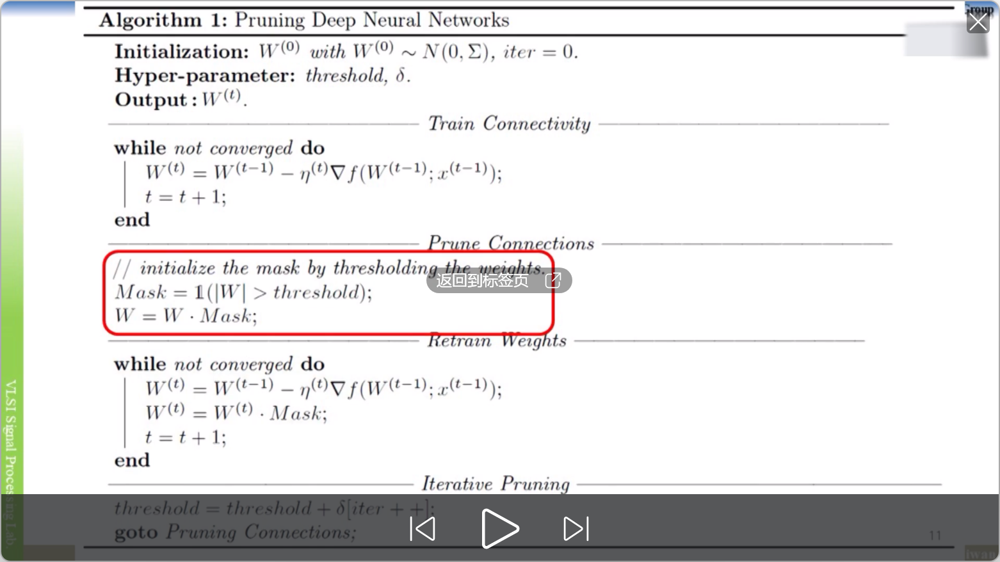
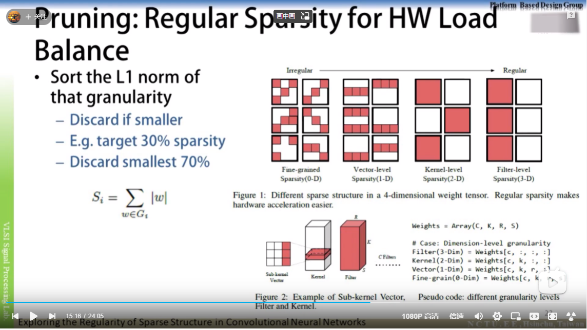
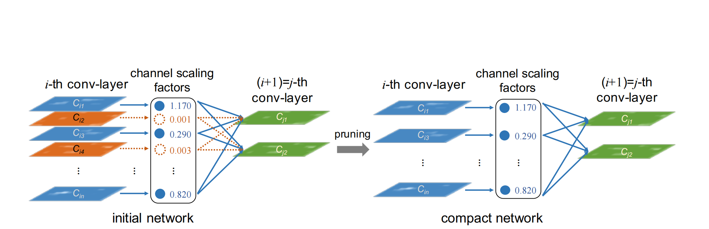
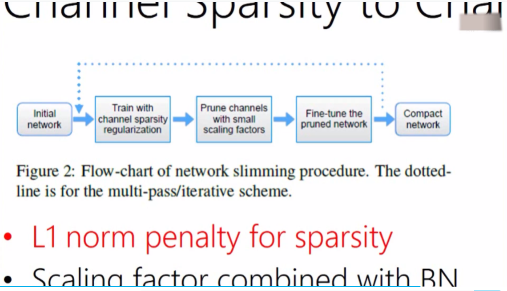
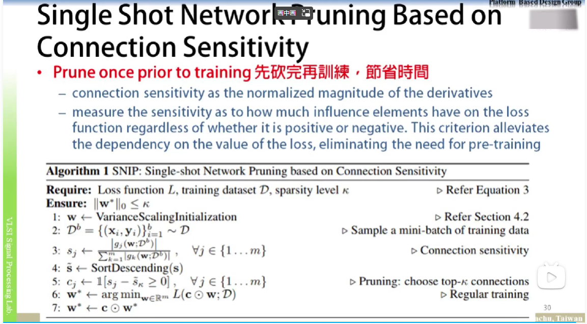
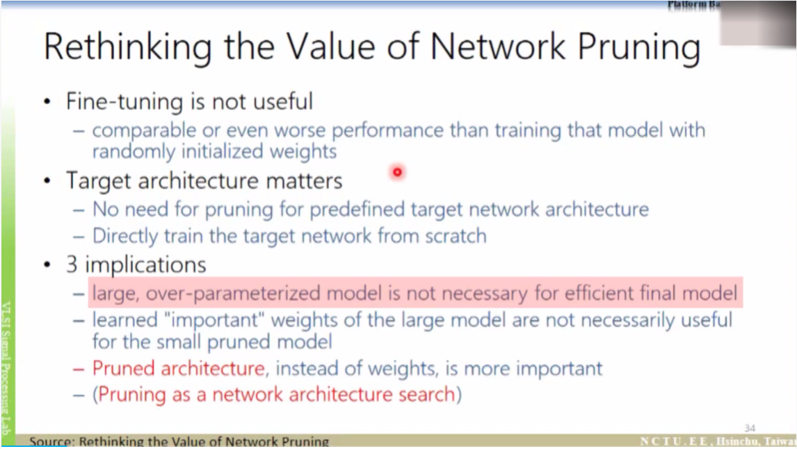
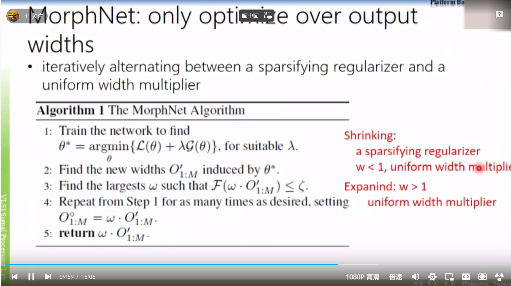
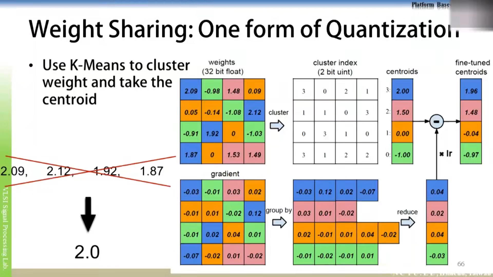
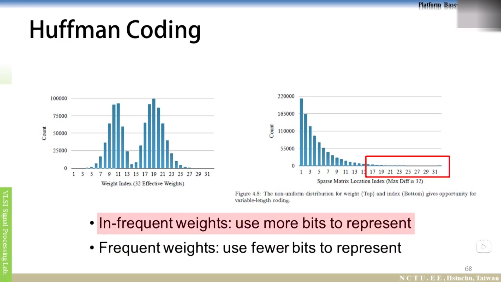

title: "人工智能commonsense-QAT-PTQ-Slimming-Pruning"
author: "lvsolo"
date: "2025-05-18"
tags: ["interview",  "common sense"]

# 2016-2020年模型压缩和加速方法总览

[Lec02 深度學習的模型壓縮與加速 Pruning (2/9)_哔哩哔哩_bilibili](https://www.bilibili.com/video/BV1Rt4y1m7Fm?p=2&spm_id_from=pageDriver&vd_source=d892bc9d71dcada4e4e833b6eaf3a620)

网络剪枝大体上可以分为两个分支：

* unstructured pruning（非结构化剪枝）
* structured pruning（结构化剪枝）

unstructured pruning是指对于**individual weights**进行prune；structured pruning是指对于**filter/channel/layer**的prune。其中非结构化修剪方法（直接修剪权重）的一个缺点是所得到的**权重矩阵是稀疏的，如果没有专用硬件/库，则不能达到压缩和加速的效果**。相反，结构化修剪方法在通道或层的层次上进行修剪。由于原始卷积结构仍然保留，因此不需要专用的硬件/库来实现。在结构化修剪方法中，通道修剪是最受欢迎的，因为它在最细粒度的水平上运行，同时仍然适合传统的深度学习框架。

2.pruning基本步骤 basic procedure：

1）训练时通过加mask模拟pruning，训练结束后进行删减

2）iterative pruning 设定阈值时，可以分多次pruning掉一定比例+finetune，如果一次就prune掉最终的比例，可能会造成finetune时训练精度恢复困难

3.论文learning structured sparsity in Deep neural networks

1)group lasso:

lasso:L0 L1 L2 范数，用于稀疏化

group lasso：将参数分组，进行批量的分块的稀疏化

2）loss=data loss + nonstructured regularizer(l2 l1 for weight value) + structured regularizer(group lasso for channels filters)

3)总体思想就是通过lasso，限制模型在某一维度（NCHW）上的复杂度，产生参数稀疏的模型

[Group Lasso_llzz嗯哈的博客-CSDN博客_group lasso](https://blog.csdn.net/weixin_45681487/article/details/104479244)

4.论文Exploring the Regularity of Sparse Structure inConvolutional Neural Networks

5.PRUNING FILTERS FOR EFFICIENT CONVNETS

6.Learning Efficient Convolutional Networks through Network Slimming

1）通过看COnv前的BN层的scale系数gamma，如果较小，那么对应的channel不重要

2）需要在训练中添加上BN的scale系数的lasso loss

3）具体的操作：假设一个conv1+bn+conv2层，如果bn的某一个chnnal方向的scale很小，那么删除掉conv1中生成该channel卷积的那个卷积核，删除掉bn中对应的channel的scale，删除掉conv2中kernel和bias对应channel通道上的分量

7.layer pruning

8.SNIP: SINGLE-SHOTNETWORKPRUNING BASED ONCONNECTIONSENSITIVITY

1)先砍完再训练，节省时间：假设砍掉某一channel/layer/filter，看输出的变化幅度，比较大的说明影响大，保留，小的删掉

2）然后再训练

   

[Lec03 深度學習的模型壓縮與加速 Pruning and Architecture Search (3/9)_哔哩哔哩_bilibili](https://www.bilibili.com/video/BV1Rt4y1m7Fm?p=3&spm_id_from=pageDriver&vd_source=d892bc9d71dcada4e4e833b6eaf3a620)

 1.Rethinking the value of network pruning

1）pruning+fine tune VS 砍完之后train from scratch

认为finetune没用，模型的结构要比其中的权重更重要

2)砍完之后train from scratch，精度不变或提高，训练时间double

3）可以先用较小的训练集来进行pruning，然后在目标训练集上进行train from scratch，节省训练时间

    

2.morphnet：constrained based pruning

限制一定的flops或参数量进行剪枝

    

[Lec04 深度學習的模型壓縮與加速 Weight Quantization (4/9)_哔哩哔哩_bilibili](https://www.bilibili.com/video/BV1Rt4y1m7Fm?p=4&spm_id_from=pageDriver&vd_source=d892bc9d71dcada4e4e833b6eaf3a620)

1.NVIDIA TENSORRT s7310-8-bit-inference-with-tensorrt.pdf

1）直接采用minmax误差较大怎么办？

固定一端，比如max对应127，然后给出一系列min的值，计算量化前后的KL散度，选择分布最相近的那个min值

2）如果单侧数据集中：非对称量化；非线性量化

2[. deep compression ](https://www.bilibili.com/video/BV1Rt4y1m7Fm?p=4&spm_id_from=pageDriver&vd_source=d892bc9d71dcada4e4e833b6eaf3a620)通过聚类重新对32bit float数进行编码，从而压缩模型

    

1）kmeans对权重值进行聚类，得到聚类中心

2）finetune 获得梯度*lr对聚类中心进行修正，weight  sharing

    

3）huffman coding压缩index和weights

    

3. PACT: PARAMETERIZED CLIPPING ACTIVATION FORQUANTIZED NEURAL NETWORKS

在训练中通过clipping限制激活值的上限，这个上限通过训练学习到

[Lec06 深度學習的模型壓縮與加速 Low Rank Approximation (6/9)_哔哩哔哩_bilibili](https://www.bilibili.com/video/BV1Rt4y1m7Fm?p=6&vd_source=d892bc9d71dcada4e4e833b6eaf3a620)

低秩分解

    

[Lec07 深度學習的模型壓縮與加速 Winograd Transformation (7/9)_哔哩哔哩_bilibili](https://www.bilibili.com/video/BV1Rt4y1m7Fm?p=7&spm_id_from=pageDriver&vd_source=d892bc9d71dcada4e4e833b6eaf3a620)

FFT Winograd 频域操作？？

[Lec08 深度學習的模型壓縮與加速 Low Complexity Model From Scratch (8/9)_哔哩哔哩_bilibili](https://www.bilibili.com/video/BV1Rt4y1m7Fm?p=8&vd_source=d892bc9d71dcada4e4e833b6eaf3a620)

Compact Models

    

1.squeezenet ：用部分1*1+3*3 替换原来的全部3*3 kernel

    

    

 Ghostnet

2.resnext

    

3.可分离深度卷积：depthwise conv+1X1 conv

Mobilenet v1/2/3

    

    

    

    

Xception

depthwise之后不要加relu等activation function，直接加1*1卷积效果更好

shufflenet

    

efficientNet

类似NAS看mobilenet和shuffle结构那种好，纯实验结果

Shift ：

shuffleNet V2：

1）flops不能完全代表模型运行速度需要考虑到IO SRAM DRAM

    

2）底层运行框架cuda 3*3优化比1*1好，3*3不是1*1的9倍运行时间

    

    

3）设计模型的四条建议

    

a.输入输出的channel数量尽量一致

简单推导

    

b.group convolution 无法加速的原因：group越多，MAC耗时越大

    

c.模型的分支结构越多，模型运行并行度越低，，速度越慢

    

d.带有大量的residual结构中有大量element wise，不可忽略，低flops高MAC

    

根据上面四条实验结果，评价之前的模型

    

改进shufflenet 得到v2

1）element wise add---> concat

2）group conv-->channel  split

3) concat之后才进行一次channel shuffle

   

[Lec09 深度學習的模型壓縮與加速 Dynamic Execution (9/9)_哔哩哔哩_bilibili](https://www.bilibili.com/video/BV1Rt4y1m7Fm?p=9&vd_source=d892bc9d71dcada4e4e833b6eaf3a620)

SBNet：segmentation->对需要进行卷积的图进行拼接->卷积->结果重新填充到原始位置

    

Dynamic Channel Pruning:Feature Boosting and Suppression

接近SENet那种attention的思想

    
