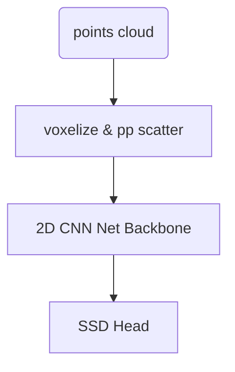

## auto-update table of contents
- [Headline](#headline)
  - [Headline](#headline-1)
    - [Headline](#headline-2)
      - [Headline](#headline-3)
        - [Headline](#headline-4)
  - [To-do Lists](#to-do-lists)
  - [Code](#code)
  - [Math Expressions](#math-expressions)
  - [Image](#image)
  - [Video](#video)
  - [Table](#table)
- [中文标题](#中文标题)
  - [zhongyinghunhe中英混合](#zhongyinghunhe中英混合)


## table of contents
1. [Code](#code)
2. [Image](#image)
3. [Video](#video)

# Headline
## Headline
### Headline
#### Headline
##### Headline

- one
  - two
  - three
    - four
    - five
## To-do Lists
- [] Task 1
- [x] Task 2
- [] Task 3

## Code
```python
def main(a,b):
    return a+b
```
## Math Expressions
$$
 f(x) = a *x
$$
$$ f(x) = a $$
$$\int_{a}^{b} f(x)\ dx$$

## Image


## Video

<iframe src="//player.bilibili.com/player.html?aid=VIDEO_AID&bvid=VIDEO_BVID&page=PAGE&high_quality=1" scrolling="no" border="0" frameborder="no" framespacing="0" allowfullscreen="true"> </iframe>

## Table
| Header 1 | Header 2 | Header 3 |
|:---------|:--------:|---------:|
| Left     | Center   | Right    |
| **Bold** | *Italic* | `Code`   |
| 1        | 2        | 3        |
| [Link](https://example.com) | {:width="300px" height="200px"} | <u>Underline</u> |

中文输入

# 中文标题
## zhongyinghunhe中英混合

flowchart


graph TB
    pts(points cloud) --> A[voxelize & pp scatter]
    A --> B[2D CNN Net Backbone]
    B -->C[SSD Head]



[more diagrams charts](https://gohugo.io/content-management/diagrams/#graphics)

