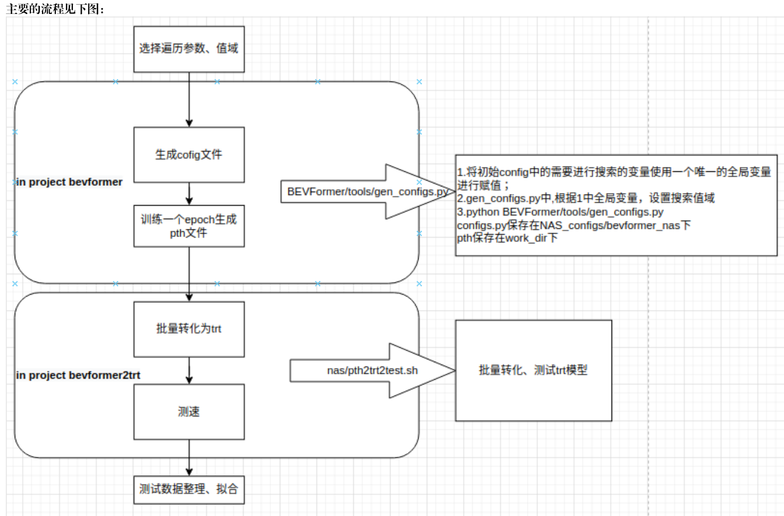
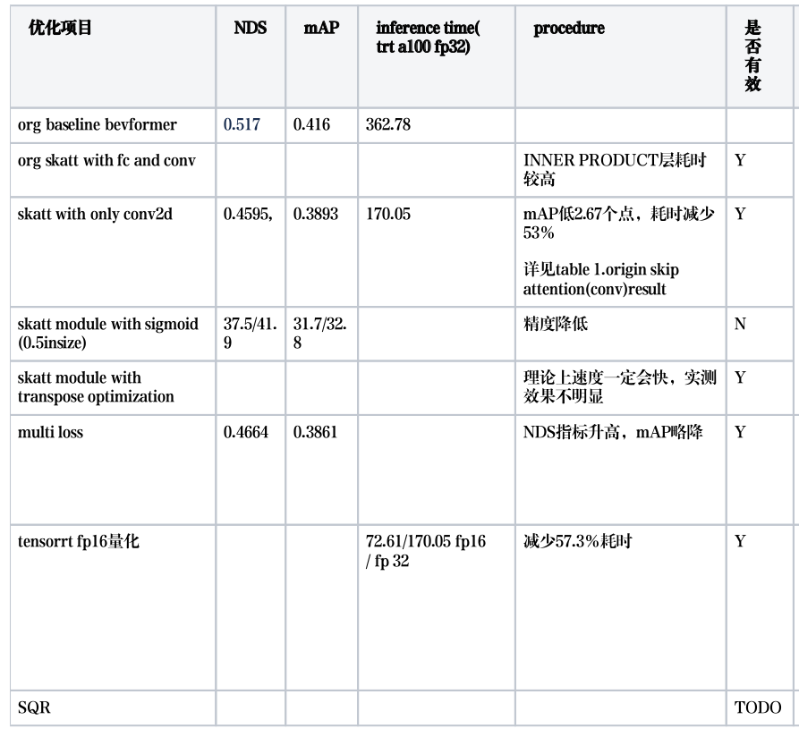

title: "Optimization for Object Detection"
author: "lvsolo"
date: "2023-01-16"
tags: ["optimization", "object detection"]

DETR PETR

点云数据清理:

1. 2D图像数据过滤3D点云上的标注框
2. 自适应配置不同类别的总体样本比例的方法:

PointPillar:

1. anchors shape ratio调整
2. point clouds feature abstraction 中的maxpooing使用Linear+eigen库代替
3. data augmentation:
   1. instance:旋转平移缩放；点云重采样；对称补全
   2. scenerio:对称翻转
4. CBGS：
   1. 按shape大小分组+Group head，每个单独的头对每个大小相近的组进行分类
   2. 对每个组的样本的数量进行平衡
5. Dynamic IoU Assignment:YOLOv8 动态匹配机制，
6. SSN：点云-->三视图-->凸包convex hull-->转化为(角度,半径)的形式-->chebyshev拟合系数-->三视图系数concat-->用于回归box的shape，可以反推出bbox的立方体形式的shape
   **注意**在SSN的论文中，bbox的shape不是使用的whl，而是使用了chebyshev拟合系数进行的loss计算和预测值回归
7. 二阶段：先回归出大致的bbox，然后将bbox中点特征分割出来进行分类
8. **RegNet**作为backbone:
9. sum pooling trick提高训练速度，与2类似
10. auxilary loss:anchor based/free head;detr like head

BEVFormer

1.由于精度和速度之间的复杂关系，希望通过在对速度有预期的情况下，搜索精度较高的模型；即：对X(BEV wh，fpn数量， bev query数量）和Y（推理耗时)进行建模，拟合方程来设计符合耗时预期的精度最高的模型结构；

2.skip attention

3.one2many
