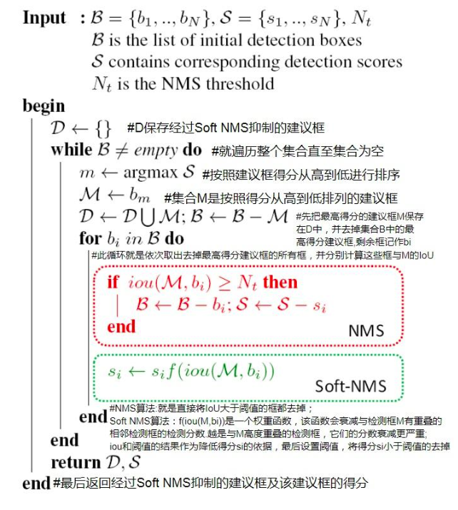

title: "BEVDet"
author: "lvsolo"
date: "2024-04-18"
tags: ["paper reading",  "BEV"]

# 一.Methods

## I.LSS view transformer + CenterPoint Head

## II.data augmentation in BEV coord

## III.简化NMS

### ✅ 1. **BEV 空间下的简单 NMS**

BEVDet 中的 NMS 是在 **Bird's Eye View 空间（即 X-Z 平面）** 上进行的，目标框都是在 BEV 中的水平框（top-down view）：

* BEV 中的目标框是  **平面旋转矩形（Rotated Boxes）** ，不是完整 3D 立方体；
* 简化为在 2D 平面上（BEV 平面）进行重叠计算，减少了复杂度；
* 通常使用的是  **IoU-based NMS** ，但可以利用加速版本如：
  * **Rotated NMS** （支持旋转框）；
  * **Circle NMS** （圆形近似代替框）——大大简化 IoU 计算；
  * 或在某些部署版本中使用  **approximate NMS 或 soft-NMS** 。

soft-nms原理：

### ✅ 2. **Anchor-free 设计降低 NMS 压力**

BEVDet 系列（尤其是 BEVDet4D）引入了  **CenterPoint-style anchor-free 预测头** ，其输出结构特征如下：

* **每个网格点只预测一个候选中心点** ；
* 回归周围 box 参数；
* 通过 **高质量的中心度估计** 来抑制冗余候选；
* 从而减少后处理时需要进行 NMS 的候选框数量。

> 这类 anchor-free 设计天然就减少了冗余框密度，从源头上降低 NMS 的复杂度。

### ✅ 3. **前 Top-K 筛选 + NMS**

实际中 BEVDet 会对每类的置信度分数进行：

* **Top-K 筛选（如 top-500 per class）** ；
* 再进行 NMS；

从而大大加快推理速度，尤其在 batch size > 1 时提升明显。

### ✅ 4. （部署版本）使用 TensorRT 的 NMS 插件

在部署 BEVDet 模型（如在 NVIDIA 平台）时，很多工程会使用：

* TensorRT 自带的  **batchedNMSPlugin** ；
* 或者 ONNX 的  **EfficientNMS** ；
* 这些插件支持批处理 + GPU 加速 NMS，非常适合 real-time 系统。

### 📌 总结一张表（便于记忆/面试复述）：

| 加速方式         | 具体做法                                 | 目的            |
| ---------------- | ---------------------------------------- | --------------- |
| 平面 NMS         | 在 BEV 平面（2D）做 NMS，避免复杂 3D NMS | 减少计算维度    |
| Anchor-free 输出 | 每点只回归一个框，降低冗余               | 降低候选数量    |
| Top-K 筛选       | 每类置信度排序，保留前 K                 | 加速 NMS 前处理 |
| 快速 NMS 插件    | TensorRT、ONNX 提供的插件                | 推理部署加速    |

改进：BEVDET4D

改进：BEVDepth

添加了DepthNet，使用图像像素点对应的雷达点云对可见范围内的图像特征的可学习的深度分布估计进行有监督训练，从而增强了 BEVDet 的深度感知能力。

