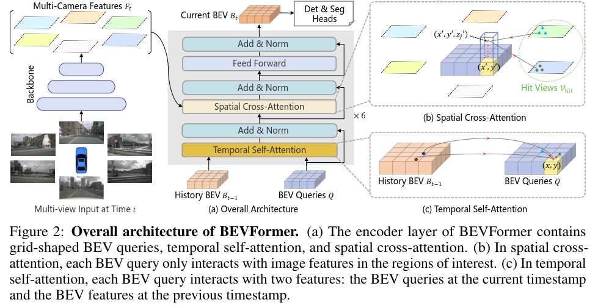

title: "BEVFormer"
author: "lvsolo"
date: "2025-04-18"
tags: ["paper reading",  "BEV"]



```python
@TRANSFORMER_LAYER.register_module()
class BEVFormerLayer(MyCustomBaseTransformerLayer):
    """Implements decoder layer in DETR transformer.
    Args:
        attn_cfgs (list[`mmcv.ConfigDict`] | list[dict] | dict )):
            Configs for self_attention or cross_attention, the order
            should be consistent with it in `operation_order`. If it is
            a dict, it would be expand to the number of attention in
            `operation_order`.
        feedforward_channels (int): The hidden dimension for FFNs.
        ffn_dropout (float): Probability of an element to be zeroed
            in ffn. Default 0.0.
        operation_order (tuple[str]): The execution order of operation
            in transformer. Such as ('self_attn', 'norm', 'ffn', 'norm').
            Default：None
        act_cfg (dict): The activation config for FFNs. Default: `LN`
        norm_cfg (dict): Config dict for normalization layer.
            Default: `LN`.
        ffn_num_fcs (int): The number of fully-connected layers in FFNs.
            Default：2.
    """

    def __init__(self,
                 attn_cfgs,
                 feedforward_channels,
                 ffn_dropout=0.0,
                 operation_order=None,
                 act_cfg=dict(type='ReLU', inplace=True),
                 norm_cfg=dict(type='LN'),
                 ffn_num_fcs=2,
                 **kwargs):
        super(BEVFormerLayer, self).__init__(
            attn_cfgs=attn_cfgs,
            feedforward_channels=feedforward_channels,
            ffn_dropout=ffn_dropout,
            operation_order=operation_order,
            act_cfg=act_cfg,
            norm_cfg=norm_cfg,
            ffn_num_fcs=ffn_num_fcs,
            **kwargs)
        self.fp16_enabled = False
        assert len(operation_order) == 6
        assert set(operation_order) == set(
            ['self_attn', 'norm', 'cross_attn', 'ffn'])

    def forward(self,
                query,
                key=None,
                value=None,
                bev_pos=None,
                query_pos=None,
                key_pos=None,
                attn_masks=None,
                query_key_padding_mask=None,
                key_padding_mask=None,
                ref_2d=None,
                ref_3d=None,
                bev_h=None,
                bev_w=None,
                reference_points_cam=None,
                mask=None,
                spatial_shapes=None,
                level_start_index=None,
                prev_bev=None,
                **kwargs):
        """Forward function for `TransformerDecoderLayer`.

        **kwargs contains some specific arguments of attentions.

        Args:
            query (Tensor): The input query with shape
                [num_queries, bs, embed_dims] if
                self.batch_first is False, else
                [bs, num_queries embed_dims].
            key (Tensor): The key tensor with shape [num_keys, bs,
                embed_dims] if self.batch_first is False, else
                [bs, num_keys, embed_dims] .
            value (Tensor): The value tensor with same shape as `key`.
            query_pos (Tensor): The positional encoding for `query`.
                Default: None.
            key_pos (Tensor): The positional encoding for `key`.
                Default: None.
            attn_masks (List[Tensor] | None): 2D Tensor used in
                calculation of corresponding attention. The length of
                it should equal to the number of `attention` in
                `operation_order`. Default: None.
            query_key_padding_mask (Tensor): ByteTensor for `query`, with
                shape [bs, num_queries]. Only used in `self_attn` layer.
                Defaults to None.
            key_padding_mask (Tensor): ByteTensor for `query`, with
                shape [bs, num_keys]. Default: None.

        Returns:
            Tensor: forwarded results with shape [num_queries, bs, embed_dims].
        """

        norm_index = 0
        attn_index = 0
        ffn_index = 0
        identity = query # (1, 2500, 256)
        if attn_masks is None:
            attn_masks = [None for _ in range(self.num_attn)]
        elif isinstance(attn_masks, torch.Tensor):
            attn_masks = [
                copy.deepcopy(attn_masks) for _ in range(self.num_attn)
            ]
            warnings.warn(f'Use same attn_mask in all attentions in '
                          f'{self.__class__.__name__} ')
        else:
            assert len(attn_masks) == self.num_attn, f'The length of ' \
                                                     f'attn_masks {len(attn_masks)} must be equal ' \
                                                     f'to the number of attention in ' \
                f'operation_order {self.num_attn}'
        # attn_masks: [None, None]
        # operation_order: ('self_attn', 'norm', 'cross_attn', 'norm', 'ffn', 'norm')
        for layer in self.operation_order:
            # temporal self attention
            if layer == 'self_attn':

                query = self.attentions[attn_index](
                    query, # (1, 2500, 256)
                    prev_bev, # None或(2, 2500, 256)
                    prev_bev, # None或(2, 2500, 256)
                    identity if self.pre_norm else None, # None
                    query_pos=bev_pos, # (1, 2500, 256)
                    key_pos=bev_pos, # (1, 2500, 256)
                    attn_mask=attn_masks[attn_index], # None
                    key_padding_mask=query_key_padding_mask, # None
                    reference_points=ref_2d, # (2, 2500, 1, 2)
                    spatial_shapes=torch.tensor(
                        [[bev_h, bev_w]], device=query.device), # [[50, 50]]
                    level_start_index=torch.tensor([0], device=query.device), # [0]
                    **kwargs)
                attn_index += 1
                identity = query # (1, 2500, 256)

            elif layer == 'norm':
                query = self.norms[norm_index](query)
                norm_index += 1

            # spaital cross attention
            elif layer == 'cross_attn':
                query = self.attentions[attn_index](
                    query, # (1, 2500, 256)
                    key, # (6, 375, 1, 256)
                    value, # (6, 375, 1, 256)
                    identity if self.pre_norm else None, # None
                    query_pos=query_pos, # (1, 2500, 256)
                    key_pos=key_pos, # (1, 2500, 256)
                    reference_points=ref_3d, # (1, 4, 2500, 3)
                    reference_points_cam=reference_points_cam, # (6, 1, 2500, 4, 2)
                    mask=mask, # (6, 1, 2500, 4)
                    attn_mask=attn_masks[attn_index], # None
                    key_padding_mask=key_padding_mask, # None
                    spatial_shapes=spatial_shapes, # [[15, 25]]
                    level_start_index=level_start_index, # [0]
                    **kwargs)
                attn_index += 1
                identity = query

            elif layer == 'ffn':
                query = self.ffns[ffn_index](
                    query, identity if self.pre_norm else None)
                ffn_index += 1

        return query

```

# Encoder

## Deformable attention


Deformable Attention从上图可以看出，主要是两个东西 :$A_{ij}$和${\delta}p_{ij}$,分别对应Attention weights和sampling offsets，后续每次用到的时候都可以注意这两个是如何得到的

```python
class MultiScaleDeformableAttnFunction_fp16(Function):

    @staticmethod
    @custom_fwd(cast_inputs=torch.float16)
    def forward(ctx, value, value_spatial_shapes, value_level_start_index,
                sampling_locations, attention_weights, im2col_step):
        """GPU version of multi-scale deformable attention.

        Args:
            value (Tensor): The value has shape
                (bs, num_keys, mum_heads, embed_dims//num_heads)
            value_spatial_shapes (Tensor): Spatial shape of
                each feature map, has shape (num_levels, 2),
                last dimension 2 represent (h, w)
            sampling_locations (Tensor): The location of sampling points,
                has shape
                (bs ,num_queries, num_heads, num_levels, num_points, 2),
                the last dimension 2 represent (x, y).
            attention_weights (Tensor): The weight of sampling points used
                when calculate the attention, has shape
                (bs ,num_queries, num_heads, num_levels, num_points),
            im2col_step (Tensor): The step used in image to column.

        Returns:
            Tensor: has shape (bs, num_queries, embed_dims)
        """
        ctx.im2col_step = im2col_step
        output = ext_module.ms_deform_attn_forward(
            value,
            value_spatial_shapes,
            value_level_start_index,
            sampling_locations,
            attention_weights,
            im2col_step=ctx.im2col_step)
        ctx.save_for_backward(value, value_spatial_shapes,
                              value_level_start_index, sampling_locations,
                              attention_weights)
        return output

    @staticmethod
    @once_differentiable
    @custom_bwd
    def backward(ctx, grad_output):
        """GPU version of backward function.

        Args:
            grad_output (Tensor): Gradient
                of output tensor of forward.

        Returns:
             Tuple[Tensor]: Gradient
                of input tensors in forward.
        """
        value, value_spatial_shapes, value_level_start_index, \
            sampling_locations, attention_weights = ctx.saved_tensors
        grad_value = torch.zeros_like(value)
        grad_sampling_loc = torch.zeros_like(sampling_locations)
        grad_attn_weight = torch.zeros_like(attention_weights)

        ext_module.ms_deform_attn_backward(
            value,
            value_spatial_shapes,
            value_level_start_index,
            sampling_locations,
            attention_weights,
            grad_output.contiguous(),
            grad_value,
            grad_sampling_loc,
            grad_attn_weight,
            im2col_step=ctx.im2col_step)

        return grad_value, None, None, \
            grad_sampling_loc, grad_attn_weight, None

```

TODO：Multiscale Deformable Attention中的multi scale是如何实现的？与FPN的区别和相似之处有么？

### Reference Points in Deformable attention

```python
        # 3d参考点 ref_3d: (1, 4, 2500, 3)
        # self.pc_range[5]-self.pc_range[2] 8
        # pc_range = [-51.2, -51.2, -5.0, 51.2, 51.2, 3.0]
        # self.num_points_in_pillar 4
        ref_3d = self.get_reference_points(
            bev_h, bev_w, self.pc_range[5]-self.pc_range[2], self.num_points_in_pillar, dim='3d', bs=bev_query.size(1),  device=bev_query.device, dtype=bev_query.dtype)
        # (1, 4, 2500, 3)
        ref_2d = self.get_reference_points(
            bev_h, bev_w, dim='2d', bs=bev_query.size(1), device=bev_query.device, dtype=bev_query.dtype)
        # (1, 2500, 1, 2) 

        reference_points_cam, bev_mask = self.point_sampling(
            ref_3d, self.pc_range, kwargs['img_metas']) # ref_3d -> ref_3d_cam, (6, 1, 2500, 4, 2), (6, 1, 2500, 4)

        # bug: this code should be 'shift_ref_2d = ref_2d.clone()', we keep this bug for reproducing our results in paper.
        shift_ref_2d = ref_2d  # .clone() # 获取BEV平面上的2D参考点
        shift_ref_2d += shift[:, None, None, :] # 在原始参考点的基础上+偏移量 (1, 2500, 1, 2) 

```

get_reference_points函数,可以看到reference points不论三维还是二维，都是在pc_cloud_range（xy:[-50,+50],z:[-5,3])的范围内均匀分布的，每个维度的大小取决于bev feat的HW shape（50*50)，以及每个pillar中选择的reference points 的数量（4)

```python
def get_reference_points(H, W, Z=8, num_points_in_pillar=4, dim='3d', bs=1, device='cuda', dtype=torch.float):
        """Get the reference points used in SCA and TSA.
        Args:
            H, W: spatial shape of bev.
            Z: hight of pillar.
            D: sample D points uniformly from each pillar.
            device (obj:`device`): The device where
                reference_points should be.
        Returns:
            Tensor: reference points used in decoder, has \
                shape (bs, num_keys, num_levels, 2).
        """

        # reference points in 3D space, used in spatial cross-attention (SCA)
        if dim == '3d':
            # 0.5~7.5中间均匀采样4个点 (4,)-->(4, 1, 1)-->(4, 50, 50) 归一化
            zs = torch.linspace(0.5, Z - 0.5, num_points_in_pillar, dtype=dtype,
                                device=device).view(-1, 1, 1).expand(num_points_in_pillar, H, W) / Z
            # 0.5~49.5中间均匀采样50个点 (50,)-->(1, 1, 50)-->(4, 50, 50) 归一化
            xs = torch.linspace(0.5, W - 0.5, W, dtype=dtype,
                                device=device).view(1, 1, W).expand(num_points_in_pillar, H, W) / W
            # 0.5~49.5中间均匀采样50个点 (50,)-->(1, 50, 1)-->(4, 50, 50) 归一化
            ys = torch.linspace(0.5, H - 0.5, H, dtype=dtype,
                                device=device).view(1, H, 1).expand(num_points_in_pillar, H, W) / H
            ref_3d = torch.stack((xs, ys, zs), -1) # (4, 50, 50, 3)
            ref_3d = ref_3d.permute(0, 3, 1, 2).flatten(2).permute(0, 2, 1) # (4, 50, 50, 3) -> (4, 3, 50, 50) -> (4, 3, 2500) -> (4, 2500, 3)
            ref_3d = ref_3d[None].repeat(bs, 1, 1, 1) # (4, 2500, 3) -> (1, 4, 2500, 3) -> (1, 4, 2500, 3)
            return ref_3d # (1, 4, 2500, 3)

        # reference points on 2D bev plane, used in temporal self-attention (TSA).
        elif dim == '2d':
            ref_y, ref_x = torch.meshgrid(
                torch.linspace(
                    0.5, H - 0.5, H, dtype=dtype, device=device),
                torch.linspace(
                    0.5, W - 0.5, W, dtype=dtype, device=device)
            ) # (50, 50)
            ref_y = ref_y.reshape(-1)[None] / H # (50, 50) -> (2500, ) ->  (1, 2500)
            ref_x = ref_x.reshape(-1)[None] / W # (50, 50) -> (2500, ) ->  (1, 2500)
            ref_2d = torch.stack((ref_x, ref_y), -1) # (1, 2500, 2)
            ref_2d = ref_2d.repeat(bs, 1, 1).unsqueeze(2) # (1, 2500, 2) -> (1, 2500, 1, 2)
            return ref_2d # (1, 2500, 1, 2)
```

将3d reference points映射到图像坐标系中

```python
reference_points_cam, bev_mask = self.point_sampling(
            ref_3d, self.pc_range, kwargs['img_metas']) # ref_3d -> ref_3d_cam, (6, 1, 2500, 4, 2), (6, 1, 2500, 4)
```


## Temporal Self-Attention

```python
            # temporal self attention
            if layer == 'self_attn':

                query = self.attentions[attn_index](
                    query, # (1, 2500, 256) query
                    prev_bev, # None或(2, 2500, 256) key
                    prev_bev, # None或(2, 2500, 256) value
                    identity if self.pre_norm else None, # None
                    query_pos=bev_pos, # (1, 2500, 256)
                    key_pos=bev_pos, # (1, 2500, 256)
                    attn_mask=attn_masks[attn_index], # None
                    key_padding_mask=query_key_padding_mask, # None
                    reference_points=ref_2d, # (2, 2500, 1, 2)
                    spatial_shapes=torch.tensor(
                        [[bev_h, bev_w]], device=query.device), # [[50, 50]]
                    level_start_index=torch.tensor([0], device=query.device), # [0]
                    **kwargs)
                attn_index += 1
                identity = query # (1, 2500, 256)

```

```python
    def forward(self,
                query,
                key=None,
                value=None,
                identity=None,
                query_pos=None,
                key_padding_mask=None,
                reference_points=None,
                spatial_shapes=None,
                level_start_index=None,
                flag='decoder',

                **kwargs):
        """Forward Function of MultiScaleDeformAttention.

        Args:
            query (Tensor): Query of Transformer with shape
                (num_query, bs, embed_dims).
            key (Tensor): The key tensor with shape
                `(num_key, bs, embed_dims)`.
            value (Tensor): The value tensor with shape
                `(num_key, bs, embed_dims)`.
            identity (Tensor): The tensor used for addition, with the
                same shape as `query`. Default None. If None,
                `query` will be used.
            query_pos (Tensor): The positional encoding for `query`.
                Default: None.
            key_pos (Tensor): The positional encoding for `key`. Default
                None.
            reference_points (Tensor):  The normalized reference
                points with shape (bs, num_query, num_levels, 2),
                all elements is range in [0, 1], top-left (0,0),
                bottom-right (1, 1), including padding area.
                or (N, Length_{query}, num_levels, 4), add
                additional two dimensions is (w, h) to
                form reference boxes.
            key_padding_mask (Tensor): ByteTensor for `query`, with
                shape [bs, num_key].
            spatial_shapes (Tensor): Spatial shape of features in
                different levels. With shape (num_levels, 2),
                last dimension represents (h, w).
            level_start_index (Tensor): The start index of each level.
                A tensor has shape ``(num_levels, )`` and can be represented
                as [0, h_0*w_0, h_0*w_0+h_1*w_1, ...].

        Returns:
             Tensor: forwarded results with shape [num_query, bs, embed_dims].
        """
        if value is None: # value prev_bev, value=None, prev_bev=None
            assert self.batch_first
            bs, len_bev, c = query.shape
            value = torch.stack([query, query], 1).reshape(bs*2, len_bev, c) # (2, 2500, 256)

            # value = torch.cat([query, query], 0)

        if identity is None:
            identity = query # (1, 2500, 256)
        if query_pos is not None:
            query = query + query_pos # (1, 2500, 256) = (1, 2500, 256) + (1, 2500, 256)

        if not self.batch_first: 
            # change to (bs, num_query ,embed_dims) 
            query = query.permute(1, 0, 2) # (1, 2500, 256)
            value = value.permute(1, 0, 2) # (2, 2500, 256)
        bs,  num_query, embed_dims = query.shape # 1, 2500, 256
        _, num_value, _ = value.shape # 2500

        assert (spatial_shapes[:, 0] * spatial_shapes[:, 1]).sum() == num_value # 50 * 50 = 2500
        assert self.num_bev_queue == 2 # prev_bev & bev

        query = torch.cat([value[:bs], query], -1) # pre_query & query, (1, 2500, 512), cat_dim= -1
        value = self.value_proj(value) # (2, 2500, 256)

        if key_padding_mask is not None:
            value = value.masked_fill(key_padding_mask[..., None], 0.0)

        value = value.reshape(bs*self.num_bev_queue,
                              num_value, self.num_heads, -1) # (2, 2500, 256) -> (2, 2500, 8, 32)

        sampling_offsets = self.sampling_offsets(query) # (1, 2500, 512) -> (1, 2500, 128)
        sampling_offsets = sampling_offsets.view(
            bs, num_query, self.num_heads,  self.num_bev_queue, self.num_levels, self.num_points, 2) # 偏移量 (1, 2500, 128) -> (1, 2500, 8, 2, 1, 4, 2)
        attention_weights = self.attention_weights(query).view(
            bs, num_query,  self.num_heads, self.num_bev_queue, self.num_levels * self.num_points) # 权重 (1, 2500, 512) -> (1, 2500, 8, 2, 4)
        attention_weights = attention_weights.softmax(-1)

        attention_weights = attention_weights.view(bs, num_query,
                                                   self.num_heads,
                                                   self.num_bev_queue,
                                                   self.num_levels,
                                                   self.num_points) # (1, 2500, 8, 2, 4) -> (1, 2500, 8, 2, 1, 4)

        # (1, 2500, 8, 2, 1, 4) -> (1, 2, 2500, 8, 1, 4) -> (2, 2500, 8, 1, 4)
        attention_weights = attention_weights.permute(0, 3, 1, 2, 4, 5)\
            .reshape(bs*self.num_bev_queue, num_query, self.num_heads, self.num_levels, self.num_points).contiguous()
        # (1, 2500, 8, 2, 1, 4, 2) -> (1, 2, 2500, 8, 1, 4, 2) -> (2, 2500, 8, 1, 4, 2)
        sampling_offsets = sampling_offsets.permute(0, 3, 1, 2, 4, 5, 6)\
            .reshape(bs*self.num_bev_queue, num_query, self.num_heads, self.num_levels, self.num_points, 2)

        if reference_points.shape[-1] == 2: # ref_2d, (2, 2500, 1, 2)
            offset_normalizer = torch.stack(
                [spatial_shapes[..., 1], spatial_shapes[..., 0]], -1) # [[50, 50]]

            # (2, 2500, 1, 1, 1, 2) + (2, 2500, 8, 1, 4, 2) / (1, 1, 1, 1, 1, 2)
            # ref_2d是归一化坐标，所以这里需要对offsets同样做归一化
            # sampling_locations, (2, 2500, 8, 1, 4, 2)
            sampling_locations = reference_points[:, :, None, :, None, :] \
                + sampling_offsets \
                / offset_normalizer[None, None, None, :, None, :] 

        elif reference_points.shape[-1] == 4:
            sampling_locations = reference_points[:, :, None, :, None, :2] \
                + sampling_offsets / self.num_points \
                * reference_points[:, :, None, :, None, 2:] \
                * 0.5
        else:
            raise ValueError(
                f'Last dim of reference_points must be'
                f' 2 or 4, but get {reference_points.shape[-1]} instead.')
        if torch.cuda.is_available() and value.is_cuda: #cuda可用

            # using fp16 deformable attention is unstable because it performs many sum operations
            if value.dtype == torch.float16:
                MultiScaleDeformableAttnFunction = MultiScaleDeformableAttnFunction_fp32
            else:
                MultiScaleDeformableAttnFunction = MultiScaleDeformableAttnFunction_fp32
            # value, (2, 2500, 8, 32)
            # spatial_shapes, [[50, 50]]
            # level_start_index, [0]
            # sampling_locations, (2, 2500, 8, 1, 4, 2)
            # attention_weights, (2, 2500, 8, 1, 4)
            output = MultiScaleDeformableAttnFunction.apply(
                value, spatial_shapes, level_start_index, sampling_locations,
                attention_weights, self.im2col_step) # (2, 2500, 256)
        else:

            output = multi_scale_deformable_attn_pytorch(
                value, spatial_shapes, sampling_locations, attention_weights)

        # output shape (bs*num_bev_queue, num_query, embed_dims)
        # (bs*num_bev_queue, num_query, embed_dims)-> (num_query, embed_dims, bs*num_bev_queue)
        output = output.permute(1, 2, 0) # (2, 2500, 256) -> (2500, 256, 2)

        # fuse history value and current value
        # (num_query, embed_dims, bs*num_bev_queue)-> (num_query, embed_dims, bs, num_bev_queue)
        output = output.view(num_query, embed_dims, bs, self.num_bev_queue) # (2500, 256, 2) -> (2500, 256, 1, 2)
        output = output.mean(-1) # prev_bev和cur_bev取均值, (2500, 256, 1)

        # (num_query, embed_dims, bs)-> (bs, num_query, embed_dims)
        output = output.permute(2, 0, 1) # (2500, 256, 1) -> (1, 2500, 256)

        output = self.output_proj(output) # (1, 2500, 256) -> 线性层 -> (1, 2500, 256)

        if not self.batch_first:
            output = output.permute(1, 0, 2)

        return self.dropout(output) + identity # (1, 2500, 256)
```

Temporal self-attention 是一种用于聚合时间信息的机制，主要在 BEVFormer 框架中应用，以融合历史的 BEV 特征，从而增强对当前环境的理解。其具体流程如下：

1. **输入处理**：在每个时间步 t，BEVFormer 接收来自多摄像头的输入以及之前时间步的 BEV 特征 \( B_{t-1} \)。这些输入包含当前时刻的空间信息和历史时刻的时间信息。

   ```python
   # 这里的query就是论文里的BEV query，后两个prev_bev分别是key和value，这个key在后面的代码中实际没有用到，只用到了query和value
   # 这里的shape2500是50*50，是bev的h和w尺寸，对于bevformer分为base small和tiny，他们的bev_h bev_w的尺寸分别为200， 150 和50
   self.attentions[attn_index](
                       query, # (1, 2500, 256) query
                       prev_bev, # None或(2, 2500, 256) key
                       prev_bev, # None或(2, 2500, 256) value
                       identity if self.pre_norm else None, # None
                       query_pos=bev_pos, # (1, 2500, 256)
                       key_pos=bev_pos, # (1, 2500, 256)
                       attn_mask=attn_masks[attn_index], # None
                       key_padding_mask=query_key_padding_mask, # None
                       reference_points=ref_2d, # (2, 2500, 1, 2)
                       spatial_shapes=torch.tensor(
                           [[bev_h, bev_w]], device=query.device), # [[50, 50]]
                       level_start_index=torch.tensor([0], device=query.device), # [0]
                       **kwargs)
   ```
2. **查询生成**：每个 BEV 查询 \( Q_p \) 定位在 BEV 平面上的特定位置 \( p = (x, y) \)，用于查询该位置的特征。这个查询会与历史的 BEV 特征结合，以提取时间信息。

   ```python
   query = torch.cat([value[:bs], query], -1) # pre_query & query, (1, 2500, 512), cat_dim= -1
   ```
3. **偏移预测**：与传统的自注意力机制不同，temporal self-attention 中的偏移量 \( \Delta p \) 是通过将当前查询 \( Q \) 和历史特征 \( B_{t-1} \) 进行连接后预测的。这种方式使得模型能够动态调整查询的位置，以便更好地聚焦于历史信息。同时也会生成deformable attention中的attention weights

   Deformable Attention的两个东西 :$A_{ij}$和${\delta}p_{ij}$,分别对应Attention weights和sampling offsets，在temporal self attention中是通过Linear(concat(query, prev_bev))得到的

   ```python
   """
   Args:
           embed_dims (int): The embedding dimension of Attention.
               Default: 256.
           num_heads (int): Parallel attention heads. Default: 64.
           num_levels (int): The number of feature map used in
               Attention. Default: 4.
           num_points (int): The number of sampling points for
               each query in each head. Default: 4.
           im2col_step (int): The step used in image_to_column.
               Default: 64.
           dropout (float): A Dropout layer on `inp_identity`.
               Default: 0.1.
           batch_first (bool): Key, Query and Value are shape of
               (batch, n, embed_dim)
               or (n, batch, embed_dim). Default to True.
           norm_cfg (dict): Config dict for normalization layer.
               Default: None.
           init_cfg (obj:`mmcv.ConfigDict`): The Config for initialization.
               Default: None.
           num_bev_queue (int): In this version, we only use one history BEV and one currenct BEV.
            the length of BEV queue is 2.
   """
   self.sampling_offsets = nn.Linear(
               embed_dims*self.num_bev_queue, num_bev_queue*num_heads * num_levels * num_points * 2)
   # query是bev query 和 history bev featre的concat后结果
   sampling_offsets = self.sampling_offsets(query) # (1, 2500, 512) -> (1, 2500, 128)
   sampling_offsets = sampling_offsets.view(
               bs, num_query, self.num_heads,  self.num_bev_queue, self.num_levels, self.num_points, 2) # 偏移量 (1, 2500, 128) -> (1, 2500, 8, 2, 1, 4, 2)
   # 

   self.attention_weights = nn.Linear(embed_dims*self.num_bev_queue,
                                              num_bev_queue*num_heads * num_levels * num_points)
   #此处的query也是concat(bev_query, prev_bev)
   attention_weights = self.attention_weights(query).view(
               bs, num_query,  self.num_heads, self.num_bev_queue, self.num_levels * self.num_points) # 权重 (1, 2500, 512) -> (1, 2500, 8, 2, 4)
   attention_weights = attention_weights.softmax(-1)

   attention_weights = attention_weights.view(bs, num_query,
                                                      self.num_heads,
                                                      self.num_bev_queue,
                                                      self.num_levels,
                                                      self.num_points) # (1, 2500, 8, 2, 4) -> (1, 2500, 8, 2, 1, 4)

           # (1, 2500, 8, 2, 1, 4) -> (1, 2, 2500, 8, 1, 4) -> (2, 2500, 8, 1, 4)
   attention_weights = attention_weights.permute(0, 3, 1, 2, 4, 5)\
               .reshape(bs*self.num_bev_queue, num_query, self.num_heads, self.num_levels, self.num_points).contiguous()
           # (1, 2500, 8, 2, 1, 4, 2) -> (1, 2, 2500, 8, 1, 4, 2) -> (2, 2500, 8, 1, 4, 2)
   ```
4. **聚合历史特征**：在每个时间步，temporal self-attention 会通过关注历史的 BEV 特征，生成当前时刻的 BEV 特征 \( B_t \)。在时间序列的第一个样本中（即时间步 \( t-3 \)），由于没有可用的历史信息，temporal self-attention 会简化为常规的自注意力机制，在这种情况下，BEV 特征会使用重复的查询 \( Q \) 来代替 \( B_{t-1} \)。

   ```python
   #在bev query与历史bev feature concat后经过linear得到offset，在后续的DeformableAttention中，是self-attention，只用到了history bev feature和采样位置，
   #得到最终的temporal attention模块的输出
   sampling_locations = reference_points[:, :, None, :, None, :] \
                   + sampling_offsets \
                   / offset_normalizer[None, None, None, :, None, :] 
   output = MultiScaleDeformableAttnFunction.apply(
                   value, spatial_shapes, level_start_index, sampling_locations,
                   attention_weights, self.im2col_step) # (2, 2500, 256) 这里只用到了prev_bev（value)，因此实际上是自注意力self-attention,只不过deformableattention中的sampling_location是query和prev_bev concat之后过LInear得到的
   ```
5. **输出生成**：最终	，生成的 BEV 特征 \( B_t \) 包含了跨越多个时间步的空间和时间线索，这些特征随后被送入检测和分割头进行任务处理。

通过这种流程，temporal self-attention 能够有效地整合时间信息，从而提升对动态环境的理解，尤其是在处理移动物体的速度估计和高度遮挡物体的检测方面表现出色。

## Image Feature Abstraction

1.通过grid_mask模块随机遮挡进行数据增强

在垂直和水平方向应用遮挡、允许随机旋转、不启用随机偏移、遮挡比例为0.5、遮挡为部分为白色、应用遮挡的概率为0.7（遮挡概率可以随着训练的进行逐步增加）

2.多尺度特征mlvl_feats(multi-level features)

在bevformer_base中应该都是多尺度的，返回是一个hw不同的list of tensor;在bevformer_tiny和bevformer_small中，没有使用多尺度所以输出是一个list但是只有一个15*25的tensor

在进入encode阶段的时候，会将多尺度特征拼接成一个向量

```python
        feat_flatten = []
        spatial_shapes = []
        for lvl, feat in enumerate(mlvl_feats): # 遍历多尺度特征
            bs, num_cam, c, h, w = feat.shape # 1, 6, 256, 15, 25
            spatial_shape = (h, w) # (15, 25)
            feat = feat.flatten(3).permute(1, 0, 3, 2) # (1, 6, 256, 375) -> (6, 1, 375, 256)
            if self.use_cams_embeds: # self.cams_embeds, (6, 256)
                feat = feat + self.cams_embeds[:, None, None, :].to(feat.dtype) # (6, 1, 375, 256) + (6, 1, 1, 256) -> (6, 1, 375, 256)
            # self.level_embeds: (4, 256)
            feat = feat + self.level_embeds[None,
                                            None, lvl:lvl + 1, :].to(feat.dtype) # (6, 1, 375, 256) + (1, 1, 1, 256) -> (6, 1, 375, 256)
            spatial_shapes.append(spatial_shape)
            feat_flatten.append(feat)
```

特征图拼接, 对于bevformer_base模型[(6, 1, 375, 256)，(6, 1, 375*4, 256)，(6, 1, 375*4*4, 256)]->[(6,1,375+375*4+375*4*4,256)]，这个是假设三个多尺度特征度的shape依次是2次下采样

```python
 	feat_flatten = torch.cat(feat_flatten, 2) # 特征图拼接, 对于bevformer_base模型[(6, 1, 375, 256)，(6, 1, 375*4, 256)，(6, 1, 375*4*4, 256)]->[(6,1,375+375*4+375*4*4,256)]，这个是假设三个多尺度特征度的shape依次是2次下采样
        spatial_shapes = torch.as_tensor(
            spatial_shapes, dtype=torch.long, device=bev_pos.device) # [[15, 25]]
        level_start_index = torch.cat((spatial_shapes.new_zeros(
            (1,)), spatial_shapes.prod(1).cumsum(0)[:-1])) # [0]
	feat_flatten = feat_flatten.permute(
            0, 2, 1, 3)  # (num_cam, H*W, bs, embed_dims) (6, 1, 375, 256) -> (6, 375, 1, 256)
```

encoder 的key和value就是后续在spatial cross attention中的key和value，都是图像fpn输出concat后的结果

```python
	#encoder 的key和value就是后续在spatial cross attention中的key和value，都是图像fpn输出concat后的结果
        bev_embed = self.encoder(
            bev_queries, # (2500, 1, 256)
            feat_flatten, # (6, 375, 1, 256)
            feat_flatten, # (6, 375, 1, 256)
            bev_h=bev_h, # 50
            bev_w=bev_w, # 50
            bev_pos=bev_pos, # (2500, 1, 256)
            spatial_shapes=spatial_shapes, # [[15, 25]]
            level_start_index=level_start_index, # [0]
            prev_bev=prev_bev, # None or (2500, 1, 256)
            shift=shift, # (1, 2)
            **kwargs
        ) # (1, 2500, 256)
```

## Spatial Cross Attention

```python
            # spaital cross attention
            elif layer == 'cross_attn':
                query = self.attentions[attn_index](
                    query, # (1, 2500, 256)
                    key, # (6, 375, 1, 256)
                    value, # (6, 375, 1, 256)
                    identity if self.pre_norm else None, # None
                    query_pos=query_pos, # (1, 2500, 256)
                    key_pos=key_pos, # (1, 2500, 256)
                    reference_points=ref_3d, # (1, 4, 2500, 3)
                    reference_points_cam=reference_points_cam, # (6, 1, 2500, 4, 2)
                    mask=mask, # (6, 1, 2500, 4)
                    attn_mask=attn_masks[attn_index], # None
                    key_padding_mask=key_padding_mask, # None
                    spatial_shapes=spatial_shapes, # [[15, 25]]
                    level_start_index=level_start_index, # [0]
                    **kwargs)


```

此处的query是从上一个temporal模块传入的，key value是从encode模块的输入直接得到的，是多摄像机图像提取的特征

```python
bev_embed = self.encoder(
            bev_queries, # (2500, 1, 256)
            feat_flatten, # (6, 375, 1, 256)
            feat_flatten, # (6, 375, 1, 256)
            bev_h=bev_h, # 50
            bev_w=bev_w, # 50
            bev_pos=bev_pos, # (2500, 1, 256)
            spatial_shapes=spatial_shapes, # [[15, 25]]
            level_start_index=level_start_index, # [0]
            prev_bev=prev_bev, # None or (2500, 1, 256)
            shift=shift, # (1, 2)
            **kwargs
        )
```

 图像特征来自mlvl模块

```python
feat_flatten = []
        spatial_shapes = []
        for lvl, feat in enumerate(mlvl_feats): # 遍历多尺度特征
            bs, num_cam, c, h, w = feat.shape # 1, 6, 256, 15, 25
            spatial_shape = (h, w) # (15, 25)
            feat = feat.flatten(3).permute(1, 0, 3, 2) # (1, 6, 256, 375) -> (6, 1, 375, 256)
            if self.use_cams_embeds: # self.cams_embeds, (6, 256)
                feat = feat + self.cams_embeds[:, None, None, :].to(feat.dtype) # (6, 1, 375, 256) + (6, 1, 1, 256) -> (6, 1, 375, 256)
            # self.level_embeds: (4, 256)
            feat = feat + self.level_embeds[None,
                                            None, lvl:lvl + 1, :].to(feat.dtype) # (6, 1, 375, 256) + (1, 1, 1, 256) -> (6, 1, 375, 256)
            spatial_shapes.append(spatial_shape)
            feat_flatten.append(feat)

    feat_flatten = torch.cat(feat_flatten, 2) # 特征图拼接, (6, 1, 375, 256)
        spatial_shapes = torch.as_tensor(
            spatial_shapes, dtype=torch.long, device=bev_pos.device) # [[15, 25]]
        level_start_index = torch.cat((spatial_shapes.new_zeros(
            (1,)), spatial_shapes.prod(1).cumsum(0)[:-1])) # [0]

    feat_flatten = feat_flatten.permute(
            0, 2, 1, 3)  # (num_cam, H*W, bs, embed_dims) (6, 1, 375, 256) -> (6, 375, 1, 256)
```

```python
    def forward(self,
                query,
                key,
                value,
                residual=None,
                query_pos=None,
                key_padding_mask=None,
                reference_points=None,
                spatial_shapes=None,
                reference_points_cam=None,
                bev_mask=None,
                level_start_index=None,
                flag='encoder',
                **kwargs):
        """Forward Function of Detr3DCrossAtten.
        Args:
            query (Tensor): Query of Transformer with shape
                (num_query, bs, embed_dims).
            key (Tensor): The key tensor with shape
                `(num_key, bs, embed_dims)`.
            value (Tensor): The value tensor with shape
                `(num_key, bs, embed_dims)`. (B, N, C, H, W)
            residual (Tensor): The tensor used for addition, with the
                same shape as `x`. Default None. If None, `x` will be used.
            query_pos (Tensor): The positional encoding for `query`.
                Default: None.
            key_pos (Tensor): The positional encoding for  `key`. Default
                None.
            reference_points (Tensor):  The normalized reference
                points with shape (bs, num_query, 4),
                all elements is range in [0, 1], top-left (0,0),
                bottom-right (1, 1), including padding area.
                or (N, Length_{query}, num_levels, 4), add
                additional two dimensions is (w, h) to
                form reference boxes.
            key_padding_mask (Tensor): ByteTensor for `query`, with
                shape [bs, num_key].
            spatial_shapes (Tensor): Spatial shape of features in
                different level. With shape  (num_levels, 2),
                last dimension represent (h, w).
            level_start_index (Tensor): The start index of each level.
                A tensor has shape (num_levels) and can be represented
                as [0, h_0*w_0, h_0*w_0+h_1*w_1, ...].
        Returns:
             Tensor: forwarded results with shape [num_query, bs, embed_dims].
        """

        if key is None:
            key = query
        if value is None:
            value = key

        if residual is None:
            inp_residual = query
            slots = torch.zeros_like(query)
        if query_pos is not None:
            query = query + query_pos # (1, 2500, 256) + (1, 2500, 256) -> (1, 2500, 256)

        bs, num_query, _ = query.size() # 1, 2500, 256

        D = reference_points_cam.size(3) # (6, 1, 2500, 4, 2), D=4
        indexes = []
        for i, mask_per_img in enumerate(bev_mask): # bev_mask: (6, 1, 2500, 4)
            # mask_per_img: (1, 2500, 4) 单相机mask
            index_query_per_img = mask_per_img[0].sum(-1).nonzero().squeeze(-1) # (1, 2500, 4) -> (2500, 4) -> (2500, ) -> (393, 1) -> (393, )
            indexes.append(index_query_per_img)
        max_len = max([len(each) for each in indexes]) # index最大长度

        # each camera only interacts with its corresponding BEV queries. This step can  greatly save GPU memory.
        queries_rebatch = query.new_zeros(
            [bs, self.num_cams, max_len, self.embed_dims]) # (1, 6, max_len, 256)
        reference_points_rebatch = reference_points_cam.new_zeros(
            [bs, self.num_cams, max_len, D, 2]) # (1, 6, max_len, 4, 2)
  
        for j in range(bs): # per_batch
            for i, reference_points_per_img in enumerate(reference_points_cam):  # per_cam
                index_query_per_img = indexes[i] # (393, )
                # queries_rebatch[j, i, :len(index_query_per_img)]: j-th batch, i-th cam, max_len
                # query[j, index_query_per_img]: query, (1, 2500, 256), j-th batch, query_index, 从对应index采样query，放到queries_rebatch里面
                queries_rebatch[j, i, :len(index_query_per_img)] = query[j, index_query_per_img]
                # 从对应index采样reference_points，放到reference_points_rebatch里面
                reference_points_rebatch[j, i, :len(index_query_per_img)] = reference_points_per_img[j, index_query_per_img]

        num_cams, l, bs, embed_dims = key.shape # 6, 15*25, 1, 256 

        key = key.permute(2, 0, 1, 3).reshape(
            bs * self.num_cams, l, self.embed_dims) # (6, 375, 1, 256) -> (1, 6, 375, 256) -> (6, 375, 256)
        value = value.permute(2, 0, 1, 3).reshape(
            bs * self.num_cams, l, self.embed_dims) # (6, 375, 1, 256) -> (1, 6, 375, 256) -> (6, 375, 256)

        # query: (1, 6, max_len, 256) -> (6, max_len, 256)
        # key: (6, 375, 256)
        # value: (6, 375, 256)
        # ref_p: (1, 6, max_len, 4, 2) -> (6, max_len, 4, 2)
        # spatial_shapes: [[15, 25]]
        # level_start_index: [0]
        queries = self.deformable_attention(query=queries_rebatch.view(bs*self.num_cams, max_len, self.embed_dims), key=key, value=value,
                                            reference_points=reference_points_rebatch.view(bs*self.num_cams, max_len, D, 2), spatial_shapes=spatial_shapes,
                                            level_start_index=level_start_index).view(bs, self.num_cams, max_len, self.embed_dims) # (1, 6, max_len, 256)

        for j in range(bs): # per_batch
            for i, index_query_per_img in enumerate(indexes): # per_img
                # j-th batch, 对应index += queries特征
                slots[j, index_query_per_img] += queries[j, i, :len(index_query_per_img)]

        count = bev_mask.sum(-1) > 0 # (6, 1, 2500, 4) -> (6, 1, 2500) 高度求和
        count = count.permute(1, 2, 0).sum(-1) # (6, 1, 2500) -> (1, 2500, 6) -> (1, 2500) 相机维度求和
        count = torch.clamp(count, min=1.0) # (1, 2500)
        slots = slots / count[..., None] # 取均值，(1, 2500, 256) / (1, 2500, 1) slot: (1, 2500, 256)
        slots = self.output_proj(slots) # 线性层, (1, 2500, 256)

        return self.dropout(slots) + inp_residual # (1, 2500, 256)

```

Spatial cross attention的详细流程主要涉及如何从多摄像头视图中提取和聚合空间特征。以下是其详细介绍：

1. **输入特征获取**：在每个时间戳t时，我们首先将多摄像头的图像输入到主干网络（如ResNet-101），从而获得不同摄像头视图的特征F_t = {F_i^t}（i=1到N_view），其中N_view是摄像头的总数量，F_i^t表示第i个视图的特征。同时，我们保留前一个时间戳t-1的BEV特征B_{t-1}。
2. **BEV查询定义**：我们预定义了一组网格形状的可学习参数Q，这些参数用作BEVFormer中的查询。每个查询Q_p与BEV平面中的一个网格单元对应，其位置为p = (x, y)，并负责查询该位置的空间特征。bev_query是从前序的temporal self attention传过来的
3. **参考点的生成**：对于每个BEV查询Q_p，我们通过一个投影函数P(p, i, j)来获取与之对应的多个参考点。这些参考点是在3D空间中定义的（x, y, z_j），z_j是预定义的一组锚定高度。通过将这些3D参考点投影到不同的2D摄像头视图上，我们可以确定其在每个视图中的位置。
   reference points 2D/3D的整个计算流程：
4. **交互过程**：在空间交叉注意力层中，每个BEV查询Q_p只与其在多摄像头视图中的感兴趣区域进行交互。具体来说，使用deformable attention机制，每个BEV查询会与其对应的参考点进行交互，从而提取与该查询相关的空间特征。这种方式降低了计算成本，因为它避免了全局注意力机制的高开销。
5. **特征聚合**：通过以上步骤，每个BEV查询Q_p从各个摄像头视图中聚合特征，生成一个增强的BEV特征表示。这个过程不仅考虑了空间特征的多样性，还确保了有效的信息聚合。
6. **输出处理**：经过空间交叉注意力层后，特征被输入到前馈网络中进行进一步的处理，最终输出的BEV特征将作为下一个编码层的输入。通过多层堆叠，最终生成的BEV特征B_t将包含丰富的空间信息，供后续的3D目标检测和地图分割等任务使用。

综上所述，空间交叉注意力的流程是通过对多摄像头视图的特征进行选择性交互和聚合，实现了高效且精确的空间信息提取。这种设计不仅提升了模型的性能，还降低了计算复杂度。
