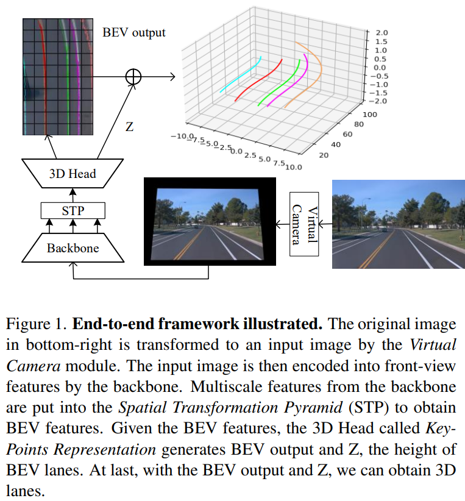
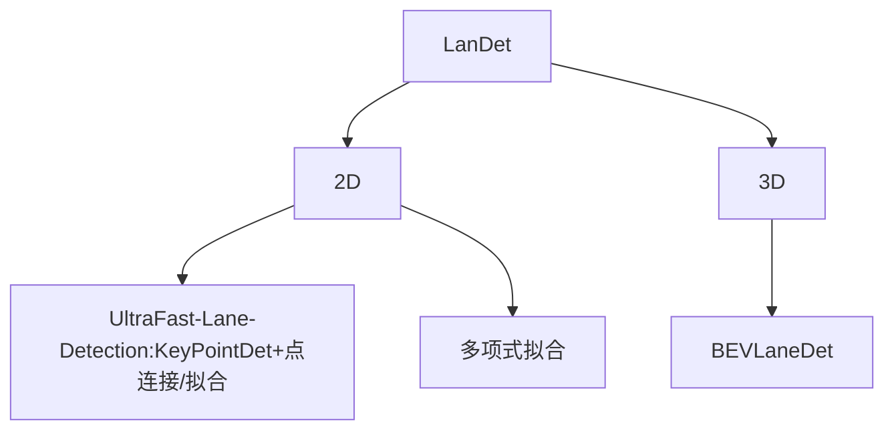
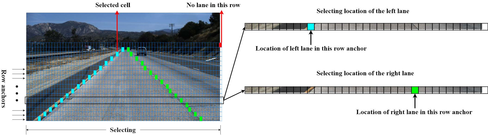
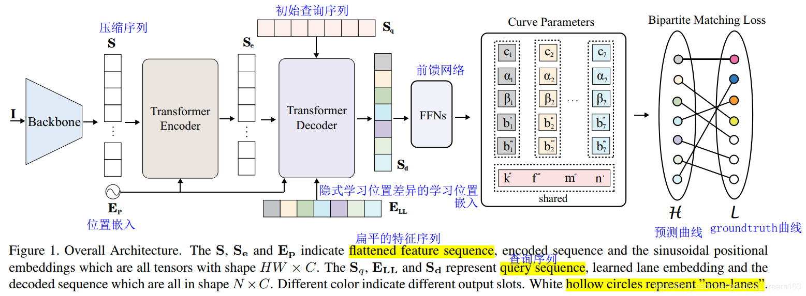

title: "BEVFormer"
author: "lvsolo"
date: "2025-05-18"
tags: ["paper reading",  "BEV","LaneDet"]

**车道线检出的形式分为结构化的和非结构化的，这个应该是一个核心问题。**

# 2D

## keypoints det

* 将每条车道线分成固定的纵向采样点（如 20 个 y 值），然后让网络预测每个 y 对应的 x。
* 所有关键点连接后构成曲线。

🔧 代表方法：

* **UltraFast-Lane-Detection (CVPR 2020)** ：
* 轻量级 backbone（ResNet18），预测 shape vector（每条线的 18 个点）。
* Head 输出是：`(N_lane x N_samples)` 的坐标矩阵。
* **LSTR (CVPR 2021)** ：
* 使用 Transformer 对每条 lane 的控制点进行建模，端到端预测控制点序列。

✅ 优点：

* 无需手工拟合。
* 可以处理曲线变化（只要 sample 足够多）。

⚠️ 缺点：

* 拟合质量依赖采样密度；
* 可能出现点顺序不稳定，需 postprocess。

### UltraFast-Lane-Detection

### LSTR:End-to-end Lane [Shape](https://so.csdn.net/so/search?q=Shape&spm=1001.2101.3001.7020) Prediction with Transformers

