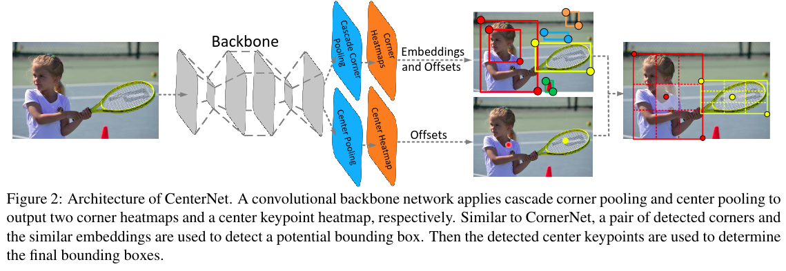

title: "CenterNet Objects as Points"
author: "lvsolo"
date: "2023-04-10"
tags: ["paper reading", "OD", "Detection", "Anchor Free"]

paper:

[CenterNet](https://readpaper.com/pdf-annotate/note?pdfId=4498420488547753985&noteId=678140303196692480)

[Objects as Points](https://readpaper.com/pdf-annotate/note?pdfId=4555055060279631873&noteId=1583979896715160320)

# 一.CenterNet

最初的CenterNet

## I.结构如图：structure:CenterPooling + Cascade Corner Pooling + 初版CenterPoint Head

### 1.CenterPooling Corner Pooling

### 2. 初版Centeroint Head

centernet的输出heatmap针对中心点的heatmap是有K个，K是分类数，但是左上角和右下角预测的heatmap分别只有一个。

heatmap对应的GT由高斯分布构成

Loss使用了GaussianFocalLoss（focalloss+BCE)和L1Loss

# 二.Objects as Points

最终版本的Centernet head：

K个headmap，对应K个类的中心点，[B, C, H_out, W_out]；

回归的size：w h [B, 2, H_out, W_out]

回归的中心点offset：回归由于下采样导致的精确位置损失[B, 2, H_out, W_out]
