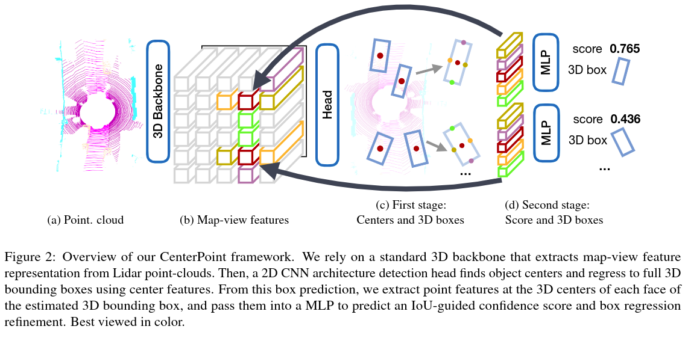

paper:[CenterPoint: Center-based 3D Object Detection and Trackin](https://readpaper.com/pdf-annotate/note?pdfId=4512589404061732865&noteId=1572645379722562304)

# 1. CenterPoint & History

CenterNet(Objects as Points) --> CenterPoint 二者的联系

| 分支              | CenterNet (2D)    | CenterPoint (3D)    |
| ----------------- | ----------------- | ------------------- |
| Heatmap           | ✅ 类别中心点热图 | ✅ 类别中心点热图   |
| Offset            | ✅ x,y 偏移量     | ✅ x,y 偏移量       |
| Size              | ✅ w,h            | ✅ l,w,h            |
| Height            | ❌                | ✅ z 值             |
| Rotation          | ❌（不需要）      | ✅ 使用 sin, cos    |
| Velocity          | ❌                | ✅（用于 tracking） |
| Output 特征图维度 | H×W（2D）        | H×W（BEV）         |

区别在于Centeroint是一个两阶段的检测器，而centernet是一个单阶段的

# 2.两阶段模型训练流程

### **阶段一：中心点候选生成（Proposal Generation）**

* **输入** ：点云数据（通常是 LiDAR），经过 voxelization 或 pillar 处理，变成稠密 BEV 特征图。
* **网络** ：主干网络（例如 VoxelNet、SECOND 或 PointPillars） + BEV backbone。
* **输出** ：
* **heatmap** （每类物体的中心点热图）
* **回归属性** ：包括 bbox 尺寸、方向、中心偏移、速度等
* **作用** ：
* 检测候选物体中心点
* 初步生成 3D 检测框 proposals

### 阶段一类似于 CenterNet，只不过是在 BEV 上完成。

---

### **阶段二：基于点的局部特征精化（RoI Refinement）**

* **目标** ：使用第一阶段生成的候选框，对**框内的点云进行局部提取**，**进一步精化预测（回归和分类）**
* **方法** ：
* 使用类似 PointNet 或 PointNet++ 的小型网络提取每个 proposal 区域的点云子集的特征
* 精调 bbox 的位置、尺寸、方向等
* **结果** ：更高精度的最终 3D 检测框

# 3.Loss
