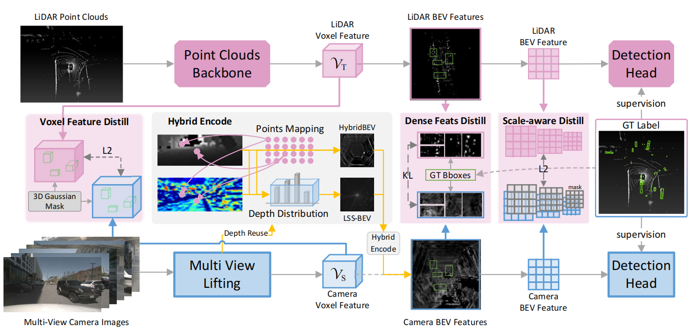

# 论文信息

- **标题**: HybridBEV: Hybrid Encode and Distillation for Improved BEV 3D Object Detection
- **作者**: Junyin Wang, Chenghu Du, Huikai Liu, Zhenchang Xia, Bingyi Liu, Shengwu Xiong
- **机构**: 武汉理工大学 等
- **发表**: IEEE Transactions on Intelligent Transportation Systems (T-ITS), Vol. 26, No. 11, pp. 21257-21270, Nov 2025
- **DOI**: [10.1109/tits.2025.3599015](https://doi.org/10.1109/tits.2025.3599015)
- **IEEE Xplore**: [document/11175584](https://ieeexplore.ieee.org/document/11175584/)
- **代码**: [github.com/wjyxx/HybridBEV](https://github.com/wjyxx/HybridBEV)

> **一句话总结**: 基于 LSS 的 BEV 检测方法（BEVDet/BEVDepth）直接把深度×特征 splat 到 BEV，丢失了高度维信息，导致物体定位和特征表示有歧义。HybridBEV 设计了 **HybridEncode 模块**——在 3D voxel 空间用 3D 卷积**重采样深度特征**，再用 **LiDAR teacher 的多级蒸馏**（voxel + BEV 特征）监督相机 student，从而让 BEV 特征更准确地反映物体分布。

---

# 背景 & 动机

## 环视相机 BEV 检测的两条技术路线

```
多视角图像 → BEV 特征 → 3D 检测, 有两大流派:

① Query-based (稀疏, 无显式 BEV):
   代表: DETR3D, PETR, BEVFormer, Sparse4D
   做法: 用 3D query 采样图像特征, 不构建稠密 BEV

② LSS-based (稠密, 显式深度):
   代表: LSS, BEVDet, BEVDepth, BEVPool
   做法: Lift (预测深度分布) → Splat (池化到 BEV) → Shoot (检测)
   HybridBEV 属于这一派 ✓
```

## LSS 范式回顾 (Lift-Splat-Shoot)

```
LSS 的三步:
━━━━━━━━━━━

  Lift (提升): 把 2D 图像像素 "提升" 到 3D 视锥 (frustum)
    - 对每个像素预测深度分布 D 个 bin 的概率
    - depth_probs × context_feature → 视锥点特征

  Splat (溅射/池化): 把视锥点池化到 BEV 网格
    - cumsum pooling (把落在同一 BEV 格子的点求和)
    - 直接沿 Z 轴塌缩! 丢失高度信息

  Shoot (检测): 在 BEV 特征上做检测
    - CenterPoint head 等

  数据流:
    图像 → backbone+FPN → 2D feat → ×depth → frustum feat → [Splat沿Z塌缩] → BEV feat → 检测
                                                          ↑
                                                          问题所在!
```

## 核心问题: 深度特征利用不充分

```
现有 LSS 方法的痛点 (论文动机):
━━━━━━━━━━━━━━━━━━━━━━━━━━━━━━━

  ① Splat 直接沿 Z 轴塌缩:
     - 不同高度的物体 (车顶 vs 车底) 的特征被混在一起
     - 物体在 BEV 上的定位变得模糊 (ambiguity in object location)
     - BEV 特征不能清晰反映物体分布

  ② 深度特征利用不充分:
     - 深度分布预测后, 只是简单和 context 相乘
     - 没有在 3D 空间进一步加工 / 重采样
     - 深度信息没有被充分用来约束物体位置

  ③ 相机 vs LiDAR 的性能差距:
     - 相机 BEV 检测远落后于 LiDAR
     - LiDAR 点云天然有精确的 3D 位置
     - 如何把 LiDAR 的知识迁移给相机? → 蒸馏
```

## HybridBEV 的两个核心创新

```
① HybridEncode (混合编码):
   不直接 Splat 塌缩, 而是先在 3D voxel 空间用 3D 卷积重采样
   → 让特征在 3D 空间被充分加工, 更准确反映物体分布
   → 再塌缩到 BEV

② Multiple Distillation (多级蒸馏):
   LiDAR teacher (CenterPoint) → camera student (HybridBEV)
   - voxel 特征蒸馏 (3D 层面)
   - BEV 特征蒸馏 (2D 层面)
   - 加载 teacher 预训练权重 (backbone 迁移)
```

---

# 整体架构

## 整体流程图



> **图注**: HybridBEV 整体架构。相机分支（student）：ResNet50 + FPN → ViewTransformer(LSS+Depth) → **HybirdEncoder(3D voxel 重采样)** → BEV Backbone → CenterHead。LiDAR 分支（teacher，仅训练）：提供 voxel 和 BEV 特征蒸馏监督。

## 数据流详解 (基于代码配置)

```
┌─────────────────────────────────────────────────────────────────────┐
│                      HybridBEV 完整 Pipeline                         │
│                                                                      │
│  ① 图像特征提取                                                       │
│  ┌──────────┐    ┌────────────┐    ┌──────────────┐                 │
│  │ 6 环视图像 │──→ │ ResNet-50  │──→ │ FPNForBEVDet │──→ 2D feat     │
│  │ 256×704  │    │ backbone   │    │ (out=512→1)  │    (H/16×W/16)  │
│  └──────────┘    └────────────┘    └──────────────┘                 │
│                                                                      │
│  ② View Transformer (LSS + Depth)                                    │
│  ┌─────────────────────────────────────────────────┐                 │
│  │ ViewTransformerLSSBEVDepth:                     │                 │
│  │   2D feat ──┬── extra_depth_net → depth 分布     │                 │
│  │             └── context MLP → 语义特征           │                 │
│  │   depth × context → frustum 点特征               │                 │
│  │   (有深度监督 loss_depth_weight=100)             │                 │
│  └──────────────────────┬──────────────────────────┘                 │
│                         │ frustum features                            │
│                         ▼                                            │
│  ③ HybridEncode (核心创新!)  ★                                      │
│  ┌─────────────────────────────────────────────────┐                 │
│  │ HybirdEncoder:                                   │                │
│  │   frustum feat → 重采样到 3D voxel 空间          │                 │
│  │   voxel_shape = [128, 128, 5]  (X, Y, Z)        │                 │
│  │   ┌─────────────────────────────┐               │                 │
│  │   │ 3D Conv (3×3×3) + BN3d+ReLU │               │                 │
│  │   │   ↓                          │               │                 │
│  │   │ 3D Conv (3×3×3) + BN3d+ReLU │ × num_convs=3 │                 │
│  │   │   ↓                          │               │                 │
│  │   │ 3D Conv (3×3×3) + BN3d+ReLU │               │                 │
│  │   └─────────────────────────────┘               │                 │
│  │   → 沿 Z 轴池化 (max/avg) → BEV feat             │                 │
│  └──────────────────────┬──────────────────────────┘                 │
│                         │ BEV features                                │
│                         ▼                                            │
│  ④ BEV 编码                                                           │
│  ┌──────────────────┐    ┌──────────┐                                │
│  │ pre_process      │──→ │ResNet    │──→ FPN_LSS ──→ 检测特征        │
│  │ (SCNET/CustomRN) │    │ForBEVDet │               (256d)           │
│  └──────────────────┘    └──────────┘                                │
│                                                                      │
│  ⑤ 检测头                                                             │
│  ┌────────────────────────────────────────────────┐                  │
│  │ CenterHead_task (task-specific, 6 个子任务):    │                  │
│  │   car | truck+CV | bus+trailer | barrier |       │                 │
│  │   motorcycle+bicycle | pedestrian+traffic_cone  │                  │
│  └────────────────────────────────────────────────┘                  │
│                                                                      │
│  ─── 蒸馏 (训练时, LiDAR teacher) ───────────────                    │
│  is_distill=True:                                                    │
│    LiDAR voxel feat ──→ 蒸馏 student voxel feat                      │
│    LiDAR BEV feat   ──→ 蒸馏 student BEV feat                        │
│    LiDAR 预训练权重 ──→ 加载到 student (加速训练)                     │
└─────────────────────────────────────────────────────────────────────┘
```

## 关键配置参数 (来自 `hybirdbev_base.py`)

```
grid_config (LSS 网格):
  xbound: [-51.2, 51.2, 0.8]   ← X 方向: 102.4m, 0.8m 分辨率 → 128 格
  ybound: [-51.2, 51.2, 0.8]   ← Y 方向: 102.4m, 0.8m 分辨率 → 128 格
  zbound: [-10.0, 10.0, 20.0]  ← Z 方向: 整体一个 bin (标准 LSS 塌缩)
  dbound: [1.0, 60.0, 1.0]     ← 深度: 1~60m, 1m 分辨率 → 59 个 bin

HybirdEncoder:
  voxel_shape: [128, 128, 5]   ← 关键! 3D voxel = 128(X) × 128(Y) × 5(Z)
                                  ↑ Z 不再塌缩成 1, 而是 5 个高度层!
  num_points: 5                ← 对应 Z 方向 5 个采样点
  embed_dims: 128
  num_convs: 3                 ← 3 层 3D 卷积
  kernel_size: (3, 3, 3)       ← 3D 卷积核
  conv_dict: Conv3d + BN3d + ReLU

numC_Trans: 64                 ← LSS view transform 后的通道数
```

---

# HybridEncode 模块详解 (核心创新)

## 标准 LSS Splat vs HybridEncode

```
标准 LSS (BEVDet/BEVDepth):
━━━━━━━━━━━━━━━━━━━━━━━━━━━

  frustum 特征 (D 个深度 × H × W)
         │
         ▼ Splat: cumsum pooling
  ┌──────────────────────────────────────┐
  │  直接沿 Z 轴求和塌缩!                 │
  │  所有高度的特征 → 单层 BEV            │
  │                                      │
  │  结果: [128, 128, 1] × 64ch          │
  │  ↑ Z=1, 完全丢失高度信息              │
  └──────────────────────────────────────┘
         │
         ▼
  BEV 特征 [128, 128, 64]

  问题:
    - 车辆 (高 ~1.5m) 和地面 (高 0m) 的特征被混在一个 BEV 格子
    - 不同高度物体的边界模糊
    - 深度特征没有被 3D 加工

HybridEncode (HybridBEV):
━━━━━━━━━━━━━━━━━━━━━━━━

  frustum 特征 (D 个深度 × H × W)
         │
         ▼ 重采样到 voxel 空间
  ┌──────────────────────────────────────┐
  │  构建 3D voxel volume                │
  │  voxel_shape = [128, 128, 5]         │
  │  ↑ X × Y × Z(5个高度层)              │
  │                                      │
  │  → 不塌缩! 保留 5 个高度层             │
  └──────────────────────────────────────┘
         │
         ▼ 3D 卷积加工 (核心!)
  ┌──────────────────────────────────────┐
  │  Conv3d(3×3×3) + BN3d + ReLU         │
  │       ↓                              │
  │  Conv3d(3×3×3) + BN3d + ReLU   × 3   │
  │       ↓                              │
  │  Conv3d(3×3×3) + BN3d + ReLU         │
  │                                      │
  │  3D 卷积让特征在 (X, Y, Z) 三维      │
  │  空间互相交互, 更准确反映物体分布      │
  └──────────────────────────────────────┘
         │
         ▼ 沿 Z 轴池化
  ┌──────────────────────────────────────┐
  │  max pooling / avg pooling           │
  │  或 max+avg 融合 (max_avg 配置)       │
  │  把 5 个高度层 → 单层 BEV             │
  │  [128, 128, 5] → [128, 128, 1]       │
  └──────────────────────────────────────┘
         │
         ▼
  BEV 特征 (经过 3D 加工, 更准确)
```

## 为什么 HybridEncode 有效？

```
① 保留高度维信息:
   标准 LSS: Z 直接塌缩成 1 → 丢失高度
   HybridEncode: 保留 5 个高度层 → 3D 卷积后再塌缩
   → 物体的 3D 结构信息被保留和利用

② 3D 卷积的空间交互:
   Conv3d(3×3×3) 让每个 voxel 和它 3D 邻居 (上下左右前后) 交互
   → 深度预测的噪声被 3D 邻域平滑
   → 物体的特征更连续、更准确

③ 重采样让深度特征更准:
   "resampling strategy of depth features in voxel space"
   - 原始 LSS 的深度是逐像素预测的, 有噪声
   - 在 voxel 空间重采样 = 用 3D 几何先验重新组织特征
   - 让特征分布更贴合真实物体的 3D 分布

④ max vs avg 池化的选择 (max_avg 配置):
   max pooling: 保留最显著的特征 (适合检测显著物体)
   avg pooling: 平滑特征 (适合减少噪声)
   max+avg 融合: 结合两者优势
```

## HybridEncode 的 voxel_shape 设计

```
voxel_shape = [128, 128, 5]:
  X = 128 格 (对应 102.4m / 0.8m = 128)
  Y = 128 格 (对应 102.4m / 0.8m = 128)
  Z = 5 格  ← 关键设计

  为什么 Z=5?
    - pc_range Z = [-5.0, 3.0] = 8m 范围
    - 5 个高度层, 每层 ~1.6m
    - 足以区分: 地面(0) / 车身(1-2) / 车顶/高物体(3-4)
    - 不需要太多 (Z 太多会增加 3D 卷积计算量)

  num_points = 5:
    对每个 BEV 格子, 从 5 个高度采样点提取特征
    → 构建 3D voxel volume 的来源
```

---

# 蒸馏策略 (Distillation)

## Teacher-Student 框架

```
┌──────────────────────────────────────────────────────────────────┐
│                   LiDAR → Camera 蒸馏框架                        │
│                                                                  │
│  ┌─────────────────────┐         ┌─────────────────────┐         │
│  │  LiDAR Teacher      │         │  Camera Student      │         │
│  │  (CenterPoint)      │         │  (HybridBEV)         │         │
│  │                     │         │                      │         │
│  │  点云 → voxelization│         │  图像 → Lift → voxel │         │
│  │   ↓                 │         │   ↓                  │         │
│  │  voxel feat ────────┼─蒸馏①──→│ voxel feat           │         │
│  │   ↓ 3D backbone     │         │   ↓ HybridEncode     │         │
│  │  BEV feat ──────────┼─蒸馏②──→│ BEV feat             │         │
│  │   ↓                 │         │   ↓                  │         │
│  │  检测输出            │         │  检测输出             │         │
│  └─────────────────────┘         └─────────────────────┘         │
│                                                                  │
│  ③ 预训练权重迁移:                                                │
│     teacher backbone 权重 → student backbone (维度匹配处)         │
│                                                                  │
│  注意: teacher 仅训练时使用, 推理时只有 student                    │
└──────────────────────────────────────────────────────────────────┘
```

## 三级蒸馏

```
① Voxel 特征蒸馏 (3D 层面):
   teacher voxel feat (128×128×5×C)
   student voxel feat (128×128×5×C)
   → L2 / MSE loss 拉近两者
   → 让相机 student 在 3D 空间学习 LiDAR 的精确几何

② BEV 特征蒸馏 (2D 层面):
   teacher BEV feat
   student BEV feat
   → feature imitation loss
   → 让 BEV 特征更清晰反映物体分布

③ 预训练权重加载 (backbone 迁移):
   is_distill=True 时:
   - 加载 LiDAR teacher 训练好的 backbone 权重
   - 初始化到 camera student 的 backbone
   - 维度匹配的层直接迁移
   → 引导优化方向, 加速收敛
```

## 蒸馏为什么有效？

```
LiDAR teacher 的优势:
  - 点云有精确的 3D 坐标 (无深度预测误差)
  - voxel 特征几何上更准确
  - BEV 特征物体分布更清晰

迁移给 camera student:
  - student 的深度预测有噪声 → voxel 特征模糊
  - 通过模仿 teacher 的 voxel 特征 → 学习更准的 3D 表示
  - 通过模仿 teacher 的 BEV 特征 → 物体分布更清晰
  - 结果: student 性能逼近 teacher, 但推理只需相机

配置体现:
  is_distill=True  ← 开启蒸馏
  (推理时可以关闭, 只用 student)
```

---

# 实验结果

## 数据集与设置

```
数据集: nuScenes
  - 10 类目标检测 (car, truck, ..., pedestrian, traffic_cone)
  - 6 个环视相机
  - 标准 train/val 划分

指标:
  - NDS (nuScenes Detection Score): 综合指标
  - mAP: 平均精度
  - mATE / mASE / mAOE / mAVE / mAAE: 各类误差

设置:
  - backbone: ResNet-50
  - 输入: 256×704
  - 深度监督: loss_depth_weight=100
  - CenterPoint head (task-specific, 6 子任务)
```

## 与 SOTA 对比 (论文声称)

```
论文结论:
  HybridBEV 在 nuScenes 上:
  - 有效提升 student network 性能
  - 超越之前基于环视相机的 SOTA 方法

对比对象 (同为 LSS-based 相机方法):
  - BEVDet
  - BEVDepth
  - BEVPool
  - 其他蒸馏方法: BEVDistill, CMKD, DistillBEV

消融实验验证三个创新各自有效:
  ① + HybridEncode: 提升 voxel/BEV 特征质量
  ② + 多级蒸馏: 提升 student 性能
  ③ + 预训练权重: 加速收敛 + 小幅提升
```

## 消融: 池化方式的影响

```
配置文件名暗示了池化策略的对比:
  hybirdbev_base.py          ← 基础 (单一池化)
  hybirdbev_max_avg.py       ← max + avg 融合池化
  hybirdbev_max_avg_secondfpn.py ← max+avg + 第二个 FPN

  说明:
  - Z 轴塌缩方式 (max / avg / max+avg) 是重要消融点
  - max+avg 融合通常效果更好 (结合显著特征 + 平滑)
  - second FPN 进一步精炼 BEV 特征
```

---

# 与相关方法的对比

## HybridBEV 在 LSS 家族中的位置

```
┌────────────────────────────────────────────────────────────────┐
│            LSS-based 相机 BEV 方法演进                          │
│                                                                │
│  LSS (2020)                                                    │
│   ↓  提出 Lift-Splat-Shoot 范式                                │
│  BEVDet (2021)                                                 │
│   ↓  模块化, BEV 数据增强, Scale-NMS                           │
│  BEVDepth (2022)                                               │
│   ↓  加入显式深度监督 (LiDAR depth GT)                          │
│  BEVPool (2022)                                                │
│   ↓  高效池化 CUDA kernel                                      │
│  ─────────────────────────────────────────────                 │
│  HybridBEV (2025) ← 本论文                                     │
│   ★ HybridEncode: 3D voxel 空间重采样深度特征 (3D Conv)        │
│   ★ 多级蒸馏: LiDAR teacher 监督 voxel + BEV                   │
│   ★ 预训练权重迁移                                              │
└────────────────────────────────────────────────────────────────┘
```

## 与蒸馏方法 (BEVDistill / CMKD) 的区别

```
| 方法         | 蒸馏层级              | HybridEncode? | 特点               |
|--------------|----------------------|---------------|--------------------|
| BEVDistill   | BEV + 多尺度特征      | ❌            | 基于 BEVFusion     |
| CMKD         | BEV 特征 + 关系蒸馏   | ❌            | 跨模态知识蒸馏      |
| DistillBEV   | BEV + 深度 + 检测     | ❌            | 多目标蒸馏         |
| HybridBEV    | voxel + BEV + 权重   | ✅ (3D Conv) | 唯一在 voxel 层蒸馏 |
                                                        + HybridEncode

  HybridBEV 的独特之处:
  ① 唯一在 voxel (3D) 层面做蒸馏的方法
     - 其他方法主要在 BEV (2D) 层面蒸馏
     - voxel 层蒸馏保留 3D 几何信息
  ② 配合 HybridEncode 的 3D 卷积
     - 蒸馏的 voxel 特征能被 3D 卷积充分利用
     - 形成 "3D 重采样 + 3D 蒸馏" 的协同
```

---

# 核心要点总结

## HybridBEV 的三个贡献

```
┌────────────────────────────────────────────────────────────────┐
│                                                                 │
│  ① HybridEncode 模块:                                           │
│     在 3D voxel 空间用 3D 卷积重采样深度特征                      │
│     → 保留高度维, 让 BEV 特征更准反映物体分布                    │
│     → 解决标准 LSS 直接塌缩导致的定位歧义                        │
│                                                                 │
│  ② 多级蒸馏 (voxel + BEV):                                      │
│     LiDAR teacher 同时监督 3D voxel 和 2D BEV 特征               │
│     → student 学习 teacher 的精确 3D 几何和清晰物体分布          │
│                                                                 │
│  ③ 预训练权重迁移:                                               │
│     加载 teacher backbone 权重                                   │
│     → 引导优化, 加速收敛                                         │
│                                                                 │
└────────────────────────────────────────────────────────────────┘
```

## 关键洞察

```
1. "深度特征要 3D 加工, 不能直接塌缩"
   标准 LSS: depth × context → 立刻 Splat 到 BEV (浪费深度信息)
   HybridBEV: 先在 3D voxel 空间用 3D Conv 加工, 再塌缩

2. "蒸馏要分层级, voxel 层比 BEV 层更关键"
   - BEV 蒸馏 (其他方法): 只能迁移 2D 信息
   - voxel 蒸馏 (HybridBEV): 迁移完整 3D 几何
   - 配合 HybridEncode 的 3D Conv, 让 3D 蒸馏真正发挥作用

3. "ResNet50 backbone 能从 LiDAR teacher 受益"
   即使相机和 LiDAR 输入不同, backbone 的低层特征 (边缘/纹理) 可迁移
   → 加载 teacher 权重作为更好的初始化
```

## 适用场景

```
适合 HybridBEV 的场景:
  ✓ 纯相机部署 (推理只用 student)
  ✓ 训练时有 LiDAR 数据 (用于 teacher + 深度监督)
  ✓ 追求高精度 BEV 检测
  ✓ 基于 LSS 范式的项目 (易集成)

不适合:
  ✗ 完全没有 LiDAR 数据 (无法训 teacher + 无深度 GT)
  ✗ 极致推理速度 (3D Conv 比 2D Conv 慢)
  ✗ Query-based 架构 (DETR3D/BEVFormer, 不是 LSS 范式)
```

---

# 参考资料

- **HybridBEV 原论文**: Wang et al., "HybridBEV: Hybrid Encode and Distillation for Improved BEV 3D Object Detection", IEEE T-ITS 2025, Vol. 26, No. 11, pp. 21257-21270, [DOI](https://doi.org/10.1109/tits.2025.3599015)
- **官方代码**: [github.com/wjyxx/HybridBEV](https://github.com/wjyxx/HybridBEV)
- **LSS (前置工作)**: Philion & Fidler, "Lift, Splat, Shoot", ECCV 2020, [arXiv:2008.05711](https://arxiv.org/abs/2008.05711)
- **BEVDet**: Huang et al., "BEVDet: High-performance Multi-camera 3D Object Detection", [arXiv:2112.11790](https://arxiv.org/abs/2112.11790)
- **BEVDepth**: Li et al., "BEVDepth: Acquisition of Reliable Depth for Multi-view 3D Object Detection", AAAI 2023, [arXiv:2206.10092](https://arxiv.org/abs/2206.10092)
- **BEVDistill (蒸馏相关)**: Chen et al., "BEVDistill: Cross-Modal BEV Distillation", ICLR 2023
- **CMKD**: "Cross-Modal Knowledge Distillation for BEV 3D Object Detection"
- **CenterPoint (teacher)**: Yin et al., "Center-based 3D Object Detection and Tracking", CVPR 2021
