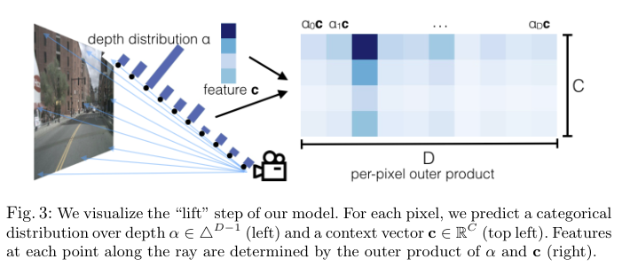
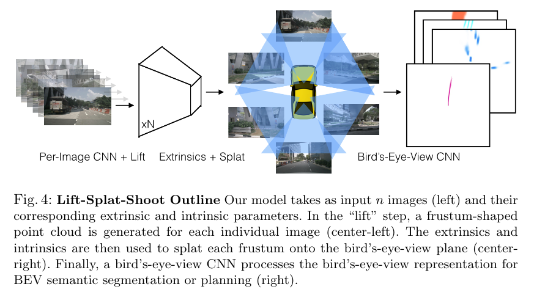
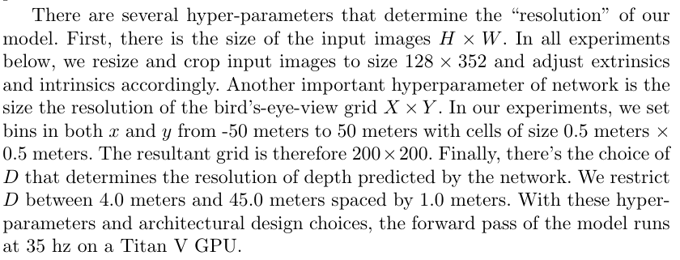
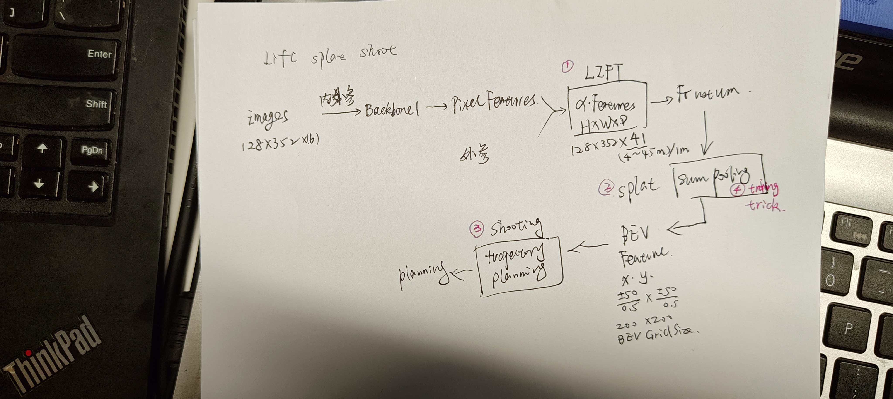

title: "LSS:lift splat shoot"
author: "lvsolo"
date: "2025-04-10"
tags: ["paper reading", "lidar detection", "BEV"]

# 1.Paper

Lift



Lift splat architechture



实验条件超参数



整体流程



# 2.Code

github.com:nv-tlabs/lift-splat-shoot.git

## 2.1 Lift


## 2.2 Splat

cumsum pooling  trick

```python
    def voxel_pooling(self, geom_feats, x):
        B, N, D, H, W, C = x.shape
        Nprime = B*N*D*H*W

        # flatten x
        x = x.reshape(Nprime, C)

        # flatten indices
        geom_feats = ((geom_feats - (self.bx - self.dx/2.)) / self.dx).long()
        geom_feats = geom_feats.view(Nprime, 3)
        batch_ix = torch.cat([torch.full([Nprime//B, 1], ix,
                             device=x.device, dtype=torch.long) for ix in range(B)])
        geom_feats = torch.cat((geom_feats, batch_ix), 1)

        # filter out points that are outside box
        kept = (geom_feats[:, 0] >= 0) & (geom_feats[:, 0] < self.nx[0])\
            & (geom_feats[:, 1] >= 0) & (geom_feats[:, 1] < self.nx[1])\
            & (geom_feats[:, 2] >= 0) & (geom_feats[:, 2] < self.nx[2])
        x = x[kept]
        geom_feats = geom_feats[kept]

        # get tensors from the same voxel next to each other
        ranks = geom_feats[:, 0] * (self.nx[1] * self.nx[2] * B)\
            + geom_feats[:, 1] * (self.nx[2] * B)\
            + geom_feats[:, 2] * B\
            + geom_feats[:, 3]
        sorts = ranks.argsort()
        x, geom_feats, ranks = x[sorts], geom_feats[sorts], ranks[sorts]

        # cumsum trick
        if not self.use_quickcumsum:
            x, geom_feats = cumsum_trick(x, geom_feats, ranks)
        else:
            x, geom_feats = QuickCumsum.apply(x, geom_feats, ranks)

        # griddify (B x C x Z x X x Y)
        final = torch.zeros((B, C, self.nx[2], self.nx[0], self.nx[1]), device=x.device)
        final[geom_feats[:, 3], :, geom_feats[:, 2], geom_feats[:, 0], geom_feats[:, 1]] = x

        # collapse Z
        final = torch.cat(final.unbind(dim=2), 1)

        return final
```

```python
def cumsum_trick(x, geom_feats, ranks):
    x = x.cumsum(0)
    kept = torch.ones(x.shape[0], device=x.device, dtype=torch.bool)
    kept[:-1] = (ranks[1:] != ranks[:-1])

    x, geom_feats = x[kept], geom_feats[kept]
    x = torch.cat((x[:1], x[1:] - x[:-1]))

    return x, geom_feats

```


## 2.3 Others

Frustum

```python

    def create_frustum(self):
        # make grid in image plane
        ogfH, ogfW = self.data_aug_conf['final_dim']
        fH, fW = ogfH // self.downsample, ogfW // self.downsample
        ds = torch.arange(*self.grid_conf['dbound'], dtype=torch.float).view(-1, 1, 1).expand(-1, fH, fW)
        D, _, _ = ds.shape
        xs = torch.linspace(0, ogfW - 1, fW, dtype=torch.float).view(1, 1, fW).expand(D, fH, fW)
        ys = torch.linspace(0, ogfH - 1, fH, dtype=torch.float).view(1, fH, 1).expand(D, fH, fW)

        # D x H x W x 3
        frustum = torch.stack((xs, ys, ds), -1)
        return nn.Parameter(frustum, requires_grad=False)

```
