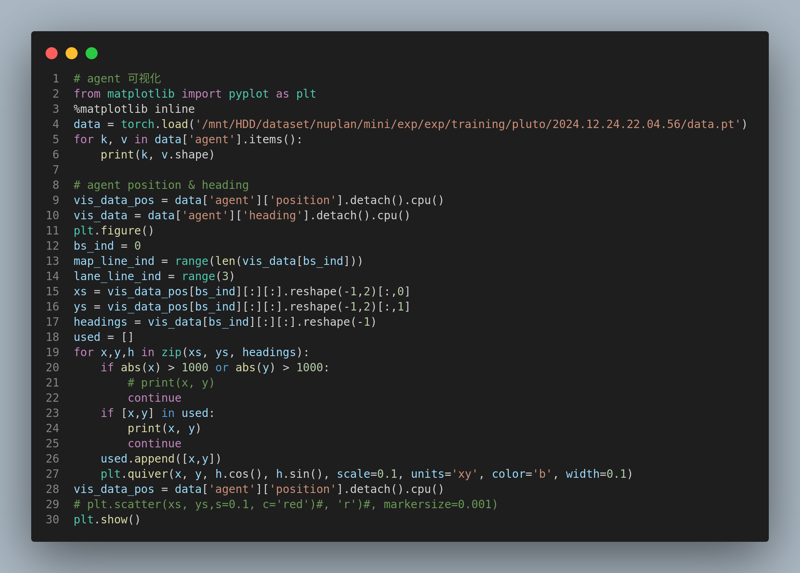

# I.Preparations

## 1.Input Visualization of Every Part of the Planner

### 1.1 mapencoder

#### 1.1.1 point position

shape:bs*(len(lane)+len(crosswalk))\*3\**SampleNumPoints**2

let M=len(lane)+len(crosswalk)

P =  SampledNumPoints

bs  \* *M \** 3 \* *P \** 2

#### 1.1.2 pointvector

bs*(len(lane)+len(crosswalk))\*3\*SampleNumPoints\*2

bs\*M\*3\*P

对于某一个M，即某一个点集可视化：

#### 1.1.3 point orientation？

bs*(len(lane)+len(crosswalk))\*3*SampleNumPoints

#### 1.1.4 pointside

value=0中心线

value=1左边线

value=2右边线

shape:bs\*M*3

#### 1.1.5 polygon center:

shape:M*3

centerline中间点的x，y坐标+pointorientation

#### 1.1.6 polygonposition

M*2

#### 1.1.7 polygonorientation

#### 1.1.8 polygon type

bs*M

value= 0 or 1 or 2

#### 1.1.9 polygon on route

shape:bs*M

value:bool if True 表示polygon在规划路线上，Flase表示不在规划路线上？

#### 1.1.10 polygon tl status

shape:bs* M

value:True or false 表示该polygon是否可以通行

#### 1.1.11 polygon_has_speed_limit

#### 1.1.12speedlight limit

shape:bs*M

value:float

#### 1.1.13 polygon road block id

shape:bs * M

#### 1.1.14 polygon是从哪来的？

polygon实际上是通过map中的车道线（lane）和人行道（cross lane）两种线对应的点组成的：

车道线：

人行道：

### 1.2.referencelines

#### 1.2.1 reference line position & vector

shape:bs * num_reference_line * num_sampled_points * 2

bs* R * P *2

#### 1.2.2 orientation

shape:bs\*R*P

#### 1.2.3 valid mask

bs\*R*P

#### 1.2.4 future projection

shape:bs\*R\*8*2

value:

### 1.3.agent visualization

bs* min(agent_num, max_agent_num) * len(tracked_object_list)

bs* A * T

agent中的第0个元素是自车，category为0；agent中包含当前时刻前2秒和后8秒的数据，所以第0个元素的第20个时刻的position信息是（0，0），即：

$data['agent']['position'][0][20] = (0,0)$

#### 1.3.1 agent position & heading

bs * A * T * 2  & bs * A * T

#### 1.3.2 velocity

bs * A * T * 2

#### 1.3.3 shape

bs * A * T * 2

#### 1.3.4 category

bs * A

#### 1.3.5 valid mask

bs * A * T

#### 1.3.6 target (when training)

### 1.4  static objects

#### 1.4.1 position & heading & valid_mask

## 2.Primer knowledge

### 2.1 yaw defination

### 2.2

# II.Paper Comprehension

## 1. model structure & pipeline

### 1.1 特征提取

1. $E_A$:
2. $E_o$:

valid_mask的作用

#### 1.1.1 Encoder

##### 1.1.1.1 agent history encoder :$E_A$

1.使用帧间差值作为输入；

2.使用了neightbour attention1D

该natten模块没有针对onnx进行适配，无法导出可对齐的onnx模型，落地中改为multiheadattention

3.FPN

##### 1.1.1.2 static obstacles encoder: $E_O$

two layer mlp:

##### 1.1.1.3 AV's state encoding:$E_{AV}$

1.不使用自车历史状态信息，因为可能导致从历史信息中学到捷径。

2.使用了SDE:

##### 1.1.1.4 map encoder:$E_P$

1.poluline feature构造：

2.Pointnet like polyline encoder:

pointnet++的具体流程：

1.sampling layer FPS 最远距离采样；2.grouping layer分组，以关键点为中心按距离或半径分组临近点；3.Pointnet layer 使用mlp生成特征

##### 1.1.1.5 Scene Encoding

1.pose embedding：

2.learnable attribute embedding:$E_{attr}$

map polygon attribute embedding:

agent attribute embedding:

static obstacles attribute embedding:

pose embedding:

#### 1.1.2 Decoder

使用类似DETR的轨迹解码器，由于anchor free的queries会导致模型训练不稳定，所以构建了一个包含经纬度信息的半anchor free的解码器结构。

##### 1.1.2.1 Reference Lines as Lateral Queries

参考线是如何生成的？

参考线是从车道线和斑马线生成出来的，这些线是从所有的map中的polyline中在行进route路线内的线

##### 1.1.2.2 Factorized Lateral-longitudinal Self-Attention

如何实现一个semi-anchor-based Queries？

$N_L$：learnable queries数量，注意这个是对应longitudinal纵向的区域的，$N_L-1$为对应的参考线被分割成的线段数量， $N_L$为参考线上端点和分割点的个数；

$N_R$：reference lines数量

1.$Q_0$的生成代码

2.经纬方向自注意力机制的分解，降低计算量

由参考线得到的queries $Q_{lat}$:$N_R$X$D$

learnable queries $Q_{lon}$:$N_L$X$D$

通过concat+mlp生成的$Q_0$:$N_R$X$N_L$X$D$

对$Q_0$直接使用自注意力，复杂度为$N_R^2$$N_L^2$,使用分解后的方式，分别计算第一维和第二维的自注意力，降低复杂度

##### 1.1.2.3 Trajectory Decoding

##### 1.1.2.4 Imitation Loss

示意图：

1.离专家轨迹的终点侧向距离最近的参考线作为target reference line。

2.$N_L-1$等于参考线分割得到的线段数量，前$N_L-1$个learnable queries分别对应了target reference line中的前$N_L-1$个线段区间；

3.target reference line上的分割好的线段中，离专家轨迹的终点最近的那个线段区间对应的learnable queries会被用于计算imitation loss，通过head生成轨迹信息，注意这个线段并不一定是target reference  line的最后一段。

##### 1.1.2.5 Prediction loss

agent车辆轨迹预测：

