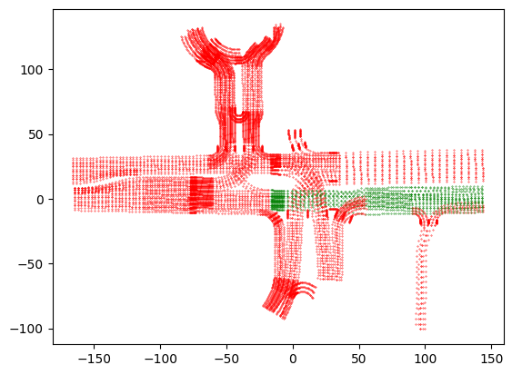
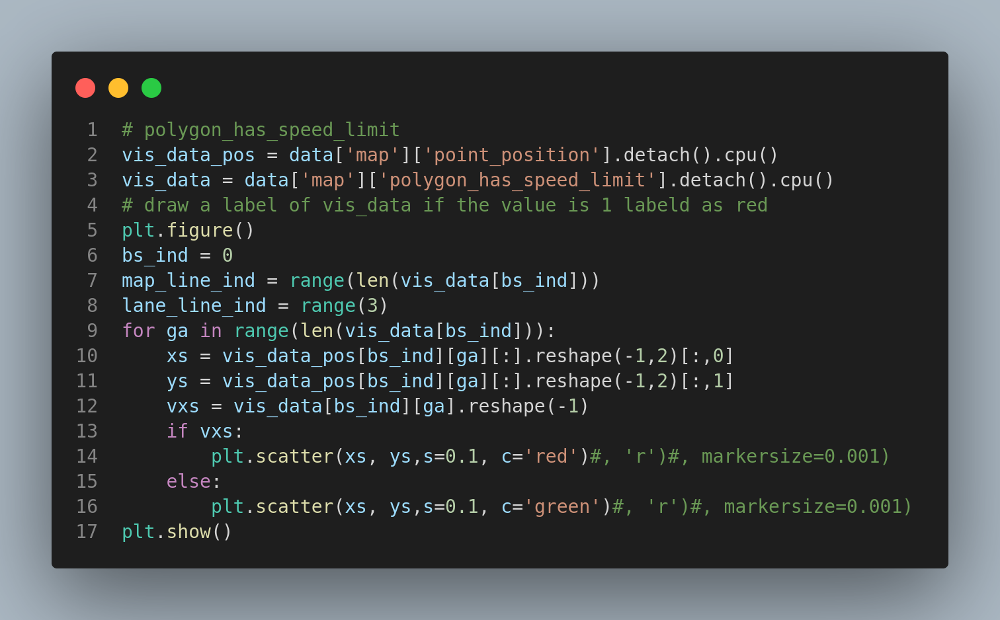
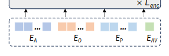

# I.Preparations

## 1.Input Visualization of Every Part of the Planner

### 1.1 mapencoder

#### 1.1.1 point position

shape:bs*(len(lane)+len(crosswalk))\*3\**SampleNumPoints**2

let M=len(lane)+len(crosswalk)

P =  SampledNumPoints

bs  \* *M \** 3 \* *P \** 2

#### 1.1.2 pointvector

bs*(len(lane)+len(crosswalk))\*3\*SampleNumPoints\*2

bs\*M\*3\*P

对于某一个M，即某一个点集可视化：

#### 1.1.3 point orientation？

bs*(len(lane)+len(crosswalk))\*3*SampleNumPoints

#### 1.1.4 pointside

value=0中心线

value=1左边线

value=2右边线

shape:bs\*M*3

#### 1.1.5 polygon center:

shape:M*3

centerline中间点的x，y坐标+pointorientation

#### 1.1.6 polygonposition

M*2

#### 1.1.7 polygonorientation

#### 1.1.8 polygon type

bs*M

value= 0 or 1 or 2

#### 1.1.9 polygon on route

shape:bs*M

value:bool if True 表示polygon在规划路线上，Flase表示不在规划路线上？

#### 1.1.10 polygon tl status

shape:bs* M

value:True or false 表示该polygon是否可以通行

#### 1.1.11 polygon_has_speed_limit

#### 1.1.12speedlight limit

shape:bs*M

value:float

#### 1.1.13 polygon road block id

shape:bs * M

#### 1.1.14 polygon是从哪来的？

polygon实际上是通过map中的车道线（lane）和人行道（cross lane）两种线对应的点组成的：

车道线：

人行道：

### 1.2.referencelines

#### 1.2.1 reference line position & vector

shape:bs * num_reference_line * num_sampled_points * 2

bs* R * P *2

#### 1.2.2 orientation

shape:bs\*R*P

#### 1.2.3 valid mask

bs\*R*P

#### 1.2.4 future projection

shape:bs\*R\*8*2

value:

### 1.3.agent visualization

bs* min(agent_num, max_agent_num) * len(tracked_object_list)

bs* A * T

agent中的第0个元素是自车，category为0；agent中包含当前时刻前2秒和后8秒的数据，所以第0个元素的第20个时刻的position信息是（0，0），即：

$data['agent']['position'][0][20] = (0,0)$

#### 1.3.1 agent position & heading

bs * A * T * 2  & bs * A * T

#### 1.3.2 velocity

bs * A * T * 2

#### 1.3.3 shape

bs * A * T * 2

#### 1.3.4 category

bs * A

#### 1.3.5 valid mask

bs * A * T
#### 1.3.6 target (when training)

### 1.4  static objects

#### 1.4.1 position & heading & valid_mask

## 2.Primer knowledge

### 2.1 yaw defination

### 2.2 

# II.Paper Comprehension

## 1. model structure & pipeline

### 1.1 特征提取

1. $E_A$:
2. $E_o$:

valid_mask的作用
