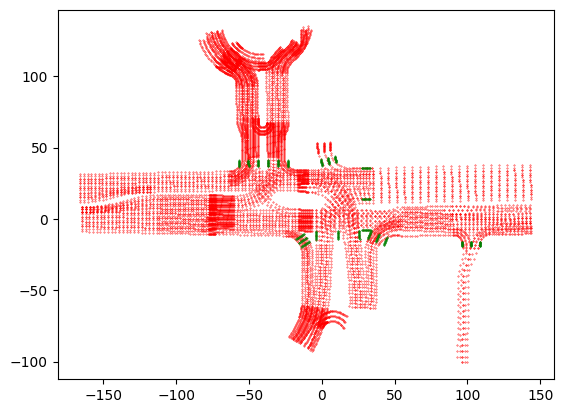
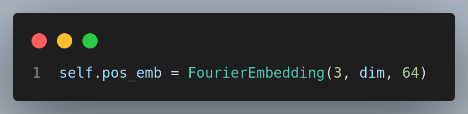

# I.Preparations

## 1.Input Visualization of Every Part of the Planner

### 1.1 mapencoder


#### 1.1.1 point position

shape:bs*(len(lane)+len(crosswalk))\*3\**SampleNumPoints**2

let M=len(lane)+len(crosswalk)

P =  SampledNumPoints

bs  \* *M \** 3 \* *P \** 2


#### 1.1.2 pointvector

bs*(len(lane)+len(crosswalk))\*3\*SampleNumPoints\*2

bs\*M\*3\*P


对于某一个M，即某一个点集可视化：


#### 1.1.3 point orientation？

bs*(len(lane)+len(crosswalk))\*3*SampleNumPoints


#### 1.1.4 pointside

value=0中心线

value=1左边线

value=2右边线

shape:bs\*M*3


#### 1.1.5 polygon center:

shape:M*3

centerline中间点的x，y坐标+pointorientation


#### 1.1.6 polygonposition

M*2


#### 1.1.7 polygonorientation

#### 1.1.8 polygon type

bs*M

value= 0 or 1 or 2


#### 1.1.9 polygon on route

shape:bs*M

value:bool if True 表示polygon在规划路线上，Flase表示不在规划路线上？


#### 1.1.10 polygon tl status

shape:bs* M

value:True or false 表示该polygon是否可以通行


#### 1.1.11 polygon_has_speed_limit




#### 1.1.12speedlight limit

shape:bs*M

value:float


#### 1.1.13 polygon road block id

shape:bs * M


#### 1.1.14 polygon是从哪来的？

polygon实际上是通过map中的车道线（lane）和人行道（cross lane）两种线对应的点组成的：

车道线：


人行道：


### 1.2.referencelines


#### 1.2.1 reference line position & vector

shape:bs * num_reference_line * num_sampled_points * 2

bs* R * P *2


#### 1.2.2 orientation

shape:bs\*R*P

#### 1.2.3 valid mask

bs\*R*P


#### 1.2.4 future projection

shape:bs\*R\*8*2

value:

### 1.3.agent visualization

bs* min(agent_num, max_agent_num) * len(tracked_object_list)

bs* A * T

agent中的第0个元素是自车，category为0；agent中包含当前时刻前2秒和后8秒的数据，所以第0个元素的第20个时刻的position信息是（0，0），即：

$data['agent']['position'][0][20] = (0,0)$

#### 1.3.1 agent position & heading

bs * A * T * 2  & bs * A * T


#### 1.3.2 velocity

bs * A * T * 2

#### 1.3.3 shape

bs * A * T * 2

#### 1.3.4 category

bs * A

#### 1.3.5 valid mask

bs * A * T

#### 1.3.6 target (when training)


### 1.4  static objects

#### 1.4.1 position & heading & valid_mask


### 1.5 cost maps


## 2.Primer knowledge

### 2.1 yaw defination


### 2.2

# II.Paper Comprehension

## 1. model structure & pipeline


### 1.1 特征提取


1. $E_A$:
2. $E_o$:

valid_mask的作用

#### 1.1.1 Encoder

##### 1.1.1.1 agent history encoder :$E_A$

1.使用帧间差值作为输入；

2.使用了neightbour attention1D


该natten模块没有针对onnx进行适配，无法导出可对齐的onnx模型，落地中改为multiheadattention

3.FPN


##### 1.1.1.2 static obstacles encoder: $E_O$

FourierEmbedding介绍：

我的理解：在针对本身有空间、时间等物理量进行傅里叶编码，得到可学习的类频域编码；同时在更高层面，完成多个类似物理量的相对关系的编码；

以agent shape为例，shape本身是具有空间属性的物理量，因此通过傅里叶变化


two layer mlp:


##### 1.1.1.3 AV's state encoding:$E_{AV}$


1.不使用自车历史状态信息，因为可能导致从历史信息中学到捷径。

2.使用了SDE:


##### 1.1.1.4 map encoder:$E_P$


1.poluline feature构造：


2.Pointnet like polyline encoder:


pointnet++的具体流程：

1.sampling layer FPS 最远距离采样；2.grouping layer分组，以关键点为中心按距离或半径分组临近点；3.Pointnet layer 使用mlp生成特征

##### 1.1.1.5 Scene Encoding


1.pose embedding：




2.learnable attribute embedding:$E_{attr}$

map polygon attribute embedding:


agent attribute embedding:


static obstacles attribute embedding:


pose embedding:


#### 1.1.2 Decoder

使用类似DETR的轨迹解码器，由于anchor free的queries会导致模型训练不稳定，所以构建了一个包含经纬度信息的半anchor free的解码器结构。


##### 1.1.2.1 Reference Lines as Lateral Queries

参考线是如何生成的？


参考线是从车道线和斑马线生成出来的，这些线是从所有的map中的polyline中在行进route路线内的线

##### 1.1.2.2 Factorized Lateral-longitudinal Self-Attention

如何实现一个semi-anchor-based Queries？


$N_L$：learnable queries数量，注意这个是对应longitudinal纵向的区域的，$N_L-1$为对应的参考线被分割成的线段数量， $N_L$为参考线上端点和分割点的个数；

$N_R$：reference lines数量

1.$Q_0$的生成代码


2.经纬方向自注意力机制的分解，降低计算量

由参考线得到的queries $Q_{lat}$:$N_R$X$D$

learnable queries $Q_{lon}$:$N_L$X$D$

通过concat+mlp生成的$Q_0$:$N_R$X$N_L$X$D$

对$Q_0$直接使用自注意力，复杂度为$N_R^2$$N_L^2$,使用分解后的方式，分别计算第一维和第二维的自注意力，降低复杂度


##### 1.1.2.3 Trajectory Decoding


##### 1.1.2.4 Imitation Loss


示意图：


1.离专家轨迹的终点侧向距离最近的参考线作为target reference line。

2.$N_L-1$等于参考线分割得到的线段数量，前$N_L-1$个learnable queries分别对应了target reference line中的前$N_L-1$个线段区间；


3.target reference line上的分割好的线段中，离专家轨迹的终点最近的那个线段区间对应的learnable queries会被用于计算imitation loss，通过head生成轨迹信息，注意这个线段并不一定是target reference  line的最后一段。


##### 1.1.2.5 Prediction loss

agent车辆轨迹预测：


### 1.2 Auxiliary loss


realted works包含将轨迹trajectory映射成可微的栅格化，类似图像，而后将obstacles映射到该栅格中，计算loss，但是此方式计算量太大

本文采用了一种基于可微分差值的方法对所有轨迹进行auxiliary loss计算

#### 1.2.1 Cost map


##### 1.2.1.1 Euclidean Signed Distance Field (ESDF) 介绍

Euclidean Signed Distance Field（ESDF，欧几里得符号距离场）是一种用于表示三维空间中物体几何形状和位置信息的数据结构。它为每个空间点分配一个距离值，表示该点到最近障碍物表面的欧几里得距离，并通过符号区分点是在障碍物内部还是外部。通常，点在障碍物内部时距离为负值，在障碍物外部时距离为正值。

```python
import numpy as np 
from scipy.ndimage import distance_transform_edt

def compute_esdf(obstacle_map):
    """
    计算二维障碍物地图的 Euclidean Signed Distance Field (ESDF)。
    参数:
        obstacle_map: 二维 NumPy 数组，障碍物用 1 表示，自由空间用 0 表示。
    返回:
        esdf: 二维 NumPy 数组，包含每个点到最近障碍物的符号距离。
    """
    # 计算距离变换（从障碍物到自由空间的距离）
    distance_to_obstacles = distance_transform_edt(obstacle_map == 0)
    # 计算距离变换（从自由空间到障碍物的距离）
    distance_to_free_space = distance_transform_edt(obstacle_map == 1)
    # ESDF 的符号距离：自由空间为正值，障碍物为负值
    esdf = np.where(obstacle_map == 1, -distance_to_free_space, distance_to_obstacles)
    return esdf
# 示例：创建一个简单的障碍物地图
obstacle_map = np.zeros((500, 500))
obstacle_map[30:70, :] = 1  # 在地图中心放置一个障碍物
obstacle_map[:, 100:160] = 1  # 在地图中心放置一个障碍物
# 计算 ESDF
esdf = compute_esdf(obstacle_map)
# 打印结果
print("障碍物地图：")
plt.imshow(obstacle_map)
print("\nESDF：")
plt.figure()
plt.imshow(esdf)
```


##### 1.2.1.2 Loss Calculation


```python
    def forward(self, trajectory: Tensor, sdf: Tensor):
        """
        trajectory: (bs, T, 4) - [x, y, cos0, sin0]
        sdf: (bs, H, W)
        """
        bs, H, W = sdf.shape

        origin_offset = torch.tensor([W // 2, H // 2], device=sdf.device)
        offset = self.offset.to(sdf.device).view(1, 1, self.N, 1)
        # (bs, T, N, 2)
        centers = trajectory[..., None, :2] + offset * trajectory[..., None, 2:4]

        pixel_coord = torch.stack(
            [centers[..., 0] / self.resolution, -centers[..., 1] / self.resolution],
            dim=-1,
        )
        grid_xy = pixel_coord / origin_offset
        valid_mask = (grid_xy < 0.95).all(-1) & (grid_xy > -0.95).all(-1)
        on_road_mask = sdf[:, H // 2, W // 2] > 0

        # (bs, T, N)
        distance = F.grid_sample(
            sdf.unsqueeze(1), grid_xy, mode="bilinear", padding_mode="zeros"
        ).squeeze(1)

        cost = self.radius - distance
        valid_mask = valid_mask & (cost > 0) & on_road_mask[:, None, None]
        cost.masked_fill_(~valid_mask, 0)

        loss = F.l1_loss(cost, torch.zeros_like(cost), reduction="none").sum(-1)
        loss = loss.sum() / (valid_mask.sum() + 1e-6)

        return loss
```

### 1.3 对比学习 contrastive imitation learning framework

给定一个训练场景数据样本，表示为 x，我们应用正数据增强模块 T + 和一个负样本 T - 来生成正样本 x+和一个负样本 x−。正增强是那些保留原始ground truth有效性的增强(例如，见图4a)，而负增强改变了原始的因果结构，使得原始的ground truth不适用。•Transformer编码器，如第III-B节所述，用于推导原始数据和增强数据样本的潜在表示h(·)。随后，这些表示通过两层 MLP 投影头映射到一个新的空间，表示为 z, z+, z−。• 计算三元组对比损失以增强 z 和 z+ 之间的一致性，同时减少 z 和 z- 之间的相似性。• 最后，对原始和正增强数据样本的轨迹进行解码，并计算模仿损失和辅助损失。

注意最终原始样本和增广的正样本都会用于计算其他的loss。

#### 1.3.1 整体流程


```python
        if self.training and self.use_contrast_loss:
            contrastive_loss = self._compute_contrastive_loss(
                res["hidden"], data["data_n_valid_mask"]
            )
        else:
            contrastive_loss = prediction_loss.new_zeros(1)
```


```python
      def _compute_contrastive_loss(
        self, hidden, valid_mask, normalize=True, tempreture=0.1
    ):
        """
        Compute triplet loss

        Args:
            hidden: (3*bs, D)
        """
        if normalize:
            hidden = F.normalize(hidden, dim=1, p=2)

        if not valid_mask.any():
            return hidden.new_zeros(1)

        x_a, x_p, x_n = hidden.chunk(3, dim=0)

        x_a = x_a[valid_mask]
        x_p = x_p[valid_mask]
        x_n = x_n[valid_mask]
        # 由于hidden层默认会被归一化，因此下面的代码相当于计算
        # 正负样本与原样本之间的余弦相似度，并求和得到shape=(batchsize,1)
        # 的tensor
        logits_ap = (x_a * x_p).sum(dim=1) / tempreture
        logits_an = (x_a * x_n).sum(dim=1) / tempreture
        # 生成一个与x_a在相同设备上的，大小为x_a.shape[0]即样本数量（batchsize）相同的
        # 全为0的tensor，用于计算交叉熵损失
        labels = x_a.new_zeros(x_a.size(0)).long()
        # cross_entropy的输入为一个shape为(batchsize,2)的tensor，labels表示正确标签
        # 为0，表示希望模型预测的logits_ap的概率尽可能大，logits_an的概率尽可能小
        # 即正样本与原样本的相似度要比负样本与原样本的相似度要大
        triplet_contrastive_loss = F.cross_entropy(
            torch.stack([logits_ap, logits_an], dim=1), labels
        )
        return triplet_contrastive_loss

```

#### 1.3.2 Data augmentation

作为对比学习的前提，除了设计loss之外，如何在原始样本的基础上生成正样本和负样本是问题的关键之一。

生成正样本的方式：


生成负样本的方式：


图示：


精度：

| 评估数据集 (val14 抽样 109/1118) | R-score | Collisions | Drivable | driving direction compliance | TTC    | Speed Limit | ego progress along expert route | Progress | Comfort | comments                                                                                             |
| -------------------------------- | ------- | ---------- | -------- | ---------------------------- | ------ | ----------- | ------------------------------- | -------- | ------- | ---------------------------------------------------------------------------------------------------- |
| val14 (抽样 109/1118)            | 0.8995  | 0.9817     | 1.0      | 1.0                          | 0.9725 | 0.9931      | 0.8457                          | 0.9725   | 0.8807  | ep5 with rule lv                                                                                     |
| val14 (抽样 109/1118)            | 0.8993  | 0.9817     | 0.9908   | 0.9954                       | 0.9266 | 0.9946      | 0.8989                          | 0.9908   | 0.8807  | ep17 with rule                                                                                       |
| val14 (抽样 109/1118)            | 0.9182  | 0.9954     | 1.0      | 0.9954                       | 0.9817 | 0.9945      | 0.8703                          | 0.9817   | 0.8716  | epoch16 (base trained ep5 with 1M aligned with DTPP, incremental train with sampled cache) with rule |

# III.量产部署问题

## 1.natten neighbourAttention问题；

## 2.自车速度和heading角不准确；

## 3.幽灵车问题；

## 4.costmap优化

## 5.起步困难问题
