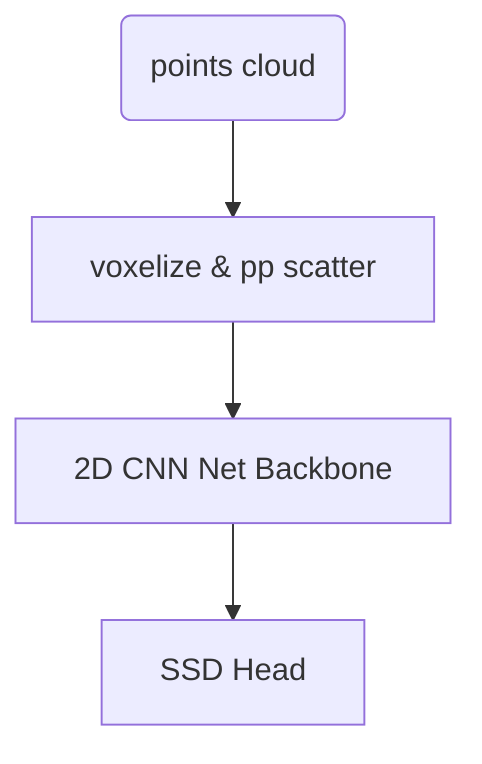

# Point Pillar

paper:[PointPillars: Fast Encoders for Object Detection from Point Clouds](https://readpaper.com/pdf-annotate/note?pdfId=4498438499233062913&noteId=2140451780928835584)

## pipeline
(1) A feature encoder network that converts a point cloud to a sparse pseudoimage; 
(2) a 2D convolutional backbone to process the pseudo-image into high-level representation;
(3) a detection head that detects and regresses 3D boxes.


graph TB
    pts(points cloud) --> A[voxelize & pp scatter]
    A --> B[2D CNN Net Backbone]
    B -->C[SSD Head]

