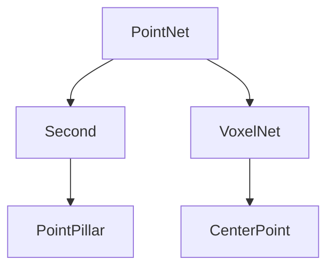
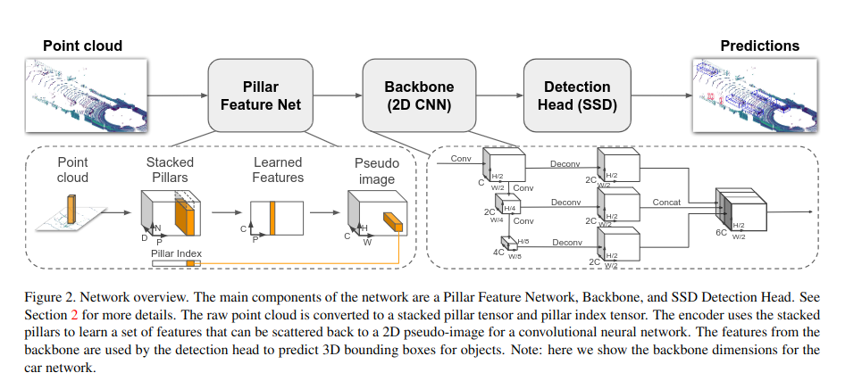
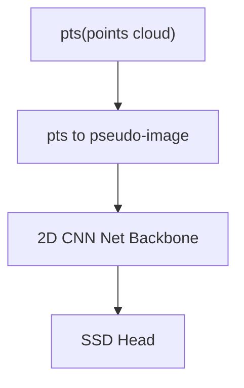
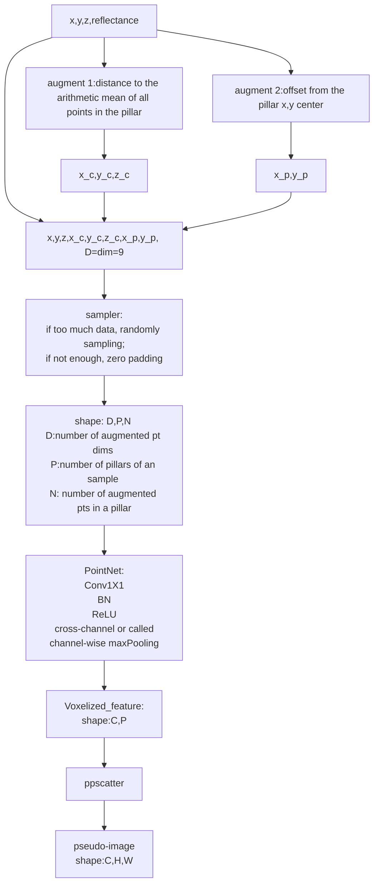
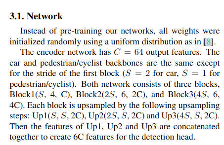
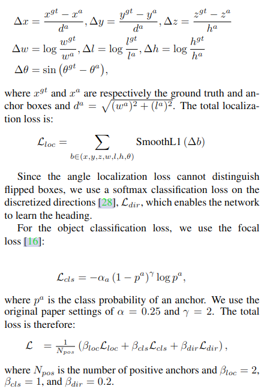
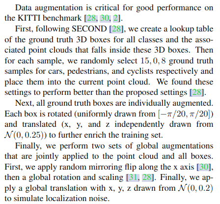
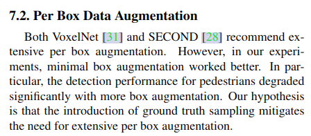
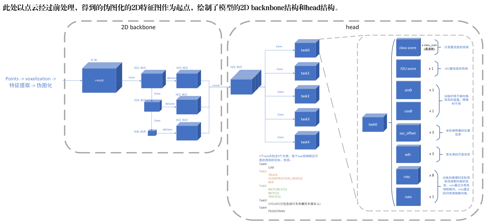

# 1. Point Pillar & History

paper:[PointPillars: Fast Encoders for Object Detection from Point Clouds](https://readpaper.com/pdf-annotate/note?pdfId=4498438499233062913&noteId=2140451780928835584)



# 2. pipeline

(1) A feature encoder network that converts a point cloud to a sparse pseudoimage;
(2) a 2D convolutional backbone to process the pseudo-image into high-level representation;
(3) a detection head that detects and regresses 3D boxes.




## 2.1 pointcloud to pseudo-image



如何解决lidar pts不均匀的问题？
ppillar需要对每个pillar中的点云进行随机采样或者padding。VoxelNet使用了element-wise max pooling，将每个voxel中的点云特征进行聚合，得到一个固定维度的特征向量。

## 2.2 Backbone


## 2.2 Head

SSD Head:
Assignment: BEV 2D IoU + maybe Hungarian match

# 3.Details

## 3.1 Network


It seems that the origin network differs the Vehicle detection and pedestrian/cyclist detection from two different backbones.

## 3.2 Loss



角度loss的计算在实际代码中可以有add_sin_difference与否的选择，可以选择loss直接等于角度弧度差值或者是在弧度差值上加上sin，之后再加上是smoothL1Loss

```python

def add_sin_difference(boxes1, boxes2):
    rad_pred_encoding = torch.sin(boxes1[..., -1:]) * torch.cos(boxes2[..., -1:])
    rad_tg_encoding = torch.cos(boxes1[..., -1:]) * torch.sin(boxes2[..., -1:])
    boxes1 = torch.cat([boxes1[..., :-1], rad_pred_encoding], dim=-1)
    boxes2 = torch.cat([boxes2[..., :-1], rad_tg_encoding], dim=-1)
    return boxes1, boxes2

if self.encode_rad:
    # sin(a - b) = sinacosb-cosasinb
    # This will update box_preds and reg_targets!
    box_preds, reg_targets = add_sin_difference(box_preds, reg_targets)

diff = prediction_tensor[:,:,6] - target_tensor[:,:,6]
if self._code_weights is not None:
    code_weights = self._code_weights.type_as(prediction_tensor)
    diff = code_weights.view(1, 1, -1)[:,:,6] * diff
abs_diff = torch.abs(diff)
abs_diff_lt_1 = torch.le(abs_diff, 1 / (self._sigma**2)).type_as(abs_diff)
loss = abs_diff_lt_1 * 0.5 * torch.pow(abs_diff * self._sigma, 2) + 
       (abs_diff - 0.5 / (self._sigma**2)) * (1.0 - abs_diff_lt_1)
```

## 3.3 Data Augmentation



1. db Sampler;
2. instance rotation abd trabslations
3. mirroring flip along x axis + global rotation and scaling
4. apply global translation with x,y,z from N(0,0.2) to simulate localization noise.
5. more point decorations.During the lidar point decoration step, we perform the VoxelNet  decorations plus two additional decorations:xp and yp which are the x and y offset from the pillar x, ycenter.


6. remove per box data augmentation which were used in VoxelNet and SECOND.

# 4.实际部署模型结构


优化后


