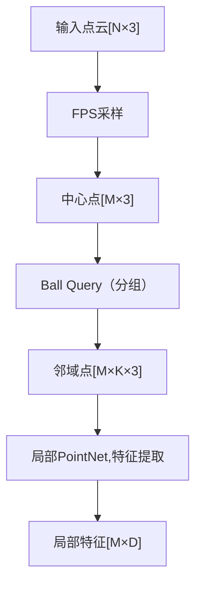

title: "PointNet++"
author: "lvsolo"
date: "2023-04-10"
tags: ["paper reading", "lidar detection"]

PointNet++ 是 PointNet 的改进版本，主要用于处理非结构化的点云数据。PointNet++ 引入了 **分层的结构** ，类似于 CNN 处理图像时的多层感受野设计，从而更好地捕捉局部几何特征。下面我会详细介绍 PointNet++ 的关键步骤，尤其是 **特征提取部分** 的做法。

---

## 🌟 1. PointNet++整体流程概览

PointNet++主要分为两个阶段：

* **Encoder** （特征提取）：通过分层采样 + 局部特征学习模块，逐步提取点的空间特征。
* **Decoder** （可选，用于分割任务）：将局部特征插值回原始点，实现每个点的语义预测。

我们重点看 Encoder 特征提取阶段。

---

## 🔍 2. 特征提取核心步骤

### 2.1 Sampling - 下采样（Farthest Point Sampling, FPS）

* 从原始点云中选出一部分点作为“中心点”（centroids）。
* 使用**Farthest Point Sampling (FPS)** 方法，保证采样点在空间中分布均匀。
* 每一层的采样数逐层减少，实现类似于图像中下采样的作用。

📌 目的：减小计算量并保留代表性空间结构。

---

### 2.2 Grouping - 邻域查询（Ball Query）

* 对每个中心点，查找其周围的一定范围内的点（ **球形查询 Ball Query** ，也可以用 k-NN）。
* 得到局部区域的点集，即一个个“点的局部邻域”。

⚠️ Ball Query 常使用固定半径，比如 0.1、0.2 等。

---

### 2.3 Feature Extraction - 局部特征提取（Mini-PointNet）

对每个局部点集，使用一个“局部 PointNet”提取特征。

每个局部 PointNet 的步骤：

1. **坐标归一化** ：将每个邻域点的坐标减去其中心点坐标，使得特征学习更关注局部结构而非全局位置。

   xi′=xi−xcenterx_i' = x_i - x_{\text{center}}**x**i**′=**x**i****−**x**center**

1. **MLP（多层感知机）** ：对每个点的局部坐标（可附带原始特征）进行编码。
2. **Max Pooling** ：将该邻域内所有点的特征聚合为一个局部特征向量。
3. **输出** ：每个中心点得到一个局部区域的全局特征。

📌 小结：这一步是核心的“特征提取”阶段，将稀疏、无序的点集编码为有意义的结构特征。

---

### 2.4 多层堆叠（Hierarchical Feature Learning）

将上述 [Sampling → Grouping → Feature Extraction] 过程堆叠多层，比如三层：

* 第1层：提取微观局部特征（小半径、小区域）。
* 第2层：提取中等尺度特征。
* 第3层：提取更大的区域结构特征。

每层之间采样点数减少，感受野增大，特征维度提升。

---

## 🧠 特征提取模块示意图（简化版）

---

## 📚 总结

PointNet++ 的特征提取部分主要包含以下核心要素：

| 步骤               | 方法                             | 作用                 |
| ------------------ | -------------------------------- | -------------------- |
| Sampling           | Farthest Point Sampling (FPS)    | 选出代表性中心点     |
| Grouping           | Ball Query / k-NN                | 构建局部点集         |
| Feature Extraction | 局部 PointNet (MLP + MaxPooling) | 从邻域中提取结构特征 |
| 多层堆叠           | Hierarchical Structure           | 捕捉不同尺度几何特征 |

---
