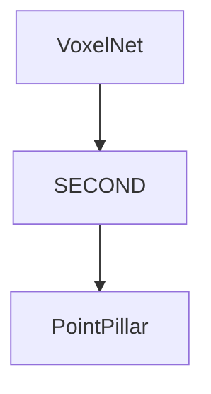

# 1. SECOND & History
paper:[SECOND: Sparsely Embedded Convolutional Detection](https://readpaper.com/pdf-annotate/note?pdfId=4513128172941369345&noteId=1712558030481128448)

```mermaid
graph TB
    VoxelNet --> SECOND --> PointPillar
```