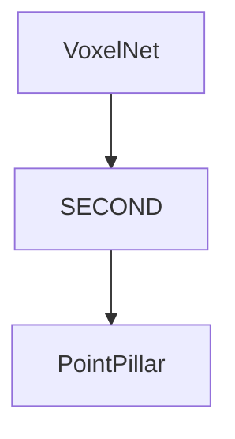

# 1. SECOND & History
paper:[SECOND: Sparsely Embedded Convolutional Detection](https://readpaper.com/pdf-annotate/note?pdfId=4513128172941369345&noteId=1712558030481128448)

Related paper:
VoxelNet: stacked VFE(voxel feature encoding module) + 3D Conv RPN
This paper:

    3D Conv --> Sparse Conv --> improved sparse conv
    angle loss regression approach

1. We apply sparse convolution in LiDAR-based object detection, thereby greatly increasing the speeds of training and inference.
2. We propose an improved method of sparse convolution that allows it to run faster.
3. We propose a novel angle loss regression approach that demonstrates better orientation regression performance than other methods do.
4. We introduce a novel data augmentation method for LiDAR-only learning problems that greatly increases the convergence speed and performance.

# 2. Pipeline

# Data Augmentation
Ground Truth database is generated that contains the attributes of objs and associated pts cloud data.