# 论文信息

| 版本 | 标题 | arXiv | 时间 |
|------|------|-------|------|
| **Sparse4D v1** | Multi-view 3D Object Detection with Sparse Spatial-Temporal Fusion | [2211.10581](https://arxiv.org/abs/2211.10581) | 2022.11 |
| **Sparse4D v2** | Recurrent Temporal Fusion with Sparse Model | [2305.14018](https://arxiv.org/abs/2305.14018) | 2023.05 |
| **Sparse4D v3** | Advancing End-to-End 3D Detection and Tracking | [2311.11722](https://arxiv.org/abs/2311.11722) | 2023.11 |

**作者**: Xuewu Lin, Tianwei Lin, Zixiang Pei, Lichao Huang, Zhizhong Su (地平线 Horizon Robotics)

**代码**: [linxuewu/Sparse4D](https://github.com/linxuewu/Sparse4D) (v1&v2), [HorizonRobotics/Sparse4D](https://github.com/HorizonRobotics/Sparse4D) (统一代码库, v3)

---

# 背景 & 动机

## BEV范式 vs 稀疏范式

<!-- TODO: 在这里补充你对BEV和Sparse两种范式的理解 -->

- **BEV-based** (BEVFormer, BEVDet 等): 将多视图特征变换到稠密鸟瞰图再做检测，计算开销大，不利于边缘设备部署
- **Sparse-based** (DETR3D, PETR, Sparse4D 等): 直接在稀疏3D实例上操作，不构建稠密BEV，计算高效、部署友好

Sparse4D 的目标: **在保持稀疏范式效率优势的同时，超越BEV方法的精度**

---

# 一、Sparse4D v1: Sparse Spatial-Temporal Fusion

## 1.1 总体架构

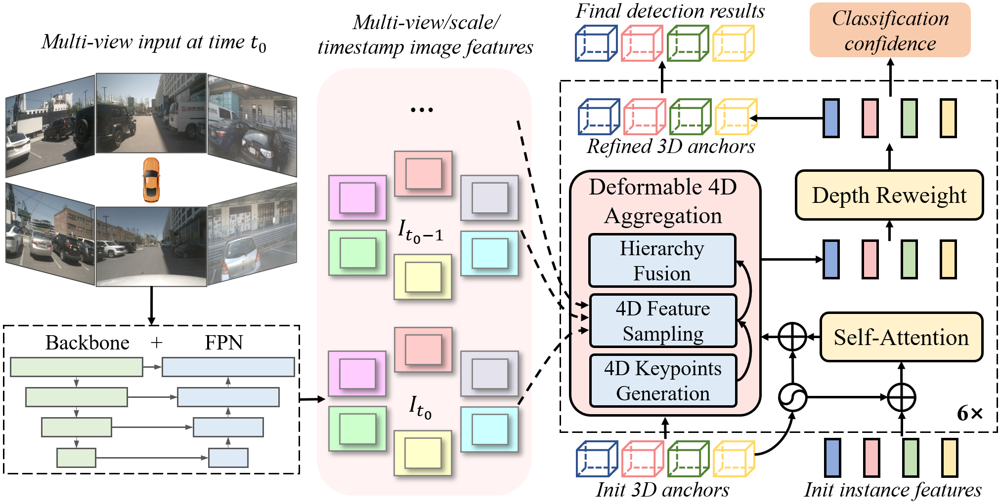

> **图注 (Figure 2)**: Sparse4D v1 总体框架。遵循 encoder-decoder 结构。输入为多视图图像，经过 backbone + FPN 提取多尺度特征。Decoder 中对 3D anchor 进行迭代 refinement，每层执行 Sparse 4D Sampling → Hierarchy Feature Fusion → Anchor 回归。

<!-- TODO: 补充你对整体pipeline的理解，数据流向等 -->

**核心流程**:

1. **Backbone + FPN**: 多视图图像 → 共享 backbone(如 ResNet-101) → 多尺度图像特征
2. **Anchor 初始化**: 通过 k-means 聚类训练集生成一组 3D anchor boxes
3. **迭代 Refinement (Decoder)**: 每一层执行:
   - Sparse 4D Sampling (特征采样)
   - Hierarchy Feature Fusion (层次化特征融合)
   - Anchor 回归 (残差更新 position/size/orientation)

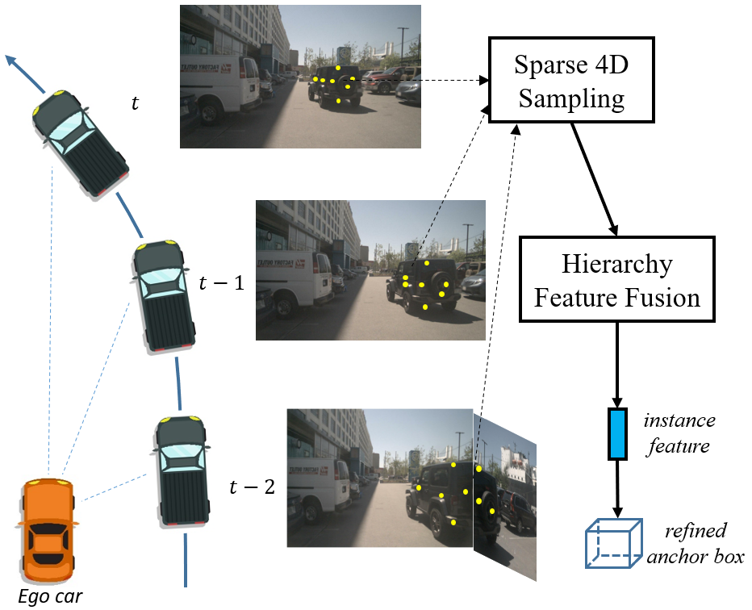

> **图注 (Figure 1)**: Sparse4D v1 概览示意图。展示了从多视图多时间戳图像中，通过稀疏采样融合生成实例特征的过程。

<!-- TODO: 补充你对概览的理解 -->

## 1.2 关键模块: Sparse 4D Sampling + Deformable 4D Aggregation

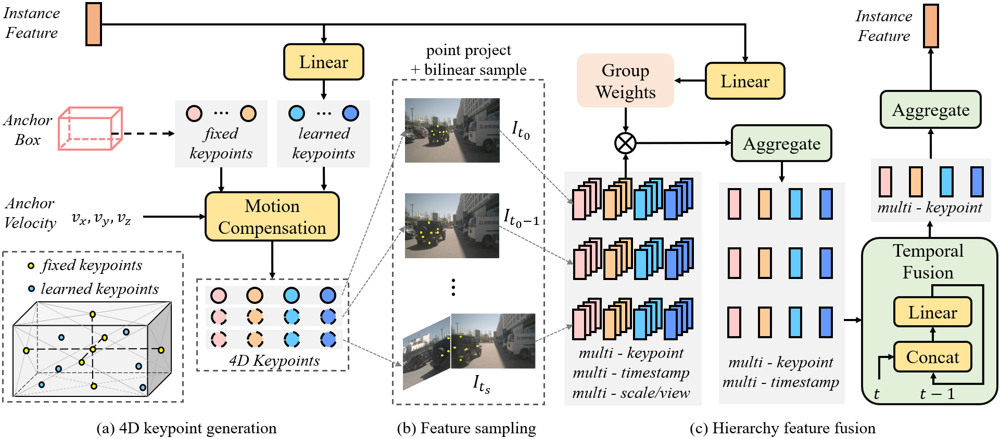

> **图注 (Figure 3)**: Deformable 4D Aggregation 模块详细设计。包含两个子模块:
> - **左侧 (Sparse 4D Sampling)**: 为每个 3D anchor 生成多个 4D keypoints (3D空间坐标 + 时间维度)，将这些 keypoints 投影到多视图/多尺度/多时间戳的图像特征上，通过双线性插值采样特征
> - **右侧 (Hierarchy Feature Fusion)**: 分三层逐步融合采样到的特征

<!-- TODO: 补充你对 Sparse 4D Sampling 的理解，包括 keypoint 如何定义、如何投影、采样过程等 -->

### (a) 4D Keypoint 生成与采样

<!-- TODO: 补充你对 keypoint 生成过程的理解 -->

每个 3D anchor box 内定义 $K$ 个 4D keypoints，由 $K_F$ 个**固定关键点**和 $K_L$ 个**可学习关键点**组成。

**可学习关键点生成** (当前帧 $t_0$):

$$D_m = R_{\text{yaw}} \cdot [\text{sigmoid}(\Phi(F_m)) - 0.5] \in \mathbb{R}^{K_L \times 3}$$

$$P^L_{m,t_0} = D_m \times [w_m, h_m, l_m] + [x_m, y_m, z_m]$$

> 其中 $\Phi$ 是子网络，$F_m$ 是实例特征，$R_{\text{yaw}}$ 是 yaw 旋转矩阵。即将网络预测的归一化偏移量旋转到 anchor 朝向，再缩放到 anchor 尺寸并平移到 anchor 中心。

**时序关键点变换** (从当前帧 $t_0$ 到历史帧 $t$):

$$P'_{m,t} = P_{m,t_0} - d_t \cdot (t_0 - t) \cdot [v_{x_m}, v_{y_m}, v_{z_m}]$$

$$P_{m,t} = R_{t_0 \to t} \, P'_{m,t} + T_{t_0 \to t}$$

> 先用恒速模型将关键点按速度反向平移，再用自车运动信息 (旋转 $R$ + 平移 $T$) 变换到历史帧坐标系。

**投影与双线性采样**:

$$P^{img}_{t,n} = T^{cam}_n \, P_t, \quad 1 \le n \le N$$

$$f_{m,k,t,n,s} = \text{Bilinear}(I_{t,n,s}, \, P^{img}_{m,k,t,n})$$

> 将 3D keypoints 通过相机内外参 $T^{cam}_n$ 投影到 2D 图像，再对各视图/尺度/时间戳做双线性插值采样。下标 $m,k,t,n,s$ 分别表示 anchor、keypoint、时间戳、相机、FPN 尺度。

### (b) Hierarchy Feature Fusion (三层融合)

<!-- TODO: 补充你对三个融合层次的理解 -->

采样得到特征 $f_m \in \mathbb{R}^{K \times T \times N \times S \times C}$ 后，分三层逐步融合：

**第一层: View-Scale Fusion** (对每个 keypoint, 每个时间戳，融合不同视图和尺度):

$$W_m = \Psi(F_m) \in \mathbb{R}^{K \times N \times S \times G}$$

$$f'_{m,k,t,i} = \sum_{n=1}^{N} \sum_{s=1}^{S} W_{m,k,n,s,i} \, f_{m,k,t,n,s,i}$$

$$f'_{m,k,t} = [f'_{m,k,t,1}, \, f'_{m,k,t,2}, \, ..., \, f'_{m,k,t,G}]$$

> 其中 $\Psi$ 是线性层，$G$ 是分组数 (按通道分组)，$[\,]$ 表示 concat。即用预测的分组权重对多视图多尺度特征做加权求和。

**第二层: Temporal Fusion** (对每个 keypoint，按时间序列融合):

$$f''_{m,k,t_s} = f'_{m,k,t_s}$$

$$f''_{m,k,t} = \Psi_{\text{temp}}\big([f'_{m,k,t}, \, f''_{m,k,t-1}]\big)$$

> 从最早时间戳开始，依次将当前帧特征与上一时间戳的融合结果拼接后过线性层 $\Psi_{\text{temp}}$，实现序列化的时序融合。

**第三层: Keypoint Fusion** (融合 anchor 内所有 keypoints):

$$F'_m = \sum_{k=1}^{K} f''_{m,k}$$

> 将所有 keypoint 的融合特征直接求和，得到最终的实例特征 $F'_m$。

## 1.3 关键模块: Depth Reweight

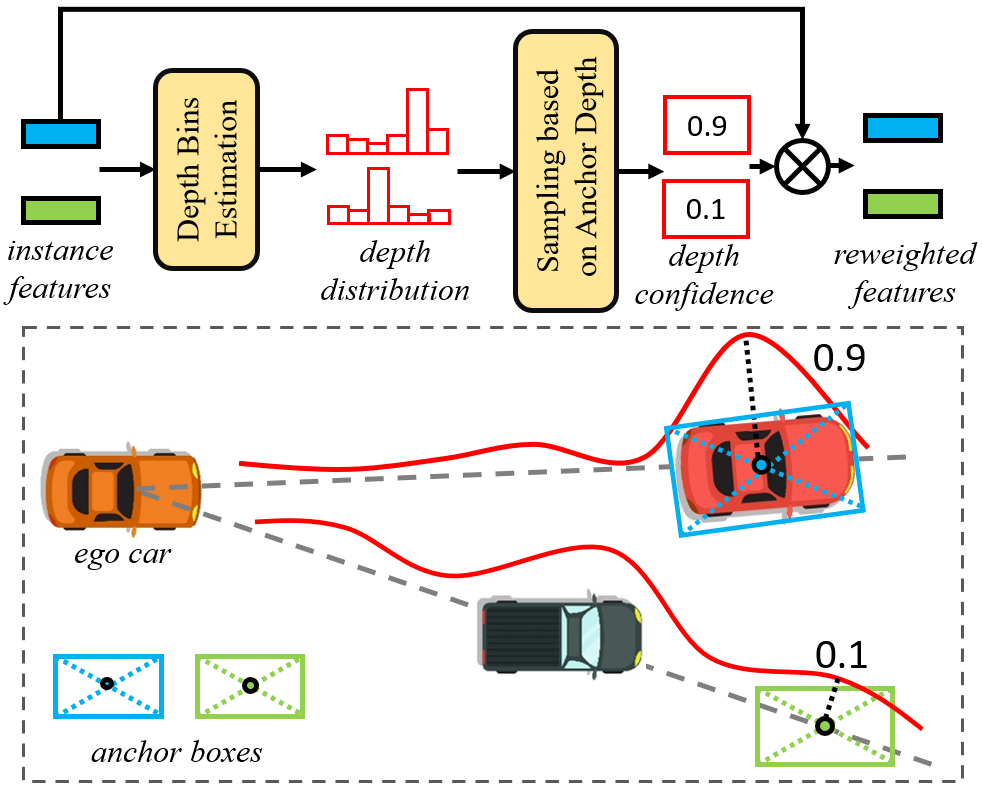

> **图注 (Figure 4)**: Depth Reweight 模块。用于缓解 3D-to-2D 投影中的病态深度歧义问题。为每个采样特征预测一个与深度相关的权重，抑制来自错误深度位置的噪声特征。

<!-- TODO: 补充你对 depth reweight 的理解，为什么需要它、如何工作 -->

**核心问题**: 多个不同深度的 3D 点可能投影到同一个 2D 像素位置，如何区分？

**解决方案** (Depth Reweight 公式):

$$C_m = \text{Bilinear}\Big(\Psi_{\text{depth}}(F'_m), \, \sqrt{x_m^2 + y_m^2}\Big)$$

$$F''_m = C_m \cdot F'_m$$

> 其中 $\Psi_{\text{depth}}$ 是由多个带残差连接的 MLP 组成的深度估计网络，预测离散深度分布；$C_m$ 是在 anchor 中心点深度 $\sqrt{x_m^2 + y_m^2}$ 处采样的深度置信度。对于深度方向偏离 GT 的实例，$C_m$ 趋近于 0，从而惩罚其特征 $F''_m$。

<!-- TODO: 补充你对 depth reweight 的理解 -->

### 为什么 v2/v3 不再需要 Depth Reweight?

v2 和 v3 的代码中**完全移除了** `DepthReweightModule`。这并非因为深度歧义问题消失了，而是因为 v2/v3 的架构改进从**其他层面**隐式地缓解了这个问题，使得显式的深度特征加权不再必要。

**v1 为什么需要 Depth Reweight?**

```
                    投影射线 (3D → 2D)
                          │
    3D点A (深度=10m) ─────┤
    3D点B (深度=20m) ─────┤────→ 同一个 2D 像素 (u, v)
    3D点C (深度=35m) ─────┘

    问题: 双线性采样时, A/B/C 采到的是同一个像素的特征
          → 模型无法区分这个特征属于哪个深度
          → 需要额外的 Depth Reweight 来预测 "你在哪个深度是对的"
```

v1 的采样是**"无记忆"**的 —— 每帧独立地从原始图像特征采样多帧历史图像，没有帧间信息传递。采样过程本身不携带"这个实例之前预测在哪个深度"的先验信息，因此需要显式的 Depth Reweight 来额外预测深度置信度。

**v2/v3 替代 Depth Reweight 的真正原因:**

```
┌─────────────────────────────────────────────────────────────────────────┐
│              v2/v3 缓解深度歧义的机制 (与 v1 的本质差异)               │
├─────────────────────────────────────────────────────────────────────────┤
│                                                                         │
│  ① Recurrent Temporal Fusion: 无限时序累积 (核心原因)                  │
│     ┌──────────────────────────────────────────────┐                    │
│     │ v1: 每帧独立采样, 没有历史深度信息的传递     │                    │
│     │     帧1(采样) → 帧2(采样) → 帧3(采样)        │  各帧互不相关      │
│     │                                               │                    │
│     │ v2/v3: F_t = F_{t-1} 帧间传递                 │                    │
│     │     帧1(采样+精修) → 帧2(传播+精修) → ...     │  深度信息持续累积  │
│     │                                               │                    │
│     │ 实例特征中编码了历史帧对深度的持续预测,        │                    │
│     │ 即使某一帧采样到歧义特征, 累积的历史信息       │                    │
│     │ 也能帮助模型判断正确的深度                     │                    │
│     └──────────────────────────────────────────────┘                    │
│                                                                         │
│  ② Dense Depth Auxiliary Loss (v2): 辅助深度监督                       │
│     ┌──────────────────────────────────────────────┐                    │
│     │ v2 配置: depth_branch = DenseDepthNet         │                    │
│     │ 功能: 从 backbone 特征预测稠密深度图           │                    │
│     │       loss_weight = 0.2 (辅助损失)             │                    │
│     │                                               │                    │
│     │ 效果: 强制 backbone 学习深度感知特征           │                    │
│     │       → 图像特征本身更 "懂" 深度              │                    │
│     │       → 采样时采到的特征天然携带深度信息       │                    │
│     └──────────────────────────────────────────────┘                    │
│                                                                         │
│  ③ Quality Estimation (v3): 部分替代深度置信度                         │
│     ┌──────────────────────────────────────────────┐                    │
│     │ Centerness = exp(-‖pred_center - gt_center‖₂) │                    │
│     │ 包含深度方向 (z轴) 的定位误差                   │                    │
│     │                                               │                    │
│     │ final_score = cls × sigmoid(centerness)       │                    │
│     │ → 深度不准 → centerness 低 → 最终分数低        │                    │
│     │ → 深度差的实例被压低分数后过滤掉               │                    │
│     │                                               │                    │
│     │ 注意: 这只是推理时的惩罚, 不能完全替代          │                    │
│     │       Depth Reweight 对特征层面的修正          │                    │
│     └──────────────────────────────────────────────┘                    │
│                                                                         │
└─────────────────────────────────────────────────────────────────────────┘
```

> **注意**: 上面没有列出"anchor embedding 包含深度信息"和"可学习 keypoint"这两项——因为 **v1 的 $F_m$ 已经包含 anchor embedding** (融为一体)，**v1 也有可学习 keypoint** ($K_L$ 个)，这两者不是 v1 和 v2/v3 的差异点，不能解释为什么 v2/v3 不再需要 Depth Reweight。

**对比总结:**

| 深度歧义应对方式 | v1 | v2 | v3 |
|-----------------|----|----|-----|
| **显式特征加权** | ✅ DepthReweightModule (推理时加权) | ❌ 移除 | ❌ 移除 |
| **时序累积深度先验** | ❌ (每帧独立, 有限窗口) | ✅ $F_t = F_{t-1}$ 无限累积 | ✅ 同 v2 |
| **辅助深度监督** | ❌ | ✅ DenseDepthNet (稠密深度预测, loss_weight=0.2) | ✅ 同 v2 |
| **Quality Estimation** | ❌ | ❌ | ✅ Centerness 惩罚定位误差 |
| **anchor embedding 含深度** | ✅ (已融入 $F_m$) | ✅ (解耦但显式加回) | ✅ 同 v2 |
| **可学习 keypoint** | ✅ | ✅ | ✅ |

> **一句话总结**: Depth Reweight 是 v1 **"无记忆"** 采样架构下的补丁方案。v2/v3 能够移除它，核心原因是 **Recurrent Temporal Fusion** 提供了无限时序累积的深度先验（这是 v1 和 v2 最本质的差异），同时 v2 通过 **DenseDepthNet** 辅助监督让 backbone 特征本身更深度感知，v3 则额外通过 **Quality Estimation** 惩罚深度定位误差。三者合力替代了 Depth Reweight 的功能。

## 1.4 v1 训练损失

$$\mathcal{L} = \lambda_1 \mathcal{L}_{\text{cls}} + \lambda_2 \mathcal{L}_{\text{box}} + \lambda_3 \mathcal{L}_{\text{depth}}$$

> 其中 $\mathcal{L}_{\text{cls}}$ 使用 Focal Loss，$\mathcal{L}_{\text{box}}$ 是 L1 回归损失，$\mathcal{L}_{\text{depth}}$ 是深度估计辅助损失。匹配使用匈牙利算法进行 one-to-one 匹配。

## 1.5 v1 性能 (nuScenes)

| Backbone | Split | NDS | mAP |
|----------|-------|-----|-----|
| ResNet-101 | val | 54.38% | 44.09% |
| VoV-99 | test | 59.5% | 51.1% |

---

# 二、Sparse4D v2: Recurrent Temporal Fusion

## 2.1 v2 的核心改进

<!-- TODO: 补充你认为 v2 相比 v1 的关键变化 -->

1. **Recurrent Temporal Fusion**: 用递归式帧间传播替代 v1 的多帧并行融合
2. **Efficient Deformable Aggregation**: 统一采样+融合模块 + 自定义 CUDA kernel

## 2.2 总体架构

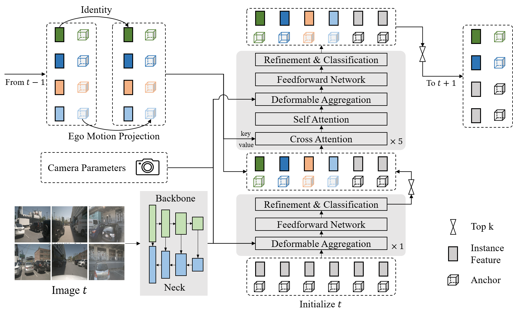

> **图注**: Sparse4D v2 总体架构图。采用流式在线推理方式: 输入为当前帧多视图图像 + 上一帧传播过来的实例(propagated instances)，输出为当前帧精修后的实例，同时选出一部分高置信度实例传播到下一帧。

<!-- TODO: 补充你对 v2 整体 pipeline 的理解 -->

**与 v1 的关键区别**: 时序信息不再通过同时采样多帧历史图像来融合，而是通过**稀疏特征帧间传递**来累积

**v2 完整 Pipeline 各章节对应位置**:

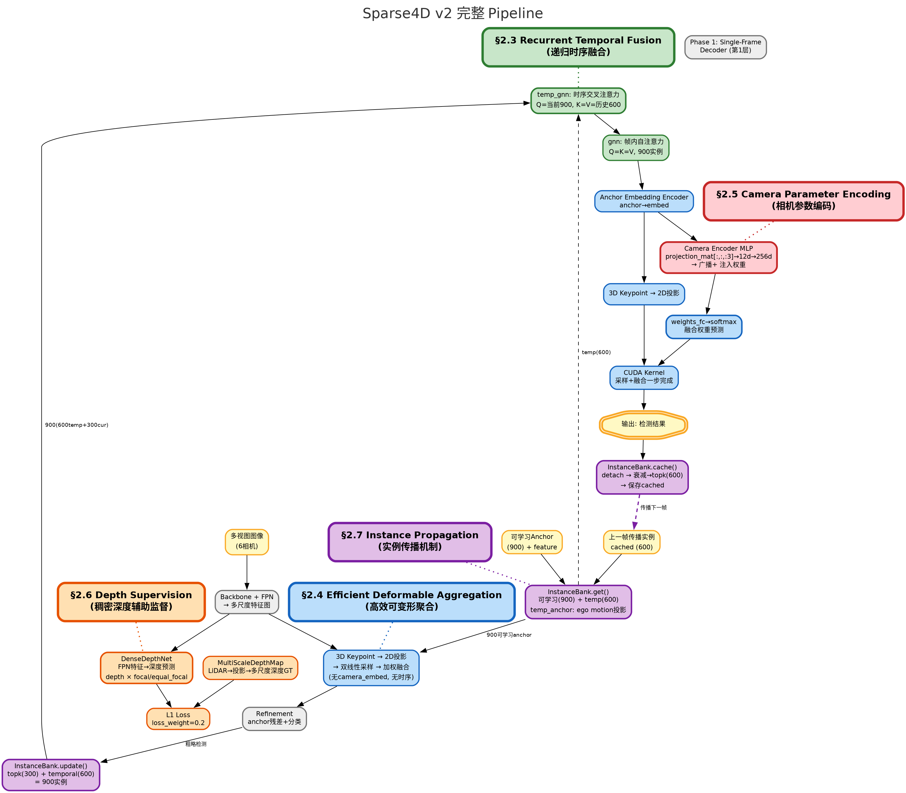

> **图注**: Sparse4D v2 完整 pipeline，每个章节编号 (§2.3~§2.7) 直接标注在对应的模块框上:
> - **§2.3 Recurrent Temporal Fusion**: temp_gnn (时序交叉注意力) + gnn (帧内自注意力)
> - **§2.4 Efficient Deformable Aggregation**: 3D→2D投影、双线性采样、CUDA融合
> - **§2.5 Camera Parameter Encoding**: projection_mat 编码注入权重预测 (嵌套在 §2.4 内部)
> - **§2.6 Depth Supervision**: DenseDepthNet 辅助深度监督 (辅助训练分支)
> - **§2.7 Instance Propagation**: InstanceBank.get() / update() / cache()
>
> 展示了从输入图像到输出的完整数据流，包含两阶段 Decoder 设计 (Phase 1 单帧 → Phase 2 时序)。

## 2.3 关键改进: Recurrent Temporal Fusion (递归时序融合)

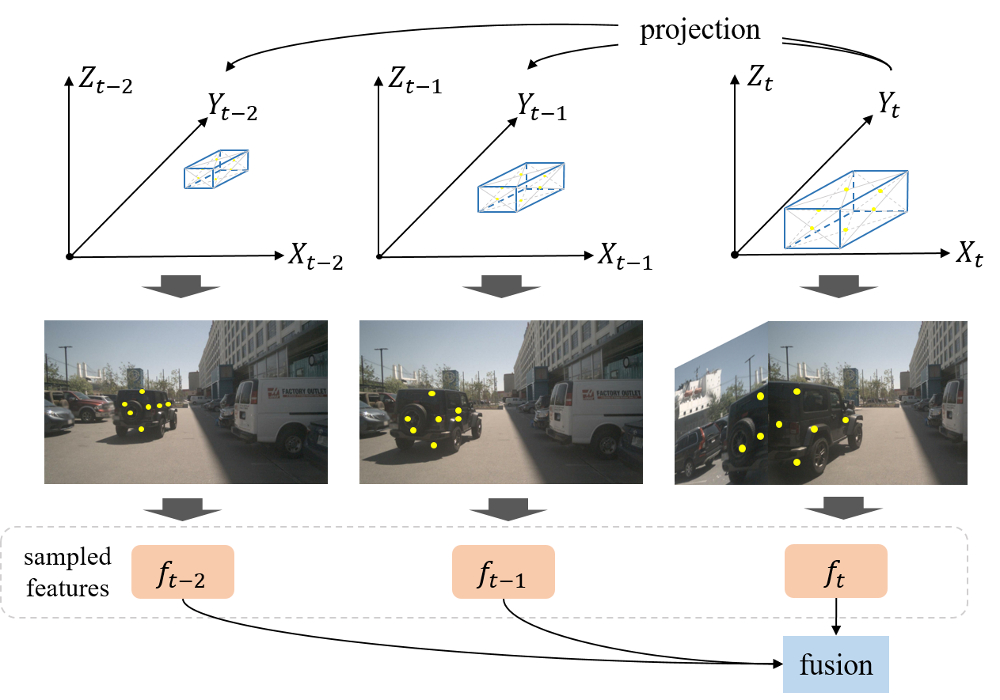

> **图注 (Figure 1a)**: v1 的多帧并行采样方式。需要同时访问 T 帧历史图像特征，计算复杂度 O(T)。

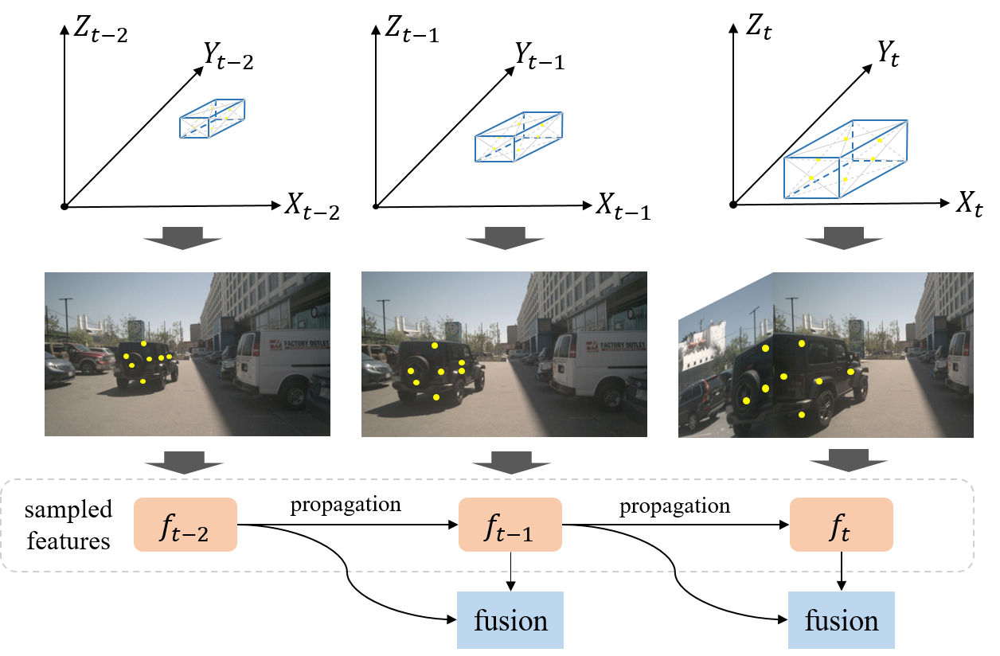

> **图注 (Figure 1b)**: v2 的递归时序融合。只需处理当前帧 + 上一帧传播过来的实例特征，复杂度 O(1)。历史信息被压缩在传播的实例特征中，实现了无限时间窗口。

<!-- TODO: 补充你对递归时序融合的理解 -->

### 核心公式: Instance Temporal Propagation (实例时序传播)

Sparse4D 中一个实例由三部分组成: **anchor** (结构化状态)、**instance feature** (图像语义特征)、**anchor embedding** (anchor 的高维编码)。v2 的核心设计是**解耦图像特征和结构化状态**，传播时只需投影 anchor，实例特征保持不变：

$$A_t = \text{Project}_{t-1 \to t}(A_{t-1}), \quad E_t = \Psi(A_t), \quad F_t = F_{t-1}$$

> 其中 $A$ 是 anchor，$E$ 是 anchor embedding，$F$ 是实例特征，$\Psi$ 是 anchor encoder。注意 $F_t = F_{t-1}$ — **实例特征直接传递，不需要重新从图像采样历史帧特征**。

### 3D 检测的 Anchor 投影函数

anchor 定义为 $A = \{x, y, z, w, l, h, \sin\text{yaw}, \cos\text{yaw}, v_x, v_y, v_z\}$，帧间传播时各分量分别处理：

$$[x, y, z]_t = R_{t-1 \to t}\big([x, y, z] + d_t [v_x, v_y, v_z]\big)_{t-1} + T_{t-1 \to t}$$

$$[w, l, h]_t = [w, l, h]_{t-1}$$

$$[\cos\text{yaw}, \sin\text{yaw}, 0]_t = R_{t-1 \to t} [\cos\text{yaw}, \sin\text{yaw}, 0]_{t-1}$$

$$[v_x, v_y, v_z]_t = R_{t-1 \to t} [v_x, v_y, v_z]_{t-1}$$

> 其中 $d_t$ 是帧间隔，$R_{t-1 \to t}$ 和 $T_{t-1 \to t}$ 是自车运动的旋转和平移。位置按恒速模型前推后做 ego motion 变换；尺寸不变；朝向和速度做 ego motion 旋转补偿。

### v1 (并行) vs v2 (递归) 对比

| | v1 并行融合 | v2 递归融合 |
|---|---|---|
| 复杂度 | O(T) 每帧 | O(1) 每帧 |
| 时间窗口 | 有限 (通常4帧) | 无限 (历史压缩在实例特征中) |
| 内存 | 随帧数线性增长 | 恒定 |
| 推理速度 | 较慢 | 快 (ResNet-50 下 >20 FPS) |

<!-- TODO: 补充你对两者优缺点的理解 -->

## 2.4 关键模块: Efficient Deformable Aggregation

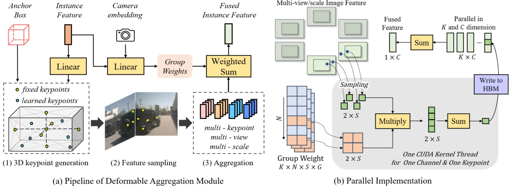

> **图注**: Efficient Deformable Aggregation 模块示意图。
> - **(a) 基本流程**: 为每个 3D anchor 生成多个 3D keypoints → 投影到多视图/多尺度图像特征上采样 → 用预测的权重进行加权融合
> - **(b) 并行实现**: 将特征采样和多视图/多尺度加权求和合并为一个 CUDA 算子，支持不同视图的不同特征分辨率

<!-- TODO: 补充你对 Deformable Aggregation 的理解，以及 CUDA 优化的意义 -->

### Deformable Aggregation 伪代码 (Algorithm 1)

```
输入:
  1) 特征图 I = {I_s ∈ R^{N×C×H_s×W_s} | 1 ≤ s ≤ S}
  2) 投影后的 2D 点 P ∈ R^{K×N×2}
  3) 权重 W ∈ R^{K×N×S×G}
  (C=特征通道数, K=点数)

输出:
  特征 F ∈ R^C

1. 初始化空列表 f
2. for i = 1 to S do:
     Bilinear(I_s, P) ∈ R^{N×C×K} → 加入 f
3. Stack f 并 reshape 到可与 W 广播的形状
4. 加权: f = f × W ∈ R^{K×N×S×C}
5. 沿 view/scale/point 维度求和 → 输出 F
```

> **EDA 优化**: 将步骤 2-5 封装为单个 CUDA 算子，避免中间变量在 HBM 中的反复读写。单个线程计算量仅 $2S$ (因为一个 3D 点最多投影到 2 个视图)。训练 GPU 内存减少 51%，推理 FPS 提升 42%。

### 工作流程

<!-- TODO: 补充 -->
1. **3D Keypoint 生成**: 在 anchor box 内生成可变形 keypoints (offset 由网络预测)
2. **多视图/多尺度采样**: 投影 → 双线性插值采样
3. **加权融合**: 用预测的 attention weights 加权融合
4. **CUDA 加速**: 采样 + 加权求和合并为单个 CUDA kernel

## 2.5 关键改进: Camera Parameter Encoding (相机参数编码)

v2 在 Deformable Aggregation 的权重预测中引入了 **Camera Parameter Encoding**（配置中 `use_camera_embed=True`），让融合权重**感知每个相机的视角和参数差异**，从而对不同相机生成不同的采样权重。

### Camera Encoding 在整体 pipeline 中的位置

Camera Parameter Encoding 发生在 **Decoder 每一层的 Deformable Aggregation 模块内部**。`projection_mat`（相机内外参矩阵）在 EDA 中实际上起了**两个作用**：

1. **3D→2D 投影**：直接用 `projection_mat` 将 3D keypoints 投到 2D 像素坐标 → 决定从图像的哪个位置采样
2. **Camera Embedding 注入权重**：将同一个 `projection_mat` 编码为 `camera_embed`，注入融合权重预测 → 生成对不同相机敏感的权重

```
Sparse4D v2 Decoder 单层 Deformable Aggregation 流程:

  输入: instance_feature (B, 900, 256) + anchor (B, 900, 11)
                    │
                    ▼
  ┌─────────────────────────────────────────────────────────────────┐
  │ Deformable Aggregation (EDA)                                    │
  │                                                                 │
  │  ① Anchor Embedding Encoder: anchor → anchor_embed (256d)      │
  │  ② Keypoint Generator: anchor → 3D keypoints (13个)            │
  │                                                                 │
  │  ③ 3D → 2D 投影  ←── projection_mat 的作用①                    │
  │     keypoints × projection_mat → 2D 像素坐标                    │
  │     (决定从图像的哪个位置采样)                                    │
  │                                                                 │
  │  ④ _get_weights() 权重预测:                                     │
  │     feature = instance_feature + anchor_embed                   │
  │   ┌─────────────────────────────────────────────────────┐       │
  │   │ ★ Camera Parameter Encoding ←── projection_mat 作用②│       │
  │   │ projection_mat[:,:,:3] → reshape(12d) → MLP → 256d  │       │
  │   │ camera_embed 广播+ 到 feature                        │       │
  │   │ weights = weights_fc(feature) → softmax              │       │
  │   │ (生成对不同相机敏感的融合权重)                         │       │
  │   └─────────────────────────────────────────────────────┘       │
  │                                                                 │
  │  ⑤ 双线性采样: 在 ③ 投影的 2D 坐标处从特征图采样                │
  │  ⑥ 加权融合: ④ 的权重 × ⑤ 采样的特征 → instance_feature 更新   │
  └─────────────────────────────────────────────────────────────────┘
                    │
                    ▼
               更新后的 instance_feature
```

> **总结**: `projection_mat` 在 EDA 中被使用了两次 — 一次用于确定采样位置 (3D→2D)，一次用于生成相机感知的融合权重 (Camera Encoding)。两者共同确保模型既能找到正确的采样位置，又能根据不同相机的特性分配合理的融合权重。

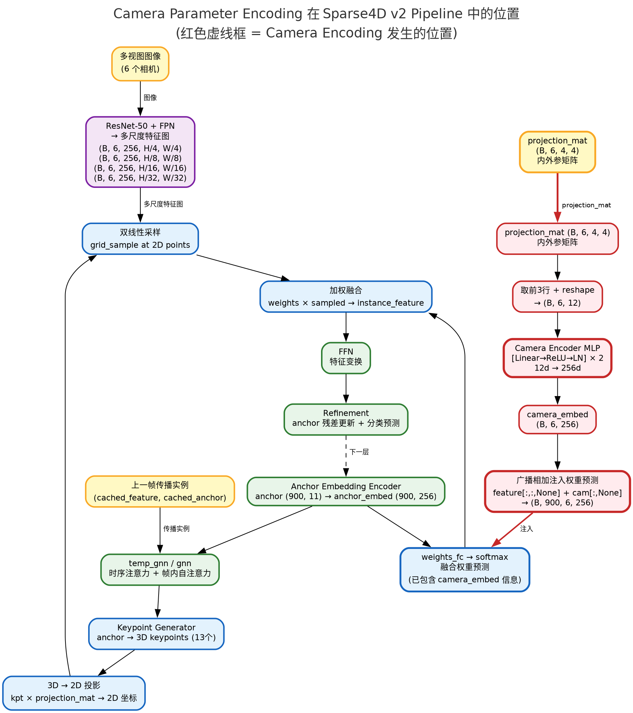

> **图注**: Camera Parameter Encoding 在 Decoder 单层中的位置（另见 [§2.2 总体架构大图](#22-总体架构) 中各章节对应位置的完整 pipeline 图）。

### 编码的是什么参数? (内参 + 外参)

编码的输入是 `projection_mat`——LiDAR 坐标系到图像像素坐标系的**完整投影矩阵**，由内参和外参相乘得到：

```
projection_mat = intrinsic @ lidar2cam.T    形状: (B, N_cams, 4, 4)

构建过程 (transform_3d.py):
  lidar2cam_r = inv(sensor2lidar_rotation)           # LiDAR→相机 旋转
  lidar2cam_t = sensor2lidar_translation @ R.T       # LiDAR→相机 平移
  lidar2cam   = [R | t]  (4×4 齐次矩阵)
  intrinsic   = cam_intrinsic                        # 相机内参 (3×3 → pad到4×4)
  projection_mat = intrinsic_4x4 @ lidar2cam.T_4x4   # 内参 × 外参
```

> 即 `projection_mat` **同时编码了相机内参 (焦距、主点) 和外参 (旋转、平移)**，是内外参融合后的完整投影矩阵。

### 编码流程

4×4 投影矩阵的第 4 行是齐次坐标行 `[0, 0, 0, 1]`，不含有用信息。取前 3 行并展平为 12 维向量，然后通过 MLP 编码为高维 embedding：

```
projection_mat (B, N_cams, 4, 4)
       │
       │ 取前3行 [:, :, :3]
       ▼
 (B, N_cams, 3, 4)
       │
       │ reshape 展平
       ▼
 (B, N_cams, 12)          ← 12维: 内参+外参的紧凑表示
       │
       │ Camera Encoder MLP
       │ [Linear(12→256) → ReLU → LayerNorm] × 2层
       ▼
 camera_embed (B, N_cams, 256)
```

### 如何注入权重预测?

```python
# blocks.py: _get_weights()
# ① instance_feature + anchor_embed
feature = instance_feature + anchor_embed            # (B, N_anchor, 256)

# ② 加入 camera_embed (广播相加)
camera_embed = self.camera_encoder(
    metas["projection_mat"][:, :, :3].reshape(bs, num_cams, -1)
)                                                    # (B, N_cams, 256)
feature = feature[:, :, None] + camera_embed[:, None]
# feature:      (B, N_anchor, 1,    256)
# camera_embed: (B, 1,        N_cams, 256)
# → 相加后:     (B, N_anchor, N_cams, 256)  ← 每个anchor×每个相机独立

# ③ 线性投影 → 权重 (注意: 因为输入已含相机维度, 输出不需要再预测N_cams)
weights = self.weights_fc(feature)                   # → (B, N_anchor, N_cams, N_levels×N_pts×G)
```

### 有无 Camera Embedding 的区别

| 方面 | `use_camera_embed=False` | `use_camera_embed=True` |
|------|--------------------------|------------------------|
| **weights_fc 输入** | `(B, N_anchor, 256)` — 无相机维度 | `(B, N_anchor, N_cams, 256)` — 逐相机独立 |
| **weights_fc 输出维度** | `G × N_cams × N_levels × N_pts` | `G × N_levels × N_pts` (不含 N_cams) |
| **权重预测方式** | 一次性预测所有相机权重 | **逐相机**独立预测 |
| **感知相机差异** | ❌ 隐式学习 | ✅ 显式注入内外参信息 |
| **参数量** | `Linear(256, G×6×4×13)` 更大 | `Linear(256, G×4×13)` + camera_encoder 更小 |

> **直觉理解**: 没有 camera_embed 时，模型需要从 instance feature 中"猜"每个相机的特性；有 camera_embed 时，模型直接"看到"每个相机的焦距、朝向、位置等参数，可以为每个相机生成更精准的采样权重。例如，模型可以学到"这个相机朝向左前方，目标在右方，所以该相机的特征权重应该更低"。

### 源码 (Camera Encoder 构造)

```python
# blocks.py: DeformableFeatureAggregation.__init__()
if use_camera_embed:
    self.camera_encoder = Sequential(
        *linear_relu_ln(embed_dims=256, in_loops=1, out_loops=2, input_dims=12)
    )
    self.weights_fc = Linear(embed_dims, num_groups * num_levels * num_pts)
    # ↑ 注意: 输出维度不含 N_cams, 因为输入已逐相机
else:
    self.camera_encoder = None
    self.weights_fc = Linear(embed_dims, num_groups * num_cams * num_levels * num_pts)
    # ↑ 输出维度含 N_cams, 需要一次性预测所有相机
```

## 2.6 关键改进: Depth Supervision (稠密深度辅助监督)

v2 引入 **DenseDepthNet** 作为辅助训练任务，从 backbone 的多尺度特征图中预测稠密深度图，通过深度监督信号帮助 backbone 学习更好的**深度感知特征**，间接提升 3D 检测精度。

> ⚠️ 这是一个**纯辅助训练模块**，推理时不使用。配置注释: `# for auxiliary supervision only`。

### 多尺度深度 GT 的生成

深度 GT 由 `MultiScaleDepthMapGenerator` 从 LiDAR 点云生成，流程如下：

```
LiDAR 3D 点云 (N×3)
       │
       │ 逐相机处理:
       │ ① 投影: pts_2d = lidar2img[:3,:3] @ points + lidar2img[:3,3]
       │ ② 透视除法: pts_2d[:,:2] /= pts_2d[:,2:3]
       │ ③ 过滤: 只保留在图像范围内且 0.1 ≤ depth ≤ 60m 的点
       │ ④ 按深度降序排列 (远处优先, 处理遮挡)
       │
       ▼
 每个 LiDAR 点 → (U, V, depth) 在该相机视图中的位置和深度
       │
       │ 按多个 downsample 比例生成深度图:
       │   stride[0]=4 → H/4 × W/4
       │   stride[1]=8 → H/8 × W/8
       │   stride[2]=16 → H/16 × W/16
       │
       ▼
 gt_depth: 3 个尺度的稀疏深度图
   gt_depth[0]: (N_cams, H/4,  W/4)    ← 对应 FPN 第1层特征图
   gt_depth[1]: (N_cams, H/8,  W/8)    ← 对应 FPN 第2层特征图
   gt_depth[2]: (N_cams, H/16, W/16)   ← 对应 FPN 第3层特征图
   
   有效像素: depth 值 (0.1~60m)
   无效像素: -1 (没有 LiDAR 点投影到该位置)
```

> **按深度降序排列**的原因: 多个 LiDAR 点可能投影到同一个像素。按深度从远到近赋值，近处的点会**覆盖**远处的点 — 这模拟了遮挡关系，保证深度图中存储的是**距离相机最近**的深度值。

### 多尺度深度 GT 生成的源码

```python
# transform_3d.py: MultiScaleDepthMapGenerator
@PIPELINES.register_module()
class MultiScaleDepthMapGenerator(object):
    def __init__(self, downsample=1, max_depth=60):
        if not isinstance(downsample, (list, tuple)):
            downsample = [downsample]
        self.downsample = downsample   # e.g. [4, 8, 16] 对应 FPN 下采样率
        self.max_depth = max_depth     # 60m

    def __call__(self, input_dict):
        # LiDAR 3D 点云 (N, 3) → 添加齐次维度 → (N, 3, 1)
        points = input_dict["points"].tensor[..., :3, None].cpu().numpy()

        gt_depth = []
        for i, lidar2img in enumerate(input_dict["lidar2img"]):
            H, W = input_dict["img_shape"][i][:2]

            # ── Step 1: 3D LiDAR 点 → 2D 图像坐标 ──
            pts_2d = (
                np.squeeze(lidar2img[:3, :3] @ points, axis=-1)  # 3×3 × (N,3) → 旋转
                + lidar2img[:3, 3]                                # + 平移
            )                                                        # (N, 3) [u_raw, v_raw, depth]
            pts_2d[:, :2] /= pts_2d[:, 2:3]                        # 透视除法 → (N, 3) [u, v, depth]

            U = np.round(pts_2d[:, 0]).astype(np.int32)            # 像素列
            V = np.round(pts_2d[:, 1]).astype(np.int32)            # 像素行
            depths = pts_2d[:, 2]                                  # 深度值

            # ── Step 2: 过滤无效点 ──
            mask = np.logical_and.reduce([
                V >= 0, V < H,               # 在图像高度范围内
                U >= 0, U < W,               # 在图像宽度范围内
                depths >= 0.1,               # 最小深度阈值 (太近的点不可靠)
                depths <= self.max_depth,    # 最大深度 60m
            ])
            V, U, depths = V[mask], U[mask], depths[mask]

            # ── Step 3: 按深度降序排列 (远处优先, 处理遮挡) ──
            sort_idx = np.argsort(depths)[::-1]   # 远→近
            V, U, depths = V[sort_idx], U[sort_idx], depths[sort_idx]

            # ── Step 4: 生成多尺度深度图 ──
            for j, downsample in enumerate(self.downsample):
                if len(gt_depth) < j + 1:
                    gt_depth.append([])

                h, w = int(H / downsample), int(W / downsample)   # 缩小后的尺寸
                u = np.floor(U / downsample).astype(np.int32)      # 坐标也按比例缩放
                v = np.floor(V / downsample).astype(np.int32)

                # 初始化为 -1 (无效标记)
                depth_map = np.ones([h, w], dtype=np.float32) * -1

                # 赋值: depth_map[v, u] = depths
                # 小写 v, u 是经过 downsample 缩放后的坐标向量 (长度=有效点数)
                # 下采样后, 多个原始像素被合并为一个大像素, 不同深度的点
                # 可能映射到同一个 (v, u) 位置。
                # 由于前面已按深度降序排列 (远→近), 赋值时近处的点
                # 会覆盖远处的点, 最终 depth_map 中保留的是最近的深度值
                #
                # ⚠️ 一个值得注意的现象:
                # 低分辨率 (downsample=16) 时, 每个像素覆盖 16×16 区域,
                # LiDAR 点碰撞多, 近处点频繁覆盖远处点 → GT 偏向近景深度
                # 高分辨率 (downsample=4) 时, 每个像素覆盖 4×4 区域,
                # 点碰撞少 → 远近深度都能保留, GT 深度分布更完整
                #
                # 这是否合理? 这里"近处覆盖远处"在物理上是正确的——
                # 一个像素对应的就是你能看到的最近深度 (遮挡关系)。
                # 且 Sparse4D 的深度监督只是辅助任务 (loss_weight=0.2),
                # 目的是让 backbone 学到深度感知特征, 不要求不同尺度
                # 负责不同深度范围。
                depth_map[v, u] = depths

                gt_depth[j].append(depth_map)   # 每个尺度 append 每个相机的深度图

        # gt_depth: list of (N_cams, H/downsample, W/downsample)
        input_dict["gt_depth"] = [np.stack(x) for x in gt_depth]
        return input_dict
```

**关键步骤解读**:

| 步骤 | 代码 | 说明 |
|------|------|------|
| **3D→2D 投影** | `lidar2img[:3,:3] @ points + lidar2img[:3,3]` | 用完整的投影矩阵 (内外参) 将 LiDAR 点投影到图像坐标 |
| **透视除法** | `pts_2d[:,:2] /= pts_2d[:,2:3]` | 齐次坐标 → 像素坐标 (u/w, v/w) |
| **过滤** | `V∈[0,H), U∈[0,W), depth∈[0.1,60]` | 只保留投影在图像内、深度合理的点 |
| **深度降序** | `np.argsort(depths)[::-1]` | 远处先赋值 → 近处后赋值 → 近处覆盖远处 (遮挡) |
| **多尺度** | `h=H/4, H/8, H/16` | 坐标也按 downsample 比例缩放，生成与 FPN 特征图尺寸匹配的 GT |
| **无效标记** | `depth_map = -1` | 没有 LiDAR 点投影到的像素标记为 -1，loss 计算时跳过 |

> **配置**: `downsample=strides[:num_depth_layers]` 即 `[4, 8, 16]`，分别对应 FPN 的 3 个尺度。每个尺度独立生成一张稀疏深度图，DenseDepthNet 的对应 Conv 层在该尺度上预测深度并计算 loss。

### DenseDepthNet: 从特征图预测深度

```python
# blocks.py: DenseDepthNet
class DenseDepthNet(BaseModule):
    def __init__(self, embed_dims=256, num_depth_layers=1,
                 equal_focal=100, max_depth=60, loss_weight=1.0):
        # depth_layers: 每个尺度一个 Conv 层
        self.depth_layers = nn.ModuleList([
            nn.Sequential(
                nn.Conv2d(embed_dims, embed_dims, 3, padding=1),
                nn.ReLU(),
                nn.Conv2d(embed_dims, 1, 1),   # → 单通道深度预测
            ) for _ in range(num_depth_layers)
        ])

    def forward(self, feature_maps, focal=None, gt_depths=None):
        if focal is None:
            focal = self.equal_focal
        else:
            focal = focal.reshape(-1)

        depths = []
        for i, feat in enumerate(feature_maps[:self.num_depth_layers]):
            # exp() 确保预测值 > 0
            depth = self.depth_layers[i](feat.flatten(end_dim=1).float()).exp()
            # 用等效焦距缩放 (关键! 见下方解释)
            depth = (depth.T * focal / self.equal_focal).T
            depths.append(depth)

        if gt_depths is not None and self.training:
            loss = self.loss(depths, gt_depths)
            return loss
        return depths
```

### 等效焦距 (Equivalent Focal Length) 的作用

DenseDepthNet 中有一个关键参数 `equal_focal=100`：

```python
depth = self.depth_layers[i](feat).exp()          # 网络原始预测 (无物理单位)
depth = (depth.T * focal / self.equal_focal).T    # 用焦距缩放
```

**为什么需要这个缩放?**

```
问题:
  nuScenes 的 6 个相机有不同的内参 (焦距不同):
    CAM_FRONT:     focal_x ≈ 1266
    CAM_FRONT_RIGHT: focal_x ≈ 1260
    CAM_BACK:      focal_x ≈ 809
    ...

  如果不做缩放, 网络需要对不同焦距的相机学习不同的深度映射
  → 增加学习难度, 尤其是当训练数据有限时

解决:
  ① 定义一个等效焦距 equal_focal = 100 (固定常数)
  ② 网络输出一个"归一化深度" (相对于 equal_focal)
  ③ 用实际焦距缩放回真实深度:
     depth_real = depth_norm × focal_actual / equal_focal

  效果:
    - 网络只需学习一种深度映射 (假设焦距=100)
    - 不同焦距的相机通过缩放因子自动适配
    - 简化了学习目标, 类似于"归一化再缩放"的思想
```

**focal 的来源**:

```python
# 数据预处理: 从相机内参矩阵提取焦距
input_dict["focal"] = input_dict["cam_intrinsic"][..., 0, 0]  # 提取 fx
```

> 每个相机有独立的焦距值 (从内参矩阵 $K_{00}$ 提取)。`focal` 的形状为 `(B, N_cams)`，广播到每个特征图像素。

### Depth Loss

```python
def loss(self, depth_preds, gt_depths):
    loss = 0.0
    for pred, gt in zip(depth_preds, gt_depths):
        pred = pred.permute(0, 2, 3, 1).reshape(-1)
        gt = gt.reshape(-1)
        fg_mask = torch.logical_and(gt > 0.0, ~torch.isnan(pred))  # 只计算有效像素
        gt = gt[fg_mask]
        pred = pred[fg_mask]
        pred = torch.clip(pred, 0.0, self.max_depth)               # 截断到 [0, 60m]
        loss += torch.abs(pred - gt).sum() / max(1.0, len(gt) * len(depth_preds)) * self.loss_weight
    return loss
```

> **L1 Loss**，只计算有效像素 (`gt > 0`)，忽略稀疏深度图中的无效区域 (`-1`)。`loss_weight=0.2` 作为辅助损失的缩放系数。

### 配置

```python
# sparse4dv2_r50_HInf_256x704.py
depth_branch=dict(  # for auxiliary supervision only
    type="DenseDepthNet",
    embed_dims=embed_dims,           # 256
    num_depth_layers=num_depth_layers, # 与 FPN 尺度数对齐
    loss_weight=0.2,                  # 辅助损失权重
),

# GT 深度图生成
dict(
    type="MultiScaleDepthMapGenerator",
    downsample=strides[:num_depth_layers],  # [4, 8, 16] 对应 FPN 下采样率
),
```

## 2.7 Instance Propagation (实例传播机制)

v2 的实例来源有两个，但它们并不是从一开始就混合在一起的。v2 的 6 层 Decoder 采用了**两阶段设计**：先做纯当前帧检测，再引入时序实例做精修。

### 两阶段 Decoder 架构

```
配置 (sparse4dv2_r50_HInf_256x704.py):
  num_decoder = 6
  num_single_frame_decoder = 1     ← 第1层是单帧 decoder
  num_temp_instances = 600          ← 上一帧传播 600 个实例
  num_anchor = 900                  ← 总实例数

  operation_order =
    ["deformable", "ffn", "norm", "refine"]                    ← Phase 1 (1层, 无时序)
    + ["temp_gnn", "gnn", "norm", "deformable", "ffn", "norm", "refine"] × 5  ← Phase 2 (5层, 有时序)
```

```
┌─────────────────────────────────────────────────────────────────────────────┐
│                    v2 两阶段 Decoder 完整流程                                │
├─────────────────────────────────────────────────────────────────────────────┤
│                                                                             │
│  输入: 900 个可学习 anchor (无时序信息)                                      │
│        + 600 个 cached 实例 (上一帧传播, 暂时搁置, 不参与 Phase 1)            │
│                                                                             │
│  ══════════════════════════════════════════════                              │
│  Phase 1: Single-Frame Decoder (第 1 层)                                    │
│  ══════════════════════════════════════════════                              │
│                                                                             │
│    输入: 900 个可学习 anchor 的 instance_feature + anchor                    │
│                                                                             │
│    ① Deformable Aggregation: 从当前帧图像特征采样                            │
│    ② FFN: 特征变换                                                          │
│    ③ Refinement: anchor 残差更新 + 分类预测                                  │
│                                                                             │
│    → 输出: 900 个实例的粗略检测结果                                          │
│                                                                             │
│    ─ ─ ─ ─ ─ ─ ─ ─ ─ ─ ─ ─ ─ ─ ─ ─ ─ ─ ─ ─ ─ ─ ─ ─ ─ ─ ─ ─ ─ ─        │
│    InstanceBank.update() — 关键桥接步骤!                                    │
│    ─ ─ ─ ─ ─ ─ ─ ─ ─ ─ ─ ─ ─ ─ ─ ─ ─ ─ ─ ─ ─ ─ ─ ─ ─ ─ ─ ─ ─ ─        │
│                                                                             │
│    ① 对 Phase 1 的 900 个输出按分类置信度排序                               │
│    ② topk(300): 选出置信度最高的 300 个作为当前帧检测实例                     │
│       N = num_anchor - num_temp_instances = 900 - 600 = 300                │
│    ③ 与上一帧缓存的 600 个实例拼接:                                         │
│       [cached_temporal(600)] + [current_top300(300)] = 900 实例              │
│    ④ 替换 instance_feature 和 anchor (通过 mask 控制是否更新)                │
│                                                                             │
│    代码:                                                                     │
│    selected_feature = torch.cat([cached_feature, top300_feature], dim=1)    │
│    selected_anchor  = torch.cat([cached_anchor,  top300_anchor],  dim=1)    │
│    instance_feature = torch.where(mask, selected_feature, instance_feature) │
│                                                                             │
│  ══════════════════════════════════════════════                              │
│  Phase 2: Temporal Decoder (第 2-6 层, 共 5 层)                             │
│  ══════════════════════════════════════════════                              │
│                                                                             │
│    输入: 900 实例 = 600 时序实例 + 300 当前帧实例                            │
│          + temp_instance_feature (600个时序实例的原始特征, 用于 temp_gnn)     │
│                                                                             │
│    每层依次执行:                                                             │
│    ① temp_gnn: 时序交叉注意力 (Q 和 K/V 不同源!)                            │
│       Q = instance_feature (900实例: 600时序+300当前, 经Phase1处理)           │
│       K = V = temp_instance_feature (600个上一帧原始缓存实例, 未经Phase1)     │
│       query_pos = anchor_embed, key_pos = temp_anchor_embed                  │
│       → 当前帧实例向历史帧实例查询, 传递时序上下文信息                        │
│    ② gnn: 当前帧内自注意力 (Q = K = V 同源)                                 │
│       900实例之间交互 (包含时序实例和当前帧实例)                               │
│    ③ Deformable Aggregation: 从当前帧图像采样特征                            │
│    ④ FFN: 特征变换                                                          │
│    ⑤ Refinement: anchor 残差更新 + 分类预测                                  │
│                                                                             │
│    → 输出: 精修后的 900 个实例 (6层预测用于计算 loss)                         │
│                                                                             │
│  ══════════════════════════════════════════════                              │
│  帧结束: InstanceBank.cache()                                               │
│  ══════════════════════════════════════════════                              │
│                                                                             │
│    ① detach: 不传梯度                                                       │
│    ② 置信度衰减: max(conf × 0.6, new_conf)                                 │
│    ③ topk(600): 选 600 个最高置信度                                         │
│    ④ 保存为 cached_feature, cached_anchor, cached_confidence               │
│    → 供下一帧 Phase 2 使用                                                  │
│                                                                             │
└─────────────────────────────────────────────────────────────────────────────┘
```

### InstanceBank.update() 源码

```python
# instance_bank.py
def update(self, instance_feature, anchor, confidence):
    if self.cached_feature is None:  # 第一帧没有时序实例, 跳过
        return instance_feature, anchor

    # N = 需要从当前帧选出的实例数 = 900 - 600 = 300
    N = self.num_anchor - self.num_temp_instances

    confidence = confidence.max(dim=-1).values  # 取最大类别置信度

    # topk: 从当前帧 900 个输出中选置信度最高的 300 个
    _, (selected_feature, selected_anchor) = topk(
        confidence, N, instance_feature, anchor
    )

    # 拼接: [上一帧缓存600] + [当前帧top300]
    selected_feature = torch.cat(
        [self.cached_feature, selected_feature], dim=1
    )  # (B, 900, 256)
    selected_anchor = torch.cat(
        [self.cached_anchor, selected_anchor], dim=1
    )  # (B, 900, 11)

    # 通过 mask 控制更新: 只有时间间隔 <= max_time_interval 的 batch 才更新
    instance_feature = torch.where(
        self.mask[:, None, None], selected_feature, instance_feature
    )
    anchor = torch.where(self.mask[:, None, None], selected_anchor, anchor)
    return instance_feature, anchor
```

### 设计直觉

> **为什么不从一开始就把时序实例混入?** 因为上一帧传播过来的实例的 anchor 是基于上一帧图像的粗略预测，可能位置偏差较大。如果直接混入，会让 900 个实例中 600 个都是"旧"的，当前帧新出现的目标可能因为初始化不足而被忽略。先做 1 层纯当前帧检测，可以让模型先找到"当前帧大概有哪些目标"，再从这些目标中选出最有潜力的 300 个，与时序实例一起精修。这样既保证了**新目标的发现能力**（300 个新实例），又利用了**时序一致性**（600 个时序实例）。

## 2.8 v2 性能 (nuScenes)

| Backbone | Split | NDS | mAP | FPS |
|----------|-------|-----|-----|-----|
| ResNet-50 | val | 53.84% | 43.92% | 20.3 |
| ResNet-101 | val | 59.39% | 50.51% | 8.4 |
| VoV-99 | test | **63.8%** | **55.6%** | - |

---

# 三、Sparse4D v3: End-to-End Detection and Tracking

## 3.1 v3 的核心改进

<!-- TODO: 补充你认为 v3 相比 v2 的关键变化 -->

1. **Decoupled Attention**: 将注意力机制解耦为时序注意力 (instance-to-instance, 实际为交叉注意力) + 交叉注意力 (instance-to-image)
2. **Temporal Instance Denoising (TID)**: 辅助训练任务，加入噪声GT实例进行去噪训练
3. **Quality Estimation**: 辅助IoU预测头，提升检测精度
4. **End-to-End Tracking**: 通过分配实例ID直接实现跟踪，无需单独的跟踪模块

## 3.2 总体架构

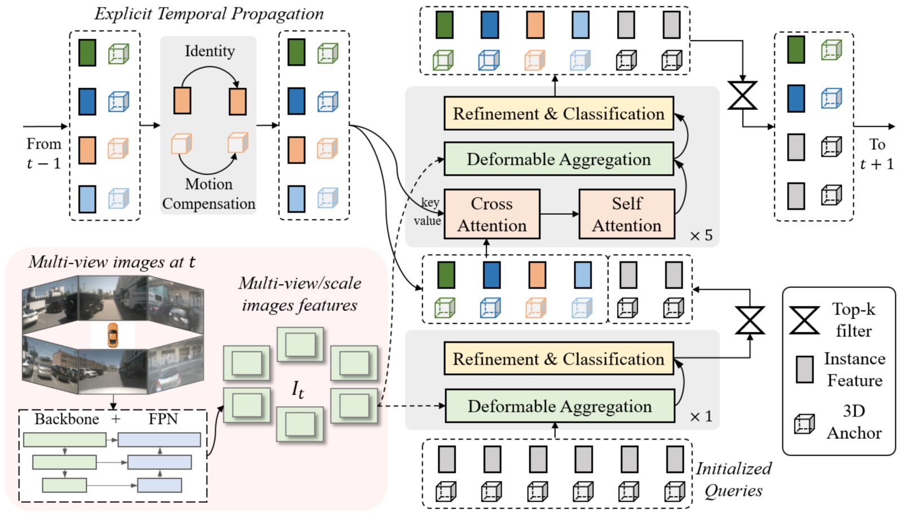

> **图注**: Sparse4D v3 总体框架。在 v2 的递归框架基础上增加: Decoupled Attention (解耦注意力)、辅助训练任务 (TID + Quality Estimation)、以及实例ID分配实现端到端跟踪。

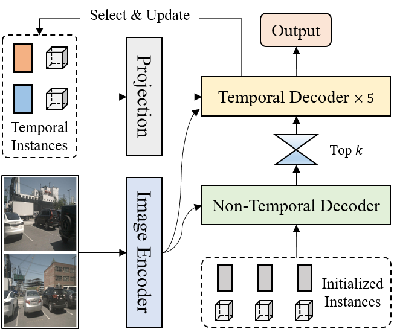

> **图注 (Figure 1)**: Sparse4D 框架简化示意图。展示 encoder-decoder 结构，输入为多视图图像 + 新初始化实例 + 上一帧传播实例，输出为精修后的实例 (3D anchor boxes + 对应特征)。

<!-- TODO: 补充你对 v3 整体结构的理解 -->

**v3 完整 Pipeline 各章节对应位置**:

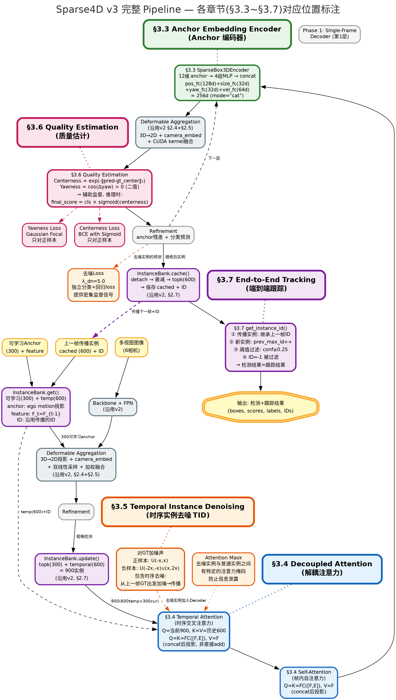

> **图注**: Sparse4D v3 完整 pipeline，每个章节编号直接标注在对应的模块上:
> - **§3.3 Temporal Instance Denoising**: 对 GT 加噪声实例注入训练，λ_dn=5.0 (仅训练时)
> - **§3.4 Quality Estimation**: Centerness + Yawness 辅助监督，推理时 final_score=cls×σ(C)
> - **§3.5 Decoupled Attention** (含 Anchor Embedding Encoder): Temporal Attention (时序交叉) + Self-Attention (帧内)，Q=K=FC([F,E])；Anchor Encoder: 11维 anchor → 4组 MLP → concat → 256d (mode="cat")
> - **§3.6 End-to-End Tracking**: ID 分配 + InstanceBank 传播 (沿用 v2 的递归框架)
> - 灰色模块为 v2 沿用 (§2.4 EDA + §2.5 Camera Encoding + §2.7 Instance Propagation)

## 3.3 Temporal Instance Denoising (TID)

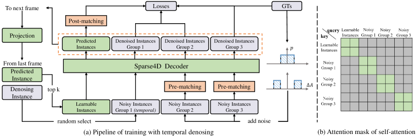

> **图注 (Figure 4)**: Temporal Instance Denoising 示意图。
> - **训练阶段**: 在输入实例中加入带噪声的 GT 实例 (位置扰动)，要求模型将其去噪回原始 GT 位置
> - **正负样本判定**: 正噪声和负噪声 anchor **混在一起**，通过匈牙利匹配 (而非噪声范围) 确定正负样本
> - **Attention Mask**: 可学习实例与去噪实例之间、不同去噪组之间均有注意力屏蔽，防止信息泄露 (详见下方)
> - **推理阶段**: 不添加噪声实例，正常推理

### 核心公式

**GT anchors:**

$$A^{gt} = \{(x, y, z, w, l, h, \text{yaw}, v_x, v_y, v_z)_i \mid i \in \mathbb{Z}_N\}$$

**带噪声 anchors** (对每个 GT 添加 $M$ 组噪声，每组含正负样本):

$$A^{noise} = \{A_i + \Delta A_{i,j,k} \mid i \in \mathbb{Z}_N, \, j \in \mathbb{Z}_M, \, k \in \mathbb{Z}_2\}$$

> 其中 $\Delta A_{i,j,1} \sim U(-x, x)$ (小噪声)，$\Delta A_{i,j,2} \sim U(-2x, -x) \cup (x, 2x)$ (大噪声)。注意：这里的"小噪声"和"大噪声"**并不直接决定**正负样本——最终正负样本通过匈牙利匹配确定，而非噪声范围。DINO-DETR 用噪声范围直接判定，Sparse4D v3 改进了这一点。
> 这里的 $x = \text{dn\_noise\_scale} = 0.5$，是一个**固定的标量超参数**，对所有 anchor 维度 (位置/尺寸/朝向/速度) 统一生效，而非 GT 某个维度的值。
> 噪声加在**编码后的 GT** 上：位置保持原值，尺寸取对数，朝向转为 sin/cos，然后统一加 $U(-0.5, 0.5)$ 的噪声。

### 正负样本的判定: 两个独立的匈牙利匹配池

> ⚠️ **核心要点**: 训练中有**两个完全独立的匈牙利匹配过程**，互不关联。

**匹配池 1: 去噪实例** (在 `get_dn_anchors()` 中，decoder 之前执行)

将正噪声 anchor 和负噪声 anchor **混在一起**，通过 `linear_sum_assignment` 跟 GT 做二分图匹配。匹配到的 = 正样本 (赋予 GT 标签)，未匹配到的 = 负样本。

```python
# target.py: get_dn_anchors()
dn_anchor = box_target + noise                    # 正噪声
if self.add_neg_dn:
    dn_anchor = torch.cat([dn_anchor, box_target + noise_neg], dim=1)  # 正负混在一起

box_cost = self._box_cost(dn_anchor, box_target, ...)
for i in range(bs):
    anchor_idx, gt_idx = linear_sum_assignment(cost)  # 匈牙利匹配
    dn_box_target[i, anchor_idx] = box_target[i, gt_idx]  # 匹配到的=正样本
    dn_cls_target[i, anchor_idx] = cls_target[i, gt_idx]
    # 没匹配到的保持 dn_cls_target = -1，即负样本
```

**匹配池 2: 可学习实例** (在 `sample()` 中，decoder 之后执行)

可学习实例经过 decoder 后产生预测结果，在 `loss()` 中调用 `sample()` 用匈牙利匹配将预测与 GT 配对。去噪实例**不参与**这个匹配。

```python
# sparse4d_head.py: loss()
cls_target, reg_target, reg_weights = self.sampler.sample(
    cls, reg, data["gt_labels_3d"], data["gt_bboxes_3d"])
# sample() 内部也用 linear_sum_assignment，但只对可学习实例的预测
```

```
匹配池 1 (get_dn_anchors)              匹配池 2 (sample)
──────────────────────────              ──────────────────────────
正噪声 anchor ─┐                        可学习实例预测 ──→ 匈牙利匹配 ──→ cls_target, reg_target
               ├─→ 匈牙利匹配 ──→ dn_cls_target, dn_reg_target
负噪声 anchor ─┘
                                        (两个匹配池完全独立，互不干扰)
```

#### 与 DINO-DETR 的关键区别

> DINO-DETR **凭噪声范围直接判定**正负样本 ($(-x,x)$ 内 = 正，之外 = 负)。但这存在误判风险：负样本的噪声虽然在**整体幅度**上更大，但 anchor 有 9+ 个维度 (xyz, w, l, h, yaw, vx, vy, vz)，负样本在**某些维度**上可能比正样本更接近 GT。直接按范围判定会产生错误分配。
>
> Sparse4D v3 的改进：不管噪声大小，统一通过匈牙利匹配让**空间距离**来决定谁是正样本、谁是负样本，彻底消除歧义。

### 注意力掩码 (Attention Mask): 三级隔离

> **核心规则**: 可学习实例与去噪实例之间**不能交互**，不同去噪组之间也**不能交互**，只有同组内的去噪实例可以交互。

代码中的注意力掩码分为两层构建：

**第一层**: `get_dn_anchors()` 中构建组内掩码 (`dn_attn_mask`)

```python
# 只有同组内可以互相关注
attn_mask = new_ones(num_gt * num_dn_groups, num_gt * num_dn_groups)  # 全部 blocked
for i in range(num_dn_groups):
    start = num_gt * i
    end = start + num_gt
    attn_mask[start:end, start:end] = 0  # 同组内 unblock → 允许关注
attn_mask = (attn_mask == 1)  # True = blocked, False = allowed
```

**第二层**: `forward()` 中构建全局掩码 (可学习实例 + 去噪实例)

```python
num_instance = num_free_instance + num_dn_anchor
attn_mask = new_ones(num_instance, num_instance)          # 全部 blocked
attn_mask[:num_free_instance, :num_free_instance] = False # 可学习实例之间: 允许
attn_mask[num_free_instance:, num_free_instance:] = dn_attn_mask  # 去噪实例之间: 用组内掩码
# 其余位置保持 True (blocked):
#   - 可学习实例 → 去噪实例: blocked ✗
#   - 去噪实例 → 可学习实例: blocked ✗
```

**可视化** (以 900 可学习实例 + 5 组去噪为例):

```
                     可学习(900)    组1    组2    组3    组4    组5
                 ┌──────────────┬─────┬─────┬─────┬─────┬─────┐
  可学习(900)    │  ✅ 可以交互  │  ✗  │  ✗  │  ✗  │  ✗  │  ✗  │
                 ├──────────────┼─────┼─────┼─────┼─────┼─────┤
  组1            │  ✗           │ ✅内 │  ✗  │  ✗  │  ✗  │  ✗  │
                 ├──────────────┼─────┼─────┼─────┼─────┼─────┤
  组2            │  ✗           │  ✗  │ ✅内 │  ✗  │  ✗  │  ✗  │
                 ├──────────────┼─────┼─────┼─────┼─────┼─────┤
  组3            │  ✗           │  ✗  │  ✗  │ ✅内 │  ✗  │  ✗  │
                 ├──────────────┼─────┼─────┼─────┼─────┼─────┤
  组4            │  ✗           │  ✗  │  ✗  │  ✗  │ ✅内 │  ✗  │
                 ├──────────────┼─────┼─────┼─────┼─────┼─────┤
  组5            │  ✗           │  ✗  │  ✗  │  ✗  │  ✗  │ ✅内 │
                 └──────────────┴─────┴─────┴─────┴─────┴─────┘
```

> **为什么需要隔离？**
>
> 1. **可学习实例 ↔ 去噪实例隔离**: 去噪实例的 anchor 来自 GT + 噪声，如果可学习实例能关注到去噪实例，就等于**泄露了 GT 信息**。可学习实例应该自己学会找到物体，不能"抄答案"。
>
> 2. **不同去噪组之间隔离**: 每个组独立进行匈牙利匹配，一个组内的一个 GT 最多匹配一个正样本。如果组间可以交互，信息会跨组传播，破坏"每组独立匹配"的约束，可能导致歧义（同一个 GT 被多个组的正样本互相确认）。
>
> 3. **同组内允许交互**: 同一组的去噪实例需要通过 self-attention 互相交换信息，才能更好地理解周围的上下文，从而更准确地"去噪"。这与 DN-DETR 的设计一致。

### 去噪实例的构造细节

> **关键结论: 去噪 anchor = 原始 GT 标注 + 噪声，不是 decoder 中间层的输出加噪声。**

整个执行时间线：

```
① 数据集提供: GT box annotations (原始标注，没经过任何 decoder)
          ↓
② get_dn_anchors(): 对原始 GT 编码后直接加噪声 (在 decoder 之前!)
   dn_anchor = encode(GT) + noise
   dn_instance_feature = zeros(256d)
          ↓
③ forward(): 把 [可学习实例] + [去噪实例] concat 在一起
   anchor   = [learnable_anchor,  dn_anchor]
   feature  = [learnable_feature, zeros]
          ↓
④ 一起走完所有 6 层 Decoder
   → 可学习实例: 被精修成检测结果
   → 去噪实例: 被精修，目标是还原回 GT
          ↓
⑤ loss():
   匹配池 2: 可学习实例预测 → sample() → 普通检测 loss
   匹配池 1: 去噪实例的 dn_cls_target/dn_reg_target (已在②确定) → 去噪 loss
```

| 组件 | 可学习实例 | 去噪实例 |
|------|-----------|---------|
| **Anchor 来源** | K-means 初始化 / 上一帧传播 | **原始 GT 标注 + 噪声** |
| **Instance Feature** | 可学习参数 / 传播来的 | **全零** (`new_zeros`) |
| **Decoder 处理** | 从头走完 6 层 | 同左，一起走完 6 层 |
| **匈牙利匹配** | `sample()` — 预测 vs GT | `get_dn_anchors()` — 噪声 anchor vs GT |
| **匹配池** | 只有可学习实例 | 只有去噪实例 |
| **Loss** | Focal Loss (分类) + Smooth L1 (回归) | 同左 (Focal Loss + Smooth L1) |

> 设计直觉: 给模型一个"在 GT 附近但有偏移"的几何起点和**空白的语义特征**，让模型通过 decoder 学会从图像中采样特征并把位置"修"回 GT。Instance feature 如果有内容就是信息泄露。

### Loss 的本质: 去噪自编码器，不是对比学习

去噪 loss 的形式与普通检测 loss **完全相同** (Focal Loss + Smooth L1 Loss)，不是对比学习 loss。

| | 对比学习 (InfoNCE) | Sparse4D v3 去噪 Loss |
|---|---|---|
| **公式** | $-\log\frac{\exp(q \cdot k^+ / \tau)}{\exp(q \cdot k^+ / \tau) + \sum \exp(q \cdot k^-_j / \tau)}$ | Focal Loss (分类) + Smooth L1 (回归) |
| **正负交互** | 正样本在分子，所有样本在分母，显式对比 | 正负样本**各算各的**，没有显式对比 |
| **优化目标** | 拉近正对、推远负对 | 正样本: 回归到 GT + 预测正确类别; 负样本: 预测为背景 |

> 虽然"区分正负样本"的思想有对比学习的味道，但数学上不是一回事。更准确地说是**去噪自编码器 (Denoising Autoencoder)** 的思路：给模型一个带噪声的输入，让它学会还原到干净的 GT。

### 核心思路

- 灵感来自 DN-DETR，但扩展到 3D 时序检测场景
- 提供密集监督信号，稳定匈牙利匹配的训练过程
- 时序去噪实例: 从上一帧 GT 出发加噪声 → 传播到当前帧 → 要求去噪回当前帧 GT
- 特别有助于时序分支，教会模型正确处理实例传播
- 配置: `num_dn_groups=5` (5组噪声实例), `num_temp_dn_groups=3` (其中3组做时序传播), `dn_noise_scale=0.5`, `dn_loss_weight=5.0`

## 3.4 Quality Estimation

<!-- TODO: 补充你对 Quality Estimation 的理解 -->

分类置信度不能准确反映检测框质量。v3 引入两个质量指标作为辅助监督：

### Centerness (中心度)

$$C_{\text{gt}} = \exp\big(-\|[x, y, z]_{\text{pred}} - [x, y, z]_{\text{gt}}\|_2\big)$$

> **连续值**，范围 $(0, 1]$。用当前**预测框中心**与**GT中心**的欧氏距离计算。
> - 重合 → $d=0$ → $C_{\text{gt}}=1$
> - 偏离 1m → $C_{\text{gt}}≈0.37$
> - 偏离越远 → $C_{\text{gt}}→0$
>
> ⚠️ 论文写 $\exp(-\|\Delta\|^2)$，代码实际用 `torch.norm(p=2)` 即 $\exp(-\|\Delta\|_2)$，以代码为准。
>
> **关键**: 不同 decoder 层的预测不同 → 每层 centerness GT 也不同，形成"你这个预测定位有多准"的自适应监督。

### Yawness (朝向度)

**论文公式** (Eq.4，连续值):

$$Y = [\sin\text{yaw}, \cos\text{yaw}]_{\text{pred}} \cdot [\sin\text{yaw}, \cos\text{yaw}]_{\text{gt}} = \cos(\Delta\text{yaw})$$

> 两个单位向量的点积 = $\cos(\Delta\text{yaw})$，范围 $[-1, 1]$，**论文给的是连续值**。

**代码实现** (二值化简化):

```python
yns_target = (cosine_similarity(...) > 0).float()  # cos>0 → 1.0, cos≤0 → 0.0
```

> ⚠️ **论文与代码有差异**: 论文公式是连续的 $\cos(\Delta\text{yaw})$，但代码用 `> 0` 截断成了 **0/1 二值**。以代码为准:
> - 朝向差 < 90° → $Y_{\text{gt}}=1$
> - 朝向差 ≥ 90° → $Y_{\text{gt}}=0$

### 正负样本的 GT 设置 (实操细节)

<!-- TODO: 补充你对正负样本 GT 设置的理解 -->

**核心代码** (来源: `projects/mmdet3d_plugin/models/detection3d/losses.py`):

```python
# quality 网络输出: quality[..., CNS] = centerness logits, quality[..., YNS] = yawness logits
cns = quality[..., CNS]                     # centerness 预测值 (logits)
yns = quality[..., YNS].sigmoid()           # yawness 预测值 (sigmoid 后)

# ---- 只对正样本 (mask=True) 计算 quality loss ----
# mask 来自匈牙利匹配: 匹配到 GT 的是正样本, 未匹配的是负样本
# 代码中: qt = qt.flatten(end_dim=1)[mask]  只取正样本的 quality 预测

# Centerness GT: 用预测框和 GT 框的中心点距离计算
cns_target = torch.norm(
    box_target[..., [X, Y, Z]] - box[..., [X, Y, Z]], p=2, dim=-1
)                       # || pred_center - gt_center ||_2
cns_target = torch.exp(-cns_target)  # exp(-distance) → 越近越接近1

# Yawness GT: 判断预测朝向与GT朝向的cos相似度是否 > 0 (二值)
yns_target = (
    torch.nn.functional.cosine_similarity(
        box_target[..., [SIN_YAW, COS_YAW]],
        box[..., [SIN_YAW, COS_YAW]],
        dim=-1,
    ) > 0
).float()               # 朝向一致 → 1.0, 朝向相反 → 0.0
```

**总结:**

| | 正样本 (匹配到 GT) | 负样本 (未匹配到 GT) |
|---|---|---|
| **Centerness GT** | $C_{\text{gt}} = \exp(-\|[x,y,z]_{\text{pred}} - [x,y,z]_{\text{gt}}\|_2^2)$, 连续值 ∈ (0, 1] | **不参与计算** (被 mask 过滤掉) |
| **Yawness GT** | 论文: $\cos(\Delta\text{yaw})$ 连续值; 代码: `>0` 二值化后 {0, 1} | **不参与计算** (被 mask 过滤掉) |
| **网络预测** | $C_{\text{pred}}$ (logit), $Y_{\text{pred}}$ (sigmoid 后) | 输出但被 mask 忽略 |

> **注意**: Quality Estimation 的 loss **只对正样本计算**。负样本通过 `mask` 过滤掉，不产生 centerness/yawness 损失。

> **特殊处理**: nuScenes 中某些类别 (如 barrier) 不区分正反方向，代码中 `cls_allow_reverse` 会对这些类别的 GT yaw 做翻转对齐，确保 yawness 判断正确。

### Quality Estimation 损失

$$\mathcal{L} = \lambda_1 \text{CrossEntropy}(Y_{\text{pred}}, Y_{\text{gt}}) + \lambda_2 \text{GaussianFocal}(C_{\text{pred}}, C_{\text{gt}})$$

> Centerness 用 BCE with Sigmoid (`CrossEntropyLoss, use_sigmoid=True`)，Yawness 用 Gaussian Focal Loss (`GaussianFocalLoss`)。**仅对正样本**计算。

### 推理时怎么用 Quality?

```python
# 推理时: 最终得分 = 分类置信度 × centerness_sigmoid
centerness = quality[output_idx][..., CNS]
cls_scores *= centerness.sigmoid()    # 乘以 centerness 作为最终排序分数
```

> 即 `final_score = classification_confidence × sigmoid(centerness_pred)`，centerness 越高的框最终得分越高，低质量的框被压低分数后过滤掉。yawness 不参与推理评分，仅在训练时提供辅助监督。

## 3.5 Decoupled Attention (解耦注意力)

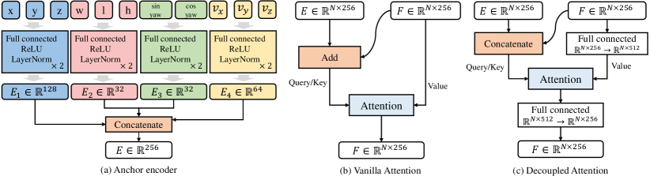

> **图注 (Figure 5)**: Anchor Encoder 和 Attention 架构。左侧为 Anchor Embedding Encoder（将 anchor 参数编码为位置编码），右侧将 v2 中统一的注意力操作解耦为:
> - **Temporal Self-Attention**: 当前帧实例与上一帧传播实例之间的注意力 (instance-to-instance)
> - **Cross-Attention (Deformable Aggregation)**: 实例与多视图图像特征之间的交叉注意力 (instance-to-image)
>
> ⚠️ **术语说明**: 论文将第一个分支称为 "Self-Attention"（与 instance-to-image 的 Cross-Attention 相对），但实际代码中 `temp_gnn` 的 **Q 和 K/V 不同源** — Q 来自当前帧 900 个实例，K/V 来自上一帧原始的 600 个时序实例，属于**交叉注意力机制**。论文用 "Self" 是强调 "实例与实例之间"（而非实例与图像之间），并非标准意义上的自注意力 (Self-Attention where Q=K=V)。

<!-- TODO: 补充你对解耦注意力的理解 -->

### Vanilla vs Decoupled 对比

**v2 Vanilla Attention**: anchor embedding $E$ 和 instance feature $F$ 直接**相加**作为 query/key:

$$Q = K = F + E, \quad V = F$$

> 问题: 相加后空间信息和语义信息混合，注意力权重会出现异常值 (Figure 3 中红圈所示的错误关联)

**v3 Decoupled Attention**: $E$ 和 $F$ **拼接**后再投影，空间信息和语义信息独立计算注意力:

$$Q = K = \text{FC}([F, \, E]) \in \mathbb{R}^{N \times 512}, \quad V = F$$

$$\text{Output} = \text{FC}(\text{Attention}(Q, K, V)) \in \mathbb{R}^{N \times 256}$$

> 即将 $F$ (256d) 和 $E$ (256d) concat 成 512d，过全连接层后做注意力计算，再投影回 256d。这给网络更大的灵活性来区分空间关系和语义关系。

### 为什么解耦？

<!-- TODO: 补充你的理解 -->
- 统一注意力将时序交互和图像特征提取混在一起，各自的学习目标不一致
- 解耦后各司其职:
  - 时序注意力 (temp_gnn, 实际为交叉注意力) → 处理当前帧实例与历史帧实例之间的交互 + 时序一致性
  - 交叉注意力 (Deformable Aggregation) → 处理实例与图像特征的特征提取

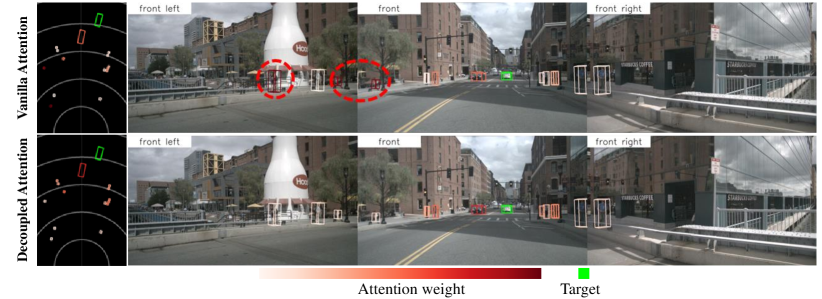

> **图注 (Figure 3)**: Vanilla Attention vs Decoupled Attention 的可视化对比。可以看到解耦后注意力权重更加聚焦和合理。

### Anchor Embedding Encoder (Anchor 编码器)


### 三个版本的 Anchor 构成与 Embedding 演进

**Anchor（锚框）**是 Sparse4D 中每个实例的结构化状态信息，三个版本的 anchor 构成如下：

| 维度 | V1 | V2 | V3 |
|------|----|----|-----|
| 位置 | $x, y, z$ | $x, y, z$ | $x, y, z$ |
| 尺寸 | **$\ln w, \ln h, \ln l$** (对数!) | $w, l, h$ | $w, l, h$ |
| 朝向 | $\sin\text{yaw}, \cos\text{yaw}$ | $\sin\text{yaw}, \cos\text{yaw}$ | $\sin\text{yaw}, \cos\text{yaw}$ |
| 速度 | $v_x, v_y$ | $v_x, v_y$ | $v_x, v_y, v_z$ |
| **总计** | **10维** | **10维** | **11维** |

> ⚠️ **V1→V2 变化**: 尺寸参数从对数空间 $\ln w, \ln h, \ln l$ 改为线性空间 $w, l, h$。
> ⚠️ **V2→V3 变化**: 速度从 2D $(v_x, v_y)$ 扩展到 3D $(v_x, v_y, v_z)$，总维度从 10 维增加到 11 维。

### Anchor Embedding 在三个版本的演进

| | V1 | V2 | V3 |
|---|---|---|---|
| **是否提及** | ✅ "anchor box embedding" | ✅ **首次明确定义**三部分解耦 | ✅ 首次定义 `SparseBox3DEncoder` 类 |
| **实例构成** | anchor + (instance feature + anchor embedding) **融为一体** | **anchor + instance feature + anchor embedding** (三部分独立) | 同 v2 (三部分独立) |
| **embedding 归属** | anchor embedding **加到 instance feature 里面**，不单独存在 | anchor embedding **单独拿出来**，作为独立组件 | 同 v2 |
| **编码方式** | 10维 → MLP → **add** 到 instance feature | 10维 → encoder Ψ → 独立的 E | 11维 → **4组分组 MLP** → **concat** |
| **注入方式** | $F = F + E$ (加到一起后不再区分) | $E$ 和 $F$ 各自独立，concat 后一起用 | $Q = K = \text{FC}([F, E])$ (拼接后投影) |
| **时序传播** | 需要重新从图像采样所有帧 | ✅ $F_t=F_{t-1}$ 不变，只需重新编码 $E_t=\Psi(A_t)$ | 同 v2 |

> **关键演进 (你的理解完全正确)**:
> - **V1**: anchor embedding 直接 **add 到 instance feature 里面**，二者融为一体。论文原文: "with the embedding of anchor parameters added before and after"、"instance feature $F_m$ with anchor box embedding added"。这导致做时序融合时无法独立处理。
> - **V2**: **把 anchor embedding 单独拿出来**，与 anchor 几何特征、instance feature 三部分解耦。这样做的目的就是**方便时序变换** — 传播时只需投影 anchor 几何参数并重新编码 embedding ($E_t = \Psi(A_t)$)，而 instance feature 可以原样传递 ($F_t = F_{t-1}$)，不需要重新从历史帧图像采样。
> - **V3**: 在 V2 解耦的基础上，进一步把 embedding 的注入方式从 add 改为 concat (Decoupled Attention)，让空间信息和语义信息独立计算注意力。实例的构成与 v2 相同（三部分），**instance ID 不在 anchor tensor 内部**，而是在 InstanceBank 外部单独维护。

> **Anchor Embedding 的本质**: 就是 anchor 的几何参数经过最朴素的多层感知机 (MLP) — `[Linear → ReLU → LayerNorm] × 4层`，把低维物理参数映射到高维特征空间充当位置编码。没有 attention、没有 deformable、没有复杂结构。和 DETR 里把坐标过 MLP 生成 positional encoding 是同一思路，只不过 anchor 参数更丰富 (v3为11维)，所以分组各自编码再拼起来。

### V2/V3 中 anchor embedding 与 instance feature 的精确交互 (代码级)

<!-- TODO: 补充你对这个交互流程的理解 -->

```python
anchor_embed = self.anchor_encoder(anchor)         # 独立编码

# === Decoder 每一层的流程 ===

# ① Self-Attention (gnn):
instance_feature = self.graph_model(
    instance_feature,
    value=instance_feature,          # ← V 只用 instance_feature
    query_pos=anchor_embed,          # ← anchor_embed 作为位置编码
    key_pos=anchor_embed,
)

# ② Deformable Aggregation:
instance_feature = self.deformable_agg(
    instance_feature,                 # ← 三个独立参数传入
    anchor,
    anchor_embed,
    feature_maps,                     # ← 图像特征
)

# ③ Refinement Module:
feature = instance_feature + anchor_embed    # ← 这里才 add 到一起
output = regression_layers(feature)           # 用 add 后的 feature 做回归
cls = classification_layers(instance_feature) # ← 注意: 分类只用 instance_feature!
```

**要点**:
- **Self-Attention**: anchor_embed 只作为 query_pos/key_pos (位置编码)，value 是 instance_feature → 两者**独立参与**注意力计算
- **Deformable Aggregation**: anchor_embed **独立传入**，用于生成 keypoint 偏移和融合权重
- **Refinement**: 最终 `feature = instance_feature + anchor_embed` → 用于回归，但分类头只用 instance_feature
- **时序传播**: 因为 embedding 独立，传播时 $F_t = F_{t-1}$ 不变，只需 $E_t = \Psi(A_t)$ 重新编码

---

### V3 的 Anchor Embedding Encoder 实现

Anchor Embedding Encoder（代码中叫 `SparseBox3DEncoder`）的作用是：**将 3D anchor box 的物理参数编码为高维 embedding，作为位置编码 (positional encoding) 注入到整个 decoder 中**。

### 输入: 11 维 anchor 参数

```
[x, y, z, w, l, h, sin_yaw, cos_yaw, vx, vy, vz]
 ─位置(3)─  ─大小(3)─    ──朝向(2)──   ─速度(3)─
```

### 处理流程

```
anchor (11 dim)
  │
  ├── pos_fc:   [x, y, z] ──────► MLP(Linear→ReLU→LN × 4) ──► 128 dim
  ├── size_fc:  [w, l, h] ──────► MLP(Linear→ReLU→LN × 4) ──►  32 dim
  ├── yaw_fc:   [sin, cos] ────► MLP(Linear→ReLU→LN × 4) ──►  32 dim
  └── vel_fc:   [vx, vy, vz] ──► MLP(Linear→ReLU→LN × 4) ──►  64 dim
       │
       └──── concat ────► 128 + 32 + 32 + 64 = 256 dim (anchor_embed)
```

**核心思路**: 把 anchor 的 11 个物理参数按语义分成 4 组（位置/大小/朝向/速度），各自过独立的 4 层 MLP，然后 concat 成 256 维 embedding。

### 源码 (`SparseBox3DEncoder`)

> 文件: `projects/mmdet3d_plugin/models/detection3d/detection3d_blocks.py`

```python
# anchor 参数索引定义 (box3d.py)
X, Y, Z, W, L, H, SIN_YAW, COS_YAW, VX, VY, VZ = list(range(11))

# MLP 构造辅助函数 (blocks.py)
def linear_relu_ln(embed_dims, in_loops, out_loops, input_dims=None):
    if input_dims is None:
        input_dims = embed_dims
    layers = []
    for _ in range(out_loops):
        for _ in range(in_loops):
            layers.append(Linear(input_dims, embed_dims))
            layers.append(nn.ReLU(inplace=True))
            input_dims = embed_dims
        layers.append(nn.LayerNorm(embed_dims))
    return layers
# 即每个子编码器 = [Linear → ReLU → LayerNorm] × out_loops

@POSITIONAL_ENCODING.register_module()
class SparseBox3DEncoder(BaseModule):
    def __init__(self, embed_dims, vel_dims=3, mode="add",
                 output_fc=True, in_loops=1, out_loops=2):
        super().__init__()
        self.embed_dims = embed_dims
        self.vel_dims = vel_dims
        self.mode = mode

        def embedding_layer(input_dims, output_dims):
            return nn.Sequential(
                *linear_relu_ln(output_dims, in_loops, out_loops, input_dims)
            )

        # 四个分组各自独立的 MLP
        self.pos_fc  = embedding_layer(3, embed_dims[0])  # [x,y,z] → 128d
        self.size_fc = embedding_layer(3, embed_dims[1])  # [w,l,h] → 32d
        self.yaw_fc  = embedding_layer(2, embed_dims[2])  # [sin,cos] → 32d
        if vel_dims > 0:
            self.vel_fc = embedding_layer(self.vel_dims, embed_dims[3])  # [vx,vy,vz] → 64d
        if output_fc:
            self.output_fc = embedding_layer(embed_dims[-1], embed_dims[-1])

    def forward(self, box_3d: torch.Tensor):
        # 分组提取，各自过 MLP
        pos_feat  = self.pos_fc(box_3d[..., [X, Y, Z]])           # [0,1,2] → 128d
        size_feat = self.size_fc(box_3d[..., [W, L, H]])          # [3,4,5] → 32d
        yaw_feat  = self.yaw_fc(box_3d[..., [SIN_YAW, COS_YAW]])  # [6,7]   → 32d

        if self.mode == "add":
            output = pos_feat + size_feat + yaw_feat
        elif self.mode == "cat":
            output = torch.cat([pos_feat, size_feat, yaw_feat], dim=-1)

        if self.vel_dims > 0:
            vel_feat = self.vel_fc(box_3d[..., VX : VX + self.vel_dims])  # [8,9,10] → 64d
            if self.mode == "add":
                output = output + vel_feat
            elif self.mode == "cat":
                output = torch.cat([output, vel_feat], dim=-1)

        if self.output_fc is not None:
            output = self.output_fc(output)
        return output
```

### v3 配置 (decoupled attention 模式)

```python
anchor_encoder=dict(
    type="SparseBox3DEncoder",
    vel_dims=3,
    embed_dims=[128, 32, 32, 64],   # 各组输出维度 → concat 后 256d
    mode="cat",                      # 拼接而非相加
    output_fc=False,                 # decouple_attn 时不需要 output_fc
    in_loops=1,
    out_loops=4,                     # 每个MLP 4层
)
```

### anchor_embed 在 decoder 中怎么用？

```python
# 在 sparse4d_head.py 中
anchor_embed = self.anchor_encoder(anchor)   # (B, N, 11) → (B, N, 256)

# 1. 作为 self-attention 的 query/key 位置编码
# 2. 作为 cross-attention (deformable aggregation) 的位置注入
# 3. 在 refinement 中加到 instance_feature 上:
feature = instance_feature + anchor_embed
```

**一句话总结**: Anchor Embedding Encoder 本质上就是**最朴素的多层感知机 (MLP)** — 把 anchor 的几何参数从低维物理空间映射到高维特征空间，充当位置编码 (positional encoding) 的角色。没有 attention，没有 deformable，没有复杂结构，就是 `[Linear → ReLU → LayerNorm] × 4层`。和 DETR 里把 (x, y) 坐标过 MLP 生成 positional encoding 是同一个思路，只不过 Sparse4D 的 anchor 参数更丰富 (v3为11维)，所以分组后各自编码再拼起来。

## 3.6 End-to-End Tracking

<!-- TODO: 补充你对端到端跟踪的理解 -->

Sparse4D v3 利用 query-based 检测的天然优势实现跟踪:

1. **实例ID分配**: 每个实例 (query) 在生命周期内维护一个唯一的 instance ID
2. **帧间传播**: 实例传播时携带 ID
3. **新实例初始化**: 新创建的实例获得新的唯一 ID
4. **推理**: 直接输出带 ID 的跟踪实例，无需后处理 (如卡尔曼滤波)

**关键优势**: 检测和跟踪在同一个模型中完成，无需单独的跟踪模块

> ⚠️ **ID 的实际存储位置**: `instance_id` **不在 anchor tensor 内部**，也不是 instance feature 的一部分。代码中 `InstanceBank` 只维护 `cached_feature`、`cached_anchor`、`cached_confidence`，没有 `instance_id` 字段。ID 是在数据集输出层（`nuscenes_3d_det_track_dataset.py`）通过 `instance_inds` 跨帧匹配来管理的。也就是说，实例的构成在 v3 中与 v2 相同（anchor + instance feature + anchor embedding 三部分），ID 是独立于这三部分之外的外部元数据。

### InstanceBank 的本质: 有状态的模型组件

InstanceBank 是一个 **PyTorch `nn.Module`**，但与普通无状态模块不同，它**持有运行时状态**（上一帧的缓存），是一个**有状态的单例 (Stateful Singleton)**：

```
普通 nn.Module:  forward(x) → y    无状态, 输入相同则输出相同
                  ↑    ↓
                  无记忆

InstanceBank:   第1帧: get() → cache()
               第2帧: get()(读到缓存) → 处理 → cache()(更新缓存)
               第3帧: get()(读到缓存) → 处理 → cache()(更新缓存)
                 ↑         ↓
               有记忆, 持有上一帧的状态
```

```python
class InstanceBank(nn.Module):
    # ── 可学习参数 (训练时优化) ──
    self.anchor = nn.Parameter(...)            # 300个初始 anchor
    self.instance_feature = nn.Parameter(...)  # 300个初始特征

    # ── 运行时状态 (推理时帧间传递, 非参数) ──
    self.cached_feature = None     # 上一帧传播的实例特征 (B, 600, 256)
    self.cached_anchor = None      # 上一帧传播的 anchor (B, 600, 11)
    self.confidence = None         # 上一帧的置信度 (用于衰减)
    self.metas = None              # 上一帧的时间戳 (用于 ego motion)
```

**设计意义**: InstanceBank 封装了实例跨帧传播的全部逻辑（get/update/cache），让 Sparse4DHead 不需要关心传播细节，只管调接口。模型内部（InstanceBank）管理"传播谁"，外部（数据集层）管理"谁是谁"（ID）。

### ID 管理方式: 模型内外分离

```
模型内部 (InstanceBank)              模型外部 (数据集输出层)
─────────────────────────            ──────────────────────────
管理: cached_anchor                  管理: instance_id 数组
      cached_feature                      通过帧间 instance_inds
      cached_confidence                   匹配来维护 ID
                                    
决定: 传播哪600个实例                  决定: 这600个实例的 ID 是什么
方式: topk(600) 按                    方式: 传播实例继承旧 ID
      置信度排序                           新实例 prev_max_id++
                                    
      两者通过数组索引对齐: 第 i 个 anchor/feature 对应第 i 个 ID
```

### 与传统 Query-based Tracking 的 ID 管理对比

**这是所有 query-based tracking 方法的通用范式** — ID 本身都不进入网络计算，"跟踪"靠的是 query/instance 的传播本身：

| 方法 | 内部传播什么 | ID 怎么管 | 有跟踪 Loss 吗 |
|------|-----------|---------|-------------|
| **Sparse4D v3** | instance (anchor + feature + embedding) | 外部数组 + 帧间匹配 | ❌ 无 |
| **MOTR** | track query (传播到下一帧做 decoder 输入) | 外部匹配 + ID 继承 | ✅ 跟踪分类 loss |
| **MUTR3D** | 3D track query + 运动模型预测 | 同上 | ✅ 跨帧关联 loss |
| **TrackFormer** | track embedding | 同上 | ✅ 关联分类 loss |

**核心共性**: 所有 query-based tracking 的"跟踪"都是**隐式的** — 靠 query/instance 的传播本身保持身份，不是靠显式的 ID 编码。同一个 query 从第 t-1 帧传播到第 t 帧，它自然代表同一个物体，ID 只是外部贴的标签。

**Sparse4D v3 的独特之处**: 完全没有跟踪损失，纯靠检测置信度 + InstanceBank 传播实现跟踪。传统方法都有额外的跟踪损失来监督模型学会传播。

### Tracking Pipeline 伪代码 (Algorithm 1)

```
输入:
  1) 传感器数据 D
  2) 时序实例 I_t = {(c, a, id)_i | i ∈ Z_Nt}   // 来自上一帧
  3) 当前帧实例 I_cur = {a_i | i ∈ Z_Ncur}        // 新初始化

输出:
  1) 感知结果 R = {(c, a, id)_i}
  2) 更新后的时序实例 I'_t

参数: 置信度阈值 T=0.25, 置信度衰减系数 S=0.6

1. R_det = Model(D, I_t, I_cur)                    // 前向推理
2. for i = 1 to Nt + Ncur:
     if c'_i ≥ T:                                   // 置信度超过阈值
       if i > Nt or id_i 为空:
         生成新的 id_i                               // 新出现的目标
       将 (c'_i, a'_i, id_i) 加入 R
       if i ≤ Nt:                                    // 来自上一帧的实例
         c'_i = max(c'_i, c_i × S)                  // 置信度衰减取最大
3. 从 R_det 中选 Nt 个最高置信度的实例作为 I'_t     // 传播到下一帧
4. 返回 R 和 I'_t
```

> 注意: 训练时不需要任何跟踪约束的微调，训练好的时序检测模型直接具备跟踪能力。

## 3.7 v3 性能 (nuScenes)

| Backbone | Split | NDS | mAP | AMOTA |
|----------|-------|-----|-----|-------|
| ResNet-50 | val | 56.1% | 46.9% | 49.0% |
| ResNet-101 | val | 62.3% | 53.7% | 56.7% |
| VoV-99 | test | 65.6% | 57.0% | 57.4% |
| EVA02-L | test | **71.9%** | **66.8%** | **67.7%** |

**v3 vs v2 (ResNet-50)**: mAP +3.0%, NDS +2.2%, AMOTA +7.6%

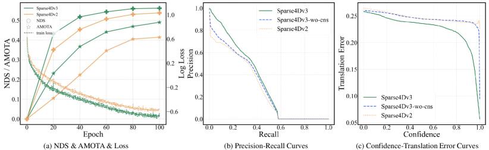

> **图注 (Figure 6)**: 训练曲线和 centerness 分析。

---

# 四、版本演进总结: v1 → v2 → v3

## 整体演进对比图

### 代码级数据流图 (v3 最终状态)

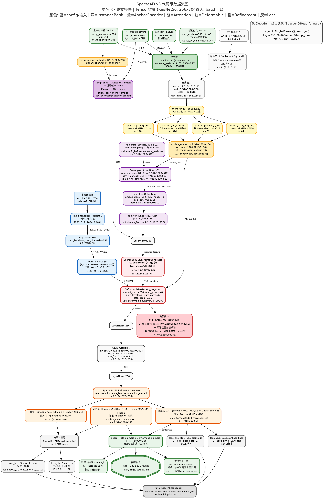

> **图注**: Sparse4D v3 代码级数据流图。包含所有关键类名、对应论文模块、Tensor 维度典型值 (以 ResNet50, 256×704 输入, batch=1 为例)。覆盖从输入图像到最终输出的完整 pipeline: InstanceBank → SparseBox3DEncoder → Decoder×6层(Attention → DeformableAggregation → FFN → Refinement) → Loss → 输出传播。

---

## 补充细节一: K-means Anchor 初始化

<!-- TODO: 补充你对 anchor 初始化的理解 -->

**代码** (`tools/anchor_generator.py`):

```python
def get_kmeans_anchor(ann_file, num_anchor=900, detection_range=55):
    # 1. 加载训练集所有 GT 3D boxes
    gt_boxes = np.concatenate([x["gt_boxes"] for x in data["infos"]], axis=0)
    
    # 2. 只保留检测范围内的 GT (距自车 <= 55m)
    distance = np.linalg.norm(gt_boxes[:, :3], axis=-1, ord=2)
    gt_boxes = gt_boxes[distance <= 55]
    
    # 3. 只对 (x, y, z) 中心坐标做 K-means 聚类 → 900 个聚类中心
    clf = KMeans(n_clusters=900)
    clf.fit(gt_boxes[:, [X, Y, Z]])   # 只用位置!
    
    # 4. 构造初始 anchor
    anchor = np.zeros((900, 11))  # 统一代码库写11维, v1实际只有10个有效变量(x,y,z,w,l,h,sin,cos,vx,vy), 第11维vz=0
    anchor[:, [X, Y, Z]] = clf.cluster_centers_        # 位置 = 聚类中心
    anchor[:, [W, L, H]] = np.log(gt_boxes[:, [W,L,H]].mean(axis=0))  # 尺寸 = 全局均值(对数)
    anchor[:, COS_YAW] = 1                                # 朝向 = cos=1, sin=0 (朝前)
    # 其余参数 (vx, vy, vz) 默认 0 (v1/v2不使用vz)
```

**总结**:

| 参数 | 初始化方式 | 说明 |
|------|-----------|------|
| $x, y, z$ | K-means 聚类中心 | 对训练集所有 GT 的**中心坐标**做 K=900 聚类，得到 900 个空间分布位置 |
| $w, l, h$ | $\ln(\bar{w}), \ln(\bar{l}), \ln(\bar{h})$ | 全部 GT 的尺寸**取均值再取对数** (V1 用对数，V2/V3 用线性) |
| $\sin\text{yaw}, \cos\text{yaw}$ | $0, 1$ (朝前) | 固定初始化为朝正前方 |
| $v_x, v_y$ | $0, 0$ | 静止 |

> **注意**: K-means 只对位置聚类，**尺寸不参与聚类**。所以 900 个 anchor 的区别只在空间位置不同，尺寸都是全局均值。anchor 是**可学习参数** (`requires_grad=True`)，训练过程中会被不断更新。

---

## 补充细节二: 3D→2D 投影与双线性插值采样

<!-- TODO: 补充你对投影和采样过程的理解 -->

### 第一步: 3D Keypoint → 2D 像素坐标投影

**代码** (`blocks.py: DeformableFeatureAggregation.project_points`):

```python
@staticmethod
def project_points(key_points, projection_mat, image_wh=None):
    # key_points: R^(B x num_anchor x 13 x 3)  — 13个3D keypoints
    # projection_mat: R^(B x 6 x 4 x 4)  — 6个相机的投影矩阵 (内参×外参)
    
    # 1. 齐次化: (x,y,z) → (x,y,z,1)
    pts_extend = torch.cat([key_points, torch.ones_like(key_points[..., :1])], dim=-1)
    
    # 2. 矩阵乘法投影: P^2d = projection_mat × P^3d
    points_2d = torch.matmul(
        projection_mat[:, :, None, None],  # R^(B x 6 x 1 x 1 x 4 x 4)
        pts_extend[:, None, ..., None]      # R^(B x 1 x num_anchor x 13 x 4 x 1)
    ).squeeze(-1)  # → R^(B x 6 x num_anchor x 13 x 3)
    
    # 3. 透视除法: 齐次坐标 (u, v, w) → (u/w, v/w)
    points_2d = points_2d[..., :2] / torch.clamp(points_2d[..., 2:3], min=1e-5)
    # → R^(B x 6 x num_anchor x 13 x 2)  — 每个keypoint在每个相机的2D像素坐标
    
    # 4. 归一化到 [-1, 1] (grid_sample 要求)
    if image_wh is not None:
        points_2d = points_2d / image_wh[:, :, None, None]  # 除以图像宽高
```

> `projection_mat` 是 $3 \times 4$ 的投影矩阵 = `intrinsic @ extrinsic`，将 3D LiDAR 坐标系下的点投影到各相机的像素坐标系。投影后做透视除法得到归一化 2D 坐标，再归一化到 $[-1, 1]$ 以适配 `grid_sample`。

### 第二步: 多尺度特征双线性插值采样

**代码** (`blocks.py: DeformableFeatureAggregation.feature_sampling`):

```python
@staticmethod
def feature_sampling(feature_maps, key_points, projection_mat, image_wh):
    # feature_maps: list of 4 个尺度, 每个 R^(B x 6 x 256 x H_s x W_s)
    # points_2d: R^(B x 6 x num_anchor x 13 x 2) — 归一化到 [0,1] 的2D坐标
    
    points_2d = DeformableFeatureAggregation.project_points(...)
    points_2d = points_2d * 2 - 1  # [0,1] → [-1,1] (grid_sample要求)
    points_2d = points_2d.flatten(end_dim=1)  # R^(B*6 x num_anchor x 13 x 2)
    
    features = []
    for fm in feature_maps:  # 遍历4个尺度
        fm_flatten = fm.flatten(end_dim=1)  # R^(B*6 x 256 x H_s x W_s)
        # grid_sample: 在每个尺度上做双线性插值
        feat = torch.nn.functional.grid_sample(
            fm_flatten,    # R^(B*6 x 256 x H_s x W_s)
            points_2d      # R^(B*6 x num_anchor x 13 x 2)
        )  # → R^(B*6 x 256 x num_anchor x 13)
        features.append(feat)
    
    features = torch.stack(features, dim=1)
    # → R^(B x 6 x 4 x 256 x num_anchor x 13)
    # = R^(B x N x S x C x K x P)
    # 即: batch × 相机 × 尺度 × 通道 × anchor × keypoint
```

> `grid_sample` 是 PyTorch 的双线性插值函数: 给定归一化 2D 坐标 $[-1, 1]$，从特征图上采样对应位置的特征值。如果坐标落在特征图外面，返回 0 (padding mode = zeros)。

### 第三步: 多视图多尺度加权融合

**代码** (`blocks.py: DeformableFeatureAggregation.multi_view_level_fusion`):

```python
def multi_view_level_fusion(self, features, weights):
    # features: R^(B x N x S x K x P x C)  — 采样到的特征
    # weights:  R^(B x N x S x K x P x G)  — 预测的权重 (softmax后)
    # G=8 (num_groups), C/G=32 (group_dims)
    
    # 1. reshape 特征: 按通道分组
    features = weights[..., None] * features.reshape(... + (G, C//G))
    # → R^(B x N x S x K x P x G x C//G)
    
    # 2. 沿 view(N) 和 scale(S) 维度求和
    features = features.sum(dim=2).sum(dim=2)  # sum over view + scale
    # → R^(B x K x P x G x C//G)
    
    # 3. reshape 回完整通道
    features = features.reshape(B, K, P, C)  # concat groups
    # → R^(B x num_anchor x 13 x 256) — 每个 anchor 有 13 个 keypoint 特征
```

> 核心操作: 对每个 keypoint，用预测的权重 (softmax over view×scale) 对采样到的多视图多尺度特征做**分组加权求和**，每组独立加权后在通道维度 concat。

### CUDA 优化版本 (Efficient Deformable Aggregation)

当 `use_deformable_func=True` 时，上面的采样 + 融合合并为一个 CUDA kernel：

```python
if self.use_deformable_func:
    points_2d = project_points(...)       # R^(B x K x 13 x 6 x 2)
    weights = weights.reshape(...)        # R^(B x K x 13 x 6 x 4 x 8)
    
    # 单个 CUDA kernel: 输入所有尺度特征图 + 2D点 + 权重 → 直接输出融合结果
    features = DAF(*feature_maps, points_2d, weights)
    # → R^(B x K x 256) — 一步完成采样+加权融合+keypoint求和
```

> 优点: 避免中间变量在 GPU HBM 中反复读写，单线程计算量仅 $2S=8$，GPU 内存减少 51%，推理速度提升 42%。

---

## 补充细节三: 完整 Loss 公式

<!-- TODO: 补充你对各 loss 的理解 -->

训练总 loss 由以下几部分组成:

### 1. 分类损失: Focal Loss (所有实例，正+负)

Sparse4D 使用 `FocalLoss(use_sigmoid=True)`，对**每个类别**做独立的二分类，正负样本都有 loss:

$$\mathcal{L}_{\text{cls}} = -\sum_{c=1}^{10} \Big[ \underbrace{y_c \cdot \alpha \cdot (1-p_c)^{\gamma} \cdot \log(p_c)}_{\text{正样本项}} + \underbrace{(1-y_c) \cdot (1-\alpha) \cdot p_c^{\gamma} \cdot \log(1-p_c)}_{\text{负样本项}} \Big]$$

其中:
- $p_c = \sigma(\text{logit}_c)$ 是网络对类别 $c$ 的预测概率 (sigmoid 输出)
- $y_c \in \{0, 1\}$ 是匈牙利匹配后的类别标签: 若该实例匹配到类别 $c$ 的 GT 则 $y_c=1$，否则 $y_c=0$
- $\gamma=2.0$: 调制因子，**降低容易分类样本的 loss 权重**
- $\alpha=0.25$: 平衡因子，缓解正负样本不均衡
- `loss_weight=2.0`: 整体缩放系数

> **Focal Loss 的核心**:
> - 正样本中: $(1-p_c)^\gamma$ 使得预测越准 ($p_c$ 越接近 1) 的样本 loss 越小 → 模型聚焦于难分类的正样本
> - 负样本中: $p_c^\gamma$ 使得预测越准 ($p_c$ 越接近 0) 的负样本 loss 越小 → 模型聚焦于难分类的负样本 (假阳性)
> - 大量简单的背景负样本 (数量远多于正样本) 被 $(1-p)^\gamma$ 大幅降权，缓解了类别不均衡问题

### 2. 回归损失: Smooth L1 Loss (只对正样本)

$$\mathcal{L}_{\text{box}} = \text{SmoothL1}(\text{pred} - \text{target}) \times w_{\text{reg}}$$

> `loss_weight=0.25`，只对匹配到 GT 的正样本计算。`reg_weights` 控制各分量的权重:

| 分量 | x | y | z | w | l | h | sin | cos | vx | vy |
|------|---|---|---|---|---|---|-----|-----|----|----|
| weight | 2.0 | 2.0 | 2.0 | 0.5 | 0.5 | 0.5 | 0.0 | 0.0 | 1.0 | 1.0 |

> 位置权重最高 (2.0)，尺寸次之 (0.5)，朝向不直接回归 (0.0，通过 sin/cos 间接约束)，速度中等 (1.0)。

### 3. Centerness 损失: BCE with Sigmoid (只对正样本)

$$\mathcal{L}_{\text{cns}} = -[C_{\text{gt}} \cdot \log(\sigma(C_{\text{pred}})) + (1-C_{\text{gt}}) \cdot \log(1-\sigma(C_{\text{pred}}))]$$

> $C_{\text{gt}} = \exp(-\|pred\_center - gt\_center\|_2)$，连续值。网络输出 centerness logit，sigmoid 后与 GT 做 BCE。

### 4. Yawness 损失: Gaussian Focal Loss (只对正样本)

$$\mathcal{L}_{\text{yns}} = -Y_{\text{gt}} \cdot (1-Y_{\text{pred}})^{\gamma} \cdot \log(Y_{\text{pred}})$$

> $Y_{\text{gt}} \in \{0, 1\}$ (代码中 `> 0` 二值化)，$Y_{\text{pred}} = \sigma(\text{logit})$。本质是 focal loss 形式处理二值朝向分类。

### 5. Denoising 损失 (只对去噪实例)

$$\mathcal{L}_{\text{dn}} = \lambda_{\text{dn}} \cdot (\mathcal{L}^{\text{dn}}_{\text{cls}} + \mathcal{L}^{\text{dn}}_{\text{box}})$$

> $\lambda_{\text{dn}} = 5.0$。去噪实例使用独立的分类+回归 loss，同样通过二分图匹配确定正负样本。包含非时序去噪 (5组中2组) 和时序去噪 (5组中3组)。

### 总 Loss 汇总

$$\mathcal{L}_{\text{total}} = \sum_{l=1}^{6} \left[ \mathcal{L}^l_{\text{cls}} + \mathcal{L}^l_{\text{box}} + \mathcal{L}^l_{\text{cns}} + \mathcal{L}^l_{\text{yns}} \right] + 5.0 \cdot \mathcal{L}_{\text{dn}}$$

> 6 层 decoder 各自独立计算 loss 后求和，去噪 loss 乘以权重 5.0。

### 版本演进对比

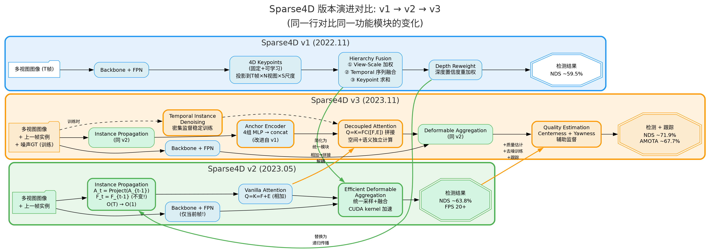

> **图注**: Sparse4D 三个版本的模块演进对比。同一行对齐的是同一功能在不同版本的变化。蓝色=v1基础设计，绿色=v2改进，橙色=v3新增。粗箭头标注了关键变化。

---

## 补充细节四: Hierarchy Feature Fusion 融合模块的版本演进

> 本节梳理 Sparse4D 融合模块从 v1 → v2 → v3 的完整演进路线，并说明最终 v3 中融合是如何处理的。

### v1: 三层递进式融合 (Hierarchy Feature Fusion)

详见 → [§1.2(b) Hierarchy Feature Fusion](#b-hierarchy-feature-fusion-三层融合)

v1 的融合是**串行的三层结构**，每层融合一个维度：

```
采样特征 f ∈ R^{K × T × N × S × C}
       │
       ▼
  ┌─────────────────────────────────────┐
  │ 第一层: View-Scale Fusion            │  对每个 keypoint、每个时间戳
  │   预测权重 W → 加权求和 (N×S → 1)    │  融合不同视图和尺度
  │   f'_{k,t} = Σ_n Σ_s W * f_{k,t,n,s}│
  └──────────────┬──────────────────────┘
                 ▼
  ┌─────────────────────────────────────┐
  │ 第二层: Temporal Fusion              │  对每个 keypoint
  │   序列化递归: 从最早帧开始             │  按时间顺序融合
  │   f''_{k,t} = Ψ([f'_{k,t}, f''_{k,t-1}])│
  └──────────────┬──────────────────────┘
                 ▼
  ┌─────────────────────────────────────┐
  │ 第三层: Keypoint Fusion              │  融合 anchor 内所有 keypoints
  │   F'_m = Σ_k f''_{m,k}             │  直接求和
  └──────────────┬──────────────────────┘
                 ▼
          实例特征 F' ∈ R^C
```

**问题**: 需要**同时访问 T 帧历史图像特征**，复杂度 O(T)，内存线性增长，时间窗口有限。

### v2: 统一采样 + 融合 (Efficient Deformable Aggregation)

详见 → [§2.4 Efficient Deformable Aggregation](#24-关键模块-efficient-deformable-aggregation) 及 [§补充细节二: 3D→2D 投影与双线性插值采样](#补充细节二-3d2d-投影与双线性插值采样)

v2 的核心改变是**把采样和融合统一为一个模块**，并实现为单个 CUDA kernel：

```
3D Keypoints → 2D 投影 → 多视图/多尺度双线性采样
                                     │
                                     ▼
                     ┌───────────────────────────────────┐
                     │ Efficient Deformable Aggregation   │
                     │ (单个 CUDA kernel)                  │
                     │                                    │
                     │  采样 + 加权融合 一步完成:           │
                     │  features = weights × sampled_feat  │
                     │  → sum over (view, scale, point)    │
                     │                                    │
                     │  v1 的三层融合 → 单步操作             │
                     │  (View-Scale + Keypoint 合并)       │
                     └──────────────┬────────────────────┘
                                    ▼
                              实例特征 F' ∈ R^C
```

**关键简化**:
- v1 的 View-Scale Fusion + Keypoint Fusion → **合并为一步分组加权求和**
- v1 的 Temporal Fusion (多帧序列融合) → **被 Recurrent Temporal Fusion 替代** (实例特征直接帧间传递，不需要从历史帧重新采样)
- 采样 + 融合 → **单个 CUDA 算子**，避免中间变量在 GPU HBM 反复读写
- 效果: 训练 GPU 内存减少 51%，推理 FPS 提升 42%

### 融合权重从何而来? (Weight Generation)

所有版本的融合权重都由**网络动态预测**，而非手动设定。权重告诉模型："对于这个实例，哪个相机视图、哪个特征尺度、哪个 keypoint 的信息更重要？"

> **核心前提**: 三个版本权重计算的**输入来源完全一致**——都是 `instance feature + anchor embedding`。区别仅在于 v1 中二者已经融为一体的，v2/v3 解耦后需要显式加回去。

#### v1 的权重生成: anchor embedding 已融入 instance feature

v1 的 View-Scale Fusion 权重公式为：

$$W_m = \Psi(F_m) \in \mathbb{R}^{K \times N \times S \times G}$$

看起来只用 $F_m$，但根据论文原文 *"instance feature $F_m$ with anchor box embedding added"*，**v1 的 $F_m$ 已经包含了 anchor embedding** ($F_m = F + E$，二者 add 后融为一体不再区分)。所以 $\Psi(F_m)$ 实际上同时利用了语义信息和空间位置信息。

#### v2/v3 的权重生成 (EDA): 解耦后显式加回 anchor embedding

v2 将 instance feature 和 anchor embedding 解耦为独立组件 (方便时序传播)，因此在计算权重时需要**显式地把 anchor embedding 加回去**：

```python
# blocks.py: DeformableFeatureAggregation._get_weights()
def _get_weights(self, instance_feature, anchor_embed, metas=None):
    # ① 特征融合: instance_feature + anchor_embed
    feature = instance_feature + anchor_embed     # (B, N_anchor, 256)

    # ② (可选) 加入相机编码
    if self.camera_encoder is not None:
        camera_embed = self.camera_encoder(
            metas["projection_mat"][:, :, :3].reshape(bs, num_cams, -1)
        )                                          # (B, N_cams, 256)
        feature = feature[:, :, None] + camera_embed[:, None]
        # → (B, N_anchor, N_cams, 256)

    # ③ 线性投影 → 权重
    weights = self.weights_fc(feature)             # → (B, N_anchor, N_cams×N_levels×N_pts×N_groups)
    .reshape(bs, num_anchor, -1, self.num_groups)  # → (B, N_anchor, N_cams×N_levels×N_pts, G)
    .softmax(dim=-2)                               # softmax over (cam×level×pts)
    .reshape(bs, num_anchor, num_cams, num_levels, num_pts, num_groups)
    # → (B, N_anchor, N_cams, N_levels, N_pts, G)
    return weights
```

**权重生成流程总结**:

```
v1: F_m (已含 anchor_embed, 二者融为一体)  ──→  Ψ(F_m)  → 权重
                                                    ↑ 输入来源 = 语义 + 空间 (混在一起)

v2/v3: instance_feature  +  anchor_embed  ──→  F + E  → Ψ(·)  → 权重
         (解耦, 各自独立)      (显式加回去)          ↑ 输入来源 = 语义 + 空间 (显式组合)
```

```
v2/v3 详细流程:
instance_feature (B, N, 256)  +  anchor_embed (B, N, 256)
                    │
                    ▼
              feature = F + E          ← 语义特征 + 空间位置信息 (显式加回)
                    │
        ┌───────────┤ (可选)
        │    + camera_embed            ← 相机内外参编码 (v3)
        │           │
        ▼           ▼
    weights_fc (Linear)                ← 单层线性投影: 256 → N_cams × N_levels × N_pts × G
                    │
                    ▼
        reshape + softmax(dim=-2)      ← 在 (cam, level, point) 维度上做 softmax 归一化
                    │                   即: 每个 group 内, 所有 (相机×尺度×点) 的权重之和 = 1
                    ▼
        weights (B, N, N_cams, N_levels, N_pts, G)
```

#### Camera Embedding: 相机参数编码

详见 → [§2.5 Camera Parameter Encoding](#25-关键改进-camera-parameter-encoding-相机参数编码)

上面流程图中 `(可选) + camera_embed` 的具体实现已在 §2.5 中详细说明，包括：编码的参数来源 (内参+外参)、4×4 矩阵取前 3 行展平为 12 维、MLP 编码为 256 维、广播相加注入权重预测，以及有无 camera_embed 的对比。

**关键细节**:

| 方面 | 说明 |
|------|------|
| **输入 (v1)** | $F_m$ (instance feature + anchor embedding **已融为一体**) |
| **输入 (v2/v3)** | `instance_feature + anchor_embed` (**解耦后显式加回**) |
| **本质** | 三个版本的输入信息**完全一致**——都是语义特征 + 空间位置编码 |
| **预测方式** | 单层线性层 `Linear(256, N_cams × N_levels × N_pts × G)` |
| **归一化** | softmax 在 (cam, level, point) 组合维度上 → 每个 group 内权重和为 1 |
| **分组机制** | 按通道分组 (G=8 组)，每组独立加权 → 不同通道组可以关注不同的 (视图, 尺度, 点) 组合 |
| **初始化** | `weights_fc` 的 weight 和 bias 都初始化为 0 → 初始时所有权重均匀分布 |
| **注意力 Dropout** | 训练时可选 `attn_drop`，随机 mask 掉部分权重，正则化 |

> **为什么解耦后还要加回去?** 解耦的目的是**方便时序传播** — 传播时只需 $F_t = F_{t-1}$ 原样传递 instance feature，$E_t = \Psi(A_t)$ 根据新 anchor 重新编码。但权重计算仍然需要空间位置信息 (anchor embedding) 来判断"这个实例在 3D 空间的哪个位置，应该看哪个相机"，所以在使用时临时加回去。

> **直觉理解**: 每个 instance 会"投票"决定——对于我当前的语义和空间位置，我更关注哪个相机拍到的、哪个尺度的特征。比如一个在车辆正前方的实例，会赋予正前方相机更高的权重；一个较小的远距离目标，会赋予高分辨率尺度更高的权重。这种动态权重机制让模型能自适应地融合多源信息。

### v3: 融合模块在 Decoupled Attention 框架中的角色

详见 → [§3.4 Decoupled Attention](#34-关键改进-decoupled-attention-解耦注意力) 及 [Deformable Aggregation 模块详细流程图](#deformable-aggregation-模块详细流程图)

v3 的融合模块本身**没有改变** — 仍然使用 v2 的 Efficient Deformable Aggregation。但融合在整体架构中的**定位**发生了变化：

```
v2: 统一注意力 (Vanilla Attention)
┌─────────────────────────────────────────┐
│ Q = K = F + E, V = F                    │
│ ↓                                       │
│ Self-Attention (统一处理实例间+图像特征)   │
│ ↓                                       │
│ Deformable Aggregation (融合图像特征)     │ ← 时序和图像特征混合在一起
└─────────────────────────────────────────┘

v3: 解耦注意力 (Decoupled Attention)
┌─────────────────────────────────────────┐
│ ① Temporal Attention (temp_gnn)          │ ← 时序交互: 实例间
│    Q = instance_feature (900实例)         │
│    K = V = temp_instance_feature (600时序)│  ← Q 和 K/V 不同源 → 实际为交叉注意力
│    (当前帧实例 → 查询上一帧传播实例)        │
│                                         │
│ ② Deformable Aggregation (Cross-Attn)   │ ← 图像特征提取: 实例↔图像
│    (与 v2 完全相同)                       │
│    采样 + 分组加权融合 → 实例特征更新       │
│                                         │
│ ③ FFN                                    │
│                                         │
│ ④ Refinement                             │
└─────────────────────────────────────────┘
```

**v3 的关键洞察**: 融合模块 (EDA) 不变，但它的功能被明确定位为 **Cross-Attention**（实例与图像特征之间的交叉注意力），而时序交互被分离到独立的 Temporal Attention 分支（代码中 `temp_gnn`，论文称 "Temporal Self-Attention"，实际为交叉注意力 — Q 来自当前帧实例，K/V 来自上一帧时序实例）。这样两个分支各司其职，避免了 v2 中时序信号和图像信号混合导致的注意力异常。

### 融合模块演进总结

| 方面 | v1 (2022.11) | v2 (2023.05) | v3 (2023.11) |
|------|-------------|-------------|-------------|
| **融合结构** | 三层串行: View-Scale → Temporal → Keypoint | 统一步骤: 分组加权求和 | 同 v2 (EDA 不变) |
| **时序融合** | 并行采样多帧历史图像，序列化递归融合 | 递归式帧间传递，不需从历史帧采样 | 同 v2，但分离到独立 Self-Attention |
| **View/Scale 融合** | 预测权重 + 分组加权求和 | 同 v1 但合并为 CUDA kernel | 同 v2 |
| **Keypoint 融合** | 直接求和 | 合并到统一的加权求和中 | 同 v2 |
| **CUDA 加速** | 无 | ✅ 单个 CUDA kernel | 同 v2 |
| **架构定位** | Decoder 中独立模块 | Decoder 中独立模块 | Decoupled Attention 中的 Cross-Attention 分支 |
| **复杂度** | O(T) 每帧 | O(1) 每帧 | O(1) 每帧 |

> **一句话总结**: v1 的三层串行融合 → v2 统一为单步 Efficient Deformable Aggregation (EDA) → v3 保持 EDA 不变但将其明确定位为 Decoupled Attention 框架中的 Cross-Attention 分支，时序交互分离到独立的 Temporal Attention (temp_gnn) 分支。

---

## 补充细节五: Sparse4D v3 Tracking 流程详解

> 本节详细说明 Sparse4D v3 的端到端跟踪流程，包括 ID 生成与保存机制，并与传统基于 Transformer/Query 的跟踪方法 (MOTR, MUTR3D, TrackFormer 等) 进行对比。

### Sparse4D v3 跟踪流程图

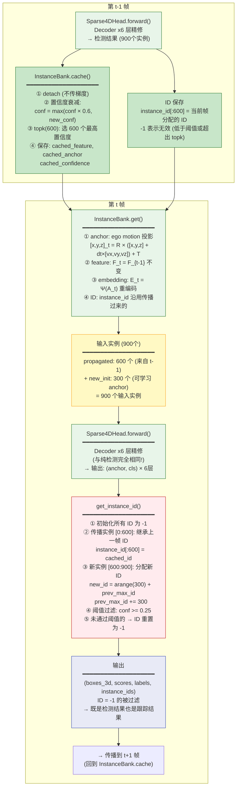
```mermaid
flowchart TB
    subgraph frame_t1["第 t-1 帧"]
        A1["Sparse4DHead.forward()
Decoder x6 层精修
→ 检测结果 (900个实例)"]
        A1 --> B1["InstanceBank.cache()
━━━━━━━━━━━━━━━━━━━━
① detach (不传梯度)
② 置信度衰减:
  conf = max(conf × 0.6, new_conf)
③ topk(600): 选 600 个最高置信度
④ 保存: cached_feature, cached_anchor
   cached_confidence"]
        A1 --> C1["ID 保存
instance_id[:600] = 当前帧分配的 ID
-1 表示无效 (低于阈值或超出 topk)"]
    end

    subgraph frame_t["第 t 帧"]
        B1 --> D1["InstanceBank.get()
━━━━━━━━━━━━━━━━━━━━
① anchor: ego motion 投影
  [x,y,z]_t = R × ([x,y,z] + dt×[vx,vy,vz]) + T
② feature: F_t = F_{t-1} 不变
③ embedding: E_t = Ψ(A_t) 重编码
④ ID: instance_id 沿用传播过来的"]
        C1 --> D1

        D1 --> E1["输入实例 (900个)
━━━━━━━━━━━━━━━━━━━━
propagated: 600 个 (来自 t-1)
+ new_init: 300 个 (可学习 anchor)
= 900 个输入实例"]

        E1 --> F1["Sparse4DHead.forward()
━━━━━━━━━━━━━━━━━━━━
Decoder x6 层精修
(与纯检测完全相同!)
→ 输出: (anchor, cls) × 6层"]

        F1 --> G1["get_instance_id()
━━━━━━━━━━━━━━━━━━━━
① 初始化所有 ID 为 -1
② 传播实例 [0:600]: 继承上一帧 ID
   instance_id[:600] = cached_id
③ 新实例 [600:900]: 分配新 ID
   new_id = arange(300) + prev_max_id
   prev_max_id += 300
④ 阈值过滤: conf >= 0.25
⑤ 未通过阈值的 → ID 重置为 -1"]

        G1 --> H1["输出
━━━━━━━━━━━━━━━━━━━━
(boxes_3d, scores, labels, instance_ids)
ID = -1 的被过滤
→ 既是检测结果也是跟踪结果"]

        H1 --> B2["→ 传播到 t+1 帧
(回到 InstanceBank.cache)"]
    end

    style A1 fill:#E8F5E9,stroke:#2E7D32
    style B1 fill:#C8E6C9,stroke:#2E7D32
    style C1 fill:#C8E6C9,stroke:#2E7D32
    style D1 fill:#E8F5E9,stroke:#2E7D32
    style E1 fill:#FFF9C4,stroke:#F9A825
    style F1 fill:#E8F5E9,stroke:#2E7D32
    style G1 fill:#FFEBEE,stroke:#C62828
    style H1 fill:#E8EAF6,stroke:#3F51B5
```

### 跟踪流程详细说明

#### Step 1: 第 t-1 帧检测完成后的缓存 (InstanceBank.cache)

在第 t-1 帧的 Decoder 精修完成后，`InstanceBank.cache()` 方法负责将实例信息保存以供下一帧使用：

```python
# instance_bank.py: cache()
def cache(self, instance_feature, anchor, confidence, metas=None, feature_maps=None):
    instance_feature = instance_feature.detach()  # ① detach: 不传梯度
    anchor = anchor.detach()
    confidence = confidence.detach()
    
    confidence = confidence.max(dim=-1).values.sigmoid()  # 取最大类别置信度 + sigmoid
    
    # ② 置信度衰减: 对上一帧传播过来的实例
    if self.confidence is not None:
        confidence[:, :self.num_temp_instances] = torch.maximum(
            self.confidence * self.confidence_decay,  # 0.6 衰减
            confidence[:, :self.num_temp_instances],   # 与新预测值取最大
        )
    
    # ③ topk(600): 选置信度最高的 600 个
    self.confidence, (self.cached_feature, self.cached_anchor) = topk(
        confidence, self.num_temp_instances, instance_feature, anchor
    )
```

**关键细节**:
- **置信度衰减机制**: 上一帧传播过来的实例 (前 600 个)，其缓存置信度取 `max(旧置信度 × 0.6, 新置信度)`。这确保即使模型暂时对某个实例的置信度降低（如遮挡），只要衰减后仍高于阈值，该实例不会立即被丢弃
- **topk 选择**: 从全部 900 个实例中选置信度最高的 600 个进行传播，丢弃低置信度的
- **detach**: 所有传播的 tensor 都 detach，不回传梯度到上一帧

#### Step 2: ID 的保存与传递

```python
# ID 保存逻辑 (伪代码, 基于 Sparse4D v3 论文 Algorithm 1)
instance_id = torch.full((batch, 900), -1, dtype=torch.long)

# 传播实例: 继承上一帧的 ID
instance_id[:, :600] = cached_instance_id  # 前600个来自上一帧

# 新实例: 分配新的唯一 ID
new_start_id = prev_max_id + 1
instance_id[:, 600:] = torch.arange(300) + new_start_id
prev_max_id = new_start_id + 300 - 1
```

**ID 生成规则**:
- **传播实例 (前 600 个)**: 直接沿用上一帧分配的 ID，保持目标身份不变
- **新初始化实例 (后 300 个)**: 从全局计数器 `prev_max_id` 开始递增分配新 ID
- **无效 ID**: 值为 -1，表示该实例未被激活或低于置信度阈值

#### Step 3: 第 t 帧的实例准备 (InstanceBank.get)

```python
# instance_bank.py: get()
def get(self, batch_size, metas=None):
    # 可学习 anchor: 300 个，每帧初始化
    instance_feature = torch.tile(self.instance_feature[None], (batch_size, 1, 1))
    anchor = torch.tile(self.anchor[None], (batch_size, 1, 1))
    
    # 传播实例: ego motion 投影
    if self.cached_anchor is not None:
        # 计算 t-1 → t 的变换矩阵
        T_temp2cur = cached_anchor.new_tensor([
            x["T_global_inv"] @ metas["img_metas"][i]["T_global"]
            for i, x in enumerate(metas["img_metas"])
        ])
        # anchor 投影: 位置、朝向、速度做 ego motion 变换
        self.cached_anchor = self.anchor_handler.anchor_projection(
            self.cached_anchor, [T_temp2cur], ...)
        # feature 不变: F_t = F_{t-1}
        # time_interval 用于速度补偿
```

**关键**: 传播过来的 600 个实例 + 新初始化的 300 个 = 900 个实例共同进入 Decoder 精修。前 600 个已经携带了历史帧的信息（特征直接传递），后 300 个是全新的。

#### Step 4: Decoder 精修 (与纯检测完全相同)

Decoder 的 6 层精修过程**不区分传播实例和新实例**，所有 900 个实例统一处理：

```
每层 Decoder:
  ① Temporal Attention (temp_gnn): 当前实例 → 查询历史时序实例 (交叉注意力, Q≠K/V)
  ② Deformable Aggregation: 所有实例从图像特征采样 + 融合
  ③ FFN: 特征变换
  ④ Refinement: anchor 残差更新 + 分类预测
```

> **核心洞察**: Sparse4D v3 的跟踪能力**完全来自时序传播机制本身** — 因为每个传播实例天然携带了它在上一帧的身份信息（通过特征传递），Decoder 只需要做检测精修，不需要任何额外的跟踪模块。

#### Step 5: 推理时的 ID 分配与输出

推理完成后，根据置信度阈值和 ID 状态生成最终跟踪结果：

```python
# 推理时 ID 分配 (伪代码, 基于 Algorithm 1)
for i in range(900):
    if confidence[i] >= 0.25:  # 阈值过滤
        if i >= 600 or instance_id[i] == -1:
            # 新出现的目标 → 分配新 ID
            instance_id[i] = prev_max_id
            prev_max_id += 1
        # 将 (confidence, anchor, instance_id) 加入输出
        output.append(...)
    # ID = -1 的被过滤掉
```

**置信度衰减的传播实例**: 对于来自上一帧的传播实例 (前 600 个)，如果当前帧的检测置信度低于阈值，但上一帧的衰减置信度 `conf_{t-1} × 0.6` 仍高于阈值，则取衰减值作为最终置信度，保持 ID 不丢失。这使得短暂遮挡或漏检的目标仍能被跟踪。

### ID 生命周期示意

```
帧 1:  [实例A conf=0.9 id=1] [实例B conf=0.8 id=2] [实例C conf=0.3 id=-1(过滤)]
                ↓ cache (topk 2)                 ↓
帧 2:  [实例A conf=0.85 id=1] [实例B conf=0.7 id=2] [新实例D conf=0.6 id=3]
                 ↓ 衰减: max(0.85×0.6, 0.5)=0.51  ↓
帧 3:  [实例A conf=0.5 id=1] [新实例E conf=0.8 id=4] [实例B conf=0.2 id=-1(低于阈值, 丢失)]
       ↑ 衰减后仍≥0.25, 保持跟踪                  ↑ B 的 ID=2 被回收, 不再传播

关键参数:
- 置信度阈值 T = 0.25 (输出过滤)
- 衰减系数 S = 0.6 (传播选择)
- 传播数量 = 600 (topk)
- 新初始化数量 = 300
```

---

### 传统 Query-based Tracking 流程 (MOTR / MUTR3D / TrackFormer)

为了更好地理解 Sparse4D v3 跟踪的独特性，下面梳理传统基于 Transformer/Query 的跟踪方法的核心流程。

#### 传统 Query-based Tracking 流程图

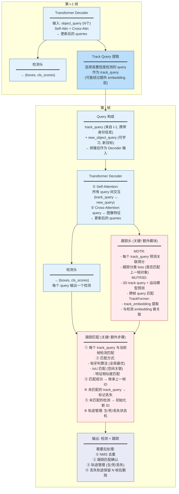
```mermaid
flowchart TB
    subgraph frame_t1_trad["第 t-1 帧"]
        TA1["Transformer Decoder
━━━━━━━━━━━━━━━━━━━━
输入: object_query (N个)
Self-Attn + Cross-Attn
→ 更新后的 queries"]
        TA1 --> TB1["检测头
━━━━━━━━━━━━━━━━━━━━
→ (boxes, cls_scores)"]
        TA1 --> TC1["Track Query 提取
━━━━━━━━━━━━━━━━━━━━
选择高置信度检测的 query
作为 track_query
(可能经过额外 embedding 层)"]
    end

    subgraph frame_t_trad["第 t 帧"]
        TC1 --> TD1["Query 构成
━━━━━━━━━━━━━━━━━━━━
track_query (来自 t-1, 携带身份信息)
+ new_object_query (可学习, 新目标)
→ 拼接后作为 Decoder 输入"]

        TD1 --> TE1["Transformer Decoder
━━━━━━━━━━━━━━━━━━━━
① Self-Attention:
  所有 query 间交互
  (track_query ↔ new_query)
② Cross-Attention:
  query ↔ 图像特征
→ 更新后的 queries"]

        TE1 --> TF1["检测头
━━━━━━━━━━━━━━━━━━━━
→ (boxes, cls_scores)
每个 query 输出一个检测"]

        TE1 --> TG1["跟踪头 (关键! 额外模块)
━━━━━━━━━━━━━━━━━━━━
MOTR:
  - 每个 track_query 预测关联得分
  - 跟踪分类 loss (是否匹配上一帧对象)
MUTR3D:
  - 3D track query + 运动模型预测
  - 跨帧 query 匹配
TrackFormer:
  - track_embedding 提取
  - 与检测 embedding 做关联"]

        TF1 --> TH1["跟踪匹配 (关键! 额外步骤)
━━━━━━━━━━━━━━━━━━━━
① 每个 track_query 与当前帧检测匹配
② 匹配方式:
  - 匈牙利算法 (全局最优)
  - IoU 匹配 (空间关联)
  - 特征相似度匹配
③ 匹配成功 → 继承上一帧 ID
④ 未匹配的 track_query → 标记丢失
⑤ 未匹配的检测 → 初始化新 ID
⑥ 轨迹管理: 生/死/丢失状态机"]

        TG1 --> TH1

        TH1 --> TI1["输出: 检测 + 跟踪
━━━━━━━━━━━━━━━━━━━━
需要后处理:
① NMS 去重
② 跟踪匹配确认
③ 轨迹管理 (生/死/丢失)
④ 丢失轨迹保留 N 帧后删除"]
    end

    style TA1 fill:#E3F2FD,stroke:#1565C0
    style TB1 fill:#E3F2FD,stroke:#1565C0
    style TC1 fill:#BBDEFB,stroke:#1565C0
    style TD1 fill:#E3F2FD,stroke:#1565C0
    style TE1 fill:#E3F2FD,stroke:#1565C0
    style TF1 fill:#E3F2FD,stroke:#1565C0
    style TG1 fill:#FFEBEE,stroke:#C62828
    style TH1 fill:#FFEBEE,stroke:#C62828
    style TI1 fill:#E8EAF6,stroke:#3F51B5
```

#### 传统方法的关键特征

| 方法 | 跟踪头设计 | 跟踪 Loss | 匹配机制 | 需要微调 |
|------|-----------|----------|---------|---------|
| **MOTR** | track_query → 关联得分 | ID 分类 loss + 跟踪 loss | 匈牙利匹配 (query-object) | ✅ 需要跟踪数据微调 |
| **MUTR3D** | 3D track query + 运动模型 | 跨帧关联 loss | 3D 空间匹配 | ✅ 需要跟踪数据微调 |
| **TrackFormer** | track_embedding 提取器 | 关联分类 loss | Transformer attention 隐式匹配 | ✅ 需要跟踪数据微调 |

**共同特点**: 都需要**额外的跟踪头** (额外的网络参数) 和**显式的跟踪损失函数** (需要跟踪标注数据) 来训练跟踪能力。

---

### Sparse4D v3 vs 传统 Query-based Tracking 对比

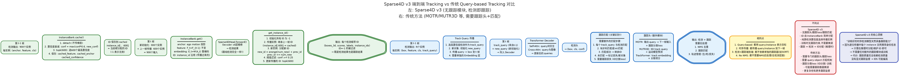

> **图注**: Sparse4D v3 端到端跟踪 (左) 与传统 Query-based 跟踪 (右) 的完整流程对比。

#### 相同点

| 方面 | Sparse4D v3 | 传统方法 |
|------|------------|---------|
| **Query-based 表示** | 用 instance (anchor + feature) 表示目标 | 用 object query 表示目标 |
| **时序传播** | 传播 instance 到下一帧 | 传播 track_query 到下一帧 |
| **检测+跟踪端到端** | 在同一个模型中完成 | 在同一个模型中完成 |
| **无需单独跟踪器** | 不依赖 SORT/DeepSORT 等外部跟踪器 | 同样不依赖外部跟踪器 |

#### 核心不同点

| 方面 | Sparse4D v3 | 传统方法 (MOTR/MUTR3D) |
|------|------------|----------------------|
| **跟踪头** | ❌ 无 | ✅ 需要专门的跟踪头 (额外参数) |
| **跟踪 Loss** | ❌ 无 | ✅ 需要显式跟踪损失 (ID分类/关联loss) |
| **跟踪匹配** | ❌ 无 (ID 直接分配) | ✅ 需要匈牙利匹配或 IoU 匹配 |
| **训练微调** | ❌ 不需要, 检测模型直接跟踪 | ✅ 需要跟踪数据微调 |
| **ID 分配方式** | InstanceBank 简单递增分配 | 匹配成功继承/失败新建 |
| **置信度选择** | 纯靠检测置信度 + 衰减 | 跟踪头预测关联分数 |
| **后处理** | 无 (阈值过滤即可) | 可能需要 NMS + 轨迹管理 |
| **跟踪质量依赖** | 完全依赖检测质量 | 有显式跟踪监督, 更鲁棒 |

#### Sparse4D v3 跟踪的核心洞察

> **"训练好的时序检测模型天然具备跟踪能力"**

Sparse4D v3 的核心思想是：由于递归时序传播中每个 instance 天然携带了身份信息（通过 instance feature 的帧间传递），模型已经学会了区分不同目标。因此只需要在**推理时**简单地分配和维护 ID，就能实现跟踪。

**优势**:
- 零额外参数、零额外训练、零额外推理开销
- 检测和跟踪完全一体化

**代价**:
- 跟踪质量完全依赖检测质量，没有显式跟踪监督 → ID Switch (IDS) 可能偏高
- 对遮挡/长时间丢失的目标处理能力有限 (仅靠置信度衰减维持)
- 无法利用跟踪标注数据进一步提升跟踪性能

---

## Sparse4D v3 完整算法流程图

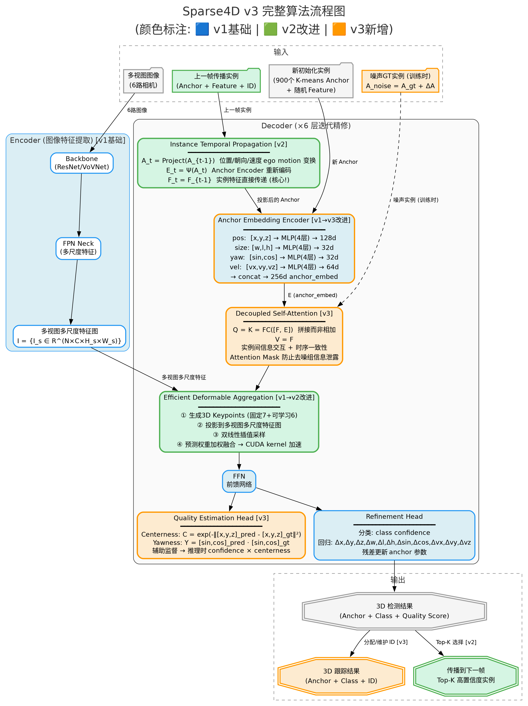

> **图注**: Sparse4D v3 最终状态的完整算法流程。颜色标注每个模块的来源版本: 🟦 蓝色=v1基础模块, 🟩 绿色=v2改进, 🟧 橙色=v3新增。Decoder 内 6 层迭代精修，每层依次执行: Instance Propagation → Anchor Encoding → Decoupled Self-Attention → Deformable Aggregation → FFN → Quality Estimation + Refinement。

## Deformable Aggregation 模块详细流程图

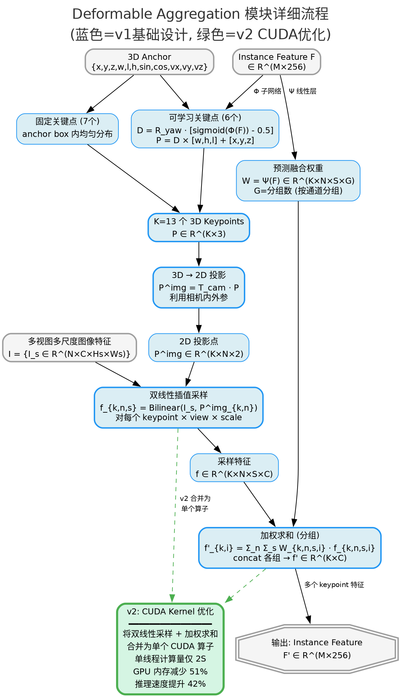

> **图注**: Deformable Aggregation 模块内部流程。展示从 3D Keypoint 生成 → 2D 投影 → 双线性插值采样 → 分组加权融合的完整过程，以及 v2 中 CUDA kernel 优化的位置。

```
v1 (2022.11)                           v2 (2023.05)                           v3 (2023.11)
==========================             ==========================             ==========================
Sparse 4D Sampling                     Efficient Deformable Aggregation        Decoupled Attention
  ├─ 多视图/多尺度/多时间戳采样           ├─ 统一采样+融合模块                    ├─ 时序注意力 (temp_gnn) + 交叉注意力 (EDA)
  └─ 并行采样                            └─ CUDA kernel 加速                    └─ 更有效的特征学习

Hierarchy Feature Fusion                Recurrent Temporal Fusion               Temporal Instance Denoising
  ├─ View-Scale Fusion                   ├─ O(T) → O(1) 复杂度                 ├─ 密集监督信号
  ├─ Temporal Fusion                     ├─ 无限时间窗口                        └─ 稳定训练过程
  └─ Keypoint Fusion                     └─ 帧间稀疏特征传递

Depth Reweight                          Instance Propagation                   Quality Estimation
  └─ 实例级深度权重                       └─ 帧间实例传播+特征携带               └─ IoU预测辅助头

                                                                               End-to-End Tracking
                                                                                 ├─ 实例ID分配
                                                                                 └─ 无需单独跟踪器

性能: ~59.5% NDS                       性能: ~63.8% NDS                       性能: ~71.9% NDS
```

## 贯穿所有版本的核心设计原则

<!-- TODO: 补充你对这些原则的理解 -->

1. **稀疏范式**: 始终不构建稠密 BEV 特征，只在稀疏实例级别操作
2. **3D Anchor-based**: 使用通过 k-means 初始化的 3D anchor boxes，迭代精修
3. **可变形特征采样**: 在投影的 3D keypoint 位置采样图像特征 (非全局注意力)
4. **时序融合**: 利用历史帧信息提升检测
5. **无需 NMS**: 稀疏集合预测，不需要后处理 NMS

---

# 五、参考资料

- [Sparse4D v1 Paper](https://arxiv.org/abs/2211.10581)
- [Sparse4D v2 Paper](https://arxiv.org/abs/2305.14018)
- [Sparse4D v3 Paper](https://arxiv.org/abs/2311.11722)
- [GitHub: linxuewu/Sparse4D](https://github.com/linxuewu/Sparse4D) (v1 & v2 code)
- [GitHub: HorizonRobotics/Sparse4D](https://github.com/HorizonRobotics/Sparse4D) (unified code, v3)
- [SparseDrive](https://github.com/MrSnake/SparseDrive) (后续工作: 端到端规划)
