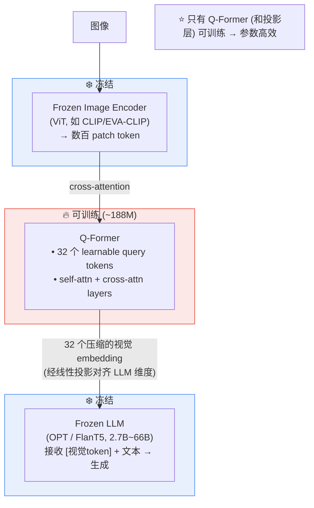
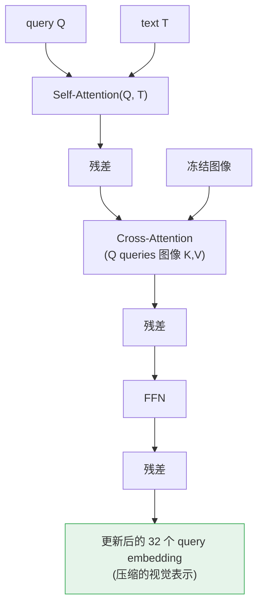
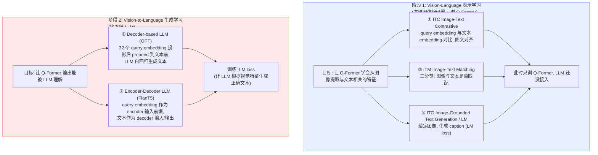
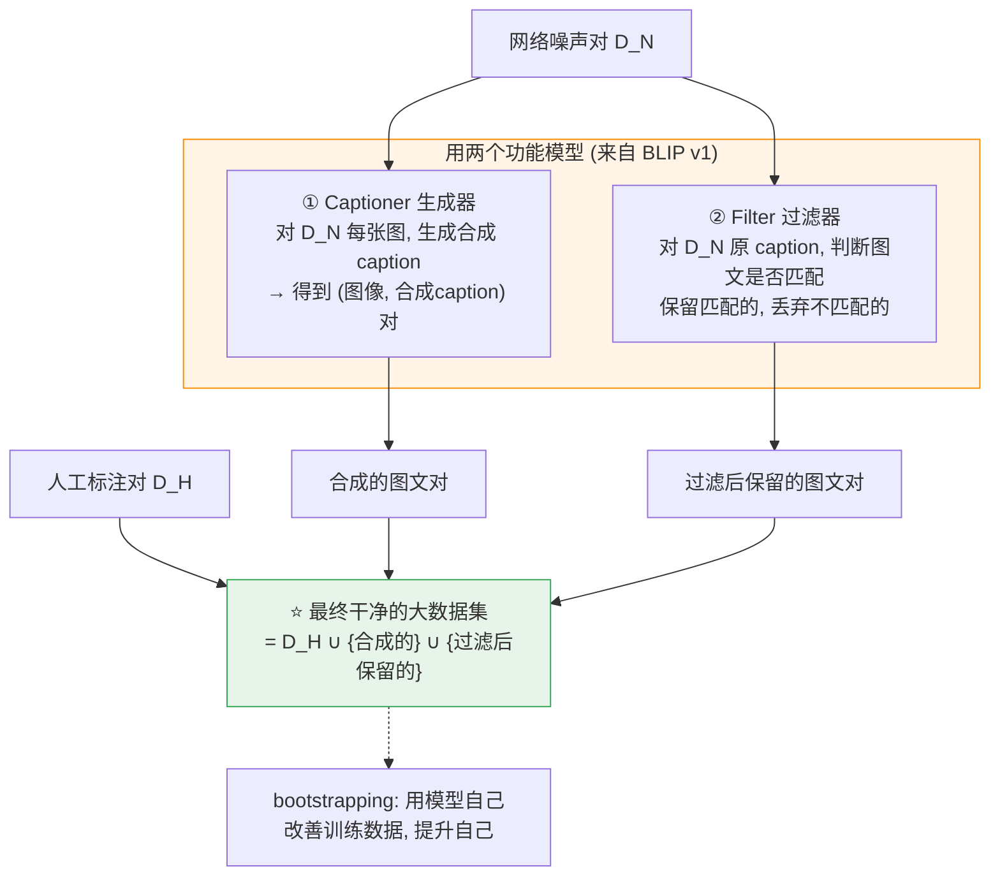

# 论文信息

- **标题**: BLIP-2: Bootstrapping Language-Image Pre-training with Frozen Image Encoders and Large Language Models
- **作者**: Junnan Li, Dongxu Li, Silvio Savarese, Steven Hoi
- **机构**: Salesforce Research
- **发表**: ICML 2023
- **arXiv**: [2301.12597](https://arxiv.org/abs/2301.12597)
- **代码**: [github.com/salesforce/LAVIS](https://github.com/salesforce/LAVIS)

> **一句话总结**: 训练大型多模态模型端到端算力爆炸——BLIP-2 的解法是**冻结现成的视觉编码器和冻结 LLM，只训练一个轻量的桥接模块 Q-Former**。Q-Former 用一组可学习 query 通过 cross-attention 从冻结图像编码器里"提取"出与文本最相关的少量视觉特征，再喂给冻结 LLM 生成文本。两阶段预训练 + 用模型自身生成字幕清洗噪声数据（CapFilt）。BLIP-2 用极小可训练参数量达到 SOTA，是 VLM "冻结大模型 + 桥接" 范式的代表（guideline VLM 核心三件套之一）。

---

# 1. 背景与动机

## 1.1 端到端训练大 VLM 的算力困境

```
现状 (BLIP-2 之前):
  想训练强大的多模态模型 → 需要把视觉编码器 + LLM 一起从零/继续训
  
  问题:
  ① 算力爆炸: 视觉 + 语言两个大模型联合训练, 显存/时间巨大
  ② 数据效率低: 端到端要海量高质量图文对
  ③ 浪费已有能力: 
     强大的 ViT (CLIP 训的) 和强大的 LLM (OPT/FlanT5) 已经存在
     端到端再训它们 = 重复造轮子 + 易过拟合

BLIP-2 的提问:
  能否复用冻结的视觉编码器 + 冻结的 LLM,
  只训练一个轻量模块把它们连起来?
```

## 1.2 关键挑战：视觉特征太多，LLM 难消化

```
直接把冻结 ViT 的输出喂给冻结 LLM 的问题:
  ViT 输出 = 数百~数千个 patch token (如 257 / 1024 个)
  → 全部塞进 LLM 前端, 计算/显存开销巨大
  → 且很多 patch token 对文本任务是冗余的 (背景 patch)

BLIP-2 的方案: Q-Former
  用一组可学习的 query token (如 32 个)
  通过 cross-attention 从冻结 ViT 提取 "最相关" 的少量视觉特征
  → 把 1024 个 patch 压缩成 32 个高信息量 token → 喂给 LLM
```

---

# 2. 方法

## 2.1 整体架构：冻结双塔 + Q-Former 桥



## 2.2 Q-Former 结构详解（核心模块）

Q-Former = Querying Transformer, 结构类似 BERT:

输入两类 token:
- ① 可学习 Query Tokens: $Q \in \mathbb{R}^{32 \times D}$（固定数量, 随机初始化）
- ② 文本 Tokens: $T$（输入的文本, 如 caption/问题）

Transformer 层（如 12 层）, 每层含:
- **Self-Attention**: query tokens 之间 + query 与文本 token 交互
- **Cross-Attention**: query tokens 从冻结图像编码器提取视觉特征
  （只有 query tokens 做 cross-attn 的 query, 图像 patch 是 key/value）
- **FFN**



关键: 32 个 query token 学会 "提问" 冻结图像编码器, 提取出对下游文本任务最有用的视觉信息。

### 2.2.1 官方代码：Q-Former 结构（`Blip2Base.init_Qformer` + `Blip2Qformer`）

> 来源：[`lavis/models/blip2_models/blip2.py`](https://github.com/salesforce/LAVIS/blob/main/lavis/models/blip2_models/blip2.py)、[`blip2_qformer.py`](https://github.com/salesforce/LAVIS/blob/main/lavis/models/blip2_models/blip2_qformer.py)。Q-Former 复用 BERT 结构，关键设计是：① 一组可学习的 `query_tokens`；② 每隔 `cross_attention_freq` 层插一层 cross-attention（query 作 Q，冻结图像特征作 K/V）。

**① 构造 Q-Former 与可学习 query tokens**（`Blip2Base.init_Qformer`，BERT 派生 + 插 cross-attn）：

```python
@classmethod
def init_Qformer(cls, num_query_token, vision_width, cross_attention_freq=2):
    # 基于 bert-base-uncased 的配置构造 Q-Former
    encoder_config = BertConfig.from_pretrained("bert-base-uncased")
    encoder_config.encoder_width = vision_width          # cross-attn 的 K/V 维度 = 冻结 ViT 输出维度
    # 关键设计：每隔 cross_attention_freq 层插一层 cross-attention
    encoder_config.add_cross_attention = True            # 开启 cross-attention（BERT 默认无）
    encoder_config.cross_attention_freq = cross_attention_freq   # 默认每 2 层插 1 层
    encoder_config.query_length = num_query_token        # 可学习 query 数量（论文用 32）
    Qformer = BertLMHeadModel.from_pretrained(
        "bert-base-uncased", config=encoder_config
    )
    # ⭐ 核心：32 个可学习 query tokens（nn.Parameter，随模型一起训练）
    query_tokens = nn.Parameter(
        torch.zeros(1, num_query_token, encoder_config.hidden_size)
    )
    query_tokens.data.normal_(mean=0.0, std=encoder_config.initializer_range)   # 正态初始化
    return Qformer, query_tokens
```

**② Q-Former 前向：query 对冻结图像特征做 cross-attention**（`Blip2Qformer.forward` 中 ITC 部分的特征提取）：

```python
def forward(self, samples):
    image = samples["image"]
    # ① 冻结 ViT 出图像 patch 特征（数百~上千 token）
    image_embeds = self.ln_vision(self.visual_encoder(image))
    image_atts = torch.ones(image_embeds.size()[:-1], dtype=torch.long).to(image.device)

    # ② 把 32 个 query_tokens 沿 batch 维 expand（每张图共享同一组可学习 query）
    query_tokens = self.query_tokens.expand(image_embeds.shape[0], -1, -1)

    # ③ Q-Former 推理：query_tokens 作序列输入，冻结图像特征作 cross-attn 的 encoder_hidden_states
    #    BERT 内部：query 之间 self-attn + query 对图像 cross-attn → 输出 32 个"压缩后的视觉 embedding"
    query_output = self.Qformer.bert(
        query_embeds=query_tokens,                       # query 序列（自注意力对象）
        encoder_hidden_states=image_embeds,              # 冻结图像特征（cross-attn 的 K/V）
        encoder_attention_mask=image_atts,
        use_cache=True,
        return_dict=True,
    )

    # ④ 投影到对比学习空间（ITC 损失用），保留 32 个 query 的全部 embedding
    image_feats = F.normalize(self.vision_proj(query_output.last_hidden_state), dim=-1)
    # ...
```

可以看到，Q-Former 的精髓就一句话：**冻结图像特征只作为 cross-attention 的 K/V，可学习的 32 个 query 通过"提问"把上千 patch 压缩成 32 个高信息量 token**——既解决了"视觉 token 太多"的瓶颈，又把"该提取什么"这个自由度交给可学习 query。

## 2.3 两阶段预训练



**阶段 1 三个子任务的损失函数：**

- **ITC（Image-Text Contrastive）**：query embedding $s_i$ 与文本 embedding $t_i$ 做对比，其中 $\tau$ 为可学习温度系数：

$$L_{\text{ITC}}=-\frac{1}{N}\sum_{i}\log\frac{\exp(\langle s_i,t_i\rangle/\tau)}{\sum_{j}\exp(\langle s_i,t_j\rangle/\tau)}$$

- **ITM（Image-Text Matching）**：二分类交叉熵，$y_i\in\{0,1\}$ 为是否匹配的标签，$p_i$ 为预测匹配概率：

$$L_{\text{ITM}}=-\sum_{i}\Big[y_i\log p_i+(1-y_i)\log(1-p_i)\Big]$$

- **ITG / LM（Image-Grounded Text Generation）**：给定图像生成文本的自回归语言建模损失，目标 token 序列为 $y_{1:T}$：

$$L_{\text{LM}}=-\sum_{t=1}^{T}\log P(y_t\mid y_{<t},\,V;\theta)$$

其中 $V$ 为 Q-Former 提取的视觉特征。

**阶段 2 的生成损失** 同样为 LM 形式：让冻结 LLM 根据 Q-Former 输出的视觉特征 $\hat{V}$ 生成正确文本：

$$L_{\text{gen}}=-\sum_{t=1}^{T}\log P_{\text{LLM}}(y_t\mid y_{<t},\,\hat{V})$$

### 2.3.1 官方代码：Q-Former 如何接冻结 LLM（`Blip2T5Instruct`）

> 来源：[`lavis/models/blip2_models/blip2_t5_instruct.py`](https://github.com/salesforce/LAVIS/blob/main/lavis/models/blip2_models/blip2_t5_instruct.py)（OPT 版 `blip2_opt.py` 思路一致）。这里是 BLIP-2 "阶段 2" 的核心：**只训 Q-Former + 一个线性投影层，冻结 ViT 和整个 LLM**。Q-Former 输出的 32 个视觉 token 经 `llm_proj` 投影到 LLM 隐层维度后，prepend（拼接）到文本 embedding 序列最前面，再喂给冻结 LLM。

**① 冻结 ViT 与冻结 LLM，只留 Q-Former + 投影层可训练**（`Blip2T5Instruct.__init__` 的关键冻结逻辑）：

```python
def __init__(self, ...):
    super().__init__()
    # —— 冻结视觉编码器（参数不参与训练，eval 模式）——
    self.visual_encoder, self.ln_vision = self.init_vision_encoder(...)
    if freeze_vit:
        for name, param in self.visual_encoder.named_parameters():
            param.requires_grad = False              # ❄️ ViT 全部冻结
        self.visual_encoder = self.visual_encoder.eval()
        self.visual_encoder.train = disabled_train    # 屏蔽 train()，彻底锁死

    # —— Q-Former + 可学习 query tokens（🔥 可训练）——
    self.Qformer, self.query_tokens = self.init_Qformer(
        num_query_token, self.visual_encoder.num_features
    )

    # —— 加载并冻结整个 LLM（T5 / OPT）——
    self.t5_model = T5ForConditionalGeneration.from_pretrained(t5_model, config=t5_config)
    for name, param in self.t5_model.named_parameters():
        param.requires_grad = False                   # ❄️ LLM 全部冻结
        param.data = param.data.bfloat16()

    # 🔥 唯一的"桥"：把 Q-Former 隐层维度 → LLM 隐层维度（可训练线性投影 = llm_proj）
    self.t5_proj = nn.Linear(
        self.Qformer.config.hidden_size, self.t5_model.config.hidden_size
    )
```

**② forward：Q-Former 输出 → `llm_proj` 投影 → prepend 到 LLM 输入**（删除 few-shot / OCR 等无关分支）：

```python
def forward(self, samples):
    image = samples["image"]
    with self.maybe_autocast():
        image_embeds = self.ln_vision(self.visual_encoder(image))   # 冻结 ViT → 数百 patch token
    image_atts = torch.ones(image_embeds.size()[:-1], dtype=torch.long).to(image.device)

    query_tokens = self.query_tokens.expand(image_embeds.shape[0], -1, -1)   # 32 个可学习 query

    # ① Q-Former：query 对冻结图像特征做 cross-attention → 32 个压缩视觉 embedding
    query_output = self.Qformer.bert(
        query_embeds=query_tokens,
        encoder_hidden_states=image_embeds,           # 冻结图像特征作 cross-attn 的 K/V
        encoder_attention_mask=image_atts,
        return_dict=True,
    )

    # ② ⭐ llm_proj 投影：把 Q-Former 隐层维度对齐到冻结 LLM 隐层维度（只取 32 个 query 的输出）
    inputs_t5 = self.t5_proj(query_output.last_hidden_state[:, : query_tokens.size(1), :])
    atts_t5 = torch.ones(inputs_t5.size()[:-1], dtype=torch.long).to(image.device)

    with self.maybe_autocast(dtype=torch.bfloat16):
        # ③ 文本（prompt/问题）经 LLM 自己的 embedding 层 → embedding
        input_tokens = self.t5_tokenizer(samples["text_input"], ...).to(image.device)
        inputs_embeds = self.t5_model.encoder.embed_tokens(input_tokens.input_ids)

        # ④ ⭐ prepend：[32 个视觉 token] 拼到 [文本 token] 前面 → 作为 LLM encoder 输入
        inputs_embeds = torch.cat([inputs_t5, inputs_embeds], dim=1)
        encoder_atts = torch.cat([atts_t5, input_tokens.attention_mask], dim=1)

        # ⑤ 冻结 LLM 前向，算 LM loss（让 LLM 根据视觉特征生成正确文本）
        outputs = self.t5_model(
            inputs_embeds=inputs_embeds,
            attention_mask=encoder_atts,
            decoder_attention_mask=output_tokens.attention_mask,
            return_dict=True,
            labels=targets,                          # pad 位置 mask 为 -100
        )
        return {"loss": outputs.loss}
```

可以看到阶段 2 的精髓就是两步：**用 `llm_proj` 把 Q-Former 的 32 个视觉 embedding 投到 LLM 维度，再 cat 到文本 embedding 前面**——梯度只回传到 Q-Former 和 `llm_proj`，ViT 与 LLM 始终冻结。这也是 LLaVA 后来"用 MLP 直接接 LLM"思路的更早期、更显式信息瓶颈版本。

## 2.4 CapFilt：用模型清洗噪声数据

动机: 网络图文对噪声高 (alt-text 不准)，高质量人工标注数据（如 CC3M/COCO）量少。

CapFilt (Captioning + Filtering): 用 BLIP 第一阶段模型清洗数据。



---

# 3. 实验

## 3.1 主要结果

```
BLIP-2 在多个 VLM 任务上达 SOTA, 且训练高效:

  ① Image Captioning (COCO, NoCaps): 大幅领先
  ② VQA (VQAv2, OK-VQA, GQA): SOTA
  ③ 图文检索 (Flickr30k, COCO): 强
  ④ Zero-shot 图文检索 + 视觉问答
  
  关键: 
    训练成本远低于端到端大 VLM
    只需训 ~188M 参数的 Q-Former
    却能用上 66B 级 LLM 的能力
```

## 3.2 涌现能力（接大 LLM 后）

```
BLIP-2 接 OPT-6.7B/66B 等大 LLM 后涌现:
  • 知识性视觉问答 (能讲图像里的常识)
  • 多轮视觉对话
  • 一定的推理能力
  
  ⚠️ 也暴露 hallucination (幻觉): 模型可能 "编造" 图里没有的东西
     (这是后续 VLM 共同挑战)
```

---

# 4. 与同类工作对比

```
方法              视觉接入方式              是否训大模型
─────────────────────────────────────────────────────
Flamingo          gated cross-attn 插 LLM   训桥接 (冻结 LLM)
BLIP-2            Q-Former 桥接 + 投影       训 Q-Former (冻结)
LLaVA             直接 MLP 投影 + 全连接     微调 LLM
PaLI              端到端 encoder-decoder     全训

BLIP-2 特点:
  • 用可学习 query 显式压缩视觉 token → 信息瓶颈
  • 训练参数最少 (冻结双塔)
  • 工程上最易扩展到超大 LLM
```

---

# 5. 核心要点总结

## 5.1 BLIP-2 三大贡献

```
① Q-Former: 
   可学习 query 从冻结图像编码器提取少量高价值视觉特征
   → 解决 "视觉 token 太多" 问题

② 冻结双塔 + 桥接:
   冻结 ViT + 冻结 LLM, 只训轻量 Q-Former
   → 极致参数高效

③ CapFilt:
   用模型自己清洗噪声图文数据 → bootstrap 提升
```

## 5.2 在 VLA 路线中的位置

```
BLIP-2 是 VLM 阶段 "生成式 + 冻结大模型桥接" 范式代表
  (guideline 核心三件套: CLIP / BLIP / LLaVA)

  BLIP-2 → 启发 LLaVA 等更简单的 "projection 桥接" 思路
  → VLA 阶段, RT-2/OpenVLA 借鉴 "把视觉特征当 token 喂 LLM" 的思想
```

## 5.3 一句话记忆

```
BLIP-2 = 冻结 ViT + 冻结 LLM + 可训练 Q-Former 桥
         (Q-Former 用 query 把视觉压缩成 LLM 能消化的 token)
```

---

# 6. 参考资料

- **BLIP-2 原论文**: Li et al., "BLIP-2: Bootstrapping Language-Image Pre-training with Frozen Image Encoders and Large Language Models", ICML 2023, [arXiv:2301.12597](https://arxiv.org/abs/2301.12597)
- **官方代码 (LAVIS)**: [github.com/salesforce/LAVIS](https://github.com/salesforce/LAVIS)
- **BLIP (v1)**: Li et al., ICML 2022 (CapFilt, BLIP 基础)
- **Flamingo**: Alayrac et al., NeurIPS 2022, [arXiv:2204.14198](https://arxiv.org/abs/2204.14198) (cross-attn 桥接)
- **LLaVA**: Liu et al., NeUIPS 2023 (MLP projection 桥接)
- **OPT**: Zhang et al., 2022 (开源 LLM)
- **FlanT5**: Chung et al., 2022 (指令微调 T5)
- **CoCa**: Yu et al., 2022 (对比 + caption 双目标)
