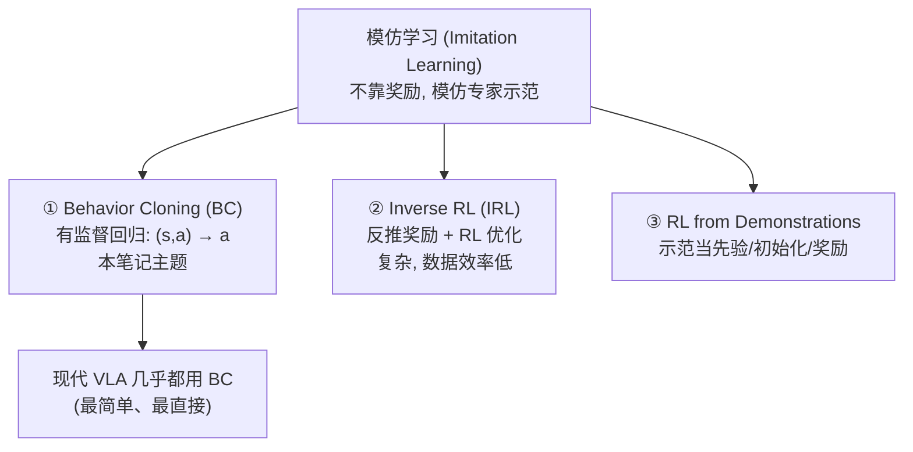
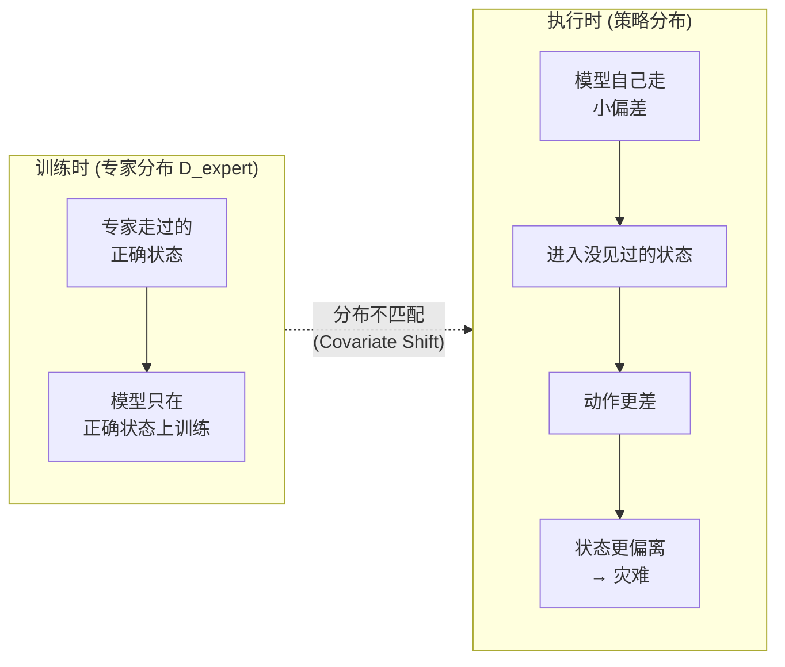
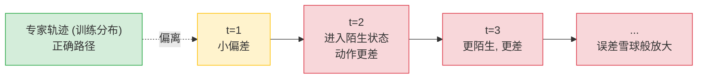
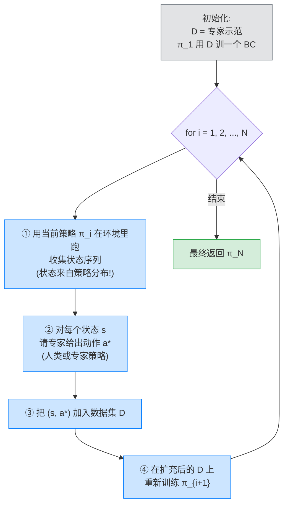
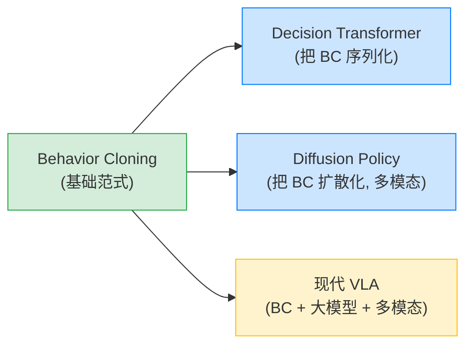

# 方法信息

> **说明**: Behavior Cloning (BC, 行为克隆) 不是某单篇论文，而是**模仿学习 (Imitation Learning) 中最基础的有监督学习范式**。本笔记把 BC 作为一类方法做系统性精读：定义、损失、致命的 covariate shift 问题、DAgger 的闭环纠偏方案，以及它如何演进到现代 deep BC，并成为 VLA (RT-2 / OpenVLA) 的训练底座。

- **代表性工作**:
  - **ALVINN** (Pomerleau, 1989): 首个神经网络的端到端自驾 BC
  - **DAgger** (Ross, Gordon, Bagnell, 2011): 解决 BC 的 covariate shift, [arXiv:1011.0686](https://arxiv.org/abs/1011.0686)
  - 综述相关: [arXiv:2005.07648](https://arxiv.org/abs/2005.07648) (Demonstrations for Improved RL)

> **一句话总结**: BC = 用专家示范的 (状态, 动作) 对做**有监督回归**，直接学习一个从 state 到 action 的映射 $\pi(a\mid s)$。它是 VLA policy 最基础、最直接的训练范式——OpenVLA / RT 本质上就是"数据驱动的 BC + 大模型"。BC 的核心痛点是 **covariate shift（协变量偏移）导致的 compounding error（误差累积）**，DAgger 用"在策略分布上采集 + 专家纠正"解决它。

---

# 1. 模仿学习全景

## 1.1 从示范学习策略

**模仿学习 (Imitation Learning, IL)** 不靠奖励信号（区别于 RL），而是模仿专家示范（demonstrations），学一个能复现专家行为的策略。它有三条主路线：

- **① Behavior Cloning (BC)**：有监督学习，$(s,a) \to a$。**本笔记主题**。
- **② Inverse Reinforcement Learning (IRL)**：从示范反推奖励函数，再用 RL 优化（复杂、数据效率低）。
- **③ RL from Demonstrations**：把示范当 RL 的先验/初始化/奖励。

VLA 几乎都用 BC（或其变体）：因为最简单、最直接。



## 1.2 BC 的定义

给定专家示范数据集 $D = \{(s_1, a_1), (s_2, a_2), \dots, (s_N, a_N)\}$，其中 $s_i$ 是专家看到的状态、$a_i$ 是专家做的动作。BC 学一个策略网络 $\pi_\theta(a\mid s)$，最小化预测动作与专家动作的差距。

- **离散动作**：分类损失（cross-entropy）

$$
\mathcal{L}_{\text{CE}} = -\sum_{i=1}^{N}\log \pi_\theta(a_i \mid s_i)
$$

- **连续动作**：回归损失（MSE）

$$
\mathcal{L}_{\text{MSE}} = \sum_{i=1}^{N}\big\|\mu_\theta(s_i) - a_i\big\|^{2}
$$

- 或**高斯策略**（参数化均值与协方差）：

$$
\mathcal{L}_{\text{Gauss}} = -\sum_{i=1}^{N}\log \mathcal{N}\!\big(a_i;\ \mu_\theta(s_i),\ \Sigma_\theta(s_i)\big)
$$

> **本质：BC 就是监督学习！** 输入 = 状态 $s$，标签 = 专家动作 $a$。

---

# 2. BC 的致命问题：Covariate Shift & Compounding Error

## 2.1 训练分布 vs 执行分布的不匹配

**关键问题（BC 失败的根源）：**

- **训练时**：状态 $s$ 来自"专家轨迹"的分布 $D_{\text{expert}}$ → 模型只在"专家会遇到的正确状态"上被训练。
- **执行时**：模型自己走，一旦某步稍有偏差 → 进入一个"没见过的状态" → 在没见过的状态下动作可能很差 → 差动作 → 状态更偏离 → 越来越没见过 → 灾难。

这就是 **Covariate Shift（协变量偏移）**：训练数据分布（专家状态分布）≠ 测试/执行数据分布（策略状态分布）。

$$
P_{\text{train}}(s) \neq P_{\text{exec}}(s) \quad \text{（专家状态分布 ≠ 策略状态分布）}
$$



## 2.2 Compounding Error（误差累积）

误差为什么累积放大：模型执行时，第 1 步的小偏差会让第 2 步进入陌生状态、动作更差，第 3 步更陌生、更差……误差雪球般放大。



**结论**：哪怕每步准确率 90%，$T$ 步后正确率 $\approx 0.9^{T}$ → **指数下降**！

$$
P(\text{整条轨迹正确}) \approx \prod_{t=1}^{T}p_t \;\xrightarrow{T \to \infty}\; 0 \quad (\text{即使单步 } p_t \text{ 很高})
$$

> **理论 (Ross et al.)**：BC 的误差上界随轨迹长度 $T$ 线性/指数增长 → 长程任务 BC 几乎必然失败。

## 2.3 为什么监督学习在这里"错配"

- **普通监督学习**（如图像分类）：测试样本分布 = 训练分布 → IID 假设成立 → 泛化好。
- **BC 的特殊性（序列决策）**：策略的动作会影响后续状态！→ 测试状态分布依赖策略本身 → 非 IID → covariate shift 不可避免。

这是 BC 与普通监督学习的**本质区别**。

---

# 3. DAgger：解决 Covariate Shift 的经典方案

## 3.1 核心思想：在策略分布上训练

**DAgger (Dataset Aggregation)** 的诊断：问题根源 = 训练状态来自专家分布，而非策略分布。

解决：**让训练状态来自"策略自己的分布"！**

做法：让策略自己跑（产生策略分布的状态），但在这些状态下问专家要正确动作（ground truth），加入训练集继续训 → 训练分布逐渐逼近执行分布 → 消除 covariate shift。

## 3.2 DAgger 算法



**DAgger 伪代码（for i: 用 $\pi_i$ 采样状态 → 专家给标签 → 加入 $D$ → 重训）：**

```python
# DAgger 算法伪代码: 在策略分布上聚合数据, 消除 covariate shift
# 关键: 每轮让"当前策略"自己跑, 收集它实际遇到的状态, 再请专家标注

# 1) 初始化: D = 专家示范数据集 (state, action) 对
D = list(expert_demonstrations)

# 2) 用初始专家数据训一个 BC 策略作为 π_1
pi = train_BC(policy_net, D)

for i in range(1, N_iters + 1):
    # ① 用当前策略 π_i 在环境里跑, 收集它实际遇到的状态序列
    #    关键: 这些状态来自"策略自己的分布", 而非专家分布
    states_seen = rollout_in_env(pi, env)

    # ② 对每个状态, 请专家给出动作标签 a*
    #    专家可以是真人, 也可以是一个(较慢的)专家策略/控制器
    expert_actions = [expert_label(s) for s in states_seen]

    # ③ 把 (s, a*) 加入数据集 D (Dataset Aggregation 得名)
    D.extend(zip(states_seen, expert_actions))

    # ④ 在扩充后的 D 上重新训练策略 π_{i+1}
    pi = train_BC(policy_net, D)

# 最终返回 π_N: 训练分布已逼近执行分布, 误差不再随 T 指数累积
return pi
```

**关键点：**

- 每轮新数据来自策略自己遇到的状态 → 逐步覆盖执行分布。
- 专家只提供动作标签（不需策略实时接管，比"接管纠正"轻量）。

> **理论保证 (Ross et al. 2011)**：DAgger 的误差不随 $T$ 累积（多项式界，而非指数）→ 长程任务也能学好。

## 3.3 DAgger 的难点

DAgger 的现实困难：

- **① 需要在线交互**（策略要在环境/真机跑）→ 真实机器人上昂贵/危险。
- **② 需要专家实时给标签** → 人类专家实时标注动作很难。
- **③ 需要"专家"对策略遇到的奇怪状态也能给正确动作。**

→ DAgger 在仿真里好用，真机/离线数据场景受限。
→ 现代 VLA 倾向用海量离线数据 + 强模型，隐式缓解 covariate shift。

---

# 4. 现代 Deep Behavior Cloning

## 4.1 深度网络作为策略

现代 BC 用深度网络把 $\pi_\theta(a\mid s)$ 参数化：

- **状态 $s$ 编码**：
  - 图像 → CNN/ViT（如 ResNet、DINOv2）
  - 机器人本体状态（关节角/速度）→ MLP
  - 语言指令 → 语言编码器（LLM）
- **策略头**：
  - MLP → 动作（连续回归）
  - 分类头 → 离散动作 token
  - 扩散头 → 多模态动作（Diffusion Policy）

本质还是 BC：监督学习（状态 → 动作）。

**简洁的现代 deep BC 策略网络示例**（视觉编码器 + 本体状态 MLP → 融合 → 动作输出，连续动作用 MSE）：

```python
import torch
import torch.nn as nn

# 现代 deep BC 策略网络示意: 图像(CNN/ViT) + 本体状态(MLP) → 融合 → 动作
# 训练目标: 监督回归 (s, a) 对, 输出连续动作 (MSE 损失)
class BCPolicy(nn.Module):
    def __init__(self, img_encoder, proprio_dim, action_dim, hidden=256):
        super().__init__()
        self.img_encoder = img_encoder          # 视觉骨干 (ResNet / DINOv2 等), 输出 visual feat
        for p in self.img_encoder.parameters():
            p.requires_grad = False             # 通常冻结视觉骨干, 加速训练 + 防过拟合

        # 本体状态分支: 关节角/速度等低维向量 → MLP
        self.proprio_mlp = nn.Sequential(
            nn.Linear(proprio_dim, hidden), nn.ReLU(), nn.Linear(hidden, hidden)
        )
        # 融合: [视觉特征; 本体特征] → 动作
        self.head = nn.Sequential(
            nn.Linear(img_encoder.feat_dim + hidden, hidden),
            nn.ReLU(),
            nn.Linear(hidden, action_dim),      # 输出连续动作 (回归)
        )

    def forward(self, image, proprio):
        v = self.img_encoder(image)             # 视觉嵌入
        p = self.proprio_mlp(proprio)           # 本体嵌入
        return self.head(torch.cat([v, p], -1)) # μ_θ(s): 预测动作均值


# BC 训练循环: 纯监督学习, 标签 = 专家动作
def train_bc(policy, dataloader, epochs=50):
    opt = torch.optim.Adam(policy.parameters(), lr=1e-4)
    mse = nn.MSELoss()                          # 连续动作 → MSE 回归损失
    policy.train()
    for _ in range(epochs):
        for image, proprio, expert_action in dataloader:   # (s, a) 对
            pred_action = policy(image, proprio)           # μ_θ(s)
            loss = mse(pred_action, expert_action)         # L = Σ_i || μ_θ(s_i) - a_i ||²
            opt.zero_grad(); loss.backward(); opt.step()
```

## 4.2 条件 BC（语言/图像条件）

VLA 里的 BC 是**条件 BC**：

$$
\pi_\theta(a\mid s,\ \ell), \quad \ell = \text{语言指令}
$$

给定观测 + 语言指令 → 输出动作（多任务 BC：一条指令定义一个任务）。

例：$s$ = 桌面图像 + 机械臂状态，$\ell$ = "把红色方块放到蓝色碗里"，$a$ = 机械臂目标动作。

---

# 5. BC vs DAgger vs GAIL vs RL 对比

| 方法 | 监督信号 | 需在线交互 | 需奖励 | 解决 covariate shift | 复杂度 |
|------|----------|------------|--------|----------------------|--------|
| **BC** | 专家 (状态,动作) | 否 | 否 | ❌ (有 shift) | 低 |
| **DAgger** | 专家动作标签 | ✅ 是 | 否 | ✅ | 中 |
| **GAIL** | 对抗 (学奖励) | 是 (RL) | 隐式学 | 部分 | 高 |
| **RL** | 环境奖励 | 是 | ✅ | (本身无此问题) | 高 |

一句话：

- **BC** = 最简单，但 covariate shift 累积误差。
- **DAgger** = BC 的 in-policy 修正版，需交互。
- **GAIL** = 用对抗学奖励，复杂。
- **RL** = 需奖励，难。

---

# 6. BC 与 VLA 的关系

## 6.1 VLA 本质上是 BC

RT-1 / RT-2 / OpenVLA 的训练：

- **数据**：$(s, \ell, a) = (\text{图像观测},\ \text{语言指令},\ \text{专家动作})$ 三元组，来自遥操作/人类示范（Open-X-Embodiment 等）。
- **训练目标**：给定 (图像, 语言)，预测专家动作。

> 这就是 (条件) Behavior Cloning！只是用了一个超大的 VLM 作为策略网络。
>
> **现代 VLA = 大模型时代的 BC。**

VLA 如何缓解 BC 的 covariate shift：

- **① 海量多样数据**（OXE 百万级轨迹）→ 覆盖更多状态分布。
- **② 强大预训练**（VLM 知识）→ 在没见过的状态也能泛化合理动作。
- **③ 数据增强**（相机视角/扰动）→ 扩大覆盖。
- **④ Receding horizon / 闭环执行**（Diffusion Policy）→ 纠正小偏差。

## 6.2 BC 在 VLA 路线中的位置

阶段3 Action 建模的"基础"：



理解 BC 的 covariate shift，才能理解 VLA 为什么要海量数据 + 强泛化模型。

---

# 7. 核心要点总结

## 7.1 BC 的精髓

> **BC = 用专家 (state, action) 对做有监督回归，直接学 $\pi(a\mid s)$。**
>
> - **优点**：简单、直接、无需奖励。
> - **缺点**：Covariate Shift → Compounding Error（训练状态分布 ≠ 执行状态分布，误差累积）。
> - **DAgger 修正**：在策略分布上采集 + 专家纠正。
> - **VLA 本质** = (条件) BC + 大模型 + 海量数据。

## 7.2 关键概念速记

- **① Covariate Shift**：训练状态（专家分布）≠ 执行状态（策略分布）。
- **② Compounding Error**：序列中小误差指数累积放大。
- **③ DAgger**：在策略自己的状态分布上训练，消除 shift。
- **④ 条件 BC**：$\pi(a\mid s,\ell)$，VLA 用语言条件。
- **⑤ Modern VLA** = 大规模 BC。

---

# 8. 参考资料

- **ALVINN** (首个神经网络 BC): Pomerleau, "ALVINN: An Autonomous Land Vehicle in a Neural Network", NeurIPS 1989
- **DAgger**: Ross, Gordon, Bagnell, "A Reduction of Imitation Learning and Structured Prediction to No-Regret Online Learning", AISTATS 2011, [arXiv:1011.0686](https://arxiv.org/abs/1011.0686)
- **Demonstrations for Improved RL** (综述相关): [arXiv:2005.07648](https://arxiv.org/abs/2005.07648)
- **GAIL**: Ho & Ermon, NeurIPS 2016 (对抗模仿学习)
- **DAGGER 讲解 / CS285**: Berkeley RL 课程
- **RT-1**: Brohan et al., 2022 (大规模真机 BC)
- **Open-X-Embodiment**: 2023 (BC 的大规模数据)
- **OpenVLA**: Kim et al., 2024, [arXiv:2406.09246](https://arxiv.org/abs/2406.09246) (VLA = 大模型 BC)
- **Diffusion Policy**: Chi et al., RSS 2023 (扩散式 BC)
