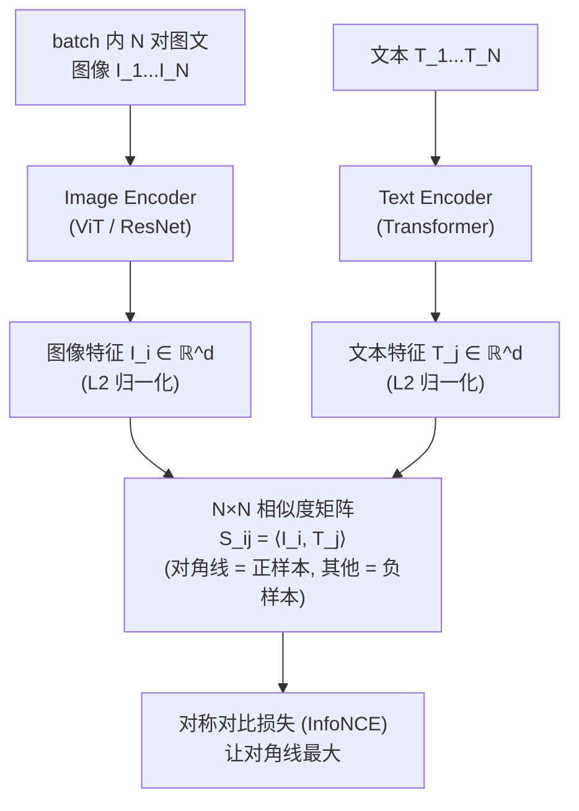
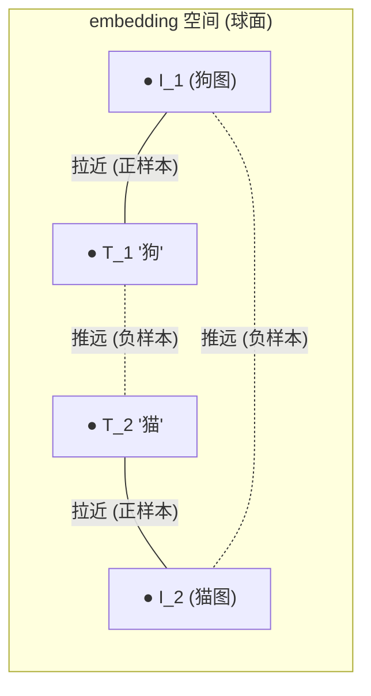
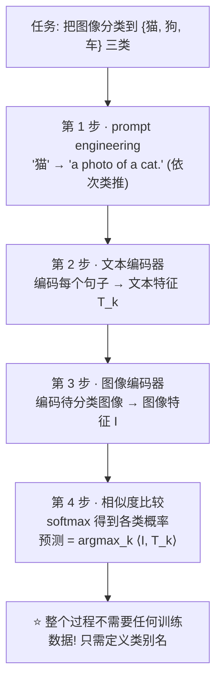
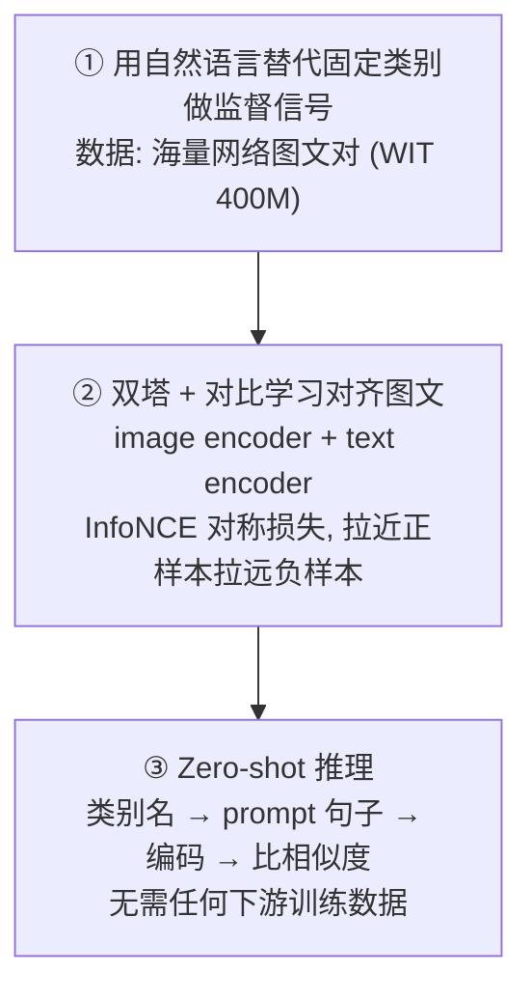

# 论文信息

- **标题**: Learning Transferable Visual Models From Natural Language Supervision
- **作者**: Alec Radford, Jong Wook Kim, Chris Hallacy, Aditya Ramesh, Gabriel Goh, Sandhini Agarwal, Girish Sastry, Amanda Askell, Pamela Mishkin, Jack Clark, Gretchen Krueger, Ilya Sutskever
- **机构**: OpenAI
- **发表**: ICML 2021
- **arXiv**: [2103.00020](https://arxiv.org/abs/2103.00020)
- **代码**: [github.com/openai/CLIP](https://github.com/openai/CLIP)

> **一句话总结**: CLIP 用**自然语言作为监督信号**训练一个视觉模型：双塔架构（图像编码器 + 文本编码器）+ **对比学习**，让匹配的图文对在 embedding 空间里靠近、不匹配的拉远。训练后只需**用自然语言描述类别即可做 zero-shot 分类**（无需任何标注训练数据），在 ImageNet 等数据集上 zero-shot 媲美有监督 ResNet，且对分布偏移鲁棒。CLIP 开创了 "文本对齐视觉" 的范式，是 VLM/VLA 一切多模态对齐工作的起点。

---

# 1. 背景与动机

## 1.1 传统视觉监督的局限

```
传统视觉模型 (ImageNet 分类):
  监督信号 = 固定的类别标签集合 (1000 类: 猫、狗、车...)
  
  问题:
  ① 类别集合封闭: 训练时没见过的类别 (如 "牛角包") 无法识别
     → 必须重新标注数据 + 重训
  ② 标签是 "硬" 标签, 不含语义关系
     ("西班牙猎犬" 和 "猎犬" 的语义关系模型学不到)
  ③ 标注成本高
```

## 1.2 用自然语言作为监督信号

```
CLIP 的核心 idea:
  放弃固定类别标签, 用自然语言句子描述图像内容作为监督
  
  例: 图像是一只狗
     传统: label = "dog" (类别 id 207)
     CLIP: text = "a photo of a dog" (自然语言)
  
  优势:
  ① 语言是开放的 (open-vocabulary)
     → 训练后可识别任意描述的类别
  ② 语言携带丰富语义
     → 模型学到 "概念" 而非死标签
  ③ 网上有海量图文对 (alt text), 标注免费
```

## 1.3 为什么用对比学习而非生成式预测

```
早期尝试自然语言监督 (VirTex, 预测 caption):
  图像 encoder + 语言模型, 预测完整 caption
  → 效果差! (caption 太难预测, 信噪比低)

CLIP 的洞察:
  从图像预测 caption 的每个词 太难
  → 不如只学 "图文是否匹配" 这个简单对齐信号
  
  → 对比学习 (contrastive) 远比生成式预测高效

  实验: 对比学习效率是 caption prediction 的 ~4 倍
       (Figure 3: 同算力下对比 loss 下降快得多)
```

---

# 2. 方法

## 2.1 双塔架构



## 2.2 对比损失（InfoNCE，对称）

对 batch 内 $N$ 个配对, 算 $N \times N$ 相似度矩阵 $S_{ij} = \langle I_i, T_j \rangle / \tau$。

图像→文本方向（每行 softmax，对角线为正）：

$$L_{i2t} = -\frac{1}{N}\sum_{i} \log \frac{\exp(S_{ii}/\tau)}{\sum_{j}\exp(S_{ij}/\tau)}$$

文本→图像方向（每列 softmax，对角线为正）：

$$L_{t2i} = -\frac{1}{N}\sum_{j} \log \frac{\exp(S_{jj}/\tau)}{\sum_{i}\exp(S_{ij}/\tau)}$$

总损失（对称）：

$$L = \tfrac{1}{2}(L_{i2t} + L_{t2i})$$



> **训练目标**: 匹配的图文对靠近, 不匹配的拉远 → 学到一个图文共享的语义空间。

### 2.2.1 代码对照：OpenCLIP 的对比损失

> 来源：`open_clip/loss.py` 的 `ClipLoss`。OpenAI 官方仓库只放了推理、没放训练损失，**OpenCLIP 是最权威的开源 PyTorch 实现**。下面的代码已删去 `output_dict` / `logit_bias` 等无关分支，并用中文行内注释逐行映射回上面的 InfoNCE 公式。

```python
import torch
import torch.distributed as dist
from torch.nn import functional as F


def gather_features(image_features, text_features, local_loss=False,
                    gather_with_grad=True, rank=0, world_size=1):
    """跨卡 all-gather：把每张卡上的本地特征拼成全局特征。

    ⭐ 这是 CLIP 能用 32768 超大 batch 训练的关键：
       每个 rank 只算自己那批图文对的前向，再用 all-gather
       把所有卡的特征凑成 [world_size*N, d] 的全局矩阵，
       于是单卡 N 对图文就能拿到 world_size*N - 1 个负样本。
    """
    if gather_with_grad:
        # 带梯度的 gather（让梯度能回传到本地 rank 的特征）
        all_image_features = torch.cat(torch.distributed.nn.all_gather(image_features), dim=0)
        all_text_features  = torch.cat(torch.distributed.nn.all_gather(text_features),  dim=0)
    else:
        gathered_image = [torch.zeros_like(image_features) for _ in range(world_size)]
        gathered_text  = [torch.zeros_like(text_features)  for _ in range(world_size)]
        dist.all_gather(gathered_image, image_features)   # 普通不带梯度的 gather
        dist.all_gather(gathered_text,  text_features)
        if not local_loss:
            # 关键：all_gather 默认不回传梯度，这里手动把本 rank 的特征
            # 塞回对应位置，保证本地特征参与计算图、能拿到梯度
            gathered_image[rank] = image_features
            gathered_text[rank]  = text_features
        all_image_features = torch.cat(gathered_image, dim=0)
        all_text_features  = torch.cat(gathered_text,  dim=0)
    return all_image_features, all_text_features


class ClipLoss(torch.nn.Module):

    def get_ground_truth(self, device, num_logits):
        """生成标签：对角线为正样本。

        对应公式里的 S_ii（第 i 个图文对自身匹配）。
        labels = [0, 1, 2, ..., N-1] 表示第 i 行/列的正样本恰是第 i 列/行。
        """
        labels = torch.arange(num_logits, device=device, dtype=torch.long)
        return labels

    def get_logits(self, image_features, text_features, logit_scale):
        """算 N×N 相似度矩阵 S = (1/τ) · ⟨I_i, T_j⟩。

        对应公式里的 S_{ij} = ⟨I_i, T_j⟩ / τ。
        注意：进入这里之前 image_features / text_features 都已 F.normalize 过，
        所以 @ 做的是余弦相似度（点积即 cos，因已归一化到单位球面）。
        logit_scale 就是可学习的温度 1/τ（初始化为 log(1/0.07)≈2.659）。
        """
        if self.world_size > 1:
            all_image, all_text = gather_features(   # 跨卡 gather，见上
                image_features, text_features,
                local_loss=self.local_loss, gather_with_grad=self.gather_with_grad,
                rank=self.rank, world_size=self.world_size)
            # image_loss：每行 softmax（i→所有 j），logits_per_image[i,:] 是第 i 张图对全部文本的相似度
            logits_per_image = logit_scale * all_image @ all_text.T
            # text_loss：每列 softmax（j→所有 i），恰好是 image_loss 矩阵的转置
            logits_per_text = logits_per_image.T
        else:
            logits_per_image = logit_scale * image_features @ text_features.T
            logits_per_text  = logit_scale * text_features  @ image_features.T
        return logits_per_image, logits_per_text

    def forward(self, image_features, text_features, logit_scale):
        logits_per_image, logits_per_text = self.get_logits(
            image_features, text_features, logit_scale)
        labels = self.get_ground_truth(image_features.device, logits_per_image.shape[0])

        # ⭐ 对称损失 L = (L_i2t + L_t2i) / 2
        #   - 第一项：图像→文本方向的 InfoNCE（每行 softmax，对角线为正）= L_i2t
        #   - 第二项：文本→图像方向的 InfoNCE（每列 softmax，对角线为正）= L_t2i
        #   - cross_entropy(logits, labels) 内部 = -log softmax(logits)[labels]
        #     正好是公式里的 -log( exp(S_ii/τ) / Σ_j exp(S_ij/τ) )
        total_loss = (
            F.cross_entropy(logits_per_image, labels) +
            F.cross_entropy(logits_per_text, labels)
        ) / 2
        return total_loss
```

> 几个关键映射点：`logit_scale`（`nn.Parameter`，初值 `log(1/0.07)`，对应可学习温度 $\tau$）↔ 公式分母的 $\tau$；`F.normalize` 把特征压到单位球面 ↔ 公式里的内积即余弦；`(image_loss + text_loss) / 2` ↔ 对称相加。

## 2.3 编码器细节

```
图像编码器 (论文试了多种):
  • ViT (Vision Transformer): ViT-B/32, ViT-B/16, ViT-L/14
  • ResNet (改进版): ResNet-50, ResNet-101, RNx4, RNx16 等
  → ViT-L/14 是最强配置

文本编码器:
  • Transformer (类似 GPT-2)
  • 输入: 文本 → BPE token → Transformer → 取 [EOS] token 特征
  • 投影到与图像共享的 d 维空间

两个编码器输出都 L2 归一化后算内积相似度
```

### 2.3.1 代码对照：OpenCLIP 的编码器前向

> 来源：`open_clip/model.py` 的 `CLIP` 类（`encode_image` / `encode_text` / `forward`）+ `open_clip/transformer.py` 的 `VisionTransformer` 池化与 `text_global_pool`。下面把图像「取 `[class]` token + proj」、文本「取 `[EOS]` 位置 + proj」、最后 `F.normalize` 三步映射回上面的描述。

```python
class CLIP(nn.Module):
    def __init__(self, embed_dim, vision_cfg, text_cfg, ...):
        # ...
        # ⭐ 可学习的温度：logit_scale = log(1/τ)，初值 np.log(1/0.07)≈2.659，对应 τ=0.07
        #    使用时取 exp(): self.logit_scale.exp() == 1/τ，放大相似度矩阵。
        self.logit_scale = nn.Parameter(torch.ones([]) * np.log(1 / 0.07))

    def encode_image(self, image, normalize=False):
        """图像编码器前向：visual 内部已做 '取 [class] token + proj'，这里只补一个 L2 归一化。"""
        features = self.visual(image)
        return F.normalize(features, dim=-1) if normalize else features   # 球面归一化

    def encode_text(self, text, normalize=False):
        """文本编码器前向：取 [EOS] 位置 + proj + L2 归一化。"""
        cast_dtype = self.transformer.get_cast_dtype()
        x = self.token_embedding(text).to(cast_dtype)   # [B, n_ctx, d_model] token 查表
        x = x + self.positional_embedding.to(cast_dtype) # 加位置编码
        x = self.transformer(x, attn_mask=self.attn_mask) # 因果 Transformer（类似 GPT-2）
        x = self.ln_final(x)                            # 最后一个 LayerNorm
        # ⭐ 取 [EOS] token 的特征：pool_type 默认 'argmax'
        #   因 [EOS]/[EOT] 是词表里 id 最大的 token，text.argmax(dim=-1) 恰好定位到它
        x = text_global_pool(x, text, self.text_pool_type,
                             eos_token_id=getattr(self, "text_eos_id", None))
        if self.text_projection is not None:            # 投影到与图像共享的 embed_dim 维
            if isinstance(self.text_projection, nn.Linear):
                x = self.text_projection(x)
            else:
                x = x @ self.text_projection            # CLIP 原版用 Parameter 矩阵
        return F.normalize(x, dim=-1) if normalize else x   # 球面归一化

    def forward(self, image=None, text=None):
        # 双塔前向：分别编码并 L2 归一化，再吐出 logit_scale（1/τ）给损失层
        image_features = self.encode_image(image, normalize=True) if image is not None else None
        text_features  = self.encode_text(text, normalize=True)  if text  is not None else None
        return image_features, text_features, self.logit_scale.exp()
```

下面是 `VisionTransformer` 内部「取 `[class]` token + proj」那两步（对应 `encode_image` 里调用的 `self.visual`）：

```python
class VisionTransformer(nn.Module):
    def _global_pool(self, x):
        if self.pool_type == 'avg':       # 平均池化所有 patch
            pooled, tokens = x[:, 1:].mean(dim=1), x[:, 1:]
        elif self.pool_type == 'tok':     # ⭐ CLIP 默认：取第 0 个 token（即 [class]/[CLS]）
            pooled, tokens = x[:, 0], x[:, 1:]
        else:                             # 'none'：保留全部 token
            pooled = tokens = x
        return pooled, tokens

    def forward(self, x):
        x = self._embeds(x)                       # conv1 切 patch + 拼 [CLS] + 加位置编码 + ln_pre
        x = self.transformer(x)                   # ViT Transformer Encoder
        pooled, tokens = self._pool(x)            # _pool 内部先 ln_post 再 _global_pool 取 [CLS]
        if self.proj is not None:                 # ⭐ 投影到与文本共享的 embed_dim 维
            pooled = pooled @ self.proj
        return pooled
```

而文本取 `[EOS]` 位置的核心是 `text_global_pool`（默认 `pool_type='argmax'`）：

```python
def text_global_pool(x, text=None, pool_type='argmax', eos_token_id=None):
    if pool_type == 'argmax':
        # ⭐ 取 [EOS]/[EOT] 位置的 embedding：
        #   eot_token 是词表里 id 最大的，text.argmax(dim=-1) 恰好指向它
        pooled = x[torch.arange(x.shape[0], device=x.device), text.argmax(dim=-1)]
    elif pool_type == 'eos':
        # 显式按 eos_token_id 定位（用专门 tokenizer 时更稳）
        idx = (text == eos_token_id).int().argmax(dim=-1)
        pooled = x[torch.arange(x.shape[0], device=x.device), idx]
    # ...（'first' / 'last' 分支略）
    return pooled
```

> 映射小结：图像侧 `x[:, 0]`（`[CLS]` token）+ `@ proj` ↔ 「取 `[class]` token」；文本侧 `text.argmax` 处的特征 + `@ text_projection` ↔ 「取 `[EOS]` 位置」；两个 `encode_*` 末尾的 `F.normalize(..., dim=-1)` ↔ 「L2 归一化到单位球面」。归一化后两塔做点积即余弦相似度，再乘 `logit_scale.exp()`（= $1/\tau$）就是损失里 $S_{ij}=\langle I_i,T_j\rangle/\tau$ 的 logits。

## 2.4 训练数据：WIT（WebImageText）

```
CLIP 专有数据集 WIT:
  • 从互联网爬取的 (图像, 文本) 配对
  • 4 亿 (400M) 对
  • 50 万个查询词覆盖的概念
  • 广泛: 食物、动物、物体、场景、名人...
  
  ⭐ 关键: 这些文本是自然网络 alt-text, 不是人工标注
          → 规模大但噪声高
  
  CLIP 的成功很大程度上依赖这个大规模数据
  (开源复现 OpenCLIP 用 LAION 等公开数据达到类似效果)
```

## 2.5 训练超参

```
• batch size 极大: 32768 (对比学习需要大 batch 提供足够负样本)
• 32 天训练 (256 V100)
• temperature τ 可学习
• 对称损失
```

---

# 3. Zero-shot 分类（CLIP 的招牌能力）

## 3.1 Zero-shot 推理流程



## 3.2 Prompt Engineering 的重要性

```
直接用类别词 (如 "cat") 效果差, 因为文本编码器见过的是完整句子
→ 用模板构造更像训练分布的句子:

  基础模板: "a photo of a {label}."
  领域模板: "a photo of a {label}, a type of pet."  (动物)
           "a satellite photo of {label}."          (卫星图)
  
  集成 (ensemble): 用多个模板平均 → 更稳

  效果提升: 用 prompt engineering 比直接用单词提升 ~5 个点
```

---

# 4. 实验

## 4.1 Zero-shot vs 有监督 (ImageNet)

```
ImageNet zero-shot top-1:

  方法                          ImageNet zero-shot
  ──────────────────────────────────────────────
  ResNet-50 (有监督, 1000类训练)    76.0  (不是zero-shot, 作对照)
  CLIP ViT-B/32 (zero-shot)        ~64
  CLIP ViT-B/16 (zero-shot)        ~68
  CLIP ViT-L/14 (zero-shot)        ~75
  
  ⭐ 惊人: CLIP 用 zero-shot (无需任何 ImageNet 训练)
          就达到与有监督 ResNet-50 相当的水平!
```

## 4.2 分布偏移鲁棒性（CLIP 最大优势之一）

```
在 ImageNet 的分布偏移版本上 (v2, A, R, Sketch):

  方法                  ImageNet   v2    A     R    Sketch   平均
  ──────────────────────────────────────────────────────────────
  ResNet-101 (有监督)    88         70    18    42    30      低
  CLIP ViT-L (zero-shot)  76        70    80    88    60      高!
  
  观察:
    有监督模型在 ImageNet 上高, 但遇到分布偏移暴跌 (ObjectNet 18%)
    CLIP zero-shot 在偏移数据集上碾压 (ObjectNet 80%)
  
  → CLIP 学到了鲁棒的、通用的语义, 不依赖特定数据集的捷径
```

## 4.3 Linear probe（评估特征质量）

```
冻结 CLIP 图像编码器, 只训一个线性分类器:

  方法                  ImageNet linear probe
  ──────────────────────────────────────
  SimCLR (自监督)         76
  CLIP ViT-L              85+
  
  → CLIP 特征质量极强, 线性可分性高
```

## 4.4 任务泛化

```
CLIP zero-shot 在 30+ 数据集上评测:
  • 物体分类、场景分类、动作识别、纹理、计数...
  • 大部分任务 zero-shot 接近或超越有监督
  
  弱项:
    ① 计数 (counting) 弱 —— 文本监督学不好精确数量
    ② 抽象/空间关系弱
    ③ 细粒度分类 (具体鸟类品种) 弱 —— 需要专家级描述
```

---

# 5. 局限

```
① 需要海量数据:
   4 亿图文对, 普通实验室难复现 → 推动开源 OpenCLIP (用 LAION-400M/2B)

② 计数/空间/抽象推理弱
   文本监督信号在这些任务上不够

③ 细粒度分类弱
   需要专业知识 prompt

④ 不是生成式:
   CLIP 只做对齐, 不能生成图像描述 (caption)
   → BLIP/LLaVA 等生成式 VLM 补足

⑤ 密集任务弱:
   分割/检测不如自监督 (DINOv2), 因为文本对齐丢失细节
```

---

# 6. 核心要点总结

## 6.1 CLIP 三步走



## 6.2 为什么 CLIP 是里程碑

```
1. 开创 "用语言对齐视觉" 范式 → 后续 BLIP/LLaVA/SigLIP/VLA 全基于此
2. Zero-shot 分类能力 → 无需重训即可适配新类别
3. 鲁棒的通用语义表征 → 广泛用作视觉编码器
4. 证明对比学习是图文对齐的高效方法
```

## 6.3 在 VLA 路线中的位置


> 后续 SigLIP 改进其损失, OpenVLA 用 SigLIP 作视觉编码器。

---

# 7. 参考资料

- **CLIP 原论文**: Radford et al., "Learning Transferable Visual Models From Natural Language Supervision", ICML 2021, [arXiv:2103.00020](https://arxiv.org/abs/2103.00020)
- **官方代码**: [github.com/openai/CLIP](https://github.com/openai/CLIP)
- **OpenCLIP (开源复现)**: [github.com/mlfoundations/open_clip](https://github.com/mlfoundations/open_clip)
- **ALIGN**: Jia et al., ICML 2021 (类似双塔图文, 用噪声数据规模化)
- **ViT**: Dosovitskiy et al., ICLR 2021 (CLIP 图像编码器)
- **SimCLR**: Chen et al., ICML 2020 (对比学习基础)
- **SigLIP**: Zhai et al., ICCV 2023, [arXiv:2303.15343](https://arxiv.org/abs/2303.15343) (改进损失)
- **BLIP-2**: Li et al., ICML 2023 (生成式 VLM)
- **LLaVA**: Liu et al., NeurIPS 2023 (instruction tuning VLM)
