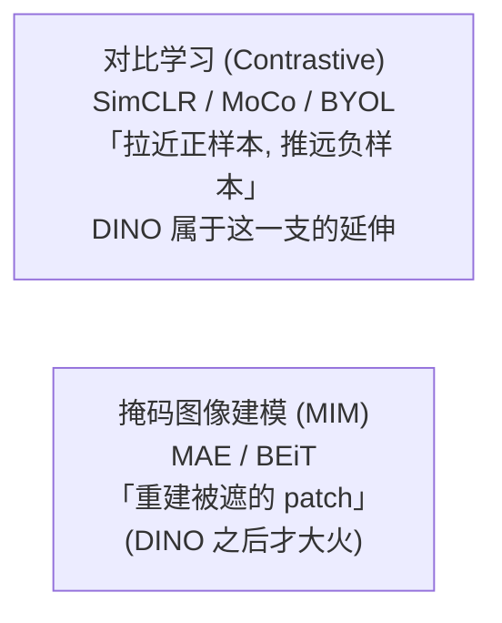
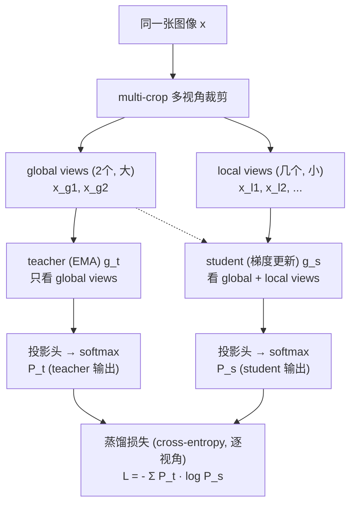
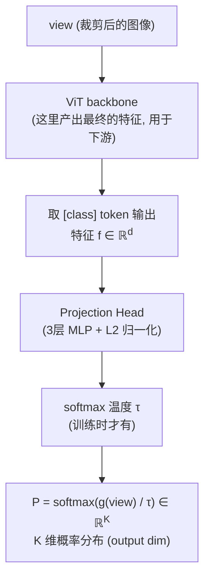
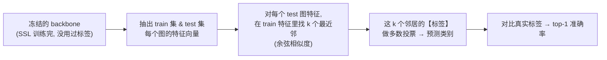
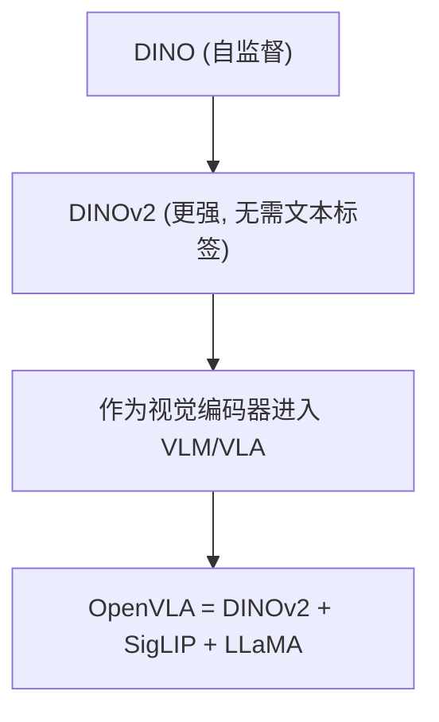

# 论文信息

- **标题**: Emerging Properties in Self-Supervised Vision Transformers
- **作者**: Mathilde Caron, Hugo Touvron, Ishan Misra, Hervé Jégou, Julien Mairal, Piotr Bojanowski, Armand Joulin
- **机构**: Facebook AI Research (FAIR) / Meta AI / Inria
- **发表**: ICCV 2021 (Best Paper Award)
- **arXiv**: [2104.14294](https://arxiv.org/abs/2104.14294)
- **代码**: [github.com/facebookresearch/dino](https://github.com/facebookresearch/dino)

> **一句话总结**: DINO 是一种**无需标签的自蒸馏 (self-distillation)** 方法来训练 ViT：用 student 网络去匹配 teacher 网络在大量无标注图像上的输出，teacher 是 student 的 EMA（滑动平均）。令人惊讶的是，这样训出来的 ViT 会自发涌现 (emerge) 出**语义分割能力**——它的 attention map 会自动聚焦到物体的语义区域，且在 linear probing / k-NN 评估上全面超越有监督 ViT，把自监督视觉表征的质量推到了新高度。它是 DINOv2 / OpenVLA 视觉骨干的直接前身。

---

# 1. 背景与动机

## 1.1 自监督学习两条路线

自监督学习 (Self-Supervised Learning, SSL)：不用人工标签，利用数据本身的结构造监督信号 → 用海量无标注数据学通用表征。

视觉自监督的两条主路线：



## 1.2 为什么自监督 + ViT 特别有意思？

```
问题:
  自监督方法 (MoCo v3, SimCLR 等) 多数在 CNN 上验证
  直接搬到 ViT 上往往训练不稳定 (尤其大模型会 collapse)

更重要的观察 (DINO 的灵感来源):
  ViT 的 attention 和 CNN 不一样 ——
  CNN 的特征是局部归纳偏置 "硬编码" 的,
  而 ViT 的 attention 是 data-driven 的, 可能涌现更结构化的行为

DINO 的赌注:
  用自蒸馏训练 ViT, 看看 attention 会不会涌现出
  "自动聚焦物体" 这种 CNN 上看不到的现象
  → 结果: 涌现了! (这是论文最大的发现)
```

---

# 2. 方法：自蒸馏 (Self-Distillation with No Labels)

## 2.1 整体架构



> teacher 参数 = student 参数的 EMA（指数滑动平均）；teacher 不接收梯度！

$$L = - \sum P_t \cdot \log P_s$$

## 2.2 multi-crop：同一图像的多个视角

**先澄清一个常见误解：multi-crop 的"多视角"到底是什么？**

"多视角"= 对**同一张原图**做多次**随机裁剪**（`RandomResizedCrop`），再叠加颜色抖动/翻转/高斯模糊/过度曝光等光度增强。它**不是**对同一块裁剪做旋转/仿射等几何变换——核心是"从原图的不同位置、不同尺度各裁一刀"。每张图共生成：

- **2 个 global crops（全局视角）**：裁剪覆盖原图较大比例（默认 `scale=(0.4, 1.0)`，即 40%~100% 区域），统一 resize 到 224×224；
- **8 个 local crops（局部视角）**：裁剪覆盖原图很小比例（默认 `scale=(0.05, 0.4)`，即 5%~40% 区域），统一 resize 到 96×96。

意义：不同视角（尤其 local↔global）迫使模型学**"视角/裁剪不变"**的语义表示——看到狗头和看到整只狗，都该认出"狗"。

**关键约束**：teacher 只在 2 个 global views 上前向（只看大视野）；student 在全部 10 个 views 上前向。→ 这样 student 要"从小局部 crop 去预测大全局 crop 的语义"，被迫学真正的语义而非死记像素。

**代码对照**（`main_dino.py` 的 `DataAugmentationDINO`，可清楚看到"多视角=多次随机裁剪 + 光度增强"）：

```python
class DataAugmentationDINO(object):
    def __init__(self, global_crops_scale, local_crops_scale, local_crops_number):
        flip_and_color_jitter = transforms.Compose([
            transforms.RandomHorizontalFlip(p=0.5),
            transforms.RandomApply([transforms.ColorJitter(0.4, 0.4, 0.2, 0.1)], p=0.8),
            transforms.RandomGrayscale(p=0.2),
        ])
        normalize = transforms.Compose([transforms.ToTensor(),
            transforms.Normalize((0.485, 0.456, 0.406), (0.229, 0.224, 0.225))])

        # 2 个 global crop: 大尺度裁剪 → 224
        self.global_transfo1 = transforms.Compose([
            transforms.RandomResizedCrop(224, scale=global_crops_scale, interpolation=Image.BICUBIC),
            flip_and_color_jitter, utils.GaussianBlur(1.0), normalize])
        self.global_transfo2 = transforms.Compose([
            transforms.RandomResizedCrop(224, scale=global_crops_scale, interpolation=Image.BICUBIC),
            flip_and_color_jitter, utils.GaussianBlur(0.1), utils.Solarization(0.2), normalize])
        # 8 个 local crop: 小尺度裁剪 → 96
        self.local_transfo = transforms.Compose([
            transforms.RandomResizedCrop(96, scale=local_crops_scale, interpolation=Image.BICUBIC),
            flip_and_color_jitter, utils.GaussianBlur(0.5), normalize])
        self.local_crops_number = local_crops_number

    def __call__(self, image):
        crops = [self.global_transfo1(image), self.global_transfo2(image)]
        for _ in range(self.local_crops_number):
            crops.append(self.local_transfo(image))
        return crops                       # 返回 10 张不同的裁剪图
```

> 调用方（`train_dino`）默认 `global_crops_scale=(0.4,1.0)`、`local_crops_scale=(0.05,0.4)`、`local_crops_number=8`。注意 `RandomResizedCrop` 每次随机采样不同的位置/比例 → 每张图得到 10 个**互不相同**的裁剪视角。

## 2.3 网络结构：backbone + projection head

每个网络（student 和 teacher）结构相同：



> 注意：projection head 只在自监督训练时用；推理/下游任务用 backbone 输出的特征（丢弃 head）。

$$P = \text{softmax}\left( g(\text{view}) / \tau \right) \in \mathbb{R}^{K}$$

## 2.4 损失：跨视角蒸馏 (cross-view distillation)

对每个 student view $x_s$（来自裁剪），找一个 teacher view $x_t$：
规则：student 的 local/global view 都去对齐 teacher 的 global view。

损失（student view $v$ 与 teacher global view $t$）：

$$L_{v,t} = - \sum_{k} P_t(k) \cdot \log P_s(k) = \text{cross-entropy}(\text{teacher\_软化分布},\ \text{student\_软化分布})$$

其中：

$$P_t = \text{softmax}\left( g_t(x_t) / \tau_t \right), \quad P_s = \text{softmax}\left( g_s(x_v) / \tau_s \right)$$

> 温度 $\tau_t, \tau_s$ 通常 $0.04 \sim 0.1$，teacher 温度可更小（更 sharp）。

### 2.4.1 关键疑问：student 和 teacher 输入都不一样，到底"对齐"什么？怎么对齐？

这是 DINO 最容易卡住的地方，正面回答（5 点）：

**① 对齐的不是像素，是"语义编码"（输出分布）。**
student / teacher 的输出都不是图像本身，而是 backbone + projection head 之后的一个 **$K$ 维概率分布 $P$**（DINO 默认 $K=65536$）。可以把它理解成一堆"原型/聚类"上的软分配——理想情况下它只反映"图里是什么东西"，而与裁剪大小/位置/颜色无关。

**② 两个视角来自同一张原图，语义内容相同。**
global crop 和 local crop 都是从**同一只狗**的原图里裁出来的，看到的语义对象是同一个（"狗"），只是范围/大小不同。所以要求它们输出**相同的语义码**是合理的——就像你看到整只狗 vs 只看到狗头，都该认出"这是狗"。

**③ "对齐"= 最小化两个分布的交叉熵。**
student 处理某个视角得到 $P_s$，teacher 处理某个 global 视角得到 $P_t$（作为固定的、`detach` 不回传梯度的软标签）。损失 $-\sum_k P_t(k)\log P_s(k)$ 强制 $P_s \to P_t$。当**整个数据集所有图**都被这样约束时，网络唯一能进一步降 loss 的办法，就是**丢掉裁剪/颜色这些"表面差异"，只保留"这是什么物体"这个不变量**——这正是我们想要的表征。

**④ teacher 和 student 为什么能"对得上"？因为它们本质是同一个网络。**
teacher = student 参数的 EMA（滑动平均），架构完全相同。也就是说，两者用**几乎同一套权重**在编码，只是看到不同裁剪。EMA 让 teacher 比 student 稍"旧一点、稳一点"，给 student 提供一个稳定目标去追逐（见 §2.6）。所以这不是两个不相关的网络硬凑——它们就是"同一个大脑"在看同一张图的不同部分。

**⑤ 一个反直觉但关键的点：故意让输入不同，才有学习信号。**
代码里 `if v == iq: continue` 会**跳过 student 和 teacher 处理完全同一个 crop 的配对**（那种情况是 trivial 的、学不到东西的对齐）。保留下来的全是"不同视角"配对。正是"不同视角 → 要求相同语义码"这个**落差**，逼出了不变性表征。如果输入完全相同，对齐就退化为恒等映射，什么也学不到。

> **一句话**：teacher 和 student 是同一个网络（EMA 关系）在看同一张图的不同裁剪；要求它们对"同一只狗"输出同一个语义分布——这个约束逼网络学到了与裁剪无关的物体语义。

**代码对照**（`main_dino.py` 的 `DINOLoss.forward`，把上面 5 点映射到具体实现）：

```python
def forward(self, student_output, teacher_output, epoch):
    # student_output: (ncrops, out_dim)，student 在全部 10 个 crop 上的输出
    # teacher_output: (2, out_dim)，     teacher 只在 2 个 global crop 上的输出
    student_out = student_output / self.student_temp        # ① 学生先除以温度
    student_out = student_out.chunk(self.ncrops)            # 按每个 crop 切开

    # ② teacher centering + sharpening（见 §2.5）
    temp = self.teacher_temp_schedule[epoch]
    teacher_out = F.softmax((teacher_output - self.center) / temp, dim=-1)
    teacher_out = teacher_out.detach().chunk(2)             # teacher 作为不回传梯度的软标签

    total_loss = 0
    n_loss_terms = 0
    for iq, q in enumerate(teacher_out):                    # q: 每个 global 视角的 teacher 分布
        for v in range(len(student_out)):                   # 遍历每个 student 视角
            if v == iq:                                     # ⑤ 跳过"同一视角"的 trivial 配对!
                continue
            # ③ 跨视角交叉熵: 强制 student 视角 v 的分布 → teacher 视角 iq 的分布
            loss = torch.sum(-q * F.log_softmax(student_out[v], dim=-1), dim=-1)
            total_loss += loss.mean()
            n_loss_terms += 1
    total_loss /= n_loss_terms
    self.update_center(teacher_output)                      # 更新 centering 向量
    return total_loss
```

读懂这段就懂了 DINO：`q`（teacher 对 global crop 的语义分布）和 `student_out[v]`（student 对另一个视角的语义分布）来自**不同裁剪**，但用交叉熵把它们往一起拉——这就是"跨视角对齐语义分布"的全部含义。

### 2.4.2 常见疑问：局部 crop 和全局 crop 内容都不一样，强行对齐为什么不坏？

> **疑问（很容易卡这儿）**：一张图里有多个物体，如果裁出来的局部 crop 正好只含其中一个物体、没有周围物体，那它的语义信息**显然不该**和全局 view 一样。为什么强行让它们一样，不仅没问题，还能学出好特征？

**先肯定直觉**：局部和全局的内容确实不一样——这恰恰是 DINO 想要的，不是 bug。关键在于"对齐的是什么"和"强行对齐逼出了什么"。

**① 对齐的不是"物体清单/像素"，是一个高层语义码。**
teacher/global 输出的不是"图里有猫有狗"的描述，而是一个 $K=65536$ 维概率分布（"这张图在 $K$ 个原型上的软分配"）。student 被逼着去**预测这个分布**。所以问题不是"局部和全局含一样的东西吗"，而是"**从一个局部，能不能预测出全局的那个码**"。

**② 这本质是个"从部分预测整体"的自监督 pretext task。**
teacher 的全局码是"答案"，student 只看局部去猜。要猜得准，student 必须从局部里提取出**能决定全局码的信息**——也就是最显著、"最定义这张图"的前景物体。背景、精确像素都帮不上忙（每次裁剪不同，记像素没用）。

**③ "强行一样"为什么不坏，反而正好逼出我们要的特征。**
student **没法靠死记像素**满足约束（裁剪每次不同），唯一能降 loss 的解就是**学到与裁剪无关的语义不变量**——"这是什么物体"。这和 SimCLR/BYOL/MoCo 一个原理：正样本对=同一图的不同增强、逼表征一致 → 逼出对增强的不变性 + 对不变内容的聚焦。DINO 的 local-global 只是更强的版本。

**④ 多物体场景怎么办。**
全局含多个物体时，teacher 有 sharpening（低温），会 committed 到**最显著的那个物体**（全局码主要由前景主导物体决定）。局部（正好裁到那只猫）被推向全局码：若全局以猫为主，"猫局部→猫全局"天然一致；若含猫+狗、码有歧义，那这个监督是**带噪声的**，但 teacher 的 EMA 稳定性 + 海量图像平均，噪声被洗掉，留下鲁棒的物体级特征。而且训练图多是 object-centric 的，"局部=全局主导物体"这个假设经常成立。

**⑤ 代码细节：local 永远配的是一个【不同的】global view。**
损失里 `if v == iq: continue` 跳过了 student 和 teacher 看**同一张 crop**的配对。留下来的全是"不同视角"配对——"局部≠全局"恰恰是 by design 的对齐对象。

**⑥ 这正是"attention 涌现分割"的种子。**
局部必须预测全局码 → 局部最该关注"决定全局码的那个显著物体" → attention 自然学会聚焦前景物体 → 涌现分割。这个反直觉的机制，恰恰是让 attention 学会找物体的**原因**。

> **一句话**："强行让局部=全局"不是在断言它们像素相同，而是在下达一个任务——"从一部分预测整体的高层语义"。这个任务唯一可解的方式就是学物体级、裁剪不变的特征，而这正是 DINO 要的，也是 attention 会涌现找物体的根源。

## 2.5 防止坍塌 (collapse) 的两个关键技巧

**核心问题**：自蒸馏没有负样本，网络很容易"坍塌"——输出恒定的平凡解（所有图都输出同一个分布，loss 也能到 0，但毫无意义）。

防止 collapse 的两招：

**① Centering（中心化）**：维护一个滑动平均的中心向量 $c$，teacher 输出减去 $c$ 再 softmax：

$$P_t = \text{softmax}\left( (g_t - c) / \tau_t \right)$$

作用：让 teacher 输出分布"居中"，防止某一维独大。

**② Sharpening（锐化）**：teacher 用较小的温度 $\tau_t$（如 0.04）→ 分布更尖锐。作用：防止 teacher 输出过于平坦（均匀分布也是 trivial 解）。

**两者缺一不可**：
- 只用 centering → 仍会 collapse
- 只用 sharpening → 仍会 collapse
- centering + sharpening → 训练稳定，无需负样本！

## 2.6 Teacher 更新：EMA

teacher 不接收梯度！它的参数来自 student 的指数滑动平均（EMA）：

$$\theta_t \leftarrow \lambda \cdot \theta_t + (1 - \lambda) \cdot \theta_s$$

其中：$\theta_t$ = teacher 参数；$\theta_s$ = student 参数（梯度更新）；$\lambda$ = 动量系数（如 0.996，随训练逐渐增大到 1.0）。

> 直觉：teacher 是 student 的"历史平均版本"，更稳定；student 朝 teacher 学，teacher 又缓慢跟随 student → 类似 Mean Teacher，自我蒸馏。

## 2.7 与同类方法的关系

```
DINO ≈ BYOL + 多视角 + 防collapse (centering/sharpening)
     但用 cross-entropy (而非 BYOL 的 cosine/MSE 回归)
     
DINO ≈ MoCo/SimCLR 去掉 "负样本对"
     → 不需要大 batch / memory bank 也能稳定

区别关键:
  - BYOL/MoCo-v3: 回归 loss (cosine), 预测头里用 stop-gradient
  - DINO:         分类式 cross-entropy loss, 用 EMA teacher + centering 防 collapse
  - 距离度量不同, 但都是 self-distillation 家族
```

---

# 3. 涌现特性 (Emerging Properties) —— 论文最大亮点

## 3.1 Attention 自动做语义分割

现象：取 DINO 训练的 ViT 最后一层 `[class]` token 对 patch token 的 attention，reshape 回 2D 并上采样 → 得到一张热力图。

惊人的结果：这张 attention map 自动聚焦到图像里的语义物体上！（狗、车、鸟…… 的轮廓清晰可见。）


意义：
① 完全无监督，没人教它分割，它自己学会了"物体在哪"；
② 这是 CNN 特征里看不到的现象（CNN 的感受野是硬编码的）；
③ 说明 ViT + 自监督 → 学到了真正的 "objectness" 概念。

### 3.1.1 具体实现：取的是"哪一层、哪个位置"的 attention？经过哪些操作得到热力图？

三个明确的点：

1. **取最后一层**（最后一个 Transformer block）的 self-attention 矩阵。
2. **取 `[CLS]` token 那一行、对所有 patch token 的那一列**。一次 ViT 前向的 attention 张量形状是 `(1, heads, N+1, N+1)`（$N$=patch 数，多出来的 1 是 `[CLS]` token）。第 0 个 token 是 `[CLS]`，所以 `[0, :, 0, 1:]` 表示"**`[CLS]` 这个位置作为 query，对每个 patch token 作为 key 的注意力权重**"——丢掉它对自身的那一格（`1:` 跳过 index 0）。结果形状 `(heads, N)`。
3. **reshape 回 2D 网格 + 上采样**：把 `(heads, N)` 还原成 `(heads, h_feat, w_feat)`（例如 14×14），再用最近邻插值放大 `patch_size` 倍（如 ×16）→ 得到与原图同分辨率的注意力热力图，每个 head 一张。某些 head 会自发聚焦到前景物体 → 这就是"涌现的分割"。

> 为什么是 `[CLS] → patch` 的 attention？因为 `[CLS]` token 要聚合全图信息做最终表示，它的注意力"看哪些 patch"就反映了模型认为"哪些区域对识别物体最重要"。无监督训练后，这个重要性自发对齐到了物体轮廓。

**代码对照 1**——`vision_transformer.py` 里取最后一层 attention 的方法（关键：最后一个 block 传 `return_attention=True`）：

```python
def get_last_selfattention(self, x):
    x = self.prepare_tokens(x)                 # 加 [CLS] token + 位置编码
    for i, blk in enumerate(self.blocks):
        if i < len(self.blocks) - 1:
            x = blk(x)                         # 前 N-1 层正常前向
        else:
            # 最后一层: 返回该层的 attention 权重, 形状 (1, heads, N+1, N+1)
            return blk(x, return_attention=True)
```

**代码对照 2**——`visualize_attention.py` 里把它变成热力图的关键几行（注意 `attentions[0, :, 0, 1:]` 这一步正是"取 `[CLS]` 对 patch 的 attention"）：

```python
w_featmap = img.shape[-2] // args.patch_size   # 例如 224 // 16 = 14
h_featmap = img.shape[-1] // args.patch_size

attentions = model.get_last_selfattention(img.to(device))   # (1, heads, N+1, N+1)
nh = attentions.shape[1]                       # 头数

# ⭐ 只保留 [CLS](第0个) 对所有 patch(1:) 的 attention → (heads, N)
attentions = attentions[0, :, 0, 1:].reshape(nh, -1)

# (可选) 只保留累积质量前 threshold 的位置, 让热力图更干净
# ...

# reshape 回 2D 网格 → 上采样到原图大小
attentions = attentions.reshape(nh, w_featmap, h_featmap)
attentions = nn.functional.interpolate(
    attentions.unsqueeze(0), scale_factor=args.patch_size, mode="nearest"
)[0].cpu().numpy()

for j in range(nh):                            # 每个 head 存一张热力图
    plt.imsave(fname=..., arr=attentions[j], format='png')
```

> 注意 DINO 原版用的是**单层 raw attention**（最后一层）。后续工作（如 attention rollout / DINOv2）有时会做更精细的处理，但 DINO 论文里惊艳的"自动分割"图，就是上面这段 `[CLS]→patch` 单层 attention 直接可视化得到的——正因为它无监督地学到了 objectness，才显得震撼。

## 3.2 为什么自监督 ViT 会涌现，而 CNN 不会？

```
原因推测 (论文分析):
  ① CNN 有强归纳偏置 (平移不变 + 局部), 特征被 "模板化"
     → 自监督信号难以让 CNN 主动学 objectness
  ② ViT 的 attention 是 data-driven 的全局交互
     → 当训练目标 (跨视角一致性) 需要时, attention 会自然指向物体
  ③ 自蒸馏 + 多视角: 强迫模型找到 "视角不变的物体级语义"
     → attention 必须聚焦到物体才能完成多视角对齐

  → 这种涌现是 ViT 架构 + 自监督目标 "共同" 产生的
```

---

# 4. 实验

## 4.1 Linear probing (冻结 backbone + 线性分类器)

```
ImageNet linear probing (top-1):

  方法                       backbone        top-1
  ────────────────────────────────────────────────
  Supervised ViT             ViT-S/16        79.1
  SimCLR                     ResNet-50       69.3
  BYOL                       ResNet-50       74.3
  MoCo-v3                    ViT-B/16        76.7
  DINO                       ViT-S/16        77.0   ← 小模型已接近有监督!
  DINO                       ViT-B/16        78.2
  DINO                       ViT-S/8         79.7
  ────────────────────────────────────────────────

  → DINO 全面超越同期自监督方法
  → 小 patch (P=8) 比 P=16 更好 (更细粒度)
```

## 4.2 k-NN 评估（无需训练）

### 4.2.1 k-NN 到底在测什么？

> **一句话**：k-NN 是用"借来的标签"检查 backbone 学到的特征空间好不好——**同类图像在特征空间里是不是真的聚到了一起**。它不训练任何分类器，是最干净的特征质量探针。

流程（注意：**SSL 训练阶段完全没看过标签**，k-NN 只在事后"借用"标签来打分）：



- **特征好**：一张狗的 test 图，最近邻绝大多数也是狗 → 投票出"狗" → 对 → 高分。
- **特征烂（随机）**：邻居乱七八糟，投票 ≈ 随机猜 → 10%（10 类 baseline）。

为什么它是"最干净"的探针：不加任何分类器、不微调，直接看 backbone 学到的特征有没有语义结构。比 linear probing（要在特征上训一个线性分类器）更 unbiased，也比看 loss 更可靠——loss 平不代表特征好（可能 collapse），但 k-NN 涨说明"同类相聚"真的在发生。

> **判读经验**：训练早期 loss 可能贴在 ≈ln(out_dim) 不动（warmup 阶段），这时**k-NN 是否高于随机**才是"学没学进去、有没有 collapse"的硬指标。我们在 `DINO/repro/` 复现时正是用它判断训练是否健康（cifar 2 epoch → 36%，STL 20 epoch → 66%）。

### 4.2.2 DINO 的 k-NN 结果

```
DINO ViT-S/16:  74.5%  (k-NN)
→ 接近 linear probing, 说明特征本身已高度线性可分

对比: BYOL k-NN 只有 ~60%
→ DINO 特征质量碾压级提升
```

## 4.3 迁移到下游任务

```
迁移到检测/分割 (在 iNaturalist/CIFAR 等下游 fine-tune):
  DINO 预训练 比 有监督 ImageNet 预训练 表现更好或相当
  尤其在长尾 (iNaturalist) 上优势明显

  → 自监督表征泛化性更强
```

---

# 5. 核心要点总结

## 5.1 DINO 的方法精髓

**① 自蒸馏框架**：student（梯度）→ 模拟 → teacher（EMA，无梯度）。
**② multi-crop**：同一图多个裁剪视角，跨视角对齐（local→global）。
**③ 损失**：cross-entropy（蒸馏式），softmax with temperature。
**④ 防 collapse**：centering + sharpening（无需负样本！）。
**⑤ Teacher 更新**：EMA。

$$\theta_t \leftarrow \lambda\theta_t + (1-\lambda)\theta_s$$

## 5.2 为什么这篇论文重要

```
1. 证明了自监督 ViT 会涌现 object-level 理解 (attention 自动分割)
   → 改变了对 ViT 特征可解释性的认识

2. 把无监督视觉表征质量推到逼近/超越有监督的水平
   → 让 "大数据自监督" 路线在视觉完全可行

3. 奠定了 DINOv2 的基础
   → DINOv2 = DINO + iBOT(patch级损失) + 大数据 + 工程优化
   → DINOv2 成为 OpenVLA 等的视觉骨干
```

## 5.3 对 VLA 路线的意义



---

# 6. 参考资料

- **DINO 原论文**: Caron et al., "Emerging Properties in Self-Supervised Vision Transformers", ICCV 2021, [arXiv:2104.14294](https://arxiv.org/abs/2104.14294)
- **官方代码**: [github.com/facebookresearch/dino](https://github.com/facebookresearch/dino)
- **BYOL**: Grill et al., "Bootstrap Your Own Latent", NeurIPS 2020 (自蒸馏无负样本先驱)
- **MoCo v3**: Chen et al., "An Empirical Study of Training Self-Supervised ViT", 2021
- **SimCLR**: Chen et al., ICML 2020 (对比学习)
- **SwAV**: Caron et al., NeurIPS 2020 (multi-crop + 聚类)
- **iBOT**: Zhou et al., ICLR 2022 (DINO + masked patch 预测, DINOv2 的基础)
- **DINOv2**: Oquab et al., 2023, [arXiv:2304.07193](https://arxiv.org/abs/2304.07193)
- **MAE**: He et al., CVPR 2022 (掩码图像建模, 另一支自监督)
- **OpenVLA**: Kim et al., 2024, [arXiv:2406.09246](https://arxiv.org/abs/2406.09246)
