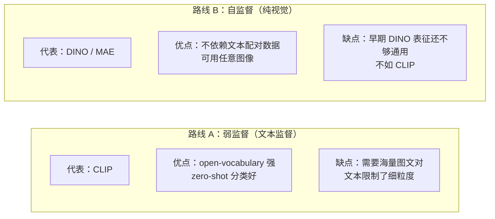
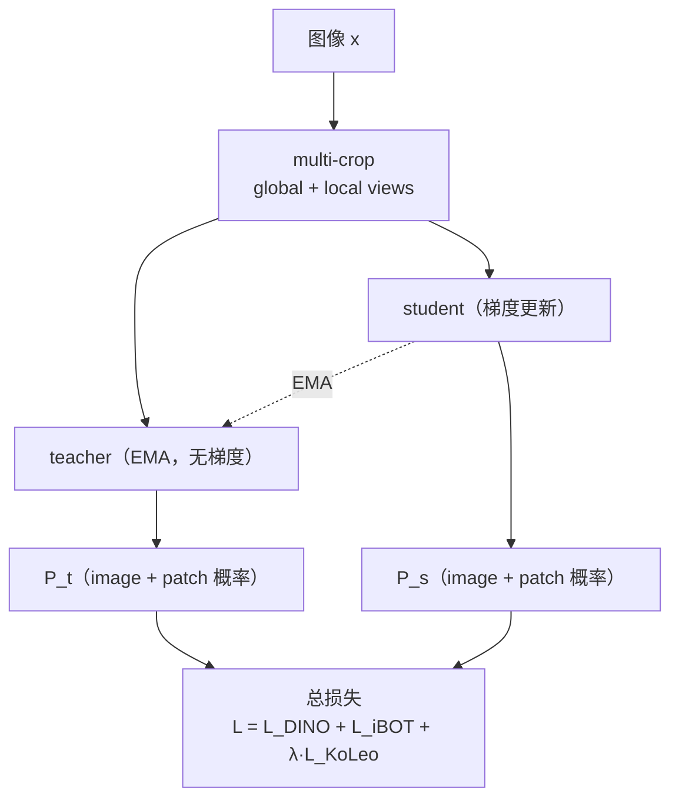
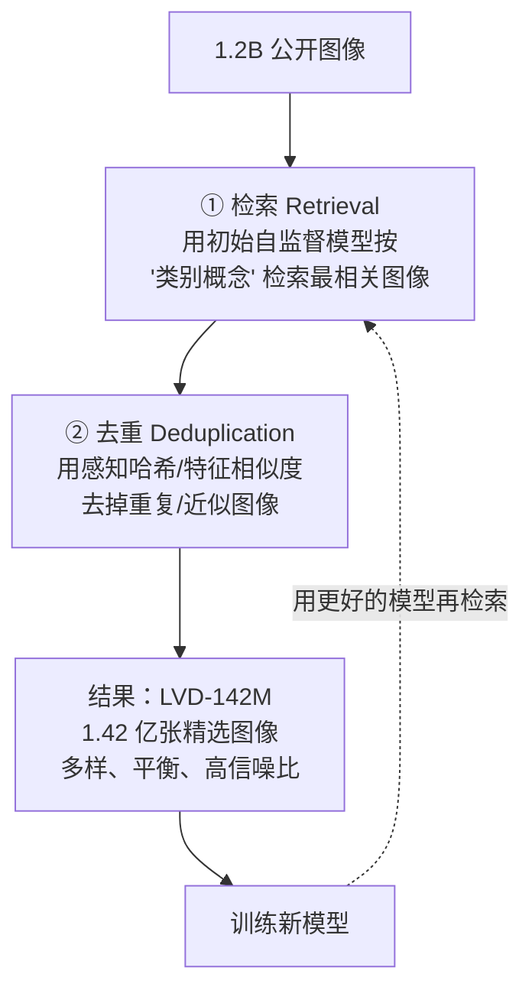
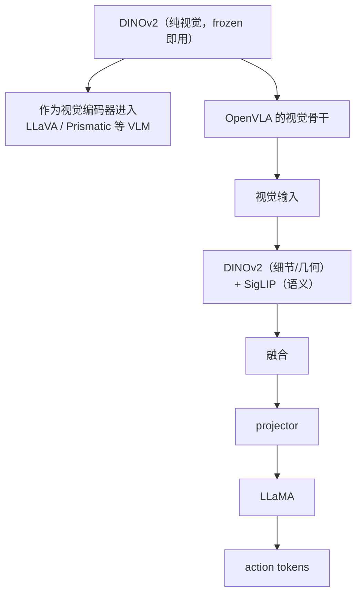
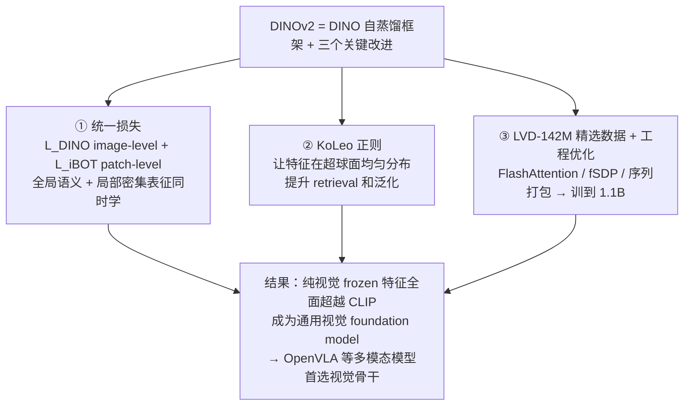

# 论文信息

- **标题**: DINOv2: Learning Robust Visual Features without Supervision
- **作者**: Maxime Oquab, Timothée Darcet, Théo Moutakanni, Huy Vo, Marc Szafraniec, Vasil Khalidov, Pierre Fernandez, Daniel Haziza, Rodrigo Massa, Alaaeldin El-Nouby, Mahmoud Assran, Nicolas Ballas, Wojciech Galuba, Russell Howes, Po-Yao Huang, Shang-Wen Li, Ishan Misra, Michael Rabbat, Vasu Sharma, SyMIC (FAIR + Inria)
- **机构**: Meta AI (FAIR), Inria
- **发表**: 2023 (TMLR 2024)
- **arXiv**: [2304.07193](https://arxiv.org/abs/2304.07193)
- **代码**: [github.com/facebookresearch/dinov2](https://github.com/facebookresearch/dinov2)

> **一句话总结**: DINOv2 把 DINO 的自蒸馏思路工程化到极致：**统一 image-level (DINO) + patch-level (iBOT) 两种自监督损失**，加入 KoLeo 正则化，配合自建的 **LVD-142M 大规模精选数据集**和一系列高效训练技巧（FlashAttention、fSDP、序列打包），训练出**纯视觉、无需任何文本标签的通用视觉 foundation model**。它的 frozen 特征在分类/分割/深度/检索等众多下游任务上**全面碾压 CLIP**，成为 OpenVLA 等多模态模型首选的视觉编码器。

---

# 1. 背景与动机

## 1.1 目标：纯视觉的 foundation model



**DINOv2 的论点：**

- 文本监督（CLIP）会丢失视觉细节 —— 文字"一只狗"描述不了像素级信息
- 纯视觉自监督能学到更精细、更通用的表征
- 目标：把自监督做到 CLIP 级别的通用性（甚至更强），让 frozen 特征直接 transfer 到任意下游任务

## 1.2 相对 DINO 的差距要补什么？

DINO（2021）已证明自监督 ViT 很强，但距离通用 foundation model 还差：

- **① 规模不够**：只训到 ViT-B，数据用 ImageNet 级别
- **② 数据质量**：没有精选大规模数据集
- **③ patch 级表示弱**：DINO 只对齐 image-level，密集预测上不够
- **④ 训练不稳定/低效**：大模型自蒸馏易 collapse，训练慢

**DINOv2 的四大改进：**

- **① 统一损失**：DINO loss + iBOT loss（image + patch 双重监督）
- **② KoLeo 正则**：增强特征分布均匀性，提升 retrieval
- **③ LVD-142M 数据**：自动构建的大规模精选数据集
- **④ 工程优化**：FlashAttention + fSDP + 序列打包，训到 ViT-g（1.1B）

---

# 2. 方法

## 2.1 整体框架（自蒸馏，同 DINO）



teacher = student 的 EMA；centering + sharpening 防 collapse。

## 2.2 统一损失：DINO loss + iBOT loss

**① DINO loss（image-level，来自 DINO）**：对 `[class]` token 的输出做跨视角蒸馏，让全局语义表示跨视角一致。

$$
L_{\text{DINO}} = - \sum P_{t}^{\text{cls}} \cdot \log P_{s}^{\text{cls}} \quad \text{(cross-entropy)}
$$

**② iBOT loss（patch-level，来自 iBOT / masked prediction）**：对 patch token 的输出做蒸馏。部分随机 mask 掉 student 的 patch，teacher 用未 mask 的 patch，强化密集（dense）表征，对分割/检测友好。

$$
L_{\text{iBOT}} = - \sum_{\text{masked patch } i} P_{t}^{i} \cdot \log P_{s}^{i}
$$

**DINOv2 的关键：同时用两者** —— 全局语义 + 局部细节都学到了。

$$
L = L_{\text{DINO}} + L_{\text{iBOT}} + \lambda L_{\text{KoLeo}}
$$

### 2.2.1 官方代码：统一损失的计算（`SSLMetaArch.forward_backward`）

> 取自 `facebookresearch/dinov2` 的 `dinov2/train/ssl_meta_arch.py`。`SSLMetaArch` 把 student / teacher 两条前向、DINO/iBOT/KoLeo 三个损失全部串在一个 `forward_backward` 里：teacher 走 `@torch.no_grad()`（无梯度，EMA 拷贝），student 走正常反向；三个损失加权累加后一次性 `backward()`。

```python
# dinov2/train/ssl_meta_arch.py —— SSLMetaArch.forward_backward（聚焦损失计算，已删去无关分支）
def forward_backward(self, images, teacher_temp):
    # ...
    n_global_crops = 2                         # 全局裁剪固定 2 个（DINO 的 global views）
    n_local_crops = self.cfg.crops.local_crops_number   # 局部裁剪数量（DINO 的 local views）
    global_crops = images["collated_global_crops"].cuda(non_blocking=True)
    local_crops  = images["collated_local_crops"].cuda(non_blocking=True)
    masks = images["collated_masks"].cuda(non_blocking=True)            # iBOT 的随机 mask
    mask_indices_list      = images["mask_indices_list"].cuda(non_blocking=True)
    n_masked_patches       = mask_indices_list.shape[0]                 # 被遮住的 patch 数
    # ...
    ibot_loss_scale = 1.0 / n_global_crops   # iBOT 损失按 global crop 数归一

    # ---------------- teacher 前向（无梯度，EMA 权重） ----------------
    @torch.no_grad()
    def get_teacher_output():
        teacher_backbone_output_dict = self.teacher.backbone(global_crops, is_training=True)
        teacher_cls_tokens       = teacher_backbone_output_dict["x_norm_clstoken"]      # [class] token → DINO 用
        ibot_teacher_patch_tokens = teacher_backbone_output_dict["x_norm_patchtokens"]  # patch token  → iBOT 用
        # ...
        # 对 cls / 被 mask 的 patch 过 head，得到 teacher 的 logits
        tokens_after_head = self.teacher.dino_head(buffer_tensor_teacher)
        teacher_cls_tokens_after_head                = tokens_after_head[:n_cls_tokens]
        masked_teacher_patch_tokens_after_head       = tokens_after_head[n_cls_tokens:n_cls_tokens + n_masked_patches]

        if self.cfg.train.centering == "centering":
            # ★ DINO 的 teacher：softmax + centering + sharpening（除以 teacher_temp 锐化）
            teacher_dino_softmaxed_centered_list = self.dino_loss.softmax_center_teacher(
                teacher_cls_tokens_after_head, teacher_temp=teacher_temp
            ).view(n_global_crops_teacher, -1, *teacher_cls_tokens_after_head.shape[1:])
            # ★ 更新 center：EMA 追踪 teacher 输出均值，防 collapse（继承自 DINO）
            self.dino_loss.update_center(teacher_cls_tokens_after_head)
            if do_ibot:
                # ★ iBOT 的 teacher：同样的 softmax + centering + sharpening，但作用在 masked patch 上
                masked_teacher_ibot_softmaxed_centered = self.ibot_patch_loss.softmax_center_teacher(
                    masked_teacher_patch_tokens_after_head[:, :n_masked_patches], teacher_temp=teacher_temp
                )
                self.ibot_patch_loss.update_center(masked_teacher_patch_tokens_after_head[:n_masked_patches])
        # ...
        return teacher_dino_softmaxed_centered_list, masked_teacher_ibot_softmaxed_centered

    teacher_dino_softmaxed_centered_list, masked_teacher_ibot_softmaxed_centered = get_teacher_output()

    # ---------------- student 前向（有梯度，反向更新） ----------------
    student_global_backbone_output_dict, student_local_backbone_output_dict = self.student.backbone(
        [global_crops, local_crops], masks=[masks, None], is_training=True
    )  # 注意：student 的 global crop 会按 iBOT mask 被遮掉一部分 patch
    student_local_cls_tokens  = student_local_backbone_output_dict["x_norm_clstoken"]
    student_global_cls_tokens = student_global_backbone_output_dict["x_norm_clstoken"]
    # ...
    # student cls / masked-patch logits 都过同一个 dino_head（共享 head，分块用 BlockDiagonalMask 拼成一次前向）
    outputs_list = _attn_bias.split(self.student.dino_head(cat_inputs))

    loss_dict = {}
    loss_accumulator = 0   # 三个损失加权累加，最后一次 backward

    # ===== L_DINO（image-level，cls token 跨视角蒸馏） =====
    # local crops 与 global crops 的 cls token 都要跟 teacher 的 cls 蒸馏对齐
    dino_local_crops_loss = self.dino_loss(
        student_output_list=student_local_cls_tokens_after_head.chunk(n_local_crops),
        teacher_out_softmaxed_centered_list=teacher_dino_softmaxed_centered_list,
    ) / (n_global_crops_loss_terms + n_local_crops_loss_terms)
    loss_accumulator += self.dino_loss_weight * dino_local_crops_loss   # ← 这就是 L_DINO 的 local 项

    dino_global_crops_loss = (
        self.dino_loss(
            student_output_list=[student_global_cls_tokens_after_head],
            # teacher 的两个 global crop 在 get_teacher_output 里被 reverse 拼过：A 配 B
            teacher_out_softmaxed_centered_list=[teacher_dino_softmaxed_centered_list.flatten(0, 1)],
        ) * loss_scales / (n_global_crops_loss_terms + n_local_crops_loss_terms)
    )
    loss_accumulator += self.dino_loss_weight * dino_global_crops_loss  # ← 这就是 L_DINO 的 global 项

    student_cls_tokens = student_global_cls_tokens   # 留给 KoLeo 用

    # ===== L_KoLeo（正则，鼓励 cls token 在超球面均匀分布） =====
    if self.do_koleo:
        koleo_loss = self.cfg.dino.koleo_loss_weight * sum(
            self.koleo_loss(p) for p in student_cls_tokens.chunk(2)
        )   # 注意：两个 global crop 的 cls 分别算 KoLeo，不跨同一张图配对
        loss_accumulator += koleo_loss              # ← 这就是 λ·L_KoLeo

    # ===== L_iBOT（patch-level，masked patch 蒸馏） =====
    if do_ibot:
        ibot_patch_loss = (
            self.ibot_patch_loss.forward_masked(             # 只在被 mask 的 patch 上算交叉熵
                student_global_masked_patch_tokens_after_head,
                masked_teacher_ibot_softmaxed_centered,
                student_masks_flat=masks,
                n_masked_patches=n_masked_patches,
                masks_weight=masks_weight,
            ) * loss_scales * ibot_loss_scale
        )
        loss_accumulator += self.ibot_loss_weight * ibot_patch_loss  # ← 这就是 L_iBOT

    self.backprop_loss(loss_accumulator)   # 三个损失累加后一次性反传
    return loss_dict
```

可以看到整段就是把 $L = L_{\text{DINO}} + L_{\text{iBOT}} + \lambda L_{\text{KoLeo}}$ 一行行落到 `loss_accumulator` 上。

### 2.2.2 官方代码：DINO / iBOT 损失的交叉熵细节

> `DINOLoss`（cls token，image-level）和 `iBOTPatchLoss`（masked patch，patch-level）共享同一套逻辑：teacher 端做 **softmax + centering + sharpening**，student 端在低温度（`student_temp=0.1`）下做 `log_softmax`，二者做交叉熵。下面是两者的核心。

```python
# dinov2/loss/dino_clstoken_loss.py —— L_DINO 的交叉熵（image-level，作用在 cls token 上）
class DINOLoss(nn.Module):
    def __init__(self, out_dim, student_temp=0.1, center_momentum=0.9):
        super().__init__()
        self.student_temp = student_temp          # student 侧锐化温度（小 → 分布更尖）
        self.center_momentum = center_momentum    # center 的 EMA 动量
        self.register_buffer("center", torch.zeros(1, out_dim))   # ★ center 向量，防 collapse 的关键

    @torch.no_grad()
    def softmax_center_teacher(self, teacher_output, teacher_temp):
        self.apply_center_update()
        # ★ teacher：先减 center（centering），再除 teacher_temp（sharpening），最后 softmax
        return F.softmax((teacher_output - self.center) / teacher_temp, dim=-1)

    def forward(self, student_output_list, teacher_out_softmaxed_centered_list):
        # L_DINO = - Σ P_t^cls · log P_s^cls  （对每个 student-teacher 视角对求和再取均值）
        total_loss = 0
        for s in student_output_list:                                  # student 侧：log_softmax(s / student_temp)
            lsm = F.log_softmax(s / self.student_temp, dim=-1)
            for t in teacher_out_softmaxed_centered_list:              # teacher 侧：已 centering+sharpening 过
                loss = torch.sum(t * lsm, dim=-1)
                total_loss -= loss.mean()                              # 负号 → 交叉熵
        return total_loss

    @torch.no_grad()
    def apply_center_update(self):
        # ★ center 用 EMA 追踪 teacher 输出的 batch 均值（跨 GPU all_reduce 后归一）
        # center ← center * momentum + batch_mean * (1 - momentum)
        _t = self.async_batch_center / (self.len_teacher_output * world_size)
        self.center = self.center * self.center_momentum + _t * (1 - self.center_momentum)
```

```python
# dinov2/loss/ibot_patch_loss.py —— L_iBOT 的交叉熵（patch-level，作用在被 mask 的 patch 上）
class iBOTPatchLoss(nn.Module):
    def __init__(self, patch_out_dim, student_temp=0.1, center_momentum=0.9):
        super().__init__()
        self.student_temp = student_temp
        self.center_momentum = center_momentum
        self.register_buffer("center", torch.zeros(1, 1, patch_out_dim))   # patch 维度也有自己的 center

    @torch.no_grad()
    def softmax_center_teacher(self, teacher_patch_tokens, teacher_temp):
        self.apply_center_update()
        # ★ 与 DINO 完全一致：teacher patch 也做 centering + sharpening + softmax
        return F.softmax((teacher_patch_tokens - self.center) / teacher_temp, dim=-1)

    def forward_masked(self, student_patch_tokens_masked, teacher_patch_tokens_masked,
                       student_masks_flat, n_masked_patches=None, masks_weight=None):
        t = teacher_patch_tokens_masked   # teacher 的 masked patch（未遮，原 patch）
        s = student_patch_tokens_masked   # student 的 masked patch（输入端被遮，靠上下文预测）
        # L_iBOT = - Σ_{masked patch i} P_t^i · log P_s^i
        loss = lossfunc(t, s, self.student_temp)        # = Σ t · log_softmax(s / student_temp)
        if n_masked_patches is not None:
            loss = loss[:n_masked_patches]              # 只取真正被 mask 的 patch
        loss = loss * masks_weight                      # 按 mask 权重加权
        return -loss.sum() / student_masks_flat.shape[0]   # 负号 → 交叉熵
```

> **关键对应**：`softmax_center_teacher` 里的 `(teacher_output - self.center) / teacher_temp` 就是 DINO 论文里的 **centering + sharpening**；`update_center` / `apply_center_update` 是 **center 的 EMA 更新**。两者都是防止自蒸馏 collapse 的标准技巧——没有它们，teacher/student 很容易退化成常数输出。

## 2.3 KoLeo 正则化

**动机**：希望学到的特征在空间中分布均匀（避免特征坍缩到某个子空间，提升 retrieval/泛化）。

KoLeo（Kolmogorov-Leonov）正则鼓励一个 batch 内的特征向量相互"撑开"（类似球面均匀分布）。给定 batch 内 $N$ 个归一化特征 $f_{1},\dots,f_{N}$，定义每个 $f_{i}$ 到最近邻的距离 $d_{i}$，则 $L_{\text{KoLeo}}$ 鼓励 $d_{i}$ 尽量大（特征点在超球面上尽量分散）。

$$
L_{\text{KoLeo}} = -\frac{1}{N}\sum_{i=1}^{N} \log\left( d_{i} + \epsilon\right), \quad d_{i} = \min_{j\neq i}\|f_{i}-f_{j}\|
$$

**效果**：提升 image retrieval（检索任务）；让 frozen 特征更通用。

### 2.3.1 官方代码：KoLeo 正则的实现（`KoLeoLoss`）

> 取自 `dinov2/loss/koleo_loss.py`。先把特征 L2 归一化（推到单位球面上），再用内积矩阵找 batch 内每个样本的**最近邻**，求最近邻距离，最后按公式取 `-log(d + eps)` 的均值。

```python
# dinov2/loss/koleo_loss.py —— KoLeo（Kozachenko-Leonenko）熵正则
class KoLeoLoss(nn.Module):
    """Kozachenko-Leonenko entropic loss regularizer
       from Sablayrolles et al. - 2018 - Spreading vectors for similarity search"""
    def __init__(self):
        super().__init__()
        self.pdist = nn.PairwiseDistance(2, eps=1e-8)   # L2 距离（带小 eps 防 0）

    def pairwise_NNs_inner(self, x):
        """对 L2 归一化后的向量，用内积近似找每个样本的最近邻。"""
        dots = torch.mm(x, x.t())                       # 内积矩阵（归一化后 = 余弦相似度）
        n = x.shape[0]
        dots.view(-1)[:: (n + 1)].fill_(-1)             # 把对角线置 -1，避免把自己当最近邻
        _, I = torch.max(dots, dim=1)                   # 内积最大 ⇔ 距离最小 → 拿到最近邻下标 I
        return I

    def forward(self, student_output, eps=1e-8):
        with torch.cuda.amp.autocast(enabled=False):
            student_output = F.normalize(student_output, eps=eps, p=2, dim=-1)  # ★ 先推到单位球面
            I = self.pairwise_NNs_inner(student_output)                          # 每个 i 的最近邻下标
            distances = self.pdist(student_output, student_output[I])            # d_i = ||f_i - f_{NN(i)}||
            loss = -torch.log(distances + eps).mean()                            # ★ L_KoLeo = -1/N Σ log(d_i + eps)
            return loss
```

> **关键对应**：`F.normalize(..., p=2)` = 公式里"归一化特征"；`pairwise_NNs_inner` 找到的 `I` = 最近邻 $j^{*}$；`self.pdist(f_i, f_{I[i]})` = $d_{i}=\min_{j\neq i}\|f_{i}-f_{j}\|$；最后 `-log(d+eps).mean()` 就是 $L_{\text{KoLeo}}$。最大化 $d_i$ ⇔ 最小化 $-\log(d_i)$，逼特征互相撑开。

## 2.4 高效训练技巧（把模型训到 1.1B 的工程关键）

要把 ViT-g（1.1B 参数）自蒸馏训稳，需要大量工程：

- **① FlashAttention**：把 attention 的 $O(N^{2})$ 内存降到 $O(N)$，训练更快更省显存
- **② fSDP（Fully Sharded Data Parallel）**：分片并行，让大模型在有限 GPU 上可训
- **③ 序列打包（sequence packing / sample packing）**：把不同长度的样本拼到一个长序列里，减少 padding 浪费，大幅提升 GPU 利用率
- **④ EMA teacher + centering/sharpening**：防 collapse，训练稳定（继承自 DINO）
- **⑤ 高分辨率 fine-tune**：大部分训练在低分辨率，最后阶段升到高分辨率微调

### 2.4.1 官方代码：teacher 的 EMA 更新（`update_teacher`）

> 取自 `dinov2/train/ssl_meta_arch.py`。teacher 不参与反传，每个 step 用 student 权重做 EMA 拷贝：`θ_t ← m·θ_t + (1-m)·θ_s`，`m` 随训练逐步增大（cosine schedule，越后期 teacher 越"懒"）。

```python
# dinov2/train/ssl_meta_arch.py —— teacher EMA 更新（无梯度，逐参数 foreach 操作）
def update_teacher(self, m):
    # m = teacher EMA 动量（越大 teacher 越不变；DINOv2 用 cosine schedule 让 m 从小到大）
    student_param_list = []
    teacher_param_list = []
    with torch.no_grad():
        for k in self.student.keys():
            for ms, mt in zip(get_fsdp_modules(self.student[k]), get_fsdp_modules(self.teacher[k])):
                student_param_list += ms.params
                teacher_param_list += mt.params
        # ★ θ_t ← m · θ_t + (1 - m) · θ_s  （foreach 向量化，比逐个赋值快得多）
        torch._foreach_mul_(teacher_param_list, m)
        torch._foreach_add_(teacher_param_list, student_param_list, alpha=1 - m)
```

> 配合 `train()` 里把 teacher 永远置为 `eval()` 模式（`self.teacher.eval()`），保证 teacher 的 BN/Dropout 行为稳定。center 的 EMA 更新见上面 2.2.2 节 `apply_center_update`（同样的 `center ← center·momentum + batch_mean·(1-momentum)`）。

## 2.5 LVD-142M 数据集（核心贡献之一）

**问题**：没有公开的大规模高质量图像数据集（CLIP 用私有 WIT/LAION 有噪声）。
**目标**：自动构建一个"干净、多样、大规模"的纯图像数据集。

**构建流程（无需人工标注）：**



**⭐ 关键：数据是反复迭代的（self-improving data pipeline）** —— 用模型 A 检索数据 → 训模型 B → 用 B 再检索 → 训模型 C ...

---

# 3. 模型规模

| 模型 | Params | Layers | Hidden D | Heads |
|------|--------|--------|----------|-------|
| ViT-S | 21M | 12 | 384 | 6 |
| ViT-B | 86M | 12 | 768 | 12 |
| ViT-L | 300M | 24 | 1024 | 16 |
| ViT-g | **1.1B** | 40 | 1408 | 16 |

- ViT-g 是当时最大的纯自监督视觉模型之一
- 所有模型都基于 patch 14（$P=14$）

---

# 4. 实验

## 4.1 frozen 特征 + linear probing（无需微调）

**ImageNet linear probing（top-1）：**

| 方法（frozen 特征） | top-1 |
|------|-------|
| CLIP（ViT-L/14） | 83.0 |
| OpenCLIP | ~83 |
| MAE（ViT-L） | 75.8 |
| DINO（ViT-B） | 78.2 |
| **DINOv2（ViT-L/14）** | **86.7** ← 超越 CLIP！ |
| **DINOv2（ViT-g/14）** | **87.1** |

**结论**：纯视觉自监督 > 文本监督（CLIP）；证明文本不是必需的。

## 4.2 多任务 frozen 评估（DINOv2 最强的地方）

不用任何微调，直接用 frozen 特征 + 轻量 head，在多个任务评测：

| 任务 | CLIP-L | DINOv2-L |
|------|--------|----------|
| ImageNet linear | 83.0 | 86.7 |
| 分割（ADE20K linear） | 中等 | 更强 |
| 深度估计（NYUd） | 弱 ← CLIP 文本监督学不好深度 | 强 |
| 图像检索 | 弱 | 强 ← KoLeo 正则带来的 |
| Video（动作识别） | - | 强 |

**关键结论**：DINOv2 的 frozen 特征在"几何/密集"任务上远超 CLIP，因为它学的是纯像素视觉信息，不受文本描述限制。→ 这正是 OpenVLA 选它做视觉编码器的原因之一。

## 4.3 与 CLIP 的互补性

- **CLIP** → 擅长"语义/概念"对齐（open-vocabulary 分类）
- **DINOv2** → 擅长"几何/细节/密集"表征（分割/深度/定位）
- 二者互补！OpenVLA 同时用 DINOv2 + SigLIP 两个编码器，把 CLIP 语义 + DINOv2 几何都拿走

---

# 5. 对 VLA / VLM 的意义



**为什么 DINOv2 适合 VLA？**

- ① frozen 特征强，无需微调即可用 → 节省训练成本
- ② 包含细粒度几何信息 → 机器人需要精确空间感知
- ③ 纯视觉，不依赖图文配对 → 训练数据灵活

---

# 6. 核心要点总结



## 与 CLIP 的对比一句话

- **CLIP**：视觉 ↔ 文本 对齐（对比），学语义概念，frozen 密集任务弱
- **DINOv2**：纯视觉自蒸馏（image+patch），学几何细节，frozen 密集任务强
- 二者在 OpenVLA 里被组合使用，取长补短

---

# 7. 参考资料

- **DINOv2 原论文**: Oquab et al., "DINOv2: Learning Robust Visual Features without Supervision", TMLR 2024, [arXiv:2304.07193](https://arxiv.org/abs/2304.07193)
- **官方代码**: [github.com/facebookresearch/dinov2](https://github.com/facebookresearch/dinov2)
- **DINO**: Caron et al., ICCV 2021, [arXiv:2104.14294](https://arxiv.org/abs/2104.14294) (自蒸馏基础)
- **iBOT**: Zhou et al., ICLR 2022, [arXiv:2111.07832](https://arxiv.org/abs/2111.07832) (masked patch + DINO)
- **KoLeo 正则**: Sablayrolles et al., NeurIPS 2018 ("Spreading vectors for similarity search")
- **CLIP**: Radford et al., ICML 2021, [arXiv:2103.00020](https://arxiv.org/abs/2103.00020) (对比基线)
- **MAE**: He et al., CVPR 2022 (另一支自监督)
- **Prismatic VLM**: Karamcheti et al., 2024 (DINOv2+SigLIP 双编码器 VLM, OpenVLA 的基础)
- **OpenVLA**: Kim et al., 2024, [arXiv:2406.09246](https://arxiv.org/abs/2406.09246)
