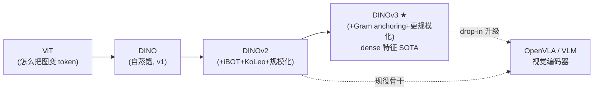
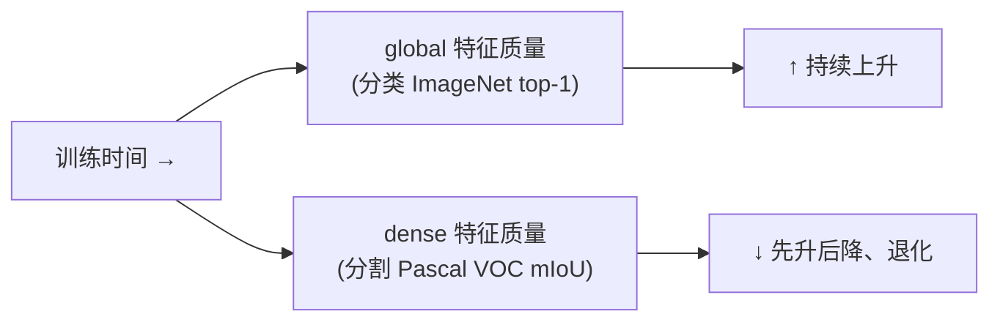
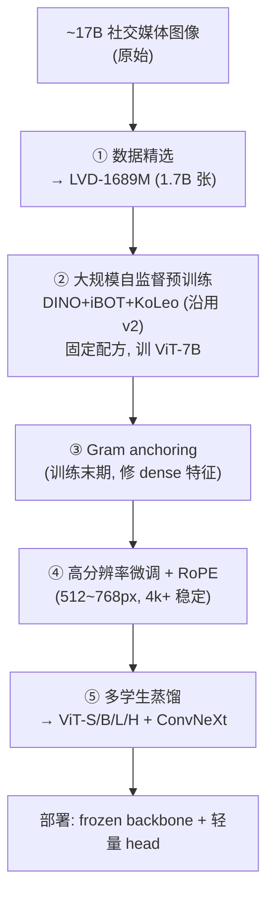
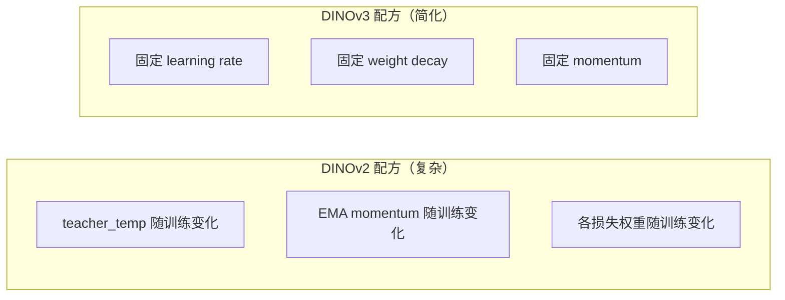
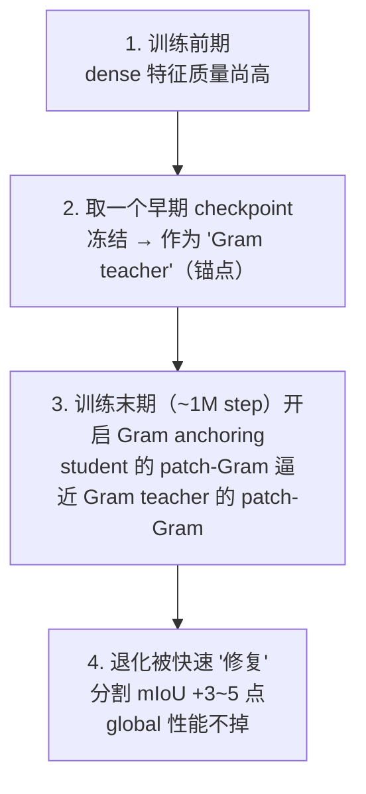
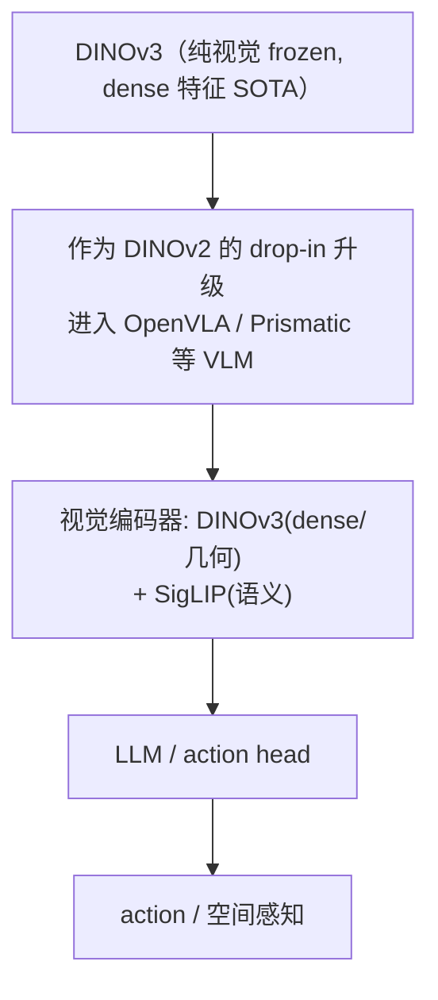
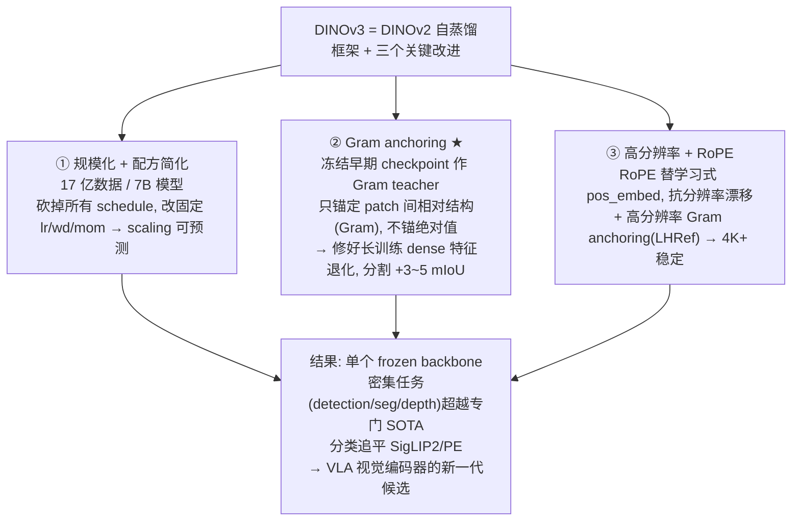

# 论文信息

- **标题**: DINOv3
- **作者**: Oriane Siméoni, Huy V. Vo, Maximilian Seitzer, Federico Baldassarre, Maxime Oquab, Cijo Jose, Vasil Khalidov, Marc Szafraniec, Seungeun Yi, Michaël Ramamonjisoa, Francisco Massa, Daniel Haziza, Luca Wehrstedt, Jianyuan Wang, Timothée Darcet, Théo Moutakanni, Leonel Sentana, Claire Roberts, Andrea Vedaldi, Jamie Tolan, John Brandt, Camille Couprie, **Julien Mairal**, Hervé Jégou, Patrick Labatut, **Piotr Bojanowski**（FAIR）
- **机构**: Meta AI (FAIR)
- **发表**: 2025-08-13（技术报告）
- **arXiv**: [2508.10104](https://arxiv.org/abs/2508.10104)
- **代码**: [github.com/facebookresearch/dinov3](https://github.com/facebookresearch/dinov3)（训练代码 + 预训练权重，**商用许可**）
- **官方博客**: [ai.meta.com/blog/dinov3-self-supervised-vision-model/](https://ai.meta.com/blog/dinov3-self-supervised-vision-model/)

> **一句话总结**: DINOv3 是 Meta 自监督视觉 foundation model 的第三代。它在 DINOv2（image+patch 自蒸馏 + KoLeo）基础上做了两件关键的事：**① 规模化**（数据从 1.42 亿涨到 **17 亿**张、模型从 1.1B 涨到 **7B**，并**砍掉 DINOv2 一大堆随训练变化的超参 schedule** 改用固定配方，让规模化可预测）；**② Gram anchoring**——一个新损失，专门解决"长训练里 **dense（patch 级）特征退化**"这个 v2 时代的老大难问题。结果：**单个 frozen backbone、不做任何微调**，就在检测/分割/深度等密集任务上超越专门 SOTA，在分类上追平甚至超过 SigLIP 2 / Perception Encoder。

---

# 0. 在 VLA 路线中的位置



DINOv3 和 DINOv2 一样是**纯视觉自监督**编码器，定位在 **阶段 1（视觉表征）**。它最直接的工程价值：**作为 DINOv2 的 drop-in 升级**——frozen 特征更强（尤其密集任务），在 OpenVLA 这类"视觉编码器 + LLM"架构里几乎可直接替换。阅读本文前建议先读 [DINOv2](DINOv2.md) 和 [DINO](DINO/DINO.md)。

---

# 1. 背景与动机：DINOv2 遗留的两个问题

DINOv2 已经很强（frozen 特征全面超越 CLIP），但把它继续往上推（更大模型、更长训练）时撞到两堵墙。

## 1.1 问题一：dense 特征会随训练"退化"（v2 时代已知但没解决）

> **术语速查**：
> - **global 特征**：把一整张图压成一个向量（即 `[cls]` token），用于"这张图是猫还是狗"（分类）。
> - **dense / local 特征**：每个 patch（图像小块）一个向量，保留空间细节，用于"哪个像素属于哪个物体"（分割/检测/深度）。

DINOv2 自蒸馏同时优化 image-level（DINO）和 patch-level（iBOT）两种目标，本意是 global 和 dense 都强。但实际长训练里会出现一个**此消彼长**：



- 训练越久，**global 特征继续变好**（分类还在涨）；
- 但 **dense 特征会退化**——本该区分开的 patch 开始坍缩成相似的 embedding，分割/深度性能掉下去。

**为什么？** patch 特征为了服务全局语义，逐渐"抹平"了局部的判别性。这是把模型做大、训练拉长时的稳定性问题。DINOv2 论文里也观察到这个 tradeoff，但没有系统性解法。

## 1.2 问题二：训练配方"臭名昭著"地复杂

DINOv2 为了把 1.1B 自蒸馏训稳，叠了大量**随训练过程变化**的超参 schedule（teacher 温度、EMA momentum、各损失权重等都随 epoch/step 变）。后果：**很难预测**"数据翻倍、模型翻倍后性能会怎样"，规模化时全靠手调。

## 1.3 DINOv3 要补什么

| v2 遗留问题 | DINOv3 的应对 |
|---|---|
| dense 特征退化 | **Gram anchoring**（新损失，核心创新，见 §2.3） |
| 训练配方复杂、规模化不可预测 | **砍掉所有 schedule，改用固定 lr / weight-decay / momentum**，让 scaling 可估算（§2.2） |
| 模型只到 1.1B、数据 1.42 亿 | **规模化到 7B 模型 + 17 亿数据**（§2.2） |
| 只给 ViT、不够"部署友好" | 蒸馏出 ViT-S/B/L/H+ **和 ConvNeXt T/S/B/L** 全家桶（§2.5） |

---

# 2. 方法

## 2.1 整体 pipeline（一条多阶段流水线）

DINOv3 不只是"一个模型"，而是一套**模型开发流程**：



> 对比 v2：v2 基本是"② + 一点 ④"。v3 多了 **Gram anchoring（③）** 和 **高分辨率 RoPE 重构（④）**，并把蒸馏（⑤）做成了系统的多学生流程。

## 2.2 规模化 + 简化配方

**规模**：数据 **×12**（1.42 亿 → 17 亿，从 ~17B 社交图像里精选），模型 **×7**（1.1B → **ViT-7B**）。

**配方的关键简化（很容易被忽略，但极重要）**：



- 砍掉**所有**随训练变化的超参 schedule，全程用**固定的** learning rate / weight decay / momentum。
- 好处：**规模化变得可预测**——可以可靠估算"再加大数据/模型，性能会到哪"，而不用每次重新手调一堆 schedule。这其实是为 7B 这个规模能训起来铺路。

## 2.3 Gram anchoring（核心创新）

这是 DINOv3 唯一的**新算法**，专门对付 §1.1 的 dense 特征退化。

### 2.3.1 直觉：锚定"相对结构"，不锚定"绝对值"

> **术语速查——Gram matrix（格拉姆矩阵）**：把一组向量两两做内积，得到一个方阵。它刻画的是这组向量之间的**两两相似/相关结构**（哪些 patch 相似、哪些不同），而不是每个向量本身的绝对取值。在风格迁移里它常被用来表示"风格/纹理结构"。

朴素想法是"直接把 student 的 patch 特征逼回到某个好 checkpoint 的 patch 特征"——但这等于**不让模型继续学**，global 特征也别想再涨了。

Gram anchoring 的巧思：**只锚定 patch 之间的"相对关系"（Gram 矩阵），不锚定每个 patch 的绝对取值**。

- 这允许局部特征**整体自由演化**（继续学习、提升语义）；
- 但要求它们**彼此间的相似结构保持稳定**（该不同的 patch 依然不同、该相似的依然相似）；
- 于是 global 特征能继续涨，dense 特征的判别性又不丢。

### 2.3.2 机制（四步）



1. **训练前期**，dense 特征质量还很高（没退化）。
2. 取一个**早期 checkpoint，冻结**，它就是 **Gram teacher**（Gram 锚点）。
3. **训练末期**（约 1M iterations 之后，dense 特征已开始退化时）开启 Gram anchoring 损失：在每个 batch 里，让 **student 的 Gram 矩阵**（patch 两两相似度）逼近 **Gram teacher 的 Gram 矩阵**。
4. 退化的 dense 特征被快速"修复"——分割 mIoU 回升 3~5 点，而 global（分类）性能**不受影响**。

> **为什么放在训练末期才开？** 出于效率：训练前期 dense 特征本来就好，不需要额外约束；只在它开始退化时才拉一把。论文里这一步叫 **LRef**（low-res Gram anchoring），后面还接 **LHRef**（high-res Gram anchoring，见 §2.4）。

### 2.3.3 数学形式

设一张图的 patch 特征为 $F \in \mathbb{R}^{N\times D}$（$N$ 个 patch，每个 $D$ 维）。先归一化（只看方向、不看绝对值），其 Gram 矩阵为：

$$
G(F) = \hat{F}\hat{F}^{\top} \in \mathbb{R}^{N\times N}, \qquad \hat{F} = \frac{F}{\|F\|_{2,\text{per-row}}}
$$

$G_{ij}$ 就是 patch $i$ 和 patch $j$ 的（归一化后）相似度，描述的是**相对结构**。Gram anchoring 损失就是让 student 的 Gram 逼近锚点 Gram：

$$
L_{\text{Gram}} = \big\|\, G(F_{\text{student}}) - G(F_{\text{anchor}}) \,\big\|^{2}
$$

> 注意：它只约束 $G_{ij}$（两两相对关系），**不约束** $F_{\text{student}}$ 的绝对值。这就是 §2.3.1 那个"锚定相对结构、放开绝对值"的直觉的数学落地。

### 2.3.4 参考实现（按论文机制复刻的示意代码，非官方原码）

> ⚠️ 下面这段是**按论文机制写的示意实现**（方便理解），**不是从 `facebookresearch/dinov3` 复制的官方原码**。官方完整实现见 [github.com/facebookresearch/dinov3](https://github.com/facebookresearch/dinov3)。核心就两点：① 算 Gram 矩阵前先做逐 patch 的 L2 归一化（只看相对方向）；② 用 MSE 把 student 的 Gram 拉向**冻结**的 anchor 的 Gram。

```python
# 参考/示意实现：Gram anchoring 的核心（按论文机制复刻，非官方原码）
import torch
import torch.nn.functional as F

@torch.no_grad()
def gram_matrix(patch_feats):
    """
    patch_feats: (B, N, D) —— 一张图 N 个 patch 的特征。
    返回 (B, N, N)：每个 patch 和其它 patch 的相似结构（Gram 矩阵）。
    关键：先逐行 L2 归一化 → 内积 = 余弦相似度，只反映“相对方向”，与绝对幅值无关。
    """
    p = F.normalize(patch_feats, dim=-1)              # (B, N, D) —— 逐 patch 归一化
    G = torch.bmm(p, p.transpose(1, 2))              # (B, N, N) —— patch_i · patch_j
    return G

def gram_anchoring_loss(student_patch_feats, anchor_patch_feats):
    """
    student_patch_feats : (B, N, D) —— 当前 student（有梯度）
    anchor_patch_feats  : (B, N, D) —— 冻结的早期 Gram teacher（无梯度）
    让 student 的 patch 相对结构（Gram）逼近早期锚点。
    """
    G_s = gram_matrix(student_patch_feats)            # student 的 Gram
    G_a = gram_matrix(anchor_patch_feats.detach())    # 早期 Gram teacher 的 Gram
    # L_Gram = MSE(G_s, G_a)：只约束两两相对关系，不约束单个 patch 的绝对取值
    return F.mse_loss(G_s, G_a)
```

> **关键对应**：`F.normalize(..., dim=-1)` = 公式里的 $\hat{F}$；`torch.bmm(p, p.transpose(1,2))` = $G=\hat{F}\hat{F}^{\top}$；`.detach()` 保证 anchor 是固定的锚点；`F.mse_loss` = $\|G_{\text{student}}-G_{\text{anchor}}\|^2$。锚定的是"哪些 patch 相似"的结构，不是"特征具体等于多少"。

## 2.4 高分辨率 + RoPE（让 dense 特征在 4K+ 也稳）

第三块改进是围绕**高分辨率**的，目标是让 dense 特征在大图上更细、更稳。


- **RoPE（Rotary Position Embedding）替换 v2 的学习式绝对位置编码**：RoPE 用旋转编码相对位置，**天然适应不同分辨率**，不需要 v2 那套 pos_embed 插值（[[DINO]] repro 里为 multi-crop 做的双三次插值就是为了解决这个）。再配 **RoPE jittering**（训练时对位置加随机扰动），跨尺度更稳。
- **高分辨率微调阶段**：训练末期升到 512~768px；更狠的是 **LHRef（高分辨率 Gram anchoring）**——把高分辨率图喂给 Gram teacher、再把输出下采样，比直接用低分辨率产生**更强的 dense 学习信号**。
- 结果：特征图在 **4K+ 分辨率**下仍稳定（论文给了 cosine 相似度可视化的对比，LHRef 后显著更干净）。

## 2.5 post-hoc 适应 + 多学生蒸馏（部署友好）

- **frozen backbone + 轻量 head**：核心 backbone 训完后**冻结**，下游只训线性 probe / adapter，一次前向可同时喂多个任务（检测、分割、检索……），推理成本被多任务摊薄——对边缘/机器人很关键。
- **多学生蒸馏（multi-student distillation）**：ViT-7B 太大，用蒸馏一次训出**多个小模型**（ViT-S/B/L/H+），还额外提供 **ConvNeXt T/S/B/L**（29M~198M）给算力/内存受限场景。蒸馏 pipeline 一并开源。

> **post-hoc**（事后）是论文用词，指"骨干训完、冻结之后"再加的灵活性：换分辨率、换模型大小、对齐文本，都不用重训骨干。

---

# 3. 模型家族（distilled variants）

| 类型 | 变体 | 用途 |
|---|---|---|
| ViT（教师） | **ViT-7B** | 自监督训练出来的原始大模型 |
| ViT（蒸馏） | ViT-S / B / L / H+ | 从 7B 蒸馏，通用主力 |
| ConvNeXt | T / S / B / L（29M~198M） | 资源受限场景（边缘/移动/机器人） |
| 卫星专用 | MAXAR 图像预训练 backbone | 遥感/地理任务 |

ConvNeXt 系列在分类/分割/深度上**超过 ImageNet-22K 有监督预训练的同尺寸模型**——说明蒸馏把 7B 的自监督知识有效搬到了小模型里。

---

# 4. 实验

## 4.1 总体定位：frozen backbone 超越专门 SOTA

- **首次**：单个 frozen 视觉 backbone，在检测、语义分割、相对深度等多个密集任务上**无需微调**就超越专门模型。
- 分类上**追平或超过** SigLIP 2、Perception Encoder 等最强近作。
- 横向比较里也超过 EVA-02、DPT、Marigold、Depth-Anything-v2 等具体任务 SOTA。

## 4.2 相对 DINOv2 的提升（dense 任务为主）

| 任务 / 指标 | 提升幅度（相对 v2） |
|---|---|
| 语义分割 ADE20K | **+6 mIoU** |
| 视频跟踪（J&F-Mean） | **+6.7** |
| 实例检索（GAP） | **+10.9** |
| Pascal VOC 分割（Gram anchoring 单项贡献） | **+3~5 mIoU** |
| ImageNet 分类 top-1 | 追平/超过 CLIP 类弱监督方法 |

> **关键观察**：提升几乎全来自 **dense 任务**——这正是 Gram anchoring 修好 dense 特征退化的直接体现。global（分类）本来 v2 就不弱，v3 主要是把 v2 的短板（密集特征）补齐并拉到 SOTA。

## 4.3 真实落地案例

- **世界资源研究所（WRI）**：用 DINOv3 分析卫星图监测森林砍伐/恢复。在肯尼亚测树冠高度，平均误差从 DINOv2 的 **4.1 米降到 1.2 米**，可用于自动核验气候补偿、加速对小型保护项目的资助。
- **NASA JPL**：已用 DINO 系列给火星探测机器人做视觉（一次前向同时跑多个任务、算力极省），DINOv3 更强更通用。
- **跨模态**：同一算法直接换数据训卫星/医疗/内窥镜等"标注稀缺"领域，证明学到的是通用视觉表征。

---

# 5. 对 VLA / VLM 的意义



**为什么对 VLA 重要**：

- ① **dense 特征更强** → 机器人/具身智能最需要的就是**精确空间感知**（哪个像素是可抓物体、桌面深度、障碍边界），这正是 DINOv3 相对 v2 进步最大的地方。
- ② **frozen 即 SOTA** → 作为视觉编码器无需微调，省训练成本，且推理可多任务共享。
- ③ **纯视觉、不依赖图文配对** → 训练数据灵活，可按领域（机器人示教、遥测、医疗）定制预训练。
- ④ **蒸馏出 ConvNeXt 小模型** → 给算力受限的边缘机器人部署留了路。

> 现役 OpenVLA 用的是 DINOv2 + SigLIP 双编码器。随着 DINOv3 开源 + 商用许可 + 全尺寸蒸馏权重发布，可以预期下一代 VLA 会逐步把 DINOv2 换成 DINOv3，**尤其吃 dense 特征红利的空间感知/操作类任务**。

---

# 6. 核心要点总结



## 与 DINOv2 的对比一句话

- **DINOv2**：自蒸馏 + DINO/iBOT/KoLeo + LVD-142M，证明**纯视觉能超越 CLIP**；短板是长训练 dense 特征会退化。
- **DINOv3**：在 v2 基础上**规模化**（17 亿图 / 7B）+ **Gram anchoring** 修好 dense 退化 + **RoPE 高分辨率**；frozen 特征在密集任务上**绝对 SOTA**。
- 对 VLA：DINOv3 是 DINOv2 的**自然升级**，尤其利好需要精确空间感知的机器人任务。

---

# 7. 参考资料

- **DINOv3 原论文（技术报告）**: Siméoni et al., "DINOv3", 2025, [arXiv:2508.10104](https://arxiv.org/abs/2508.10104)
- **官方代码 + 预训练权重（商用许可）**: [github.com/facebookresearch/dinov3](https://github.com/facebookresearch/dinov3)
- **Meta 官方博客**: [DINOv3: Self-supervised learning for vision at unprecedented scale](https://ai.meta.com/blog/dinov3-self-supervised-vision-model/)
- **DINOv2（前作）**: Oquab et al., [arXiv:2304.07193](https://arxiv.org/abs/2304.07193)，精读见 [DINOv2](DINOv2.md)
- **DINO（自蒸馏基础）**: Caron et al., ICCV 2021, [arXiv:2104.14294](https://arxiv.org/abs/2104.14294)，精读见 [DINO](DINO/DINO.md)
- **iBOT**: Zhou et al., ICLR 2022, [arXiv:2111.07832](https://arxiv.org/abs/2111.07832)（patch 级自蒸馏，DINOv2/v3 的 dense 损失来源）
- **RoPE**: Su et al., "RoFormer", [arXiv:2104.09864](https://arxiv.org/abs/2104.09864)（旋转位置编码，DINOv3 用它替换学习式绝对位置编码）
- **第三方深度解读（本文技术细节交叉核对来源）**:
  - Lightly AI – [DINOv3 Explained: Technical Deep Dive](https://www.lightly.ai/blog/dinov3)
  - Encord – [DINOv3 Explained: Scaling Self-Supervised Vision Transformers](https://encord.com/blog/dinov3-explained-scaling-self-supervised-vision-tr/)
- **OpenVLA（下游应用）**: Kim et al., 2024, [arXiv:2406.09246](https://arxiv.org/abs/2406.09246)（现役用 DINOv2+SigLIP，DINOv3 可 drop-in 升级）
