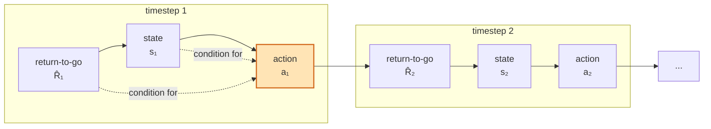
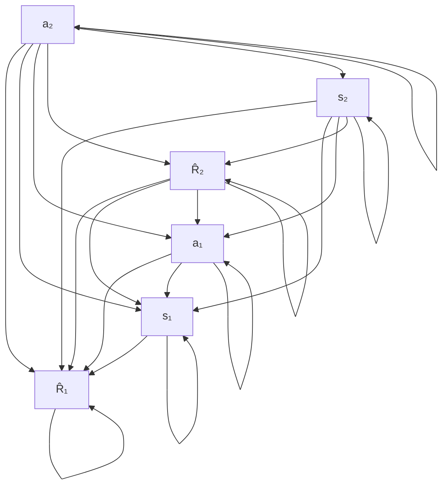
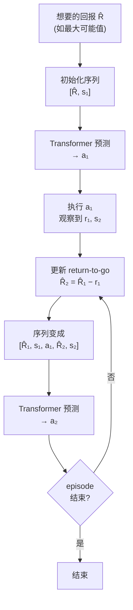
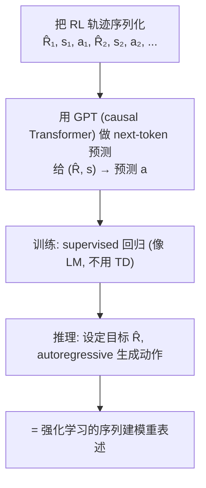
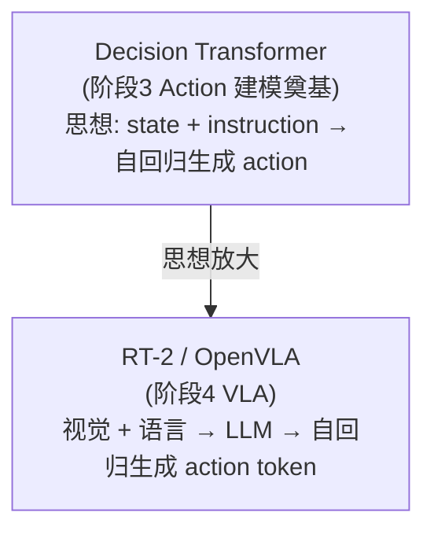

# 论文信息

- **标题**: Decision Transformer: Reinforcement Learning via Sequence Modeling
- **作者**: Lili Chen, Aravind Rajeswaran, Kimin Lee, Aditya Grover, Michael Laskin, Pieter Abbeel, Aravind Srinivas, Igor Mordatch
- **机构**: UC Berkeley, Facebook AI Research
- **发表**: NeurIPS 2021
- **arXiv**: [2106.01345](https://arxiv.org/abs/2106.01345)
- **代码**: [github.com/kzl/decision-transformer](https://github.com/kzl/decision-transformer)

> **一句话总结**: Decision Transformer (DT) 颠覆了强化学习的传统范式——它**不用 value function、不用 policy gradient、不用 TD 学习**，而是把一条轨迹 (trajectory) 表述成 $\hat{R}, s, a$ 三种 token 交替的序列，直接用一个 **GPT (causal Transformer)** 做序列建模：给定**目标回报 (return-to-go) $\hat{R}$ 和当前状态 $s$**，自回归地预测动作 $a$。实验证明，在 Atari 和 D4RL 上这种纯序列建模方法能**超越传统的离线 RL (TD3+BC, CQL)**。DT 是 "把决策当成序列生成" 思想的奠基，直接启发了后来 VLA 里 "把 action 当 token 自回归生成" 的范式 (RT-2 / OpenVLA)。

---

# 1. 背景与动机

## 1.1 传统 RL 范式的复杂与不稳定

强化学习 (RL) 的传统三大范式：

**① Value-based (Q-learning, DQN, SAC)**：学 $Q(s,a)$，用 TD (时序差分) 更新
→ 需要 bootstrap，误差累积，超参敏感

**② Policy Gradient (REINFORCE, PPO)**：沿策略梯度更新
→ 方差大，需要 on-policy 采样，样本效率低

**③ Model-based**：学环境模型再规划
→ 模型误差，计算贵

共同问题：

- 训练不稳定，难调
- 需要大量在线交互
- 离线 (offline) RL 尤其难 (distributional shift)

## 1.2 DT 的提问：RL 能否像语言建模一样简单？

NLP 里：GPT 用 next-token prediction 一次性解决几乎所有序列任务，极其稳定（就是监督学习！）

DT 的赌注：能否把 RL 问题重新表述成一个序列建模问题？

- 用 GPT 那套方法 (causal Transformer + supervised next-token)
- 不需要 value function，不需要 bootstrap
- 训练像监督学习一样稳定

## 1.3 关键洞察：把 return 当条件

传统 RL：学习 $\pi(a|s)$ 或最优策略，最大化期望回报。

DT 的关键重新表述：不直接学 $\pi(a|s)$，而是学 $\pi(a \mid \hat{R}, s)$

其中 $\hat{R}$ = return-to-go = 从当前时刻到 episode 结束的剩余累积回报：

$$\hat{R}_t = \sum_{t'=t}^{T} r_{t'}$$

直觉：

- 告诉模型 "我想要多大回报 $\hat{R}$" + "当前状态 $s$"
  → 模型生成 "达到该回报所需的动作 $a$"

推理时：想要高回报？就把 $\hat{R}$ 设成大值 → 模型生成相应动作（条件生成，不需要规划/value）。

---

# 2. 方法

## 2.1 轨迹的序列化

一条 RL trajectory：

$$(s_1, a_1, r_1, s_2, a_2, r_2, \ldots, s_T, a_T, r_T)$$

Decision Transformer 把它重排成 token 序列：

$$\hat{R}_1, s_1, a_1, \hat{R}_2, s_2, a_2, \hat{R}_3, s_3, a_3, \ldots$$

其中：

- $\hat{R}_t$ = return-to-go = $\sum_{t'=t}^{T} r_{t'}$ （从 $t$ 到结束的总回报）
- $s_t$ = 状态 token
- $a_t$ = 动作 token

顺序很关键：$\hat{R}_t \rightarrow s_t \rightarrow a_t \rightarrow \hat{R}_{t+1} \rightarrow \ldots$

即：先看 "目标回报" + "当前状态" → 再生成 "动作"。

序列化示意：



其中 $a_1$（高亮）就是要预测/生成的动作，$\hat{R}_1$ 是目标回报，$s_1$ 是状态。

## 2.2 因果 (causal) self-attention

用 GPT 风格的 causal Transformer：

每个位置只能 attend 到它之前（含自己）的 token。

关键：$a_t$ 只能 attend 到 $\hat{R}_1, s_1, a_1, \ldots, \hat{R}_t, s_t$（不能看未来！）

这保证了：

① 预测 $a_t$ 只用历史（符合因果性）
② 推理时可以 autoregressive 生成

DT 的额外细节：$\hat{R}, s, a$ 三种 token 用不同的 embedding（不同 modality）+ timestep embedding（告诉模型当前在第几步）→ 拼接后过 causal Transformer。

标准的 scaled dot-product attention：

$$\text{Attention}(Q,K,V) = \text{softmax}\!\left(\frac{QK^{\top}}{\sqrt{d}}\right)V$$

**Causal Attention 掩码示意**（行表示 query token，箭头表示该 token 能 attend 到的 key token；对角线及之前的为 ✓，之后被 mask）：



> 说明：每个节点只 attend 到它自己及之前出现的 token（上三角被 mask 掉）。例如 $a_1$ 能看到 $\hat{R}_1, s_1, a_1$；$a_2$（预测目标）用前面全部 token。

### 2.2.1 官方代码：三种 token 的 embedding + 序列拼接

下面是官方 `decision_transformer/models/decision_transformer.py` 的 `DecisionTransformer`，核心是"把 $(\hat{R}, s, a)$ 三段各自 embedding 后，沿时间轴交错拼成一个序列"：

```python
class DecisionTransformer(TrajectoryModel):
    """
    用 GPT 建模 (R̂₁, s₁, a₁, R̂₂, s₂, a₂, ...) 这种三段交错序列。
    """

    def __init__(self, state_dim, act_dim, hidden_size,
                 max_length=None, max_ep_len=4096, action_tanh=True, **kwargs):
        super().__init__(state_dim, act_dim, max_length=max_length)
        self.hidden_size = hidden_size
        # 用 HuggingFace 的 GPT2 配置（vocab_size=1，因为不用词表，直接喂 embedding）
        config = transformers.GPT2Config(vocab_size=1, n_embd=hidden_size, **kwargs)
        # 注意：这个 GPT2Model 移除了自带的 positional embedding（位置编码改由我们手动加）
        self.transformer = GPT2Model(config)

        self.embed_timestep = nn.Embedding(max_ep_len, hidden_size)   # 时间步 embedding（告诉模型当前第几步）
        self.embed_return  = torch.nn.Linear(1, hidden_size)          # return-to-go R̂ 的 embedding 头
        self.embed_state   = torch.nn.Linear(self.state_dim, hidden_size)  # 状态 s 的 embedding 头
        self.embed_action  = torch.nn.Linear(self.act_dim, hidden_size)    # 动作 a 的 embedding 头
        self.embed_ln      = nn.LayerNorm(hidden_size)                # 序列进 Transformer 前的 LayerNorm

        # 论文里只预测 action；predict_state / predict_return 备用、训练时不算 loss
        self.predict_action = nn.Sequential(                          # 出 action 时可选 Tanh（把动作压到 [-1,1]）
            nn.Linear(hidden_size, self.act_dim),
            *([nn.Tanh()] if action_tanh else [])
        )
        # predict_state / predict_return 此处省略（论文不用）

    def forward(self, states, actions, rewards, returns_to_go, timesteps, attention_mask=None):
        batch_size, seq_length = states.shape[0], states.shape[1]
        if attention_mask is None:
            attention_mask = torch.ones((batch_size, seq_length), dtype=torch.long)

        # —— 1) 每个 modality 用各自的线性头投到 hidden_size ——
        state_embeddings   = self.embed_state(states)
        action_embeddings  = self.embed_action(actions)
        returns_embeddings = self.embed_return(returns_to_go)
        # 时间步 embedding，作用类似 NLP 里的位置编码（同一个 t 的 R̂/s/a 共享同一段 timestep）
        time_embeddings = self.embed_timestep(timesteps)
        state_embeddings   = state_embeddings   + time_embeddings
        action_embeddings  = action_embeddings  + time_embeddings
        returns_embeddings = returns_embeddings + time_embeddings

        # —— 2) 沿 "modality" 维堆叠再拍平，得到交错序列 (R̂₁,s₁,a₁,R̂₂,s₂,a₂,...) ——
        # 先 stack 成 (B, 3, T, H) -> permute -> reshape 成 (B, 3T, H)
        stacked_inputs = torch.stack(
            (returns_embeddings, state_embeddings, action_embeddings), dim=1
        ).permute(0, 2, 1, 3).reshape(batch_size, 3 * seq_length, self.hidden_size)
        stacked_inputs = self.embed_ln(stacked_inputs)

        # attention_mask 也按同样方式三倍化，与新序列对齐
        stacked_attention_mask = torch.stack(
            (attention_mask, attention_mask, attention_mask), dim=1
        ).permute(0, 2, 1).reshape(batch_size, 3 * seq_length)

        # —— 3) 直接喂 input embeddings（不是词索引）进 causal GPT ——
        transformer_outputs = self.transformer(
            inputs_embeds=stacked_inputs, attention_mask=stacked_attention_mask
        )
        x = transformer_outputs['last_hidden_state']
        # 拆回 (B, 3, T, H)：维度 0=R̂、1=s、2=a，即 x[:,1,t] 是 s_t 的 token
        x = x.reshape(batch_size, seq_length, 3, self.hidden_size).permute(0, 2, 1, 3)
        # 只用 action 头预测（这里 x[:,1] 取的是 s_t 的隐藏向量，由它预测对应的 a_t）
        action_preds = self.predict_action(x[:, 1])
        return action_preds
```

> 要点：① 三种 modality 各一个线性头 → 同一个 timestep 共享一份 timestep embedding；② `stack→permute→reshape` 把 $(\hat{R}, s, a)$ 交错成一个长 $3T$ 的序列；③ GPT 的 causal mask 保证 $a_t$ 只看历史。

## 2.3 训练：监督的 next-token 预测

DT 的训练目标就是简单的监督回归/分类：

对每个 $a_t$ 位置：给定 $(\hat{R}_1, s_1, a_1, \ldots, \hat{R}_t, s_t)$ 预测 $a_t$。

- 离散动作：cross-entropy（分类）
- 连续动作：MSE（回归）或直方图 bin 化

连续动作 MSE 损失为例：

$$L = \mathbb{E}\Big[\lVert \hat{a}_t - a_t \rVert^2\Big]$$

离散动作的交叉熵损失（$\hat{p}$ 为预测分布，$a_t$ 为 ground-truth 类别）：

$$L = -\mathbb{E}\big[\log \hat{p}(a_t)\big]$$

⭐ 关键：这是 supervised learning，不是 RL 的 TD！→ 训练极其稳定，像训练语言模型一样。

### 2.3.1 官方代码：GPT forward + 只在 action token 上算 loss

`forward` 返回 3 个预测头（state / action / return），但**论文只在 action 头上算 loss**。下面的注释解释了"为什么只取 `x[:,1]`（即 $s_t$ 的隐藏向量）去预测 $a_t$"——这正是 $\hat{R}\to s \to a$ 的因果链：

```python
def forward(self, states, actions, rewards, returns_to_go, timesteps, attention_mask=None):
    # （embedding + 拼序列部分见 2.2.1，此处省略）
    # ...
    transformer_outputs = self.transformer(inputs_embeds=stacked_inputs,
                                           attention_mask=stacked_attention_mask)
    x = transformer_outputs['last_hidden_state']
    # 把输出重塑回 (B, 3, T, H)：维度 0=R̂、1=s、2=a
    x = x.reshape(batch_size, seq_length, 3, self.hidden_size).permute(0, 2, 1, 3)

    # 关键因果对齐：x[:,1,t] 是 s_t 的 token（它能看到 R̂₁..R̂_t、s₁..s_t，看不到 a_t 本身）
    # 用 s_t 的隐藏向量去预测 a_t  → 印证 "state predict action" 的自回归语义
    action_preds = self.predict_action(x[:, 1])   # 论文只用这个头
    # return_preds = self.predict_return(x[:,2]); state_preds = self.predict_state(x[:,2])  # 论文不用
    return action_preds   # 省略 state_preds / return_preds
```

训练时调用 `forward` 并只在 action 上算 MSE（取自 `sequence_trainer.py` 的 `SequenceTrainer.train_step`）：

```python
class SequenceTrainer:
    def train_step(self):
        # 采一个 batch：(states, actions, rewards, R̂, timesteps, attention_mask)
        states, actions, rewards, rtg, timesteps, attention_mask = (
            self.train_batch  # 形状都是 (B, K, dim)，K 为 context 长度
        )
        # 前向：GPT 给出每个位置的 action 预测
        action_preds = self.model.forward(
            states, actions, rewards, rtg[:, :-1], timesteps, attention_mask
        )[1]   # forward 返回 (state_preds, action_preds, return_preds)，取 action_preds

        act_dim = action_preds.shape[2]
        # —— 只在 action token 上算 loss（state/return 的预测不参与监督）——
        action_preds = action_preds.reshape(-1, act_dim)     # flatten 成 (B*K, act_dim)
        actions      = actions[..., :].reshape(-1, act_dim)  # 同样 flatten ground-truth action
        loss = self.loss_fn(action_preds, actions)           # 连续动作：MSE；离散动作换成 cross-entropy

        self.optimizer.zero_grad()
        loss.backward()
        nn.utils.clip_grad_norm_(self.model.parameters(), .25)
        self.optimizer.step()
        return loss.detach().cpu().item()
```

> 因果关系要点：序列 $(\hat{R}_1, s_1, a_1, \dots, \hat{R}_t, s_t, a_t)$ 里，$s_t$ 的位置只 attend 到它及之前——用它去预测 $a_t$ 等价于"给定 $\hat{R}_t, s_t$ 生成 $a_t$"。训练时一次性预测全部 $t$ 个 action（teacher forcing），每个预测都对应"由当前状态推出动作"的 $\hat{R}\to s \to a$ 因果；下一状态 $s_{t+1}$ 由执行 $a_t$ 得到，不在模型内 bootstrap，故**没有 TD**。

## 2.4 推理：条件生成

推理流程 (autoregressive)：



通过设置不同的 $\hat{R}$（目标回报），控制 agent 的表现水平 → $\hat{R}$ 越大，agent 表现越接近数据里的高回报轨迹。

## 2.5 与标准 RL 的范式对比

| 维度 | 传统 RL | Decision Transformer |
|------|---------|----------------------|
| 学什么 | 学 $Q$ / $V$ / $\pi$ | 学 next-token 预测 |
| 更新方式 | TD bootstrap | supervised 回归 |
| 目标 | maximize $\mathbb{E}[\text{return}]$ | 条件于 return-to-go 生成 |
| 数据 | 需要 exploration | 纯离线数据 |
| 训练稳定性 | 训练不稳定 | 训练像 LM 一样稳定 |
| 长程依赖 | credit assignment 难 | attention 自动做长程依赖 |

> 核心差异：DT 把 "优化回报" 转成 "条件生成"。

---

# 3. 实验

## 3.1 Atari & D4RL 离线 RL

DT 在 Atari (4 个游戏，离线数据集) 和 D4RL (MuJoCo) 上评测：

D4RL (halfcheetah / hopper / walker2d，medium-replay)：

| 方法 | 平均归一化分数 |
|------|---------------|
| Behavior (数据集) | ~35 |
| CQL (离线 RL) | ~50 |
| TD3+BC | ~60 |
| **Decision Transformer** | **~75** ← 超越传统离线 RL！ |

Atari (Breakout 等离线数据)：DT 也超越或匹配 CQL / REM / AwAC 等离线 RL。

⭐ 关键：纯序列建模 > 复杂的 TD 离线 RL。

## 3.2 Return-to-go 条件生成有效

实验：设不同 $\hat{R}$ 推理

- $\hat{R}$ 小 → agent 表现差（生成低回报轨迹的动作）
- $\hat{R}$ 大 → agent 表现好（生成高回报轨迹的动作）

→ 证明 DT 真的学到了 "回报条件" 的行为
→ 单一模型可通过 $\hat{R}$ 控制表现水平

## 3.3 长程依赖 & attention

实验：改变序列长度 (context window)

- 更长 context → 性能更好（能利用更长历史）
- 说明 causal attention 在处理长程依赖上有效

---

# 4. 局限与讨论

DT 的局限（论文与后续工作指出）：

**① Stitching (拼接) 问题**：DT 只能模仿数据里的轨迹，不能 "拼接" 不同轨迹片段 → 在数据非最优时，可能学不到真正最优策略。（传统 RL 的价值迭代能做 stitching，DT 不能）

**② 依赖数据质量**：数据里没有高回报轨迹 → 设大 $\hat{R}$ 也没用 → DT 本质是模仿数据里的 "条件行为"。

**③ 长程 credit assignment**：超长 episode 时，单个动作对最终回报影响被稀释 → attention 也难完美处理。

**④ 在线探索能力**：DT 是 offline 模仿，不能自己探索新策略。

但这些局限不影响 DT 的历史意义：它打开了 "把决策当序列建模" 的大门。

---

# 5. 核心要点总结

## 5.1 DT 的精髓



## 5.2 为什么 DT 重要

1. **颠覆 RL 范式**：不需要 value function / TD / policy gradient → 纯监督序列建模也能做决策
2. **训练稳定**：像训练语言模型，不用调 RL 一堆超参
3. **开启 "action 当 token 自回归生成" 范式**：直接启发 VLA
   - **RT-2**：把 action 离散化成 token，VLM 自回归生成
   - **OpenVLA**：action tokenization + LLM 自回归
   - VLA 的 "序列建模" 基因来自 DT

## 5.3 在 VLA 路线中的位置



DT 证明了这条路可行，VLA 把它放大到 "大模型 + 多模态 + 真实机器人"。

---

# 6. 参考资料

- **Decision Transformer 原论文**: Chen et al., "Decision Transformer: Reinforcement Learning via Sequence Modeling", NeurIPS 2021, [arXiv:2106.01345](https://arxiv.org/abs/2106.01345)
- **官方代码**: [github.com/kzl/decision-transformer](https://github.com/kzl/decision-transformer)
- **Trajectory Transformer**: Janner et al., NeurIPS 2021 (同期把 RL 当序列建模, 用 beam search)
- **GPT**: Radford et al., 2018/2019 (causal Transformer 来源)
- **Offline RL**: Kumar et al. (CQL), Fujimoto et al. (TD3+BC)
- **Reinforcement Learning: An Introduction**: Sutton & Barto (RL 经典)
- **RT-2**: Brohan et al., 2023 (DT 思想在机器人 VLA 的应用)
- **OpenVLA**: Kim et al., 2024, [arXiv:2406.09246](https://arxiv.org/abs/2406.09246)
