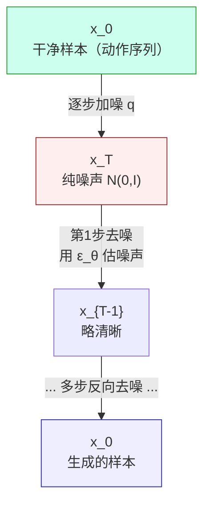
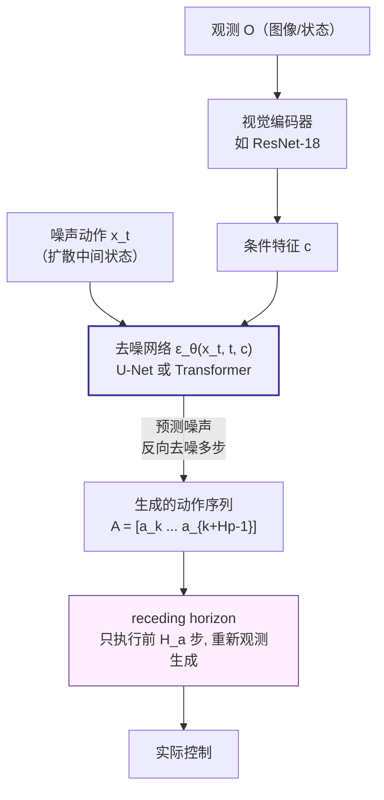
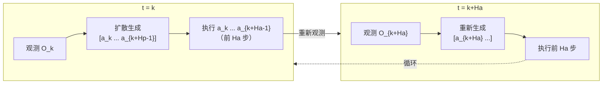
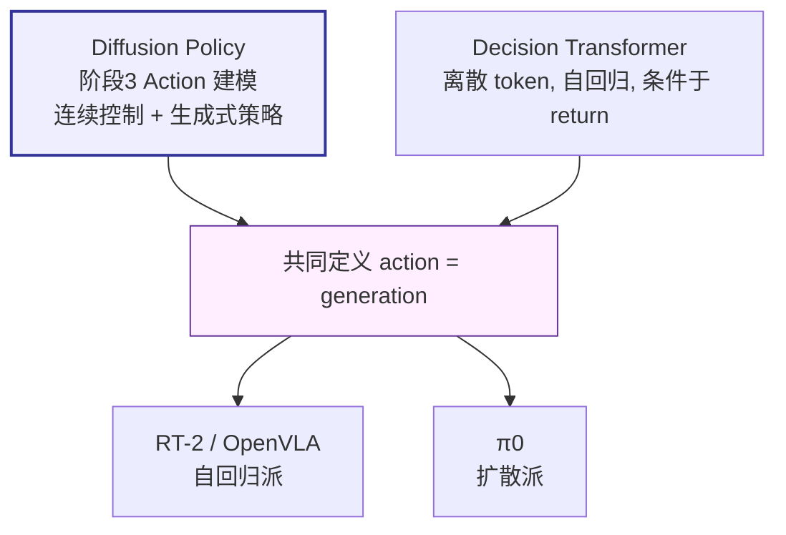

# 论文信息

- **标题**: Diffusion Policy: Visuomotor Policy Learning via Action Diffusion
- **作者**: Cheng Chi, Siyuan Feng, Yilun Du, Zhenjia Xu, Eric Cousineau, Benjamin Burchfiel, Shuran Song
- **机构**: Columbia University, MIT, Toyota Research Institute
- **发表**: RSS 2023 / International Journal of Robotics Research (IJRR) 2024
- **arXiv**: [2303.04137](https://arxiv.org/abs/2303.04137)
- **代码**: [github.com/real-stanford/diffusion_policy](https://github.com/real-stanford/diffusion_policy)

> **一句话总结**: Diffusion Policy 把在图像生成中大获成功的**扩散模型 (DDPM)** 用来生成机器人动作——用条件去噪过程，从随机噪声逐步"去噪"出一条**多步连续动作序列 (action sequence)**，而非单步动作。相比确定性策略，扩散策略能自然表达**多模态动作分布**（同一状态可有多种合理动作），对噪声/感知误差更鲁棒，且通过 **receding horizon（滚动时域）执行**保证闭环稳定性。它在 11 个任务上全面超越 LSTM/IBC 等基线，是机器人领域"扩散做策略"的标杆，深刻影响了后续 3D Diffusion Policy、π0 等 VLA 方法（guideline 阶段3 Action 建模）。

---

# 1. 背景与动机

## 1.1 模仿学习策略的表达能力瓶颈

经典行为克隆 (Behavior Cloning, BC) 的策略形式可分三类：

- **① 确定性策略**：$\pi(a\mid o)=\mu(o)$，只输出单个动作。
  - 问题：数据里同一观测可能对应多种合理动作（**多模态**），确定性策略只能取平均 → 平均动作往往无效。
  - 例：障碍物可从左或右绕开，$\mu(o)=\tfrac{1}{2}(\text{左}+\text{右})=$ 撞上去。
- **② Gaussian 策略**：$\pi(a\mid o)=\mathcal{N}(\mu(o),\sigma^{2})$。
  - 只能表达单峰高斯 → 表达不了多模态动作分布（两个绕行方向即双峰，高斯拟合差）。
- **③ Implicit BC（Energy-based）**：用能量函数表达多模态，但推理需优化、训练不稳。

> 机器人动作分布天然多模态：同一目标可有多种解法、多条示范轨迹对应同状态 → **需要一个能表达多模态连续分布的策略**。

## 1.2 扩散模型的启发

扩散模型 (DDPM) 在图像生成上大获成功：从随机噪声逐步去噪 → 生成图像，天然能表达复杂多模态分布。

**Diffusion Policy 的核心 idea**：把扩散模型的"生成"用于"生成动作"——给定观测 $o$，从噪声逐步去噪出动作 $a$（或动作序列）→ 自然支持多模态动作分布。

---

# 2. 背景知识：DDPM 扩散模型

## 2.1 前向加噪 (Forward Process)

给定真实数据 $x_{0}$（如一条动作序列），逐步加高斯噪声得到 $x_{1},x_{2},\dots,x_{T}$：

$$
q(x_{t}\mid x_{t-1})=\mathcal{N}\!\left(x_{t};\,\sqrt{1-\beta_{t}}\,x_{t-1},\,\beta_{t}\mathbf{I}\right)
$$

其中 $\beta_{t}$ 是噪声调度 (variance schedule)。

**直走捷径（重参数化 / closed-form）**：给定 $x_{0}$，可直接采样任意步 $x_{t}$：

$$
x_{t}=\sqrt{\bar{\alpha}_{t}}\,x_{0}+\sqrt{1-\bar{\alpha}_{t}}\,\varepsilon,\qquad \varepsilon\sim\mathcal{N}(0,\mathbf{I}),\qquad \bar{\alpha}_{t}=\prod_{s=1}^{t}(1-\beta_{s})
$$

$T$ 足够大时，$x_{T}\approx\mathcal{N}(0,\mathbf{I})$（纯噪声）。

## 2.2 反向去噪 (Reverse Process) —— 生成的核心

学习一个网络 $\varepsilon_{\theta}(x_{t},t)$ 预测每步加的噪声 $\varepsilon$，再反向逐步去噪：

- 从 $x_{T}\sim\mathcal{N}(0,\mathbf{I})$ 开始；
- 对 $t=T,T-1,\dots,1$：用 $\varepsilon_{\theta}(x_{t},t)$ 估计噪声，去一步噪得 $x_{t-1}$；
- 最终 $x_{0}=$ 生成的样本（图像 / 动作）。

**训练目标（极其简单）**：

$$
L=\mathbb{E}_{x_{0},\,t,\,\varepsilon}\!\left[\left\|\varepsilon-\varepsilon_{\theta}(x_{t},t)\right\|^{2}\right]
$$

即：随机采样 $(x_{0},t,\varepsilon)$，加噪得 $x_{t}$，让网络预测 $\varepsilon$。



> **直觉**：每步都用网络 $\varepsilon_{\theta}$ 预测噪声、减去一点，逐步把噪声"剥离"成干净的样本。

### 对应官方代码：DDPM 训练损失（噪声预测 MSE）

下面这段取自官方 `diffusion_unet_lowdim_policy.py` 的 `compute_loss`，正是上面 $L=\mathbb{E}\big[\|\varepsilon-\varepsilon_{\theta}(x_{t},t)\|^{2}\big]$ 的实现：随机采扩散步、采噪声、按调度加噪、再用网络预测噪声并算 MSE。

```python
def compute_loss(self, batch):
    nbatch = self.normalizer.normalize(batch)
    obs, action = nbatch['obs'], nbatch['action']     # action 即干净样本 x_0（动作序列）

    # ① 随机采样扩散步 t ~ U(0, T)，每个 batch 元素一个
    noise = torch.randn(trajectory.shape, device=trajectory.device)   # ε ~ N(0, I)
    bsz = trajectory.shape[0]
    timesteps = torch.randint(
        0, self.noise_scheduler.config.num_train_timesteps,
        (bsz,), device=trajectory.device).long()                     # 随机 t

    # ② 前向加噪：x_t = √ᾱ_t · x_0 + √(1-ᾱ_t) · ε（封装在 add_noise 里）
    noisy_trajectory = self.noise_scheduler.add_noise(
        trajectory, noise, timesteps)

    # ③ 条件注入：被 mask 成条件的位置保持原始值（inpainting / classifier-free）
    noisy_trajectory[condition_mask] = trajectory[condition_mask]

    # ④ 网络预测噪声 ε_θ(x_t, t, O)（global_cond/local_cond 即观测条件）
    pred = self.model(noisy_trajectory, timesteps,
        local_cond=local_cond, global_cond=global_cond)

    # ⑤ 目标 = 噪声 ε（prediction_type='epsilon'），MSE 即 ||ε - ε_θ||²
    pred_type = self.noise_scheduler.config.prediction_type
    target = noise if pred_type == 'epsilon' else trajectory

    loss = F.mse_loss(pred, target, reduction='none')
    loss = loss * loss_mask.type(loss.dtype)        # 只算动作步的 loss
    loss = reduce(loss, 'b ... -> b (...)', 'mean').mean()
    return loss
```

---

# 3. 方法：Diffusion Policy

## 3.1 把扩散用于动作生成

把动作（序列）当作扩散模型的"图像"：

- **数据**：$x_{0}=$ 动作序列 $A=[a_{k},a_{k+1},\dots,a_{k+H_{p}-1}]$（长度 $H_{p}$ 的未来动作）；
- **条件**：观测 $O$（图像 / 状态）。

**条件扩散**：去噪网络同时接收 $(x_{t},t,O)$，预测噪声并以观测 $O$ 为条件：

$$
\varepsilon_{\theta}(x_{t},t,O)\ \longrightarrow\ \text{从 }x_{T}\text{ 出发, 条件于 }O\text{, 逐步去噪得动作序列 }A
$$

## 3.2 两种网络 backbone

Diffusion Policy 提供两种去噪网络：

| Backbone | 结构 | 条件注入方式 | 备注 |
|---|---|---|---|
| **CNN-based (1D 时序 U-Net)** | 1D 卷积 U-Net 预测噪声 | FiLM / cross-attention | 论文主推，多数任务更稳更强 |
| **Transformer-based** | 动作 token + 条件 token → Transformer | 条件 token 拼到序列前 | 类似 DiT，某些任务更好但调参更难 |

> 论文实验结论：**主推 CNN-based**；Transformer 在部分任务更优但调参更难。

### 对应官方代码：ConditionalUnet1D（1D 时序 U-Net 噪声预测网络）

下面是官方 `conditional_unet1d.py` 中噪声预测网络 $\varepsilon_{\theta}(x_{t},t,c)$ 的核心——`forward` 把"扩散步 $t$"和"观测条件 $c$"分别编码后，经带条件注入的 U-Net 下采样→中间层→上采样（带 skip connection）输出预测噪声。

```python
def forward(self,
        sample: torch.Tensor,
        timestep,
        local_cond=None, global_cond=None, **kwargs):
    """
    sample: (B,T,input_dim)   —— 即 x_t（含噪动作序列）
    timestep: (B,) 或 int      —— 扩散步 t
    global_cond: (B,global_cond_dim) —— 观测条件 c（如展平的视觉特征）
    output: (B,T,input_dim)    —— 网络预测的噪声 ε_θ
    """
    sample = einops.rearrange(sample, 'b h t -> b t h')   # (B, horizon, dim) -> (B, dim, horizon)

    # ① 扩散步 t -> 正弦位置编码 + MLP，得到全局时间特征
    timesteps = timestep
    global_feature = self.diffusion_step_encoder(timesteps)   # SinusoidalPosEmb + MLP

    # ② 把观测条件 c 拼到全局特征上：[时间特征 ; c]
    if global_cond is not None:
        global_feature = torch.cat([global_feature, global_cond], axis=-1)

    # ③ U-Net 下采样路径：每个 stage 两个 ConditionalResidualBlock1D + Downsample
    x = sample
    h = []
    for resnet, resnet2, downsample in self.down_modules:
        x = resnet(x, global_feature)     # 块内用 FiLM 把条件注入特征图
        x = resnet2(x, global_feature)
        h.append(x)                       # 缓存 skip connection
        x = downsample(x)

    # ④ 中间层（bottleneck）：两个带条件残差块
    for mid_module in self.mid_modules:
        x = mid_module(x, global_feature)

    # ⑤ U-Net 上采样路径：与对应 skip 拼接 -> 条件残差块 -> Upsample
    for resnet, resnet2, upsample in self.up_modules:
        x = torch.cat((x, h.pop()), dim=1)   # skip connection：解码层拿到编码同分辨率特征
        x = resnet(x, global_feature)
        x = resnet2(x, global_feature)
        x = upsample(x)

    # ⑥ 1×1 卷积把通道映射回 input_dim，得到预测噪声 ε_θ(x_t, t, c)
    x = self.final_conv(x)
    x = einops.rearrange(x, 'b t h -> b h t')
    return x
```

> 其中 `ConditionalResidualBlock1D` 用 **FiLM** 调制（[arXiv:1709.07871](https://arxiv.org/abs/1709.07871)）：把条件编码成逐通道的 scale/bias，作用到特征图上，实现"观测条件引导去噪"。



## 3.3 关键设计一：预测动作序列 (Action Sequence)，非单步

- 传统 BC：$\pi(a_{t}\mid o_{t})$，预测**单步**动作；
- Diffusion Policy：预测未来 $H_{p}$ 步的**动作序列** $A=[a_{k},a_{k+1},\dots,a_{k+H_{p}-1}]$（训练时从示范轨迹截取这段）。

**好处**：① 序列级目标约束更强、抗短视；② 平滑（一次预测一整段连贯动作）；③ 利于 receding horizon 执行。

## 3.4 关键设计二：Receding Horizon (滚动时域) 执行

策略预测 $H_{p}$ 步未来动作，但**只执行前 $H_{a}$ 步**（$H_{a}<H_{p}$），然后重新观测、重新预测：



**好处（MPC 思想）**：

- **闭环**：执行少量步后重新观测 → 纠正误差；
- **平滑**：预测长（$H_{p}$）执行短（$H_{a}$）→ 动作连贯 + 闭环修正；
- **鲁棒**：感知误差不会累积放大。

### 对应官方代码：receding-horizon 推理循环

下面两段取自 `diffusion_unet_lowdim_policy.py`。`conditional_sample` 是从纯噪声反向去噪 $T$ 步生成整条 $H_{p}$ 步序列；`predict_action` 则是上层"**只取前 $H_{a}$ 步执行**"的 receding-horizon 入口——每次调用都用当前观测重新去噪一次。

```python
def conditional_sample(self, condition_data, condition_mask,
        local_cond=None, global_cond=None, generator=None, **kwargs):
    model, scheduler = self.model, self.noise_scheduler

    # ① 初始 x_T ~ N(0, I)（整条轨迹从纯噪声开始）
    trajectory = torch.randn(size=condition_data.shape, dtype=condition_data.dtype,
                             device=condition_data.device, generator=generator)
    scheduler.set_timesteps(self.num_inference_steps)   # 设定反向去噪步数

    # ② 反向去噪循环：x_T -> x_{T-1} -> ... -> x_0
    for t in scheduler.timesteps:
        trajectory[condition_mask] = condition_data[condition_mask]   # 强制满足条件（inpainting）
        model_output = model(trajectory, t,                            # ε_θ(x_t, t, O)
            local_cond=local_cond, global_cond=global_cond)
        trajectory = scheduler.step(                                  # x_t -> x_{t-1}（用 ε_θ 反推）
            model_output, t, trajectory, generator=generator, **kwargs).prev_sample

    trajectory[condition_mask] = condition_data[condition_mask]       # 最终再次保证条件满足
    return trajectory
```

```python
def predict_action(self, obs_dict):
    nobs = self.normalizer['obs'].normalize(obs_dict['obs'])   # 当前观测 O
    T, Da = self.horizon, self.action_dim                       # H_p（预测长度）, 动作维
    To = self.n_obs_steps

    # 把观测整理成 global_cond（展平成一路条件向量喂给 ε_θ）
    global_cond = nobs[:, :To].reshape(nobs.shape[0], -1)

    # ① 用当前观测重新去噪，生成 H_p 步动作序列 [a_k ... a_{k+Hp-1}]
    nsample = self.conditional_sample(cond_data, cond_mask, global_cond=global_cond)
    action_pred = self.normalizer['action'].unnormalize(nsample[..., :Da])   # 反归一化

    # ② Receding horizon：只截取前 H_a 步返回执行（H_a = n_action_steps < H_p）
    start = To
    end = start + self.n_action_steps
    action = action_pred[:, start:end]        # ← 关键：执行短，预测长

    result = {'action': action, 'action_pred': action_pred}
    return result
```

> 调用方在外层循环里：每隔 $H_{a}$ 步重新拿最新观测调用一次 `predict_action`，即得到 §3.4 描述的"预测长、执行短、再观测"的滚动时域闭环。

## 3.5 关键设计三：视觉条件 (visual conditioning)

观测 $O$ 包含图像：

- 用预训练/训练的视觉编码器（ResNet-18 等）提取特征；
- 多帧图像（历史）→ 时间池化或时间卷积；
- 特征作为扩散去噪的**条件**。

去噪网络如何用条件：

- **U-Net**：FiLM 或 cross-attention 注入条件；
- **Transformer**：条件 token 拼到序列前。

→ 图像条件引导去噪生成动作。

## 3.6 训练与推理

**训练（DDPM 标准流程，改成动作）**：

1. 对每条示范 $(O,A)$（$A$ 是动作序列）：
2. 随机采样扩散步 $t\sim\mathcal{U}(0,T)$、噪声 $\varepsilon\sim\mathcal{N}(0,\mathbf{I})$；
3. 加噪：$x_{t}=\sqrt{\bar{\alpha}_{t}}\,A+\sqrt{1-\bar{\alpha}_{t}}\,\varepsilon$；
4. 预测：$\hat{\varepsilon}=\varepsilon_{\theta}(x_{t},t,O)$；
5. 损失：$L=\|\varepsilon-\hat{\varepsilon}\|^{2}$（或预测 $x_{0}$：$\|A-\hat{A}\|^{2}$）；
6. 反向传播更新 $\varepsilon_{\theta}$ 和视觉编码器。

**推理（生成动作）**：采样 $x_{T}\sim\mathcal{N}(0,\mathbf{I})$，条件于当前观测 $O$，反向去噪 $T$ 步 → 得动作序列 $A$ → 执行前 $H_{a}$ 步。

---

# 4. 实验

## 4.1 任务与基线

**11 个任务**：PushT（2D 推块，标志性任务）、真实机器人任务（Can/Mushroom 推拿、接插头等）、双臂任务（移动咖啡豆、切菜）、Multimodal 推块。

**基线**：LSTM-Gaussian（确定性 + 高斯 BC）、Implicit BC（IBC，能量模型）、BET（Behavior Transformer，分簇）。

## 4.2 主要结果

| 任务 | LSTM-BC | IBC | BET | Diffusion Policy |
|---|---|---|---|---|
| PushT（仿真） | 70 | 87 | 92 | **98（最强）** |
| Can（真实） | 失败多 | - | - | 成功率高 |
| Push（真实） | - | - | - | 显著优于 LSTM |
| 双臂复杂任务 | 难以完成 | - | - | 能完成 |

> **关键观察**：① 在多模态任务（如 PushT 双解）上表现碾压（能表达多模态）；② Receding horizon 让真实机器人任务稳定；③ 对噪声/扰动鲁棒。

## 4.3 消融

- 预测序列 vs 单步：**序列更好**；
- CNN U-Net vs Transformer：多数任务 **U-Net 更稳**；
- Receding horizon（$H_{p}>H_{a}$）：显著提升稳定性；
- 不同扩散步数 $T$：适中（如 10–100）最佳。

---

# 5. 优势、局限与对 VLA 的意义

## 5.1 Diffusion Policy 的优势

1. **多模态动作分布**：自然支持（扩散天生多模态）；
2. **高维动作空间**：处理多步序列无压力；
3. **鲁棒**：receding horizon 闭环，抗感知误差；
4. **训练稳定**：DDPM 目标简单（MSE），不像 GAN 难训；
5. **平滑动作**：序列级预测。

## 5.2 局限

1. **推理慢**：多步去噪（$T$ 步前向网络），实时性受限。
   - 改进：DDIM 少步采样、consistency model、flow matching（π0）。
2. **图像条件强依赖视觉编码器质量**；
3. **序列长度固定**，长程任务需分块；
4. **缺乏语言条件**（原始版只看图像）。
   - 改进：加入语言条件（Language-conditioned DP）。

## 5.3 对 VLA 的意义

Diffusion Policy 是机器人领域"扩散做策略"的标杆，启发一系列扩散 VLA / policy：

- **3D Diffusion Policy (DP3)**：用 3D 点云条件；
- **π0 (Physical Intelligence)**：大规模扩散 VLA + flow matching；
- **Diffusion-VLA**：把扩散 action head 接到 VLM。

对比 RT-2/OpenVLA 的"自回归离散 action token"：

- **扩散 policy**：连续动作、多模态，但推理慢；
- **自回归 VLA**：离散 token、快，但连续控制精度受限。

→ 两条路线各有优劣，都源自"把决策当生成"。

---

# 6. 核心要点总结

## 6.1 一句话

**Diffusion Policy** = 用 DDPM 扩散模型，条件于观测，生成多步连续动作序列，用 receding horizon 闭环执行。

## 6.2 三个关键设计

1. **序列预测**：预测未来 $H_{p}$ 步动作（而非单步）；
2. **Receding Horizon**：执行前 $H_{a}$ 步，重新观测生成；
3. **扩散去噪**：从噪声逐步去噪出动作 → 天然多模态。

## 6.3 在 VLA 路线中的位置



> 与 Decision Transformer（序列自回归）并列：DT 是离散 token、自回归、条件于 return；DP 是连续动作、扩散、条件于观测。二者共同定义了"action = generation"思想，VLA 阶段分别由 RT-2/OpenVLA（自回归派）和 π0（扩散派）继承。

---

# 7. 参考资料

- **Diffusion Policy 原论文**: Chi et al., "Diffusion Policy: Visuomotor Policy Learning via Action Diffusion", RSS 2023 / IJRR 2024, [arXiv:2303.04137](https://arxiv.org/abs/2303.04137)
- **官方代码**: [github.com/real-stanford/diffusion_policy](https://github.com/real-stanford/diffusion_policy)
- **DDPM**: Ho et al., NeurIPS 2020 ("Denoising Diffusion Probabilistic Models")
- **DDIM**: Song et al., ICLR 2021 (少步采样加速)
- **Implicit BC**: Florence et al., CoRL 2021 (能量函数 BC)
- **3D Diffusion Policy (DP3)**: Ze et al., RSS 2024 (点云条件)
- **π0**: Black et al., 2024 (大规模扩散 VLA + flow matching)
- **Decision Transformer**: Chen et al., NeurIPS 2021 (对比: 自回归 action)
- **RT-2**: Brohan et al., 2023 (对比: 离散 token action)
