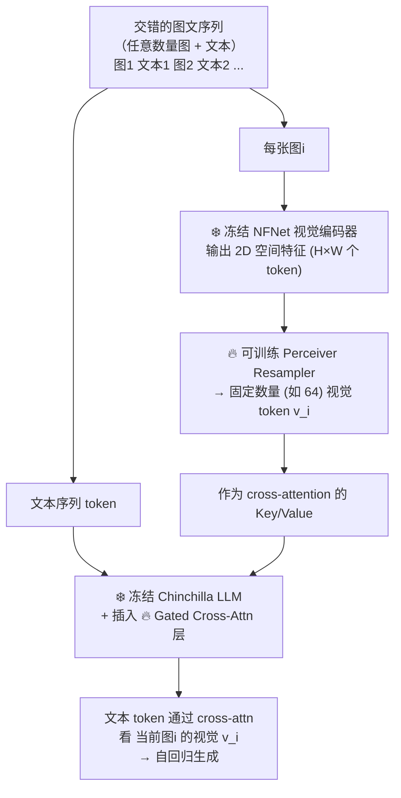
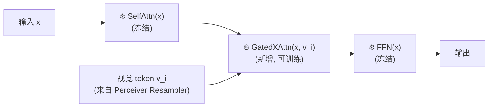
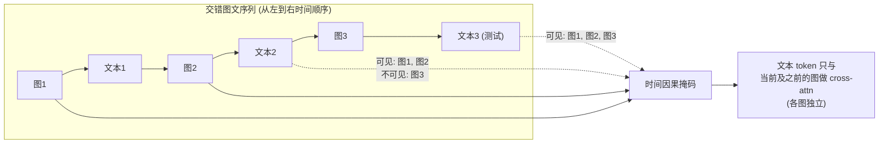
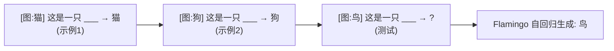
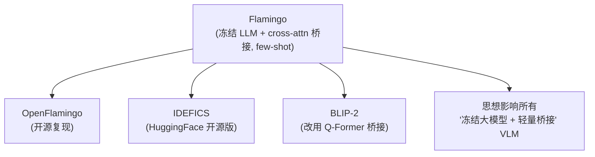

# 论文信息

- **标题**: Flamingo: a Visual Language Model for Few-Shot Learning
- **作者**: Jean-Baptiste Alayrac, Jeff Donahue, Mitezan Poman, Antoine Miech, et al. (DeepMind)
- **机构**: DeepMind
- **发表**: NeurIPS 2022
- **arXiv**: [2204.14198](https://arxiv.org/abs/2204.14198)
- **代码**: 闭源（无官方开源）；社区权威开源复现为 [mlfoundations/open_flamingo](https://github.com/mlfoundations/open_flamingo)

> **一句话总结**: Flamingo 把强大的**冻结视觉模型**和**冻结大语言模型 (Chinchilla)** 连起来，做成一个能处理**任意交错的图文序列**、支持 **few-shot in-context learning** 的多模态模型。三大关键设计：① Perceiver Resampler 把任意图像变成固定数量的视觉 token；② 新的 **gated cross-attention 层**交叉插入冻结 LLM 中，且初始化为零门控（保证训练初始即等于原 LLM）；③ 在交错的图文网页数据 (M3W) 上训练。Flamingo 在仅用少量示例的情况下，在多个视觉任务上**超越 fine-tuned SOTA**，是 "冻结大模型 + cross-attention 桥接" 范式的开创者（guideline VLM 进阶选看）。

---

# 1. 背景与动机

## 1.1 现有 VLM 的局限

Flamingo 之前的 VLM：

- 多为**单图、单轮**（一张图 + 一个问题）；
- 需要 **fine-tune** 才能适配新任务；
- 无法像 GPT-3 那样"给几个例子就能做新任务"（in-context learning）。

Flamingo 想要的：

1. **few-shot in-context learning**：给模型几张图 + 几个示例（如图文对 / 问答），它就能做新任务，无需微调；
2. 处理**任意交错的图文序列**（多图 + 多段文本）；
3. 复用已训练好的强大 LLM（Chinchilla 70B）和视觉模型（NFNet），**不从零训，只学桥接**。

## 1.2 设计哲学：冻结一切，只学连接

Flamingo 的核心策略（和后续 BLIP-2 类似，但 Flamingo 更早提出）：

- ❄️ **冻结**视觉编码器（NFNet，在 JFT/CLIP 预训练）；
- ❄️ **冻结** LLM（Chinchilla 70B）；
- 🔥 **只训练**两块桥接参数：
  - Perceiver Resampler（图像 → 视觉 token）；
  - Gated Cross-Attention 层（插入 LLM 中）。

这样**参数高效**，且保留 LLM 原有的语言能力，避免灾难性遗忘。

---

# 2. 方法

## 2.1 整体架构

下面这张图说明 Flamingo 的完整数据流：交错的图文序列经冻结 NFNet → Perceiver Resampler 产出固定数量的视觉 token → 作为 key/value 喂给插入冻结 Chinchilla 中的 Gated Cross-Attention 层；其余 self-attention / FFN 全部冻结。



**记忆要点**：只有 ❄️ 两条线（NFNet、Chinchilla）冻结，🔥 两块（Resampler、XAttn）可训练。

## 2.2 组件一：Perceiver Resampler（变任意图像为固定 token）

**问题**：不同分辨率图像 → 视觉编码器输出 token 数量不同（如 $H \times W$ 个），无法稳定喂给下游。

**Perceiver Resampler 的做法**：

- 输入：视觉编码器的 2D 特征（$H \times W$ 个 token）+ 位置编码；
- 用一组**固定数量的可学习 latent query**（如 64 个）；
- 通过 **cross-attention** 从视觉特征里"提取"信息：
  - $Q$ = latent queries；
  - $K, V$ = 视觉特征；
- 多层 cross-attn + self-attn 交替；
- 输出：固定 64 个视觉 token $v_i$（无论原图多大）。

cross-attention 的核心计算（latent query 去"查询"视觉特征）：

$$
\text{CrossAttn}(Q_{\text{latent}},\, K_{\text{img}},\, V_{\text{img}})
= \text{softmax}\!\left(\frac{Q_{\text{latent}} K_{\text{img}}^{\top}}{\sqrt{d}}\right) V_{\text{img}}
$$

**好处**：

- 任意分辨率 → 固定 token 数（下游计算量可控）；
- 压缩视觉信息，降低计算（类似 BLIP-2 的 Q-Former，但 Flamingo 更早提出）。

> **官方闭源，此处用 OpenFlamingo 复现**。`PerceiverResampler` 的核心是 `self.latents`（一组可学习 query，默认 `num_latents=64`），再过若干层交叉注意力把视觉特征"浓缩"进这 64 个 token。源码位置：[`open_flamingo/src/flamingo.py`](https://github.com/mlfoundations/open_flamingo/blob/main/open_flamingo/src/flamingo.py)。

```python
# 来自 OpenFlamingo 复现（官方闭源）。
# 文件: open_flamingo/src/flamingo.py —— 节选核心结构，省略无关分支。
class PerceiverResampler(nn.Module):
    def __init__(self, config, vision_hidden_size, lm_hidden_size):
        super().__init__()
        self._build_input_proj(vision_hidden_size, lm_hidden_size)  # 把视觉特征投影到 LM 维度
        self._build_latents(config)        # 构造可学习的 latent query
        self._build_perceiver_layers(config)  # 若干层 cross-attn + self-attn

    def _build_latents(self, config):
        # 可学习 latent query：数量固定 (默认 64)，无论输入图多大输出都一样多
        self.latents = nn.Parameter(
            torch.randn(config["num_latents"], lm_hidden_size)
        )

    def _build_input_proj(self, vision_hidden_size, lm_hidden_size):
        # 视觉编码器维度 != LM 维度，线性对齐
        self.input_proj = nn.Linear(vision_hidden_size, lm_hidden_size)

    def forward(self, vision_x: torch.Tensor):
        """
        :param vision_x: 视觉编码器输出 (B, T, F, v, D)，含视频帧/图像块
        :return: 固定数量视觉 token (B, T, num_latents, lm_hidden_size)
        """
        # 1) 先把视觉特征投到 LM 维度
        vision_x = self.input_proj(vision_x)

        # 2) latent query 扩到 batch 维，再逐层与视觉特征做 cross-attention
        latents = self.latents.unsqueeze(0).expand(B * T, -1, -1)
        for layer in self.layers:        # 每层: cross-attn(Q=latents, KV=vision) + self-attn
            latents = layer(vision_x, latents)
        return latents                   # 固定 64 个视觉 token，喂给 LLM 的 Gated XAttn
```

## 2.3 组件二：Gated Cross-Attention（核心桥接）

Flamingo 把新的 **Gated Cross-Attention (XATTN)** 层**插入**冻结 LLM 的每个 Transformer block 中。

**原始 LLM block**：$x \to \text{SelfAttn} \to \text{FFN} \to x$。

**Flamingo 修改后**（下图中 ❄️ 冻结、🔥 新增可训练）：



**GatedXAttn 内部**：在文本特征 $x$ 上加一个被门控缩放的交叉注意力残差：

$$
y = x + \tanh(\alpha) \cdot \text{CrossAttention}(x,\, v_i)
$$

其中：

- $\alpha$ 是**可学习门控参数**，**初始化为 0**；
- $\tanh(0) = 0$，所以训练初始时该层贡献为 0；
- 因此**模型初始 = 原冻结 LLM**（语言能力不丢）；
- 随训练 $\alpha$ 增大，$\tanh(\alpha)$ 逐渐引入视觉信息。

更细致地说，OpenFlamingo 对每条支路（attention / LayerNorm / MLP）各设一个 0 初始化门控，分别记为 `attn_gate`、`ln_gate`、`mlp_gate`。

> **为什么用 "gated" 且初始化为 0？**
> - 训练初始 = 原始 LLM → **不破坏语言能力**；
> - 训练稳定（梯度从语言任务平滑过渡到多模态）；
> - 这是一个重要的工程技巧，后续 BLIP-2 / LLaVA 等也有借鉴。

> **官方闭源，此处用 OpenFlamingo 复现**。`GatedCrossAttentionLayer` 的关键就是三条 0 初始化门控参数，经 `tanh` 平滑引入视觉信息。源码位置：[`open_flamingo/src/flamingo.py`](https://github.com/mlfoundations/open_flamingo/blob/main/open_flamingo/src/flamingo.py)。

```python
# 来自 OpenFlamingo 复现（官方闭源）。
# 文件: open_flamingo/src/flamingo.py —— 节选核心结构，省略无关分支。
class GatedCrossAttentionLayer(nn.Module):
    def __init__(self, hidden_size, num_heads, ...):
        super().__init__()
        self.cross_attn = ...                  # 文本 → 视觉 的交叉注意力
        self.attn_gate = nn.Parameter(torch.zeros(1))   # 🔑 门控, 初始 0
        self.ln_gate    = nn.Parameter(torch.zeros(1))  # 🔑 LayerNorm 门控, 初始 0
        self.mlp_gate   = nn.Parameter(torch.zeros(1))  # 🔑 MLP 门控, 初始 0
        # ... LayerNorm / FFN 等子模块 ...

    def forward(self, x, visual_features):
        # x: 文本特征 (来自冻结 LLM 前一层)
        # visual_features: 当前图的视觉 token v_i (来自 Perceiver Resampler)
        x = x + self.attn_gate.tanh() * self._cross_attn_block(x, visual_features)
        x = x + self.ln_gate.tanh()  * self._ln_block(x)
        x = x + self.mlp_gate.tanh() * self._mlp_block(x)
        # 关键: 初始时 attn_gate=ln_gate=mlp_gate=0 → tanh(0)=0
        #       → 该层输出 == 输入 x → 等价于"原冻结 LLM", 不破坏语言能力
        # 随训练门控增大, 视觉信息被逐步平滑引入
        return x
```

## 2.4 组件三：交错图文处理 + 时空掩码

Flamingo 输入是任意交错的序列：`图1 文本1 图2 文本2 ...`。

**关键：时间因果性（temporal causality）**：

- 文本 $i$ 只能"看"**之前**的图像（图1…图i），**不能看未来**；
- 用特殊掩码实现（各图独立 cross-attn，文本段之间单向 causal）。

这让 Flamingo 能做：

- **多轮视觉对话**；
- **few-shot**：给 `[图A]→标签A`、`[图B]→标签B`、`[图C]→?`，模型类比给出标签C。



## 2.5 训练数据

1. **交错的图文网页数据（M3W, MultiModal MassiveWeb）**：从网页爬取，文本和图片交错，**量大**，让模型学 in-context learning；
2. **图文对（ALIGN、LTIP 等）**：学图像-文本对齐；
3. **人工标注的图像描述 / 问答数据**。

混合训练 → 既会生成，又能 few-shot。

## 2.6 Few-shot In-Context Learning

推理时 few-shot 示例：把示例（图 + 标签）按交错序列拼在前面，让模型自回归生成测试样本的答案。



few-shot 数量越多，性能越好（类似 GPT-3 的 scaling 行为）。

---

# 3. 实验

## 3.1 Few-shot 超越 fine-tuned SOTA

在 6 个 benchmark 上（VQAv2、OK-VQA、COCO captioning 等）：

| 设置 | 结论 |
| --- | --- |
| Flamingo 32-shot | 在 OK-VQA、TextVQA 等"需要知识"的任务上，**超越专门 fine-tuned 的 SOTA** |
| 0 / 4 / 32-shot | 性能随示例数**稳步提升** |

**意义**：用 4–32 个示例，**无需任何梯度更新**，就打败了大量微调的专门模型 → few-shot VLM 的力量。

## 3.2 与 in-context learning

Flamingo 是首个在视觉任务上展示强大 in-context learning 的模型：

- 类比 GPT-3 在 NLP 的 few-shot；
- 证明了"大模型 + 交错多模态数据"能**涌现视觉 few-shot**。

---

# 4. 与后续工作关系



> **注意**：Flamingo 的 cross-attn 桥比 LLaVA 的 projection 复杂；后续开源主流选了更简单的 LLaVA projection 方案。

---

# 5. 核心要点总结

## 5.1 Flamingo 三大设计

1. **Perceiver Resampler**：任意图像 → 固定数量视觉 token；
2. **Gated Cross-Attention（门控，初始化 0）**：插入冻结 LLM，平滑引入视觉，不破坏语言能力；
3. **交错图文训练（M3W）**：学会处理图文交错序列 + few-shot in-context learning。

## 5.2 一句话记忆

Flamingo = 冻结视觉编码器 + Perceiver Resampler + 冻结 LLM 中插入 Gated Cross-Attention + 交错图文数据训练 → 支持图文交错序列的 few-shot 视觉语言模型。

## 5.3 在 VLA 路线中的位置

Flamingo 是 VLM "冻结大模型 + cross-attention 桥接"范式的**开创者**（guideline VLM 进阶选看，few-shot 能力来源）。它的"冻结大模型 + 轻量桥接"思想：

- → 影响 BLIP-2（Q-Former）、LLaVA（projection）；
- → 最终影响 VLA 的 RT-2 / OpenVLA（视觉特征接入 LLM 生成 action）。

---

# 6. 参考资料

- **Flamingo 原论文**: Alayrac et al., "Flamingo: a Visual Language Model for Few-Shot Learning", NeurIPS 2022, [arXiv:2204.14198](https://arxiv.org/abs/2204.14198)
- **Frozen**: Tsimpoukelli et al., 2021 ("Frozen" 少样本多模态先驱)
- **Perceiver**: Jaegle et al., ICCV 2021 (Perceiver 架构来源)
- **Chinchilla**: Hoffmann et al., 2022 (Flamingo 用的 LLM)
- **OpenFlamingo**: [github.com/mlfoundations/open_flamingo](https://github.com/mlfoundations/open_flamingo) (开源复现，本文代码片段来源)
- **IDEFICS**: HuggingFace, 2023 (开源 Flamingo)
- **BLIP-2**: Li et al., ICML 2023 (Q-Former 桥接对比)
- **LLaVA**: Liu et al., NeurIPS 2023 (projection 桥接对比)
