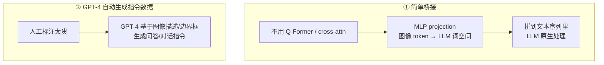
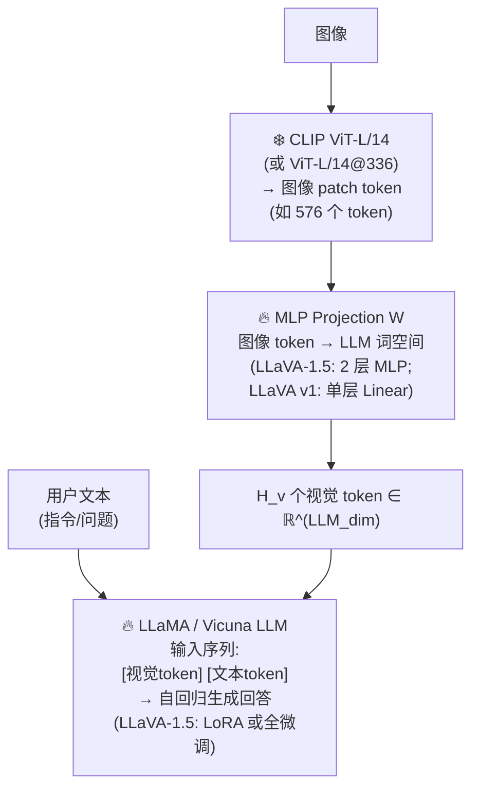
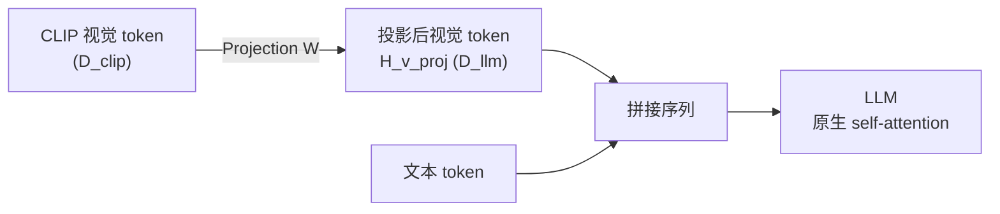
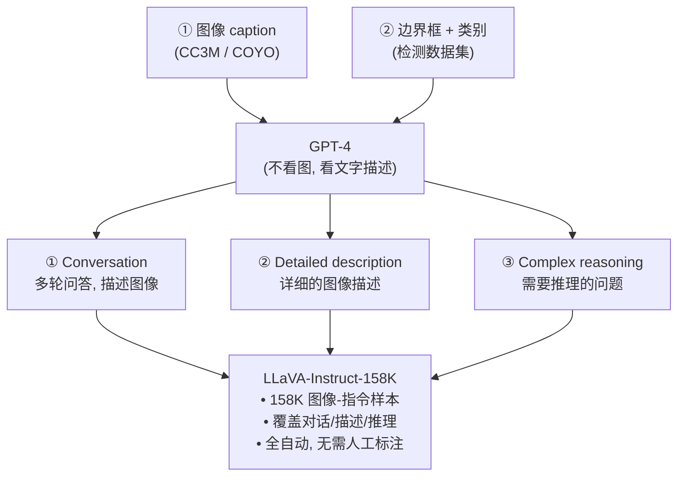
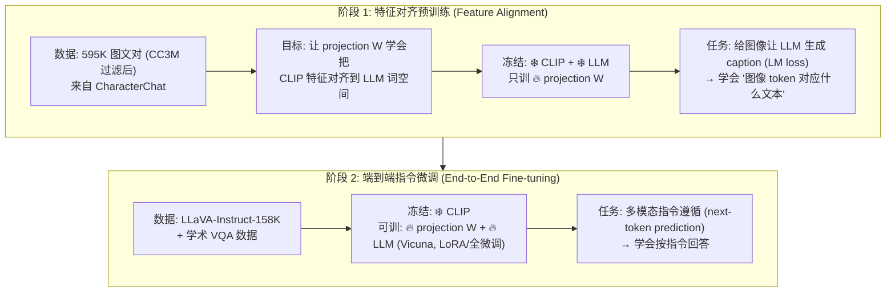
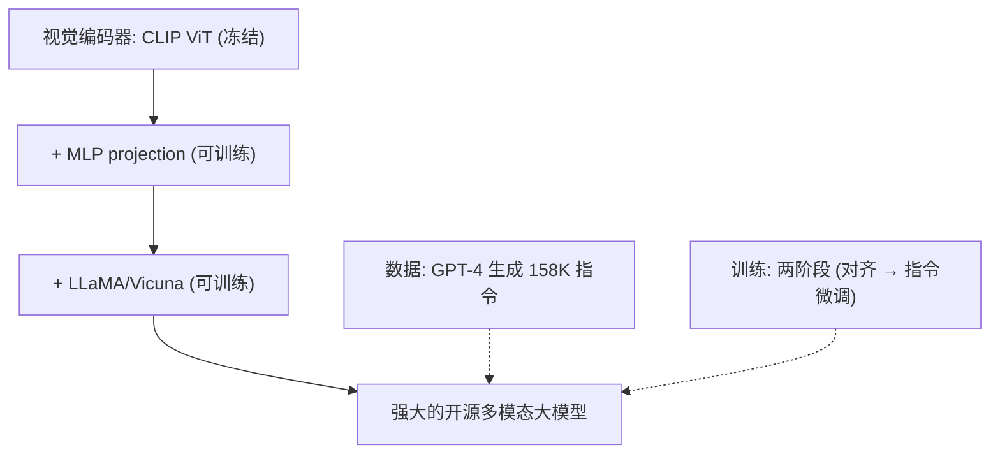
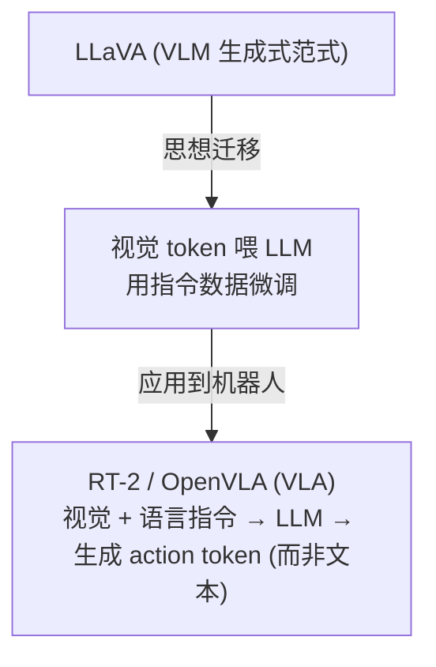

# 论文信息

- **标题**: Visual Instruction Tuning
- **作者**: Haotian Liu, Chunyuan Li, Qingyang Wu, Yong Jae Lee
- **机构**: University of Wisconsin–Madison, Microsoft Research
- **发表**: NeurIPS 2023
- **arXiv**: [2304.08485](https://arxiv.org/abs/2304.08485)
- **代码**: [github.com/haotian-liu/LLaVA](https://github.com/haotian-liu/LLaVA)

> **一句话总结**: LLaVA 是第一个开源的 GPT-4V 风格多模态大模型。做法极简而有效：**用一个线性投影层 (MLP) 把 CLIP 视觉编码器的图像 token 直接拼到 LLaMA 的词嵌入序列里**，让 LLM "看见" 图像；用 GPT-4 基于图像描述自动生成 15.8 万条图文 instruction-following 数据；两阶段训练（特征对齐 → 指令微调）。LLaVA 证明了 "视觉 token 直接当词喂给 LLM + 指令微调" 就能做出强大的多模态模型，开启了开源 MLLM 时代（guideline VLM 核心三件套之一，生成式范式）。

---

# 1. 背景与动机

## 1.1 多模态指令遵循的空白

- 2023 年 GPT-4 / GPT-4V 展示了强大的多模态指令遵循能力：
  - 用户：`[图]` "这张图里发生了什么, 用中文解释"
  - GPT-4V：（流利地描述图像并回答）
  - 但 GPT-4V 闭源，社区无法复现/研究
- LLaVA 的目标：构建一个开源的、能做 "视觉指令遵循" 的多模态模型
  - → 像聊天一样，给图 + 问问题 → 模型回答
- 关键问题：
  - ① 如何让 LLM 接收视觉输入？
  - ② 多模态指令数据从哪来？（当时几乎没有）

## 1.2 LLaVA 的两个核心 idea

① 简单桥接：不用复杂的 Q-Former (BLIP-2) 或 cross-attn (Flamingo)，直接用一个 MLP projection 把图像 token 投影到 LLM 词空间，拼到文本序列里，LLM 原生处理。

② 用 GPT-4 自动生成指令数据：人工标注多模态指令太贵，于是用 GPT-4 基于图像的描述/边界框，生成问答/对话指令数据。



---

# 2. 方法

## 2.1 整体架构



## 2.2 视觉 token 如何接入 LLM

CLIP ViT 输出 $H_v$ 个 patch token，每个维度 $D_{\text{clip}}$（例：ViT-L/14，336 分辨率 → $H_v = 24\times 24 = 576$）。

Projection $W$ 把每个视觉 token 投影到 LLM 词嵌入维度 $D_{\text{llm}}$：

$$H_v^{\text{proj}} = W \cdot H_v^{\text{clip}},\quad W \in \mathbb{R}^{D_{\text{llm}} \times D_{\text{clip}}}$$

拼接：

$$\text{LLM 输入序列} = [\,H_v^{\text{proj}}\,;\,\text{text\_tokens}\,]$$

对 LLM 来说，视觉 token 就是 "另一种词"，原生参与 self-attention。



> **关键洞察**：这么简单的连接方式就能 work！说明 LLM 足够强大，不需要复杂的 cross-attn 桥。（后来发现 MLP 投影比单层 Linear 显著更好 → LLaVA-1.5）

### 2.2.1 官方代码：视觉 token 如何接入 LLM

> 摘自 [`llava/model/llava_arch.py`](https://github.com/haotian-liu/LLaVA/blob/main/llava/model/llava_arch.py) 的 `prepare_inputs_labels_for_multimodal`。这是 LLaVA 最核心的一步：**把经过 mm_projector 投影后的图像特征，插入到输入序列里 `<image>` 占位符（`IMAGE_TOKEN_INDEX`）的位置**，与文本 embedding 拼成 LLM 的最终输入。对 LLM 而言，视觉 token 与普通词 token 没有差别，原生进入 self-attention。

```python
def encode_images(self, images):
    # 先用 CLIP 视觉塔提特征 (mm_hidden_size)，再用 mm_projector 投到 LLM 词空间 (hidden_size)
    # 即原理中的 H_v_proj = W · H_v_clip
    image_features = self.get_model().get_vision_tower()(images)
    image_features = self.get_model().mm_projector(image_features)
    return image_features

def prepare_inputs_labels_for_multimodal(
    self, input_ids, position_ids, attention_mask, past_key_values, labels,
    images, image_sizes=None):
    vision_tower = self.get_vision_tower()
    # 推理阶段（只剩 1 个 token）或无图：直接走纯文本路径
    if vision_tower is None or images is None or input_ids.shape[1] == 1:
        return input_ids, position_ids, attention_mask, past_key_values, None, labels

    # ...（多图 / anyres 分支略，单图走下面这条）
    image_features = self.encode_images(images)   # 视觉 token，已投影到 LLM 词空间

    new_input_embeds, new_labels = [], []
    cur_image_idx = 0
    for batch_idx, cur_input_ids in enumerate(input_ids):
        num_images = (cur_input_ids == IMAGE_TOKEN_INDEX).sum()   # 统计 <image> 占位符个数
        # 没有 <image> 占位符的样本：直接取文本 embedding
        if num_images == 0:
            cur_input_embeds_1 = self.get_model().embed_tokens(cur_input_ids)
            new_input_embeds.append(cur_input_embeds_1); new_labels.append(labels[batch_idx])
            cur_image_idx += 1; continue

        # 找到 <image> 占位符的位置，把序列切成 [文本段0][图][文本段1][图]... 的片段
        image_token_indices = [-1] + torch.where(cur_input_ids == IMAGE_TOKEN_INDEX)[0].tolist() + [cur_input_ids.shape[0]]
        cur_input_ids_noim, cur_labels_noim = [], []
        for i in range(len(image_token_indices) - 1):
            cur_input_ids_noim.append(cur_input_ids[image_token_indices[i]+1:image_token_indices[i+1]])
            cur_labels_noim.append(labels[batch_idx][image_token_indices[i]+1:image_token_indices[i+1]])

        # 文本片段 → 文本 embedding
        cur_input_embeds = self.get_model().embed_tokens(torch.cat(cur_input_ids_noim))
        cur_input_embeds_no_im = torch.split(cur_input_embeds, [x.shape[0] for x in cur_labels_noim], dim=0)

        # 关键：在每段文本 embedding 之后，插入对应的视觉 token embedding，拼成最终序列
        cur_new_input_embeds, cur_new_labels = [], []
        for i in range(num_images + 1):
            cur_new_input_embeds.append(cur_input_embeds_no_im[i])   # 文本段 embedding
            cur_new_labels.append(cur_labels_noim[i])
            if i < num_images:
                cur_image_features = image_features[cur_image_idx]; cur_image_idx += 1
                cur_new_input_embeds.append(cur_image_features)      # ← 把图像特征插到 <image> 位置
                # 视觉 token 对应的 label 设为 IGNORE_INDEX（不计 loss），只在回答 token 上算 LM loss
                cur_new_labels.append(torch.full((cur_image_features.shape[0],), IGNORE_INDEX,
                                                 device=cur_labels.device, dtype=cur_labels.dtype))
        cur_new_input_embeds = torch.cat([x.to(self.device) for x in cur_new_input_embeds])  # 拼接 → LLM 输入序列
        cur_new_labels = torch.cat(cur_new_labels)
        new_input_embeds.append(cur_new_input_embeds); new_labels.append(cur_new_labels)

    # ...（按 batch 最长序列 padding，左/右对齐，构造 attention_mask / position_ids）
    # 注意：返回的第 5 个值是 new_input_embeds（绕过 embed_tokens，直接把 embedding 喂给 LLM）
    return None, position_ids, attention_mask, past_key_values, new_input_embeds, new_labels
```

> **代码 ↔ 原理映射**：`encode_images` 里的 `mm_projector` = 公式 $H_v^{\text{proj}} = W \cdot H_v^{\text{clip}}$；`prepare_inputs_labels_for_multimodal` 里把 `cur_image_features` 插到 `<image>` 位置并 `torch.cat` 拼接 = $\text{LLM 输入序列}=[\,H_v^{\text{proj}}\,;\,\text{text\_tokens}\,]$；视觉 token 的 label 设为 `IGNORE_INDEX` = 只在回答 token 上算 LM loss。

### 2.2.2 官方代码：MLP mm_projector（`mlp2x_gelu`）

> 摘自 [`llava/model/multimodal_projector/builder.py`](https://github.com/haotian-liu/LLaVA/blob/main/llava/model/multimodal_projector/builder.py) 的 `build_vision_projector`。`mm_projector_type='mlp2x_gelu'`（LLaVA-1.5 默认）即两层 MLP：第一层把 CLIP 维度投到 LLM 词维度，GELU 激活，第二层在 LLM 词空间内再做一次线性变换。`mm_hidden_size` = CLIP 特征维度 $D_{\text{clip}}$，`hidden_size` = LLM 词嵌入维度 $D_{\text{llm}}$，正好对应公式里的投影矩阵 $W\in\mathbb{R}^{D_{\text{llm}}\times D_{\text{clip}}}$。

```python
def build_vision_projector(config, delay_load=False, **kwargs):
    projector_type = getattr(config, 'mm_projector_type', 'linear')

    # LLaVA v1 原始版：单层 Linear，无激活 → W
    if projector_type == 'linear':
        return nn.Linear(config.mm_hidden_size, config.hidden_size)

    # LLaVA-1.5：mlp2x_gelu / mlp3x_gelu，匹配 "mlp{N}x_gelu"
    mlp_gelu_match = re.match(r'^mlp(\d+)x_gelu$', projector_type)
    if mlp_gelu_match:
        mlp_depth = int(mlp_gelu_match.group(1))
        # 第一层：CLIP 维度 → LLM 词维度（这就是原理里的投影 W）
        modules = [nn.Linear(config.mm_hidden_size, config.hidden_size)]
        # 后续层：LLM 词维度 → LLM 词维度，每层前加 GELU 激活
        for _ in range(1, mlp_depth):
            modules.append(nn.GELU())
            modules.append(nn.Linear(config.hidden_size, config.hidden_size))
        return nn.Sequential(*modules)   # mlp2x_gelu 即 Linear→GELU→Linear

    # ...（identity / 残差等其它类型略）
```

## 2.3 用 GPT-4 生成指令数据（LLaVA-Instruct-158K）

**问题**：几乎没有现成的多模态指令数据。**LLaVA 的方案**：借助 GPT-4 自动构造。

输入给 GPT-4 的（纯文本）信息：

- ① 图像的描述（caption）—— 来自 CC3M/COYO 等
- ② 图像里物体的边界框 + 类别 —— 来自检测数据集
- 注意：GPT-4 不直接看图，看的是图的 "文字描述"

让 GPT-4 基于这些信息生成三类指令数据：



## 2.4 两阶段训练



> **注**：LLaVA-1.5 改进 —— projection 用 2 层 MLP，视觉编码器用更高分辨率，数据更多样，表现飞跃。

### 2.4.1 官方代码：两阶段训练配置

> 摘自 LLaVA-1.5 的训练脚本 [`scripts/v1_5/pretrain.sh`](https://github.com/haotian-liu/LLaVA/blob/main/scripts/v1_5/pretrain.sh)（Stage 1 特征对齐）与 [`scripts/v1_5/finetune.sh`](https://github.com/haotian-liu/LLaVA/blob/main/scripts/v1_5/finetune.sh)（Stage 2 指令微调）。两阶段的差异全部体现在命令行参数：Stage 1 冻结 CLIP+LLM 只训 projector（`--tune_mm_mlp_adapter True`），用 558K 图文对 caption 数据、大学习率 1e-3；Stage 2 解冻 LLM（Deepspeed ZeRO-3 全量微调），加载 Stage 1 的 projector（`--pretrain_mm_mlp_adapter`），用 665K 指令数据、小学习率 2e-5。

**Stage 1：特征对齐预训练（只训 projector）**

```bash
# scripts/v1_5/pretrain.sh —— 只训练 mm_projector，对齐 CLIP 特征到 LLM 词空间
deepspeed llava/train/train_mem.py \
    --model_name_or_path lmsys/vicuna-13b-v1.5 \
    --version plain \                                       # Stage1 用 plain 模板（纯图文 caption）
    --data_path ./playground/data/LLaVA-Pretrain/blip_laion_cc_sbu_558k.json \  # 558K 图文对
    --vision_tower openai/clip-vit-large-patch14-336 \      # ❄️ CLIP 冻结
    --mm_projector_type mlp2x_gelu \                        # 🔥 只训这个 2 层 MLP
    --tune_mm_mlp_adapter True \                            # ← 关键：只解冻 mm_projector
    --learning_rate 1e-3 \                                  # projector 用大学习率
    --num_train_epochs 1 \
    --output_dir ./checkpoints/llava-v1.5-13b-pretrain
    # ...（其余参数略）
```

**Stage 2：端到端指令微调（解冻 LLM + projector）**

```bash
# scripts/v1_5/finetune.sh —— 解冻 LLM（ZeRO-3 全微调）+ projector，加载 Stage1 的 projector
deepspeed llava/train/train_mem.py \
    --deepspeed ./scripts/zero3.json \                      # Stage2 用 ZeRO-3（要训 LLM 全参）
    --model_name_or_path lmsys/vicuna-13b-v1.5 \
    --version v1 \                                          # Stage2 用 v1 模板（带 <image> 占位符的多模态指令）
    --data_path ./playground/data/llava_v1_5_mix665k.json \ # 665K 指令数据（含 LLaVA-Instruct + VQA）
    --vision_tower openai/clip-vit-large-patch14-336 \      # ❄️ CLIP 仍冻结
    --pretrain_mm_mlp_adapter ./checkpoints/llava-v1.5-13b-pretrain/mm_projector.bin \  # ← 加载 Stage1 projector
    --mm_projector_type mlp2x_gelu \                        # 🔥 projector 继续训
    --learning_rate 2e-5 \                                  # LLM 用小学习率
    --num_train_epochs 1 \
    --output_dir ./checkpoints/llava-v1.5-13b
    # ...（其余参数略；注意没有 --tune_mm_mlp_adapter，即 LLM + projector 一起训）
```

> **代码 ↔ 原理映射**：Stage 1 的 `--tune_mm_mlp_adapter True` = "冻结 CLIP+LLM，只训 projection $W$"；Stage 2 加载 `--pretrain_mm_mlp_adapter` 并去掉该开关 = "继承对齐好的 $W$，再与 LLM 一起在指令数据上端到端微调"。两阶段学习率差 50 倍（1e-3 → 2e-5），与"先学投影、再细调整个模型"的目标一致。

## 2.5 训练目标

标准的 next-token prediction（语言建模）：给定图像 $X_v$ 和指令 $X_q$，模型预测回答序列 $X_a$ 的每个 token：

$$P(X_a\mid X_v,X_q)=\prod_{t=1}^{L}P(x_t\mid X_v,X_q,x_{<t})$$

其中 $X_v$ 为视觉 token、$X_q$ 为指令文本、$X_a$ 为回答。投影 $H_v = W\cdot H_v^{\text{clip}}$。

损失为交叉熵（只在回答 token 上算 loss，prompt 部分不计算）。

---

# 3. 实验

## 3.1 评估：用 GPT-4 当裁判

LLaVA 首创 "GPT-4 评估"：让 GPT-4（纯文本，看图的文字描述）给 LLaVA 的回答打分。

- 对比对象：LLaVA vs GPT-4（上界）vs 无图基线（下界）
- 结果：LLaVA 在视觉指令任务上接近 GPT-4 的 85%+，显著优于纯文本基线

## 3.2 下游任务

LLaVA 在标准 VLM benchmark 上表现强：

- ScienceQA（多模态科学问答）：SOTA（超过 GPT-3.5）
- VQA、GQA、TextVQA 等
- 视觉对话

LLaVA-1.5（改进版）进一步：用 2 层 MLP projection，多分辨率 + 更多数据，在所有 benchmark 上逼近/达到商业模型水平，成为开源 MLLM 的事实标准。

---

# 4. LLaVA 系列 vs 同期工作

| 模型 | 视觉接入 | 指令数据来源 | 是否开源 |
|------|----------|--------------|----------|
| GPT-4V | 闭源 | 闭源 | ❌ |
| Flamingo | gated cross-attn | 交错图文 | ❌ |
| BLIP-2 | Q-Former | 清洗 caption | 部分开源 |
| MiniGPT-4 | Q-Former + projection | 机器翻译 | 开源 |
| LLaVA | MLP projection | GPT-4 生成指令 | ✅ 全开源 |

**LLaVA 的贡献**：

- 最简单有效的视觉接入（MLP projection）
- 证明 "GPT-4 生成指令数据" 路线可行
- 全开源，推动开源 MLLM 生态爆发

---

# 5. 核心要点总结

## 5.1 LLaVA 的极简哲学



## 5.2 为什么 LLaVA 重要

1. 确立 "视觉 token 直接拼进 LLM + 指令微调" 的简洁范式 → 后续几乎所有开源 MLLM 都遵循（LLaVA-1.5/1.6/NeXT，Qwen-VL 等）
2. 开创用 GPT-4 自动生成多模态指令数据的方法
3. 全开源，让学术界能复现/改进多模态大模型
4. 为 VLA 奠定基础：OpenVLA 本质 = "LLaVA 式 VLM + action token 生成"（视觉编码器 + projector + LLM + 离散化 action 输出）

## 5.3 在 VLA 路线中的位置



---

# 6. 参考资料

- **LLaVA 原论文**: Liu et al., "Visual Instruction Tuning", NeurIPS 2023, [arXiv:2304.08485](https://arxiv.org/abs/2304.08485)
- **官方代码**: [github.com/haotian-liu/LLaVA](https://github.com/haotian-liu/LLaVA)
- **LLaVA-1.5**: Liu et al., "Improved Baselines with Visual Instruction Tuning", 2023, [arXiv:2310.03744](https://arxiv.org/abs/2310.03744)
- **CLIP**: Radford et al., ICML 2021 (视觉编码器)
- **Vicuna / LLaMA**: 开源 LLM 基座
- **BLIP-2**: Li et al., ICML 2023 (对比的桥接方案)
- **MiniGPT-4**: Zhu et al., 2023 (同期开源 MLLM)
- **Flamingo**: Alayrac et al., NeurIPS 2022
- **OpenVLA**: Kim et al., 2024 (LLaVA 思想做 VLA)
