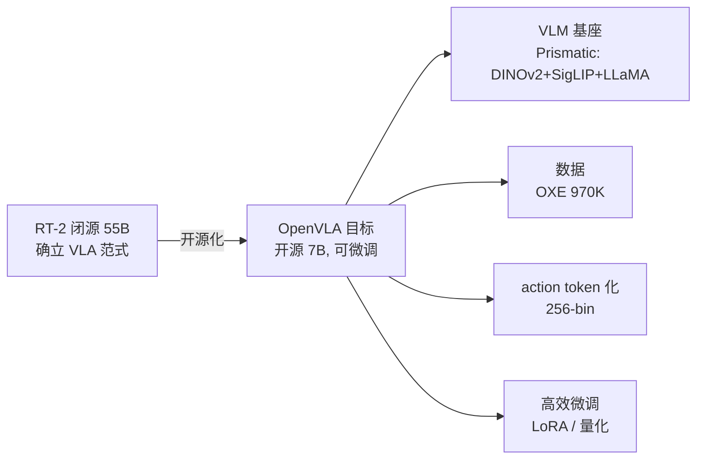
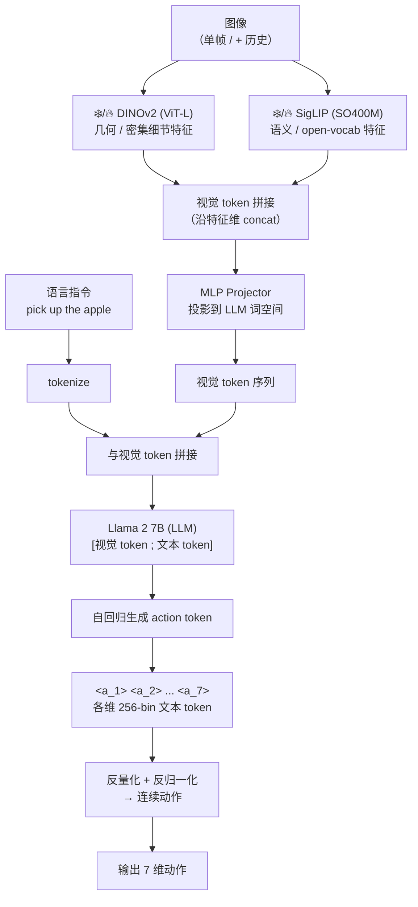
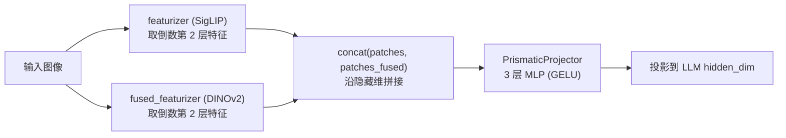
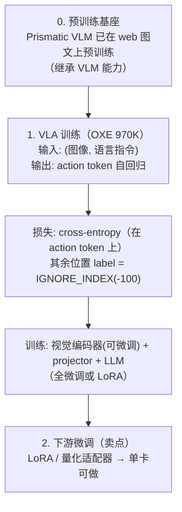
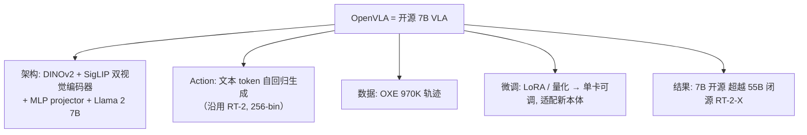
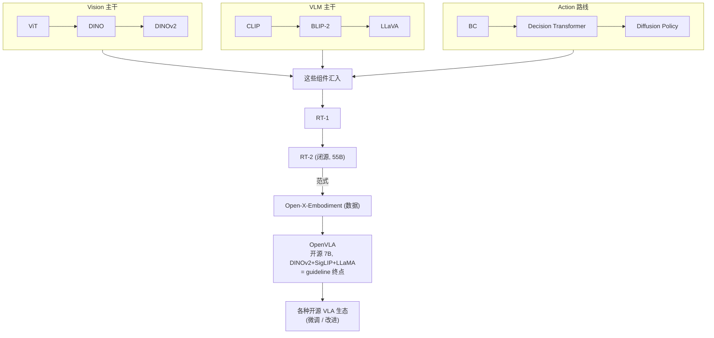

# 论文信息

- **标题**: OpenVLA: An Open-Source Vision-Language-Action Model
- **作者**: Moo Jin Kim, Karl Pertsch, Siddharth Karamcheti, Ted Xiao, Ashwin Balakrishna, Suraj Nair, Rafael Rafailov, Ethan Foster, Grace Lam, Pannag Sanketi, Quan Vuong, Thomas Kollar, Benjamin Burchfiel, Russ Tedrake, Dorsa Sadigh, Sergey Levine, Percy Liang, Chelsea Finn
- **机构**: Stanford, UC Berkeley, TRI, Google DeepMind
- **发表**: 2024 (CoRL 2024)
- **arXiv**: [2406.09246](https://arxiv.org/abs/2406.09246)
- **代码**: [github.com/openvla/openvla](https://github.com/openvla/openvla)
- **模型权重**: [huggingface.co/openvla/openvla-7b](https://huggingface.co/openvla/openvla-7b)

> **一句话总结**: OpenVLA 是**开源 7B VLA 模型**：基于 **Prismatic VLM**（**DINOv2 + SigLIP 双视觉编码器** 融合 + **Llama 2 7B** LLM），在 **Open-X-Embodiment 的 970K 轨迹**上训练，把连续动作离散化为 **256-bin 的文本 token 自回归生成**，支持高效的 **LoRA / 量化微调**。它在通用评测和 WidowX/Franka 等任务上**性能超越闭源 RT-2-X**，同时显存占用更少、微调更便宜，把高性能 VLA 带给了开源社区，是 guideline VLA 阶段的压轴重点。

---

# 1. 背景与动机

## 1.1 RT-2 强，但闭源难复现

RT-2 (2023) 确立了 VLA 范式：**VLM + action token + co-fine-tune**，把语言知识/推理与机器人动作统一进一个网络。

- ✅ 强大（知识 + 推理 + 动作）
- ❌ **闭源**（PaLI-X / PaLM-E 55B 不公开）
- ❌ **太大**（55B），普通实验室跑不起、调不动
- ❌ **难复现**，社区无法改进

> **OpenVLA 的目标**：一个开源、可微调、性能媲美/超越 RT-2 的 VLA，让学术界和工业界都能用。

## 1.2 开源 VLA 的设计要点

要复刻 RT-2 范式，开源版需要四块拼图：

| 需求 | OpenVLA 的选择 |
| --- | --- |
| ① 强大但开源的 VLM 基座 | **Prismatic VLM**：DINOv2 + SigLIP + Llama 2 |
| ② 大规模机器人数据 | **Open-X-Embodiment (OXE) 970K** 轨迹 |
| ③ action 文本 token 化 | 沿用 RT-2，每维 **256-bin** 量化为 token |
| ④ 高效微调能力 | **LoRA / 量化**，让 7B 可在单卡微调 |



---

# 2. 方法

## 2.1 整体架构

OpenVLA 的数据流可以概括为：**图像 → 双视觉编码器 → 特征拼接 + 投影 → 与语言 token 拼接 → LLM 自回归生成 action token → 反量化为连续动作**。



核心三件套：**双视觉编码器融合**（§2.2）、**action tokenization**（§2.3）、**LLM 自回归 + cross-entropy 训练**（§2.5）。

## 2.2 基座：Prismatic VLM（双视觉编码器）

OpenVLA 直接用 **Prismatic VLM** 作为基座，而非从零搭建。其视觉侧采用**双编码器融合**：

- **DINOv2 (ViT-L/14)**：纯视觉自监督 → 强**几何/细节/密集**表征（对机器人精确定位关键）。
- **SigLIP (SO400M)**：图文对比监督 → 强**语义/open-vocab** 表征。
- 两者输出 **沿特征维拼接**，再经 **MLP projector** 投影到 LLM 词空间。
- 语言模型：**Llama 2 7B**。

> **为什么双编码器？** RT-2 用单 ViT（PaLI-X）→ 视觉信号单一；OpenVLA 用 DINOv2 + SigLIP 同时获得**几何细节 + 语义**（互补），对需要精确空间感知的机器人任务尤其有利。



下面的官方实现展示了**双视觉编码器如何融合**以及**projector 如何把视觉特征投到 LLM 词空间**（取自 `prismatic/models/vlms/prismatic.py` 对应的 HuggingFace 移植版 `modeling_prismatic.py`）。

```python
# === PrismaticVisionBackbone.forward ===
# 单输入图像（6 通道 = SigLIP 3 + DINOv2 3）时，把通道劈成两半，
# 分别喂给两个 featurizer，再把两条 patch 特征沿隐藏维拼接 → 互补的视觉表征
def forward(self, pixel_values):
    if self.num_images_in_input == 1:
        if not self.use_fused_vision_backbone:
            return self.featurizer(pixel_values)            # 单编码器（仅 SigLIP）

        # 把 [bsz, 2*3, H, W] 劈成 [bsz,3,H,W] × 2 → 分别过 SigLIP 与 DINOv2
        img, img_fused = torch.split(pixel_values, [3, 3], dim=1)
        patches, patches_fused = self.featurizer(img), self.fused_featurizer(img_fused)

        # 关键：沿「特征维 dim=2」拼接 → 每个 patch 的特征 = [SigLIP | DINOv2]
        return torch.cat([patches, patches_fused], dim=2)
    # ...（多帧 / 多图输入在 fused 分支里同理逐帧融合后沿 patch 维拼接）


# === PrismaticProjector ===
# 融合视觉编码器用的是「3 层 MLP」投影（中间维度 = 4 × vision_dim），把视觉 token 投到 LLM hidden_dim
class PrismaticProjector(nn.Module):
    def __init__(self, use_fused_vision_backbone, vision_dim, llm_dim):
        super().__init__()
        if use_fused_vision_backbone:                         # OpenVLA 走这条分支
            initial_projection_dim = 4 * vision_dim
            self.fc1 = nn.Linear(vision_dim, initial_projection_dim, bias=True)
            self.fc2 = nn.Linear(initial_projection_dim, llm_dim, bias=True)
            self.fc3 = nn.Linear(llm_dim, llm_dim, bias=True)
            self.act_fn1, self.act_fn2 = nn.GELU(), nn.GELU()

    def forward(self, img_patches):
        # GELU → Linear → GELU → Linear，把 [bsz, num_patches, vision_dim] → [bsz, num_patches, llm_dim]
        projected_features = self.act_fn1(self.fc1(img_patches))
        projected_features = self.act_fn2(self.fc2(projected_features))
        return self.fc3(projected_features)
```

> 映射回原理：`featurizer`/`fused_featurizer` 即 SigLIP / DINOv2；`torch.cat(..., dim=2)` 即「几何细节 + 语义」沿特征维互补；`PrismaticProjector` 即把视觉 token 对齐到 LLM 词表的桥。

## 2.3 Action Tokenization（沿用 RT-2）

OpenVLA 把**连续动作**当成**文本 token** 自回归生成，这与 RT-2 完全相同，是「一个网络统一语言和动作」的关键。

**离散化步骤**（每维独立）：

1. 先按 per-embodiment 统计把动作归一化到 $[-1, 1]$（见 §2.3 末的反归一化）。
2. 在 $[-1, 1]$ 上等距切 **256 个 bin 边界**，对应 **255 个 bin 中心**。
3. 把每个连续值 clip 后 `np.digitize` 落到某个 bin → 映射到 **LLM 词表末尾的 256 个 token**（用最少见的 token，避免与正常文本冲突）。

每步动作通常是 7 维，因此一次推理**自回归生成约 7 个 action token**。形式上，给定视觉特征 $V$ 与语言指令 $L$，模型对动作 $a = (a_1,\dots,a_T)$ 的联合概率为：

$$
P(a \mid V, L) \;=\; \prod_{t=1}^{T} P\!\left(a_t \,\middle|\, a_{<t},\, V,\, L\right)
$$

其中每个 $a_t \in \{0,1,\dots,255\}$ 是该维对应的离散 bin token，训练损失就是在 action token 上的**交叉熵**（其余位置 label 设为 `IGNORE_INDEX = -100`）。

**反量化**（推理时把 token 还原成连续值）：把 token id 映射回 bin 中心 $c_k$：

$$
\hat{a}_t \;=\; c_{\,\text{clip}(\,V - \text{id},\, 0,\, 254\,)}
$$

其中 $V$ 是词表大小，bin 中心 $c_k = \tfrac{1}{2}(b_k + b_{k+1})$，$b_k = -1 + \tfrac{2k}{255}$。

下面的官方实现即「连续动作 ↔ 文本 token」的双向映射（取自 `prismatic/vla/action_tokenizer.py`）：

```python
class ActionTokenizer:
    def __init__(self, tokenizer, bins: int = 256, min_action: int = -1, max_action: int = 1):
        self.tokenizer, self.n_bins = tokenizer, bins
        self.min_action, self.max_action = min_action, max_action
        # ① 等距切 256 个 bin 边界，得到 255 个 bin 中心
        self.bins = np.linspace(min_action, max_action, self.n_bins)          # b_0..b_255 ∈ [-1, 1]
        self.bin_centers = (self.bins[:-1] + self.bins[1:]) / 2.0             # c_0..c_254
        # ② 复用 LLM 词表「最末 256 个 token」作为 action token，避免与正常文本冲突
        self.action_token_begin_idx = int(self.tokenizer.vocab_size - (self.n_bins + 1))

    def __call__(self, action: np.ndarray):
        """连续动作 → token id：clip → digitize 落 bin → 映射到词表末尾的 token"""
        action = np.clip(action, a_min=float(self.min_action), a_max=float(self.max_action))
        discretized_action = np.digitize(action, self.bins)                   # 落到 [1, 256]
        # 用 vocab_size - discretized_action 取「末尾 256 个」中对应的 token
        return self.tokenizer.decode(list(self.tokenizer.vocab_size - discretized_action))

    def decode_token_ids_to_actions(self, action_token_ids: np.ndarray):
        """token id → 连续动作：还原 bin 索引 → 取 bin 中心"""
        discretized_actions = self.tokenizer.vocab_size - action_token_ids
        discretized_actions = np.clip(  # 处理越界（digitize 会到 256），clip 到 [0, 254]
            discretized_actions - 1, a_min=0, a_max=self.bin_centers.shape[0] - 1
        )
        return self.bin_centers[discretized_actions]                          # 取 bin 中心
```

> 映射回原理：`np.linspace(-1,1,256)` 即 256-bin 等距切分；`np.digitize` 即把连续动作落 bin；`vocab_size - discretized_action` 即「复用 LLM 词表末尾 256 个 token」；`decode_token_ids_to_actions` 即反量化回连续值。

## 2.4 训练数据：OXE 970K

OpenVLA 训练数据来自 **Open-X-Embodiment 的 970K 子集**（筛选适合的机构/本体轨迹），覆盖多种机器人本体 + 任务 + 语言指令。这让 OpenVLA 成为一个**跨本体的通用 VLA**，可通过微调适配特定本体/任务。

## 2.5 训练流程



训练目标即 §2.3 的自回归交叉熵；可视化见上图的「两阶段」（先 VLM 预训练，再 VLA + 下游 LoRA 微调）。

## 2.6 高效微调：LoRA

OpenVLA 的一大卖点是**高效微调**：7B 全微调显存大、难在单卡做；改用 **LoRA（Low-Rank Adaptation）**：

- 冻结 LLM 大部分权重，对每个目标线性层注入低秩分解 $W = W_0 + BA$，只训练 $B \in \mathbb{R}^{d \times r}$、$A \in \mathbb{R}^{r \times d}$（秩 $r \ll d$）。
- 效果接近全微调，但**可训练参数与显存大幅下降**。

$$
W \;=\; W_0 \;+\; B\,A, \qquad B \in \mathbb{R}^{d \times r},\; A \in \mathbb{R}^{r \times d},\; r \ll d
$$

实际收益：

- **单张 GPU（如 A100）即可微调** OpenVLA。
- 微调到新机器人本体（如 WidowX）只需**少量数据**。
- **量化（如 4-bit）** 进一步省显存。

> 对比 RT-2（55B）根本调不动 → OpenVLA 让学术/小团队也能用 VLA。

下面的代码片段展示 OpenVLA 官方 `vla-scripts/finetune.py` 中用 HuggingFace `peft` 做 LoRA 微调的典型写法（冻结主干，仅训练低秩适配矩阵）。

```python
from peft import LoraConfig, get_peft_model, TaskType

# ① 用低秩分解 W = W0 + B·A 给目标线性层注入可训练适配器，冻结其余权重
#    - r=lora_rank        : 低秩矩阵的秩（很小，如 8/16/32）
#    - lora_alpha         : 缩放因子（常取 rank 或 2×rank）
#    - target_modules     : 注入 LoRA 的目标线性层（注意力 + MLP + head/embed）
lora_config = LoraConfig(
    r=lora_rank,
    lora_alpha=lora_alpha,
    target_modules=[
        # 注意力投影 + MLP 的所有 Linear
        "q_proj", "k_proj", "v_proj", "o_proj",
        "gate_proj", "up_proj", "down_proj",
        # 同时让 LM 头与输入 embedding 可训练（适配 action token 语义）
        "lm_head", "embed_tokens",
    ],
    lora_dropout=0.0,
    bias="none",
    task_type=TaskType.CAUSAL_LM,
)

# ② 用 peft 包裹模型：冻结 W0，只训练新增的 B、A（参数量 ≪ 全模型）
model = get_peft_model(model, lora_config)
model.print_trainable_parameters()   # 例：trainable: ~几十 M / total: 7B
```

> 映射回原理：`target_modules` 里的每个 `Linear` 都被替换成 $W_0 + BA$；`r=lora_rank` 即秩 $r$；`get_peft_model` 冻结 $W_0$、只训练 $A,B$ → 单卡可微调 7B。

---

# 3. 实验

## 3.1 与 RT-2-X 对比（核心结果）

通用 VLA 评测（BridgeData V2 等标准化评测）核心结论：

| 模型 | 参数 | 是否开源 | 通用任务平均 |
| --- | --- | --- | --- |
| RT-1-X | - | ✅ | baseline |
| RT-2-X | 55B | ❌ 闭源 | 强 |
| **OpenVLA** | **7B** | ✅ 开源 | **超越 RT-2-X** ⭐ |

> ⭐ **7B 打败 55B**：归功于双视觉编码器（DINOv2+SigLIP）更强的视觉、OXE 数据、以及良好训练配方。

## 3.2 微调效果

微调到特定本体（WidowX、Franka 等）：

- 少量任务数据 + LoRA 微调 → **高成功率**。
- 比从头训 BC 强得多；比 RT-2-X 在新本体上**更易适配**。

显存对比：

| 阶段 | OpenVLA (7B) | RT-2 (55B) |
| --- | --- | --- |
| 推理 | ~16GB（量化后更少） | 需多卡 |
| 微调 | 单 A100 可行 | 难微调 |

## 3.3 消融：双视觉编码器的作用

单 SigLIP vs (DINOv2 + SigLIP)：**双编码器在需要精确空间感知的任务上明显更好** → 验证 DINOv2 几何细节的价值。

---

# 4. 局限与后续

## 4.1 局限

1. **推理速度**：7B 自回归生成 action，仍比 RT-1 慢 → 后续：动作 chunk（一次生成多步）、speculative decoding。
2. **动作精度**：256-bin 离散化，细粒度控制受限 → 后续：更细量化或连续 head。
3. **单帧视觉**（原始版），时序信息弱 → 后续 OpenVLA-OFT 加入多帧。
4. **长程任务**仍依赖外部规划。

## 4.2 后续工作

OpenVLA 推动开源 VLA 生态：

- **OpenVLA-OFT**：多帧 + flow matching action head。
- **π0**（Physical Intelligence）：大规模扩散 VLA。
- **CogACT、RDT** 等：不同 action head 探索。
- 各种基于 OpenVLA 的微调/改进。

---

# 5. 核心要点总结

## 5.1 OpenVLA 的精髓



## 5.2 在 VLA 路线中的位置（终点）



OpenVLA 是 guideline VLA 阶段（阶段 4）的**终点**：它把 Vision（ViT→DINO→DINOv2）、VLM（CLIP→BLIP-2→LLaVA）、Action（BC→Decision Transformer→Diffusion Policy）三条线，连同 RT-2 的范式和 OXE 的数据，全部收束进一个开源可微调的 7B 模型。

## 5.3 一句话记忆

> **OpenVLA = 开源版 RT-2 = DINOv2 + SigLIP + Llama 2 (7B) + OXE 数据 + action token + LoRA 微调 → 把高性能 VLA 民主化给社区。**

---

# 6. 参考资料

- **OpenVLA 原论文**: Kim et al., "OpenVLA: An Open-Source Vision-Language-Action Model", CoRL 2024, [arXiv:2406.09246](https://arxiv.org/abs/2406.09246)
- **官方代码**: [github.com/openvla/openvla](https://github.com/openvla/openvla)
- **模型权重**: [huggingface.co/openvla/openvla-7b](https://huggingface.co/openvla/openvla-7b)
- **Prismatic VLM**: Karamcheti et al., 2024, [arXiv:2402.07865](https://arxiv.org/abs/2402.07865) (双视觉编码器 VLM 基座)
- **DINOv2**: Oquab et al., 2023 (视觉编码器之一)
- **SigLIP**: Zhai et al., ICCV 2023 (视觉编码器之二)
- **Llama 2**: Touvron et al., 2023 (LLM 基座)
- **RT-2**: Brohan et al., 2023, [arXiv:2307.15818](https://arxiv.org/abs/2307.15818) (范式来源)
- **Open-X-Embodiment**: 2023, [arXiv:2310.08864](https://arxiv.org/abs/2310.08864) (数据来源)
- **LoRA**: Hu et al., ICLR 2022 (高效微调)
- **OpenVLA-OFT**: 2025 (后续改进)
