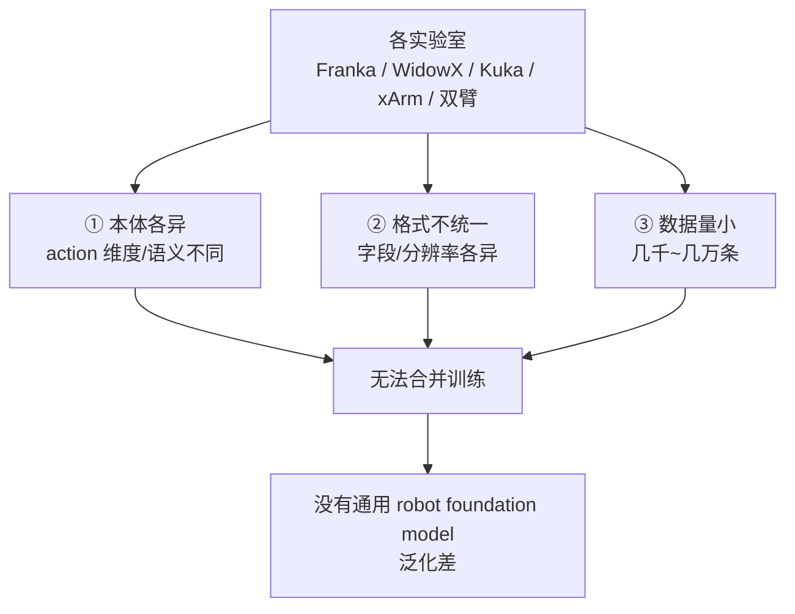
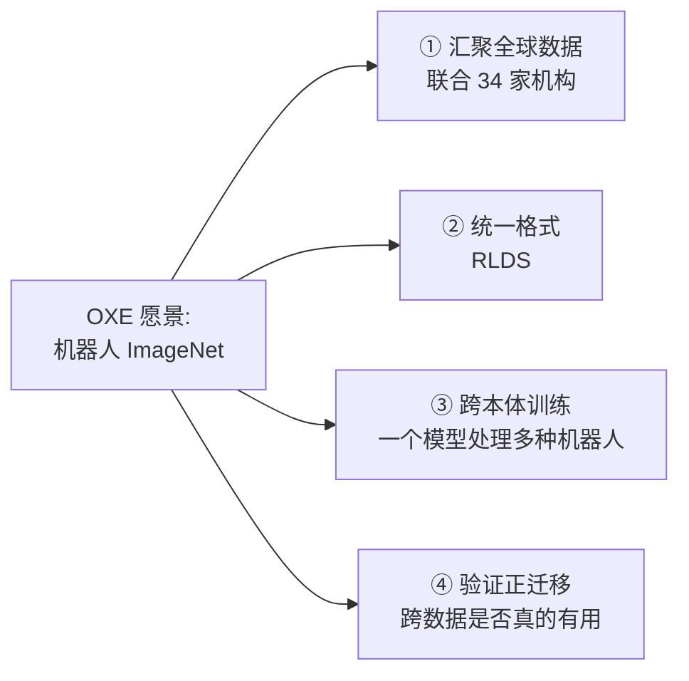
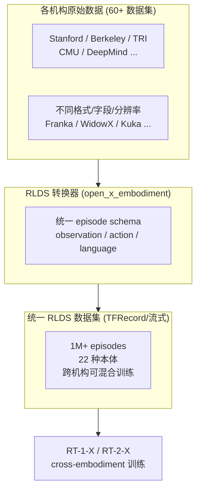
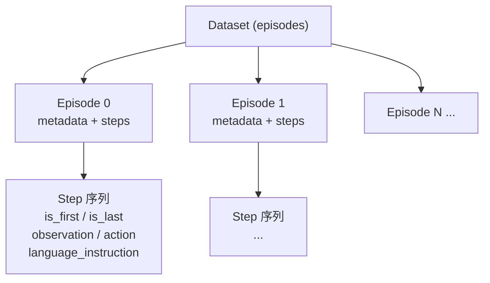
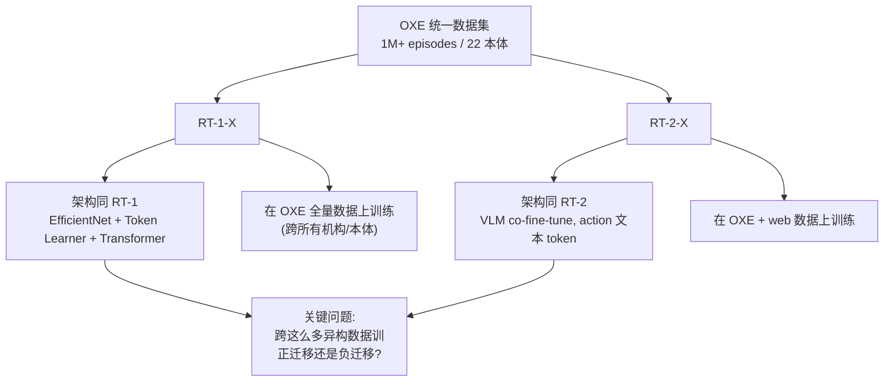
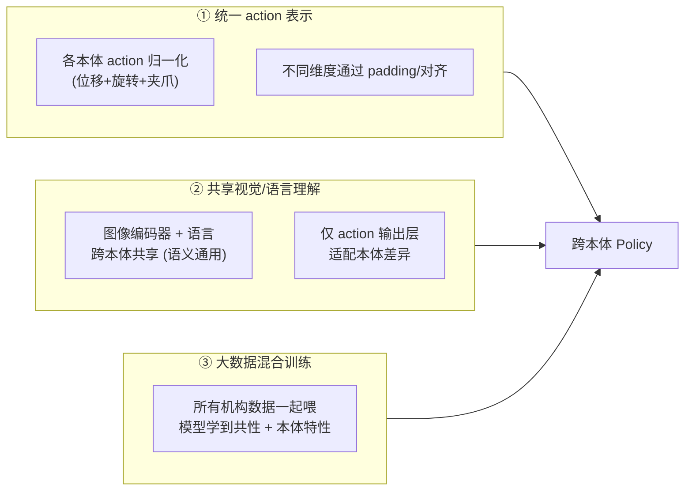
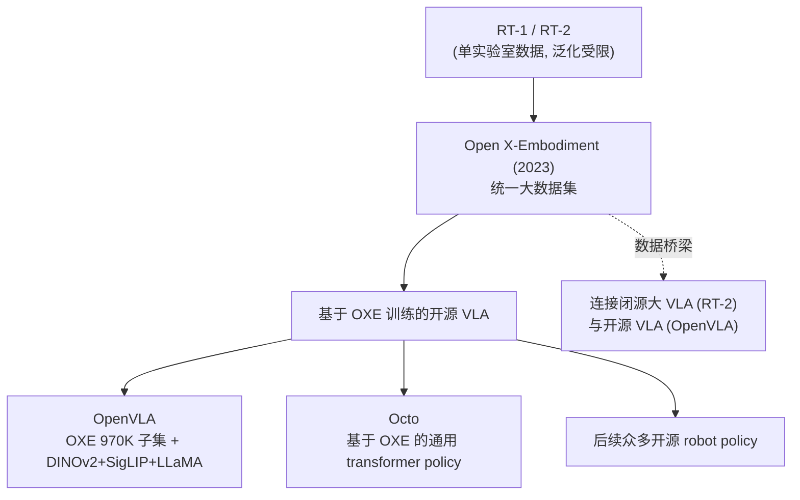

# 论文信息

- **标题**: Open X-Embodiment: Robotic Learning Datasets and RT-X Models
- **作者**: Open X-Embodiment Collaboration (34 个研究机构联合, Google DeepMind 主导)
- **机构**: 34 家机构 (Stanford, Berkeley, TRI, CMU, MIT, Google DeepMind, ...)
- **发表**: 2023 (ICRA 2024)
- **arXiv**: [2310.08864](https://arxiv.org/abs/2310.08864)
- **代码/数据**: [github.com/google-deepmind/open_x_embodiment](https://github.com/google-deepmind/open_x_embodiment), [HuggingFace Hub](https://huggingface.co/datasets/Open-X-Embodiment)

> **一句话总结**: Open X-Embodiment (OXE) 把全球 **34 家机构、22 种不同机器人本体、超过 100 万条轨迹**汇聚成**统一格式 (RLDS)** 的数据集，并在其上训练 **RT-1-X / RT-2-X** 模型。核心发现：**跨机构、跨本体 (cross-embodiment) 的数据规模化能带来正迁移 (positive transfer)**——在 OXE 上训练的单一模型，在各机构本地评测上**平均超越各自原模型**。OXE 是机器人领域的"ImageNet 时刻"，OpenVLA 等后续开源 VLA 都直接基于 OXE 训练。

---

# 1. 背景与动机

## 1.1 机器人数据的割裂困境

视觉/NLP 的成功离不开统一的大数据集（ImageNet 推动深度学习革命、LAION/WebText 推动 CLIP/LLM）。但机器人数据高度割裂：

- **本体各异 (embodiment gap)**：各实验室用不同机器人（Franka、WidowX、Kuka、xArm、双臂……），action 维度/语义都不同（有的 7 维，有的语义不同）。
- **格式不统一**：每家自己存数据（不同格式/字段/分辨率），无法直接合并训练。
- **数据量小**：单实验室采集有限（几千~几万条），远不够训练泛化模型。

后果：没有统一数据 → 没法训练通用 robot foundation model；各家在自己小数据上训 → 泛化差。



## 1.2 OXE 的愿景

OXE 的目标是给机器人领域造一个 "ImageNet"：



---

# 2. OXE 数据集

## 2.1 规模与组成

| 维度 | 数值 |
|------|------|
| 整合数据集数 | 60+ 个现有机器人数据集 |
| 轨迹总数 | > 1,000,000 条 (1M+ episodes) |
| 机器人本体数 | 22 种 (embodiment) |
| 贡献机构数 | 34 家研究机构 |

组成数据集示例：RT-1 数据、Bridge V2、Fractal (DROID)、BC-Z、Jaco Play、Roboturk、LWR、Aloha、TOTO、RoboMimic……

## 2.2 OXE 数据汇聚流程



## 2.3 统一格式：RLDS

不同实验室原始数据格式各异，需要统一。OXE 采用 **RLDS (Reinforcement Learning Datasets)**：把异构数据对齐到统一 schema，让一个训练 pipeline 能吃所有数据。

RLDS 的核心结构是一个 `tf.data.Dataset` 的 episodes，每个 episode 内嵌一个 `tf.data.Dataset` 的 steps：

- **Episode**：包含一个 steps 数据集 + 元数据（`episode_id`、`agent_id`、`environment_config` 等）。
- **Step**（必有字段 `is_first` / `is_last`；可选字段）：
  - `observation`：当前观测（图像/机器人状态）
  - `action`：在当前观测上执行的动作向量
  - `language_instruction`：自然语言指令（OXE 在 RLDS 之上额外约定）
  - `reward` / `discount` / `is_terminal`：RL 相关（模仿学习通常不用）
- **统一存储**：TFRecord/Dataset 格式，流式读取。



### 加载 OXE 子集的官方代码

下面片段取自 OXE / RLDS 官方示例，展示如何用 `tfds.load` 拉取一个 OXE 子集，并取到统一的 `observation / action / language_instruction` 字段（中文注释解释每一步）：

```python
import tensorflow_datasets as tfds
import rlds  # google-research/rlds: RLDS 数据操作库

# 1) 加载某个 OXE 子集（这里以 bridge_v2 为例）。
#    RLDS 把每个数据集表示为 "episode 序列"，每个 episode 内嵌一个 "step 序列"。
#    若 tfds 报 DatasetNotFoundError，可用 gsutil 把数据手动拷到 ~/tensorflow_datasets/。
ds = tfds.load('bridge_orig', split='train')

# 2) 拍平成 step 级数据流：episode.flat_map 拆出每条 step。
#    每个 step 都是统一 schema: observation / action / language_instruction。
step_ds = ds.flat_map(lambda episode: episode['steps'])

# 3) 取出训练需要的 (图像, 语言指令, 动作) 三元组。
#    不同子集字段路径可能略有差异，但都收敛到这三个核心键。
def to_train_sample(step):
    img = step['observation']['image']            # 工作区 RGB 图像 (H,W,3)
    lang = step['language_instruction']           # 自然语言指令 (字符串张量)
    act = step['action']                          # 动作向量 (本体相关维度)
    return {'image': img, 'lang': lang, 'action': act}

train_ds = step_ds.map(to_train_sample).batch(64)
```

> 提示：OXE 仓库还提供了一份**自包含 colab**，演示如何从每个子集可视化几条 episode、如何构造训练/推理用的 batch，详见仓库 README。

## 2.4 跨本体 action 对齐

不同机器人 action 维度/含义不同（Franka 7 维：$\Delta xyz + \Delta rpy + \text{gripper}$；WidowX 4 维：$\Delta xy + z + \text{gripper}$）。

OXE **保留各本体的原始 action**，训练时由跨本体模型处理维度差异（详见 RT-X 模型设计）——模型要学会"不同本体对应不同 action 语义"。

---

# 3. RT-X 模型（在 OXE 上训练）

## 3.1 RT-1-X 与 RT-2-X

OXE 论文训练两个模型家族：



## 3.2 Cross-Embodiment 训练策略

如何让一个模型处理多种本体？



### 训练目标（概念）

RT-X 的训练目标是标准的**行为克隆 (behavior cloning)**——给定图像观测 $o_t$ 和语言指令 $\ell$，让模型输出的动作 $\hat{a}_t$ 逼近专家动作 $a_t$：

$$
\min_{\theta}\; \mathbb{E}_{(o_t,\, \ell,\, a_t)\sim \mathcal{D}_{\text{OXE}}}
\bigl[\,\mathcal{L}\bigl(\,\pi_{\theta}(a_t \mid o_t, \ell),\ a_t\,\bigr)\bigr]
$$

其中 $\mathcal{D}_{\text{OXE}}$ 是跨所有本体、所有机构混合的统一数据集。关键在于 $\pi_{\theta}$ 对不同本体输出**不同维度**的 $a_t$，但对图像/语言的理解是**共享**的。

### Cross-Embodiment 训练示意代码

下面是一段"如何在 OXE 上混合训练跨本体 policy"的简化示意（聚焦 action 维度对齐，非官方完整实现）：

```python
import tensorflow as tf

# 各本体的 action 维度不同（如 Franka=7, WidowX=4），统一 pad 到最大维度 MAX_DIM。
MAX_DIM = 11  # OXE 中最长 action 向量的维度

def normalize_and_pad(action, embodiment_id):
    """把不同本体的 action 归一化并 pad 到统一维度。

    - action: 原始动作向量, 形状 [D_emb]
    - embodiment_id: 本体标识 (用于查表得到该本体的归一化统计量)
    返回统一维度的 action, 以及一个有效位 mask。
    """
    stats = NORM_STATS[embodiment_id]            # 该本体的均值/方差 (预计算)
    action = (action - stats['mean']) / stats['std']   # z-score 归一化
    pad = MAX_DIM - tf.shape(action)[0]
    action = tf.pad(action, [[0, pad]])          # 末尾补 0, 对齐到 MAX_DIM
    mask = tf.concat([tf.ones_like(action[:D_emb]),    # 有效位
                      tf.zeros([pad])], axis=0)
    return action, mask

def make_train_batch(mixed_oxe_ds):
    """从混合的 OXE 数据流构造一个跨本体训练 batch。

    每个 sample 还带上 embodiment_id, 让模型知道当前来自哪种机器人。
    """
    def map_fn(step):
        a, mask = normalize_and_pad(step['action'], step['embodiment_id'])
        return {
            'image':   step['observation']['image'],     # 共享视觉输入
            'lang':    step['language_instruction'],     # 共享语言输入
            'action':  a,                                 # 对齐后的统一动作
            'mask':    mask,                              # 动作有效位
            'emb':     step['embodiment_id'],            # 本体标识
        }
    return mixed_oxe_ds.map(map_fn).batch(256)

# 训练步: policy 共享 backbone, action 头按本体分支输出
for batch in make_train_batch(oxe_mixed_ds):
    with tf.GradientTape() as tape:
        pred = policy(batch['image'], batch['lang'], batch['emb'])  # [B, MAX_DIM]
        loss = masked_mse(pred, batch['action'], batch['mask'])      # 仅在有效位上算 loss
    grads = tape.gradient(loss, policy.trainable_variables)
    optimizer.apply_gradients(zip(grads, policy.trainable_variables))
```

---

# 4. 核心实验：正迁移的证据

## 4.1 各机构本地评测

**关键实验设计**：各机构用自己的本地评测协议，测 (a) 自己原模型（只在自己数据上训）与 (b) RT-X（在 OXE 全量训）。

| 机构 | 原模型成功率 | RT-1-X 成功率 | 提升 |
|------|------------|--------------|------|
| Berkeley | ~baseline | 显著更高 | ↑ |
| Stanford | ~baseline | 显著更高 | ↑ |
| TRI | ~baseline | 显著更高 | ↑ |
| ... | ... | ... | ... |
| **平均** | — | — | **↑ ~50% 相对提升** |

> 惊人结论：RT-1-X（一个模型，OXE 全量训）在每家机构的本地评测上，**平均超越该机构自己专门训练的模型**。这证明跨机构数据 → **正迁移 (positive transfer)**：即使本体不同，共享的视觉/语言/物理知识能迁移。

## 4.2 RT-2-X 的效果

- 比 RT-2 在更多任务/本体上泛化。
- 利用 OXE 的多样化数据，提升长尾任务表现。
- 验证 VLA 也能从跨本体数据受益。

## 4.3 正迁移 vs 负迁移

**正迁移 (positive transfer)** 与 **负迁移 (negative transfer)** 是核心概念。设单本体数据集上训练的模型在目标任务上的成功率为 $S_{\text{single}}$，跨本体训练后模型在该任务上的成功率为 $S_{\text{cross}}$，则：

- **正迁移**：$S_{\text{cross}} > S_{\text{single}}$，跨本体数据帮助了目标任务。
- **负迁移**：$S_{\text{cross}} < S_{\text{single}}$，异构数据反而干扰了目标任务。

$$
\Delta S = S_{\text{cross}} - S_{\text{single}}
\quad\Rightarrow\quad
\begin{cases}
\Delta S > 0 & \text{正迁移 (positive transfer)} \\
\Delta S < 0 & \text{负迁移 (negative transfer)}
\end{cases}
$$

OXE 的实验结论：

- 某些差异极大的本体间，可能轻微负迁移。
- 但**总体正迁移 >> 负迁移**，数据多样性带来的泛化收益占主导。
- 支持"大统一数据集"路线。

---

# 5. OXE 的意义

## 5.1 机器人领域的 ImageNet 时刻

1. **首个跨机构、跨本体、百万级统一数据集** → 打破数据割裂。
2. **证明 cross-embodiment 正迁移** → 一个通用 robot foundation model 可行。
3. **统一格式 (RLDS) 成为社区标准** → 后续数据集都按此发布。
4. **推动开源 VLA**：OpenVLA 直接基于 OXE 的 970K 子集训练 → OXE 是 OpenVLA 的数据基础。

## 5.2 开放生态

OXE 数据全部开放（HuggingFace）：研究者可下载/使用，促进复现与改进。像 ImageNet 之于视觉，加速机器人学习社区发展。

---

# 6. 核心要点总结

## 6.1 OXE 的贡献

| # | 维度 | 内容 |
|---|------|------|
| ① | 数据 | 1M+ 轨迹，22 本体，34 机构，统一 RLDS 格式 |
| ② | 模型 | RT-1-X / RT-2-X (跨本体训练) |
| ③ | 发现 | Cross-embodiment 正迁移：一个模型跨数据训 → 平均超越各机构专有模型 |
| ④ | 生态 | 开放数据，成为 robot foundation model 基石 |

## 6.2 在 VLA 路线中的位置



## 6.3 一句话记忆

**OXE = 机器人 ImageNet = 100 万轨迹 + 22 本体 + 34 机构 + 统一格式**；证明跨本体数据正迁移，是 OpenVLA 的数据底座。

---

# 7. 参考资料

- **OXE 原论文**: Open X-Embodiment Collaboration, "Open X-Embodiment: Robotic Learning Datasets and RT-X Models", ICRA 2024, [arXiv:2310.08864](https://arxiv.org/abs/2310.08864)
- **代码/数据**: [github.com/google-deepmind/open_x_embodiment](https://github.com/google-deepmind/open_x_embodiment)
- **数据集 (HF)**: [huggingface.co/datasets/Open-X-Embodiment](https://huggingface.co/datasets/Open-X-Embodiment)
- **RT-1**: Brohan et al., 2022, [arXiv:2212.06817](https://arxiv.org/abs/2212.06817)
- **RT-2**: Brohan et al., 2023, [arXiv:2307.15818](https://arxiv.org/abs/2307.15818)
- **RLDS**: [github.com/google-research/rlds](https://github.com/google-research/rlds) (统一格式)
- **Octo**: Octo Model Team, 2024 (基于 OXE 的开源通用 policy)
- **DROID**: Khazatsky et al., 2024 (大型开源机器人数据集, OXE 组成部分)
- **OpenVLA**: Kim et al., 2024, [arXiv:2406.09246](https://arxiv.org/abs/2406.09246) (基于 OXE)
