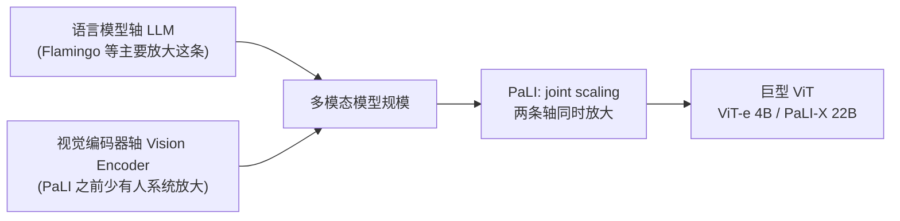
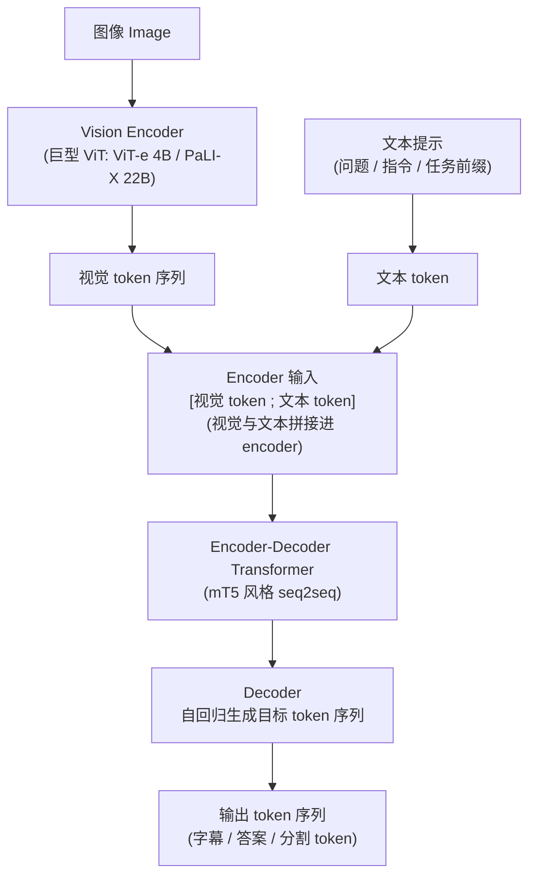
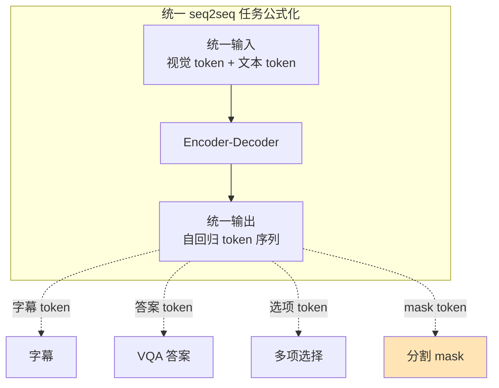
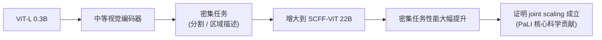
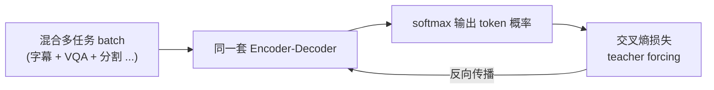
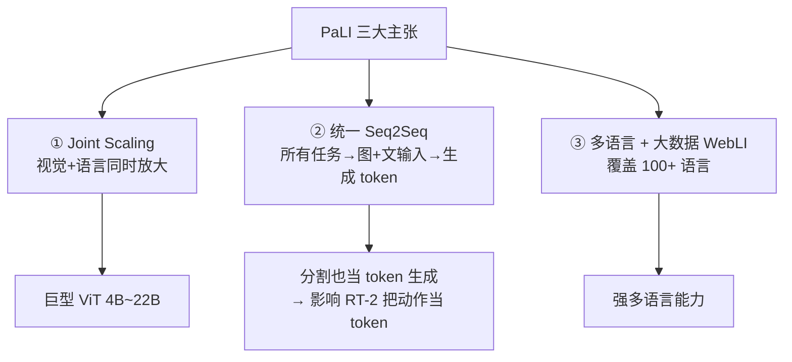
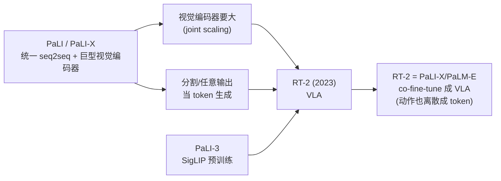

# 论文信息

- **标题**: PaLI: A Jointly-Scaled Multilingual Language-Image Model
- **作者**: Xi Chen, Xiao Wang, Lucas Beyer, Alexander Kolesnikov, et al. (Google Research)
- **机构**: Google Research
- **发表**: 2022 (后续有 PaLI-X 2023, PaLI-3 2023)
- **arXiv**: [2209.06794](https://arxiv.org/abs/2209.06794)
- **代码**: 闭源 (Google)

> **一句话总结**: PaLI 的核心主张是 **"联合缩放" (joint scaling)**——视觉和语言两条分支要同时做大，而不是只放大其中一个。它用统一的 **encoder-decoder seq2seq 架构**把所有多模态任务（字幕、VQA、把分割也当生成）都公式化成 **"输入图+文 → 输出 token 序列"**，用超大规模多语言图文数据 (WebLI) 训练，并用上 Google 自研的巨型 ViT（ViT-e 4B、PaLI-X 22B）。PaLI 证明了纯 seq2seq 统一框架 + 双轴缩放在多模态上的威力（guideline VLM 进阶选看）。

---

# 1. 背景与动机

## 1.1 缩放 (scaling) 的两条轴

多模态模型的规模来自两个方向：

- **轴 1**: 语言模型 (LLM) 大小
- **轴 2**: 视觉模型 (vision encoder) 大小

**观察 (PaLI 之前)**:

- 大部分工作主要放大语言模型 (如 Flamingo 70B LLM + 中等视觉)
- 视觉编码器往往用中等大小 ViT (如 ViT-L/B)
- 没人系统研究 "视觉编码器" 这条轴放大会怎样

**PaLI 的论点**:

> 视觉理解能力受限于视觉编码器容量 → 必须 **joint scaling**: 视觉 + 语言 一起放大 → 引入超大 ViT (ViT-e 4B, PaLI-X 22B)



## 1.2 统一的 seq2seq 框架

PaLI 不用对比学习 (CLIP) 也不用 cross-attn 桥接 (Flamingo)，而是用最朴素的 **encoder-decoder seq2seq**：

- **统一把所有任务公式化为**: 输入 = `[图像视觉 token]` + `[文本提示 (问题/指令)]`；输出 = 目标 token 序列 (答案/字幕/分割 token)
- **好处**: 一个架构处理所有任务；生成式，输出灵活；易于扩展 (就是标准 Transformer seq2seq)

---

# 2. 方法

## 2.1 整体架构



> 所有任务都走同一条管线: **输入「图 + 问题」 → 输出「答案序列」**，不需要为不同任务设计不同的 head。

## 2.2 任务统一公式化

PaLI 把多种任务都变成 seq2seq 生成：

| 任务 | 输入 | 输出 |
|---|---|---|
| ① Image Captioning (字幕) | 图 + "生成描述" | 字幕文本 |
| ② VQA (视觉问答) | 图 + 问题 | 答案 |
| ③ 多项选择 VQA | 图 + 问题 + 选项 | 选中的选项 |
| ④ **分割 (Segmentation)** ⭐ | 图 + "分割出 [类别]" | 一串表示 mask 的 token (类似 SegFormer 的 token 化 mask 表示) |



> **统一的好处**: 一个模型 + 一个目标 (seq2seq LM loss) 处理所有任务，分割也只是一个"特殊词汇表"上的生成任务。

## 2.3 视觉编码器：联合缩放的关键

PaLI 系列的视觉编码器规模：

| 模型 | Vision Encoder | 语言模型 | 总参数 |
|---|---|---|---|
| PaLI | ViT-e (4B) | 3B / 15B | ~17B |
| PaLI-X | SCFF-ViT (22B) | 32B | 55B |
| PaLI-3 | SigLIP ViT (2B) | 3B | ~5B (更小更高效) |

**关键洞察 (PaLI-X 实验)**: 把视觉编码器从 ViT-L (0.3B) → 22B，在密集任务 (分割/区域描述) 上提升巨大 → 证明**视觉编码器缩放非常重要** (joint scaling 成立)。



## 2.4 数据：WebLI（Web Language-Image）

PaLI 专有多语言数据集 **WebLI (Web Language-Image)**:

- 从网页爬取的图文对，超过 100 种语言，规模巨大 (数十亿对)

**特点**:

1. **多语言** (不止英文)
2. 包含图文对 + 交错图文网页 + 区域标注
3. 用作 PaLI 多任务训练

→ 让 PaLI 成为强大的多语言多模态模型。

## 2.5 训练目标

标准的 **seq2seq 条件语言建模**。给定视觉特征 $V$、输入文本 token $x$ 和目标输出 $y$，目标是建模：

$$
P(y \mid V, x) = \prod_{t=1}^{T} P\!\left(y_t \mid V, x, y_{<t}\right)
$$

即第 $t$ 个输出 token $y_t$ 的条件概率，依赖视觉特征 $V$、输入文本 $x$ 以及此前已生成的 token $y_{<t} = (y_1, \dots, y_{t-1})$。

**损失**: 在目标 token 上的**交叉熵** (teacher forcing):

$$
\mathcal{L} = -\sum_{t=1}^{T} \log P\!\left(y_t \mid V, x, y_{<t};\, \theta\right)
$$

**多任务**: 不同任务的样本混合训练 (共享一个模型、共享同一套参数 $\theta$)。



### 2.5.1 伪代码：seq2seq 统一任务公式化（示意）

> ⚠️ **官方未开源**：PaLI 是 Google 闭源项目（无官方代码）。以下为**示意伪代码**，用于说明 PaLI 把"视觉 token + 文本 token 拼接送 encoder、decoder 自回归生成、分割也当 token 生成"的统一 seq2seq 公式化思想，并非 Google 真实实现。

```python
# === PaLI 统一 seq2seq 任务公式化（示意伪代码，非官方实现） ===
# 官方闭源，下面仅说明"输入=[视觉token;文本]→encoder，输出→decoder 生成 token"
# 关键点: 字幕 / VQA / 分割 都被套进同一条 forward + 同一个 LM loss

class PaLI(nn.Module):
    def __init__(self, vision_encoder, text_tokenizer, seq2seq_transformer):
        self.vision_encoder = vision_encoder        # 巨型 ViT (ViT-e / SCFF-ViT)
        self.tokenizer = text_tokenizer             # 多语言文本 + 分割 token 词表
        self.transformer = seq2seq_transformer      # mT5 风格 encoder-decoder

    def encode_image(self, image):
        # 图像 -> 视觉 token 序列;  (H,W,C) -> (N_v, d)
        v_tokens = self.vision_encoder(image)       # 形状: [B, N_v, d]
        return v_tokens

    def forward(self, image, prompt_text, target_text=None):
        # ---- 1. 视觉编码 ----
        v_tokens = self.encode_image(image)         # [B, N_v, d]  视觉 token

        # ---- 2. 文本编码 (问题/指令/任务前缀) ----
        t_tokens = self.tokenizer.encode(prompt_text)   # [B, N_t]

        # ---- 3. Encoder 输入 = [视觉 token ; 文本 token] 拼接 ----
        # 视觉与文本共享同一个嵌入空间后拼接, 一起进 encoder
        enc_input = concat([v_tokens, t_tokens], dim=1) # [B, N_v + N_t, d]

        # ---- 4. Encoder 编码 (视觉+文本联合上下文) ----
        enc_states = self.transformer.encode(enc_input) # [B, N_v+N_t, d]

        # ---- 5. Decoder 自回归生成目标 token 序列 ----
        if target_text is not None:
            # 训练: teacher forcing, 算 LM loss
            target_ids = self.tokenizer.encode(target_text)        # [B, T]
            logits = self.transformer.decode(enc_states, target_ids[:, :-1])
            # 交叉熵: P(y_t | 视觉, 文本, y_<t)
            loss = cross_entropy(logits, target_ids[:, 1:])
            return loss
        else:
            # 推理: 逐 token 自回归采样, 直到 <eos>
            generated = self.transformer.decode_autoregressive(enc_states)
            return generated


# === 任务统一的关键: 不同任务只是 "prompt + 目标字符串" 不同 ===
# 同一个 forward / 同一个 LM loss 通吃:

# ① 字幕: 目标就是字幕文本
loss = pali(image, prompt_text="caption", target_text="a cat on the sofa")

# ② VQA: 目标是答案
loss = pali(image, prompt_text="question: what color is the car? answer:",
            target_text="red")

# ③ 多项选择 VQA: 目标是被选中选项的 token
loss = pali(image, prompt_text="question + options [A/B/C]", target_text="B")

# ④ 分割 ⭐: 目标是一串表示 mask 的 token (类似 SegFormer 的 mask token 化)
#    ——分割也被当成普通的 token 生成任务, 无需专门的 mask head
loss = pali(image, prompt_text="segment: cat",
            target_text="<m0><m1><m2>...<mk>")  # 一串 mask token

# 推理时同样统一:
tokens = pali(image, prompt_text="question: ...", target_text=None)
answer = pali.tokenizer.decode(tokens)   # 文本答案 / 字幕 / 分割 token 都走这里
```

> **直觉**: PaLI 的优雅之处在于——**只要能把答案"写成一行序列"，就能塞进 seq2seq**。分割之所以能套进来，靠的是把连续 mask 离散化成一串 token (一种"分割专用词汇表")。这正是后来 RT-2 把**动作 (action) 也离散成 token** 来统一 VLA 的思想原型。

---

# 3. 实验

## 3.1 主要结果

PaLI 在众多多模态任务达 SOTA (2022):

- 多语言 image captioning (64 种语言, COCO Captioning 等)
- VQA (VQAv2, OK-VQA)
- 区域描述 / 分割 (生成式分割)
- 视觉问答 (knowledge-intensive)

**PaLI-X (55B)**: 在多个 benchmark 上刷新 SOTA；多语言能力极强。

**PaLI-3 (2023, 更小更精)**: 用 SigLIP 视觉编码器 (而非 CLIP)；用对比预训练 + 生成微调；5B 参数达到接近 PaLI-X 的效果；证明 **"数据质量 + 良好预训练" 比单纯堆参数更重要**。

## 3.2 联合缩放的证据

PaLI-X 消融: 固定语言模型大小，增大视觉编码器 → 密集任务 (分割/区域描述) 性能大幅提升 → 验证 "视觉编码器缩放" 这条轴的价值。

> 这是 PaLI 最重要的科学贡献。

---

# 4. 与同类工作对比

| 模型 | 架构范式 | 视觉编码器缩放 |
|---|---|---|
| CLIP | 双塔对比 | 中等 (到 ViT-L) |
| Flamingo | 冻结 LLM + cross-attn | 中等 |
| BLIP-2 | 冻结 LLM + Q-Former | 中等 |
| **PaLI** | **端到端 seq2seq** | **极大 (到 22B!)** |
| PaLI-3 | 对比预训练 + seq2seq | SigLIP (高效) |

**PaLI 的独特主张**: joint scaling (视觉 + 语言 都放大)；统一 seq2seq 处理所有任务；强调多语言。

---

# 5. 核心要点总结

## 5.1 PaLI 三大主张

1. **Joint Scaling**: 视觉和语言两条轴要同时放大 → 引入巨型 ViT (4B~22B)
2. **统一 Seq2Seq 框架**: 所有任务 → 图+文输入 → 生成 token 输出 (字幕/VQA/分割 都统一)
3. **多语言 + 大数据 (WebLI)**: 覆盖 100+ 语言



## 5.2 在 VLA 路线中的位置

**PaLI (VLM 进阶选看)**:

- 证明了**视觉编码器缩放**的重要性
- 提供了 **"统一 seq2seq 生成"** 的范式
- PaLI-3 用 SigLIP, 印证了 SigLIP 价值

它的 **"巨型视觉编码器"** 和 **"把动作/分割当 token 生成"** 思想 → 影响 **RT-2** (PaLI-X 是 RT-2 的 VLM 基座之一!):

> **RT-2** = 把 PaLI-X / PaLM-E co-fine-tune 成 VLA



## 5.3 一句话记忆

> PaLI = 视觉 + 语言联合缩放 + 统一 seq2seq 生成 + 多语言大数据（是 RT-2 的 VLM 基座）

---

# 6. 参考资料

- **PaLI 原论文**: Chen et al., "PaLI: A Jointly-Scaled Multilingual Language-Image Model", 2022, [arXiv:2209.06794](https://arxiv.org/abs/2209.06794)
- **PaLI-X**: Chen et al., "PaLI-X: On Scaling up a Multilingual Vision and Language Model", 2023
- **PaLI-3**: Chen et al., "PaLI-3: Smaller, Faster, Stronger Vision-Language Models", 2023
- **ViT**: Dosovitskiy et al., ICLR 2021 (巨型视觉编码器基础)
- **Scaling ViT (ViT-e)**: Zhai et al., 2022 (4B 视觉编码器)
- **SimVLM**: Wang et al., ICLR 2022 (seq2seq 多模态先驱)
- **mT5**: Xue et al., NAACL 2021 (多语言 seq2seq)
- **SigLIP**: Zhai et al., ICCV 2023 (PaLI-3 用)
- **RT-2**: Brohan et al., 2023 (用 PaLI-X 做 VLA)
- **Flamingo**: Alayrac et al., NeurIPS 2022 (对比范式)
