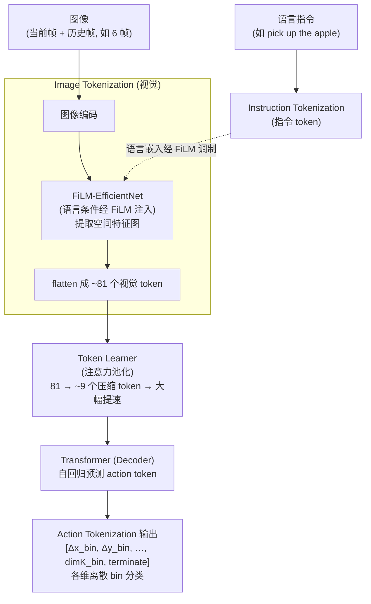
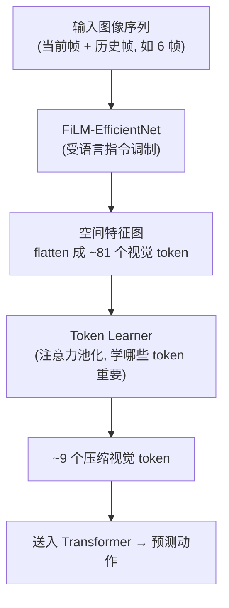
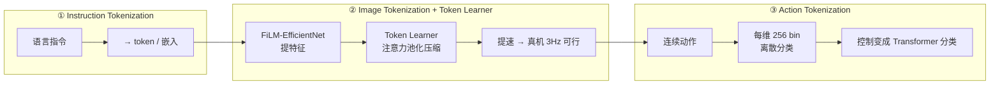
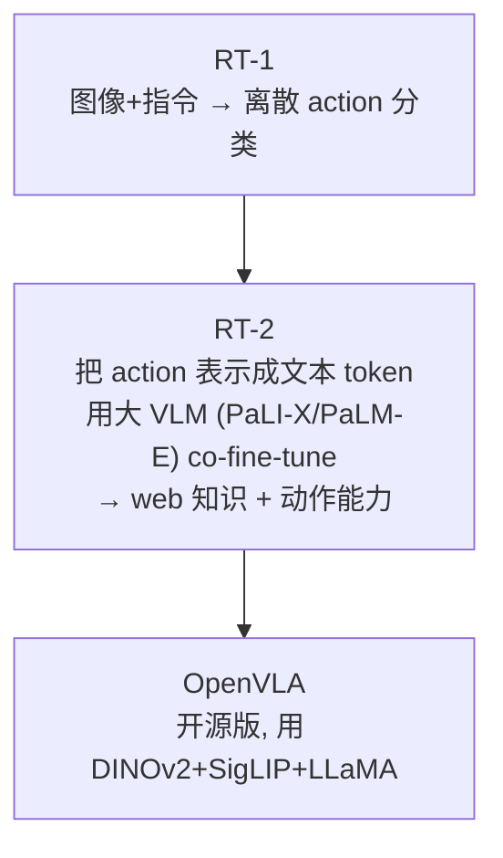

# 论文信息

- **标题**: RT-1: Robotics Transformer for Real-World Control at Scale
- **作者**: Anthony Brohan, et al. (Google Robotics / Everyday Robots)
- **机构**: Google Research, Robotics at Google
- **发表**: 2022 (arXiv 12月), RSS 2023
- **arXiv**: [2212.06817](https://arxiv.org/abs/2212.06817)
- **代码**: 部分开源 (Google)
- **演示数据**: RT-1 数据 (13万 episode 真实机器人)

> **一句话总结**: RT-1 是**首个能在真实 Everyday Robots 机器人上高效运行的 Transformer 策略**，把机器人控制建模成"指令 + 图像 → 离散化动作 token 的分类"问题。三大关键设计：① **Instruction Tokenization**（语言指令 token 化）、② **Image Tokenization**（FiLM-EfficientNet 提视觉特征）+ **Token Learner**（压缩视觉 token 数量以提速）、③ **Action Tokenization**（把每维动作离散成 bin 分类）。用 13 万条真实遥操作 episode 训练，RT-1 在 700+ 任务上泛化到新物体/指令/背景，推理可达 3Hz，奠定了"大模型真实机器人 policy"的范式，是 RT-2 / OpenVLA 的直接前身。

---

# 1. 背景与动机

## 1.1 真实机器人 policy 的两难

机器人学习 policy 的核心矛盾，在于**泛化性**与**真实部署效率**两难：

- **泛化性 (generality)**：希望 policy 能处理新物体、新指令、新背景 → 需要大模型 + 多样数据（像 LLM/VLM 那样）。
- **真实部署 (real-world efficiency)**：真实机器人控制频率要求高（几 Hz）、显存/算力受限 → 大模型通常太慢。

| 已有工作 | 短板 |
|---|---|
| BC-Z, Gato 等 | 模型不够大或数据不够多样 → 泛化弱 |
| PaLM-E 等超大模型 | 泛化强但太慢，难实时部署 |

**RT-1 的目标**：一个能在真实机器人上实时运行（3Hz）的 Transformer policy，同时具备强泛化性（新物体/指令/背景）。

## 1.2 RT-1 的解法：高效 token 化 + 分类

把机器人控制建模成一个**高效分类问题**：

- **输入**：语言指令 + 图像（当前观测）
- **输出**：离散化的动作 token 序列（分类）

通过精心设计的 token 化 + Token Learner 压缩，让一个 Transformer 既能泛化又够快 → **"把机器人动作当 token 分类"的范式**（为 RT-2 铺路）。

---

# 2. 方法

## 2.1 整体架构



## 2.2 三大 Tokenization

### 2.2.1 Instruction Tokenization（语言指令）


- **输入**：自然语言指令，如 `"pick up the red apple"`；实际数据集用一组离散指令模板（**700+ 指令**）。
- **处理**：把指令映射成 token，注入视觉编码器（FiLM 调制）。
- RT-1 数据集的指令结构化为：**动作动词**（pick / place / open / close…）+ **物体**（apple / banana / can…）+ **修饰**（颜色 / 位置）→ 约 700+ 离散指令组合。

### 2.2.2 Image Tokenization + Token Learner（视觉，提速关键）



**Image Tokenizer**：

- 用 EfficientNet（带 FiLM，受语言指令调制）提取图像特征图。
- 输入：当前图像 + 历史图像（如 6 帧，提供时间信息）。
- 输出：空间特征图，flatten 成 ~81 个视觉 token。

**Token Learner（RT-1 提速的核心）**：

- 问题：81 个视觉 token 对 Transformer 还是偏多 → 慢。
- 方案：用注意力池化把 81 个 token 压缩到更少（如 ~9 个）。
  1. 把输入 token 经 attention 自适应选择/池化；
  2. 输出少量高信息量 token。
- **效果**：大幅减少 Transformer 序列长度 → 推理提速；RT-1 可达 **3Hz 实时控制**（在当时很了不起）。

### 2.2.3 Action Tokenization（动作离散化，核心）

- 机器人动作 = 连续多维向量，如 7 维 $[\Delta x, \Delta y, \Delta z, \Delta\text{roll}, \Delta\text{pitch}, \Delta\text{yaw}, \text{gripper}]$ + 终止信号。
- RT-1 把**每维连续动作离散化成 bin（桶）**：每个动作维度 → **256 个 bin 之一** → 离散 token。
  - 例：$\Delta x \in [-0.1, +0.1]$，分成 256 个区间，落在第 $k$ 个区间 → token `x_bin_k`。
- 最终动作表示：每步输出 ~11 个 action token：

$$
[\Delta x\_\text{bin},\ \Delta y\_\text{bin},\ \Delta z\_\text{bin},\ \Delta\text{roll}_\text{bin},\ \Delta\text{pitch}_\text{bin},\ \Delta\text{yaw}_\text{bin},\ \Delta x\_\text{rot},\ \Delta y\_\text{rot},\ \Delta z\_\text{rot},\ \text{gripper}_\text{bin},\ \text{terminate}]
$$

每个 token 是一个分类（在 256 bin 里选一）。

> ⭐ **关键**：把连续动作变成离散分类 → 可以用 Transformer 分类头 → 和 RT-2 "把 action 当文本 token" 一脉相承。

## 2.3 训练目标

每个 action token 是独立分类。记 $D$ 为动作维度数，预测 bin 为 $\hat{y}_d$、真实 bin 为 $y_d$，则总损失为各维交叉熵之和：

$$
\mathcal{L} \;=\; \sum_{d=1}^{D} \mathrm{CE}\!\left(\hat{y}_d,\; y_d\right)
$$

**FiLM 调制**：语言条件 $\gamma$ 以仿射变换注入视觉特征 $x$，

$$
\mathrm{FiLM}(x) \;=\; \gamma \odot x + \beta, \qquad (\gamma,\beta)=\mathrm{MLP}(\text{指令嵌入})
$$

训练就是 $(观测+指令) \to$ 多个 action token 的多任务分类。本质是**行为克隆 (BC)**，但用分类形式。

### 2.3.1 伪代码：三种 tokenization（官方闭源，以下为根据论文复述的示意伪代码）

> 官方 RT-1 实现闭源。以下伪代码根据论文描述复述其数据流，仅作示意，非官方实现。

```python
# ===== 官方闭源，以下为根据论文复述的示意伪代码 =====
import torch
import torch.nn as nn

# ---------- (a-1) Instruction Tokenization ----------
class InstructionTokenizer(nn.Module):
    """语言指令 -> 嵌入向量 (再经 FiLM 调制视觉特征)"""
    def __init__(self, instr_embed_dim: int):
        super().__init__()
        # 实际数据集是 700+ 条结构化指令模板, 这里用嵌入层示意
        self.embed = nn.Embedding(num_embeddings=800, embedding_dim=instr_embed_dim)

    def forward(self, instr_ids):
        # instr_ids: [B] 指令 id (离散)
        instr_emb = self.embed(instr_ids)        # [B, D] 指令嵌入, 后续送入 FiLM
        return instr_emb


# ---------- (a-2) Image Tokenization (FiLM-EfficientNet) + Token Learner 压缩 ----------
class FiLM(nn.Module):
    """Feature-wise Linear Modulation: 用语言条件对视觉特征做仿射调制"""
    def __init__(self, instr_dim: int, feat_dim: int):
        super().__init__()
        # 指令嵌入 -> (gamma, beta) 两个调制参数
        self.film_mlp = nn.Linear(instr_dim, feat_dim * 2)

    def forward(self, feat, instr_emb):
        # feat: [B, C, H, W]  视觉特征图;  instr_emb: [B, D]
        gamma, beta = self.film_mlp(instr_emb).chunk(2, dim=-1)   # 各 [B, C]
        gamma = gamma.unsqueeze(-1).unsqueeze(-1)                  # [B, C, 1, 1]
        beta  = beta.unsqueeze(-1).unsqueeze(-1)
        return gamma * feat + beta                                # FiLM 调制


class ImageTokenizer(nn.Module):
    """图像 (含历史帧) -> FiLM-EfficientNet -> Token Learner 压缩 -> 少量视觉 token"""
    def __init__(self, instr_dim: int, num_keep: int = 9):
        super().__init__()
        self.efficientnet = EfficientNetFeatures()   # 骨干 (论文用 EfficientNet)
        self.film = FiLM(instr_dim, feat_dim=1280)   # 在各阶段特征上做 FiLM
        self.token_learner = TokenLearner(num_keep=num_keep)  # 81 -> 9 个 token

    def forward(self, images, instr_emb):
        # images: [B, T, C, H, W]  T 帧历史
        B, T = images.shape[:2]
        imgs = images.flatten(0, 1)                       # [B*T, C, H, W]
        feat = self.efficientnet(imgs)                    # [B*T, C, H', W'] 空间特征图
        feat = self.film(feat, instr_emb.unsqueeze(1).expand(-1, T, -1).flatten(0, 1))
        feat = feat.flatten(2).transpose(1, 2)            # [B*T, H'*W', C]  ~81 个 token
        feat = feat.view(B, T * feat.size(1), feat.size(2))  # 拼接历史帧 token
        tokens = self.token_learner(feat)                 # [B, num_keep, C]  压缩到 ~9
        return tokens


class TokenLearner(nn.Module):
    """注意力池化: 从 N 个 token 自适应选出 num_keep 个高信息量 token (RT-1 提速核心)"""
    def __init__(self, num_keep: int):
        super().__init__()
        self.num_keep = num_keep
        self.attn_mlp = nn.Sequential(nn.LayerNorm(1280), nn.Linear(1280, num_keep))

    def forward(self, tokens):
        # tokens: [B, N, C], N 个输入 token (如 81)
        attn = self.attn_mlp(tokens).transpose(1, 2)     # [B, num_keep, N] 每个输出 token 的注意力权重
        attn = attn.softmax(dim=-1)
        out = attn @ tokens                               # [B, num_keep, C]  压缩后 token
        return out


# ---------- (a-3) Action Tokenization: 连续 action -> 256 bin 离散 token ----------
class ActionTokenizer:
    """把每个连续动作维度量化到 256 个 bin 之一, 转成离散分类 token"""
    def __init__(self, n_bins: int = 256):
        self.n_bins = n_bins

    def encode(self, action_cont):
        # action_cont: [B, D]  连续动作 (D 个维度, 如 7 + gripper + ...)
        # 先按各维 [low, high] 归一化到 [0,1], 再量化到 bin id
        normalized = (action_cont - self.low) / (self.high - self.low)
        bin_ids = torch.clamp((normalized * self.n_bins).long(), 0, self.n_bins - 1)  # [B, D]
        return bin_ids                                      # 每维一个 0~255 的离散 token
```

### 2.3.2 伪代码：Transformer decoder + 多 action token 分类头

```python
# ===== 官方闭源, 以下为根据论文复述的示意伪代码 =====
class RT1Policy(nn.Module):
    """观测(图像)+指令 -> 自回归预测多个离散 action token (各维 256-bin 分类)"""
    def __init__(self, n_action_dim: int = 11, n_bins: int = 256):
        super().__init__()
        self.instr_tok = InstructionTokenizer(instr_embed_dim=512)
        self.img_tok   = ImageTokenizer(instr_dim=512, num_keep=9)
        self.transformer = TransformerDecoder(
            d_model=1280, nhead=8, num_layers=8, max_len=9 + n_action_dim)
        # 每个动作维度一个 256-bin 分类头
        self.action_heads = nn.ModuleList(
            [nn.Linear(1280, n_bins) for _ in range(n_action_dim)])
        self.action_tokenizer = ActionTokenizer(n_bins=n_bins)

    def forward(self, images, instr_ids, action_tokens_gt=None):
        # 编码输入
        instr_emb = self.instr_tok(instr_ids)            # [B, 512] 指令嵌入 (送 FiLM)
        vis_tokens = self.img_tok(images, instr_emb)     # [B, 9, 1280] 压缩后视觉 token
        seq = vis_tokens                                   # Transformer 输入序列

        # 自回归预测 n_action_dim 个 action token (并行训练, teacher forcing)
        logits_list = self.transformer(seq, queries=action_tokens_gt)
        # logits_list: list of [B, 256], 每个 action 维度一个分类分布
        return logits_list

    def compute_loss(self, logits_list, action_cont_gt):
        # action_cont_gt: [B, D] 真实连续动作 -> 量化成 bin id
        bin_ids = self.action_tokenizer.encode(action_cont_gt)   # [B, D]
        loss = 0.0
        for d, logits in enumerate(logits_list):       # 每维一个交叉熵分类
            loss = loss + nn.functional.cross_entropy(logits, bin_ids[:, d])
        return loss / len(logits_list)                  # 平均各维 CE
```

## 2.4 训练数据

- **RT-1 数据集**：130,000+ episode 真实机器人遥操作示范。
- **Everyday Robots**（Google 真实机器人）。
- **700+ 指令**（pick / place / open / close + 各种物体）。
- 真实采集，覆盖多样物体 / 背景 / 光照。

> ⭐ 全部真实数据（非仿真），是当时最大真实机器人数据集之一。

---

# 3. 实验

## 3.1 主要能力

RT-1 评测（真实机器人）：

1. **任务成功率高**：在 700+ 指令上，综合成功率 **97%**（训练分布内）。
2. **泛化能力（RT-1 最大卖点）**：
   - 新物体：见过类别但新实例 → 高成功率；
   - 新背景 / 光照：鲁棒；
   - 新指令组合：没见过的 "动词+物体" 组合 → 部分泛化；
   - 长程任务：把多个指令串联（如 "pick X then place on Y"）。
3. **实时性**：3Hz 控制频率，真机可跑。

## 3.2 与基线对比

| 对比方法 | 关系 |
|---|---|
| Gato | RT-1 数据更多、指令更复杂、泛化更强 |
| BC-Z | RT-1 模型 / 数据更大，表现更好 |
| Google 内部模型 (BC, SayCan 等) | RT-1 在规模、泛化、真机部署上同时领先 |

结论：RT-1 在规模、泛化、真机部署上同时领先。

## 3.3 关键设计消融

- **Token Learner**（压缩视觉 token）：显著提速，精度几乎不损。
- **多帧历史输入**：提升时序任务。
- **Action 离散化**：让 Transformer 分类可行。

---

# 4. RT-1 的意义与局限

## 4.1 意义

1. 首个能在真实机器人实时运行的 Transformer policy + 强泛化。
2. 确立 **"图像+指令 → action token 分类"** 范式 → 直接启发 RT-2（把 action 当文本 token，接入 VLM）。
3. 大规模真实机器人数据集（13万 episode）推动社区。
4. 证明 **"大数据 + Transformer = 通用真机 policy"** 可行。

## 4.2 局限

1. 指令空间相对封闭（700+ 离散指令），不如 RT-2 开放。
2. 缺乏 web 知识（没有语言模型推理能力）。
3. 数据采集昂贵（真实遥操作）。
4. 模型架构未用预训练 VLM，泛化有上限 → 这些都由 RT-2 解决。

---

# 5. 核心要点总结

## 5.1 RT-1 三大设计



- **数据**：13万真实 episode，700+ 指令。
- **训练**：BC（分类）。

## 5.2 在 VLA 路线中的位置



## 5.3 一句话记忆

**RT-1 = 真机实时 Transformer policy = 图像+指令 → 离散 action token 分类 + Token Learner 提速 + 13万真实数据。**

---

# 6. 参考资料

- **RT-1 原论文**: Brohan et al., "RT-1: Robotics Transformer for Real-World Control at Scale", 2022, [arXiv:2212.06817](https://arxiv.org/abs/2212.06817)
- **SayCan**: Ahn et al., CoRL 2022 (用 LLM 做机器人任务规划, RT-1 配套)
- **Gato**: Reed et al., 2022 (多任务 Transformer policy)
- **BC-Z**: Jang et al., CoRL 2021 (多任务 BC)
- **Token Learner**: Ryoo et al., 2021 (token 压缩)
- **EfficientNet / FiLM**: 视觉编码器基础
- **RT-2**: Brohan et al., 2023, [arXiv:2307.15818](https://arxiv.org/abs/2307.15818) (RT-1 的进化)
- **OpenVLA**: Kim et al., 2024, [arXiv:2406.09246](https://arxiv.org/abs/2406.09246)
