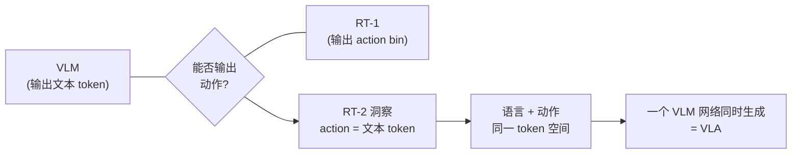
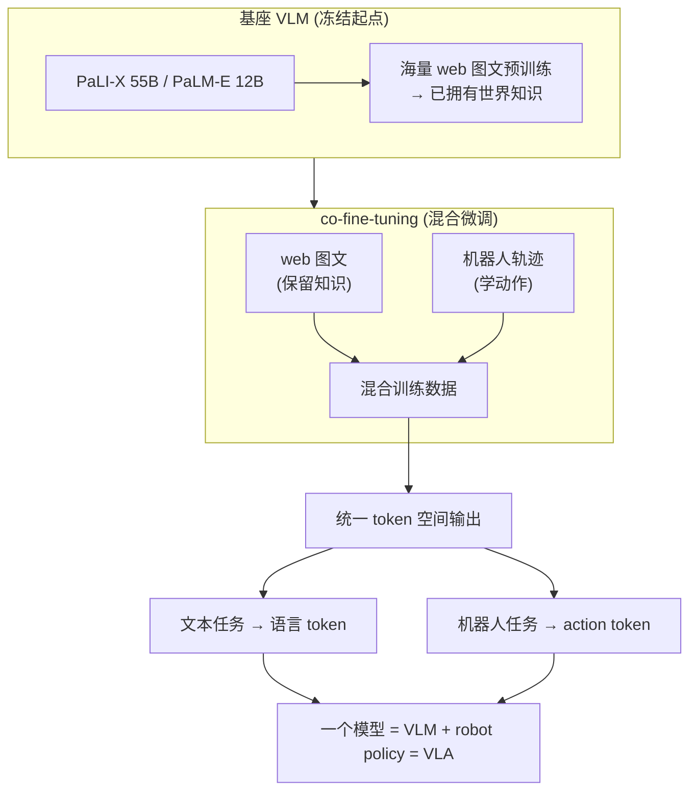
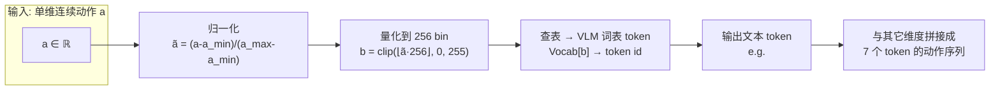
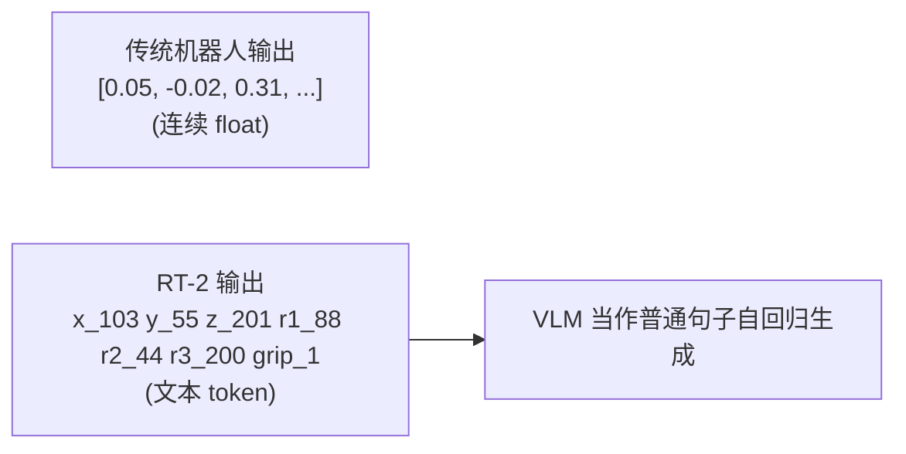
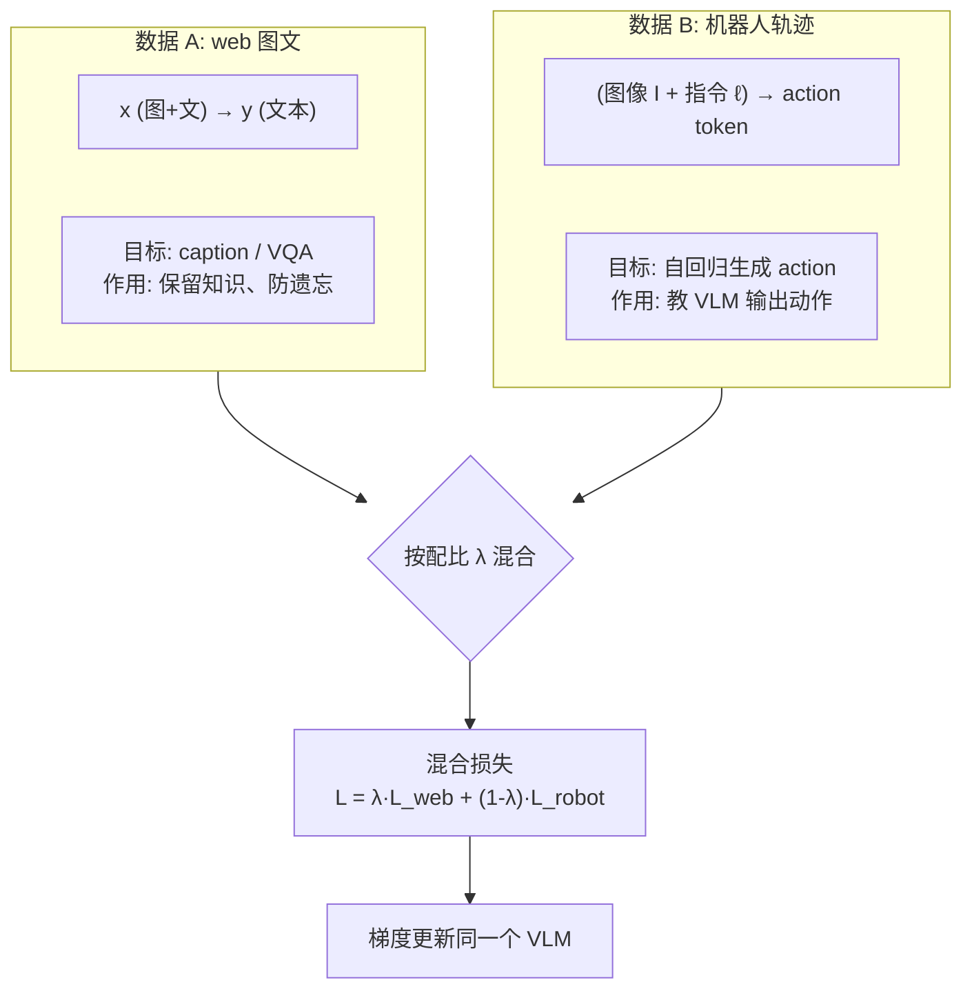
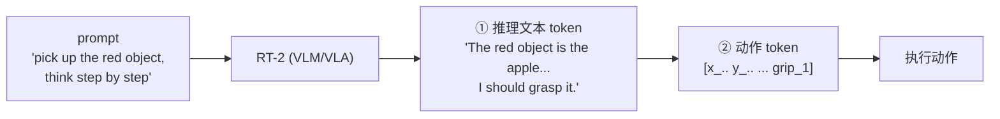
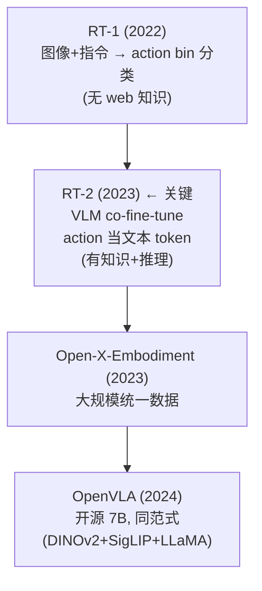

# 论文信息

- **标题**: RT-2: Vision-Language-Action Models Transfer Web Knowledge to Robotic Control
- **作者**: Anthony Brohan, et al. (Google DeepMind)
- **机构**: Google DeepMind
- **发表**: 2023 (CoRL 2023)
- **arXiv**: [2307.15818](https://arxiv.org/abs/2307.15818)
- **代码**: 闭源

> **一句话总结**: RT-2 **首次把大型 VLM（PaLI-X / PaLM-E，最高 55B）co-fine-tune 成 VLA**——把机器人动作表示成**文本 token**（每维动作量化成 256 bin 映射到词表），让同一个网络、同一套 token 空间**既能输出语言又能输出动作**。这样机器人 policy 就继承了 VLM 从互联网学到的世界知识，涌现出**符号理解、chain-of-thought 推理、组合泛化**等 RT-1 没有的能力，确立了"统一 VLM 与机器人控制"的 VLA 范式。

---

# 1. 背景与动机

## 1.1 RT-1 的局限：有动作能力，缺世界知识

- **RT-1 (2022)**:
  - 真机实时、强泛化到新物体/背景；
  - 但指令空间封闭（700+ 离散指令）；
  - 且**没有 web 知识**（不会推理，不理解符号/概念）。
  - 例：`"把棕色动物的玩具拿来"` → RT-1 难做（要理解 "棕色"、"动物"）；`"move the object to the same color as the apple"` → 需推理，RT-1 做不到。
- **VLM（PaLI, PaLM-E）**：
  - 拥有海量 web 知识（常识/概念/推理）；
  - 但**不会动**（只能输出文本，不能控制机器人）。

> **RT-2 的提问**：能否让一个模型同时拥有 VLM 的 web 知识 + 机器人动作能力？

## 1.2 关键洞察：动作 = 文本 token

- VLM 输出的是 **token（文本）**；RT-1 输出的是 **action bin（离散）**。
- RT-2 的洞察：**把 action 也表示成文本 token！**
  - 于是 action 和语言**在同一个 token 空间**；
  - 用**一个 VLM 网络**同时生成语言和动作；
  - 进而 **co-fine-tune VLM** 在 (web 图文) + (机器人轨迹) 上 → VLM 既保留 web 知识，又学会输出动作。



---

# 2. 方法

## 2.1 整体思路：VLA = VLM co-fine-tune

- **基座 VLM（冻结起点）**：PaLI-X (55B) 或 PaLM-E (12B/16B) 等，已在海量 web 图文上预训练 → 拥有世界知识。
- **co-fine-tuning（混合微调）**：数据 = web 图文（保留知识）+ 机器人轨迹（学动作）。
- **统一输出**：同一个 token 空间——文本任务输出语言 token；机器人任务输出 action token（文本化的动作）。
- **结论**：一个模型，同时是 VLM 和 robot policy = **VLA**。



## 2.2 Action Tokenization（核心：动作文本化）

RT-2 把**连续动作离散成文本 token**，复用 VLM 词表：

- 动作 = 多维连续向量（如 7 维：位移 $\Delta x,\Delta y,\Delta z$ + 旋转 $\Delta r_1,\Delta r_2,\Delta r_3$ + 夹爪 gripper）。
- **每维动作 → 量化成 256 个 bin**（和 RT-1 一样）。
- 关键：这 256 个 bin 映射成 VLM 词表里的 **256 个 token**。
  - 例：$\Delta x$ 落在第 103 个 bin → 输出 token `<x_103>`。
- 最终动作 = 一串文本 token：`<x_103> <y_55> <z_201> <rot_x_88> ... <gripper_1>`。

> **为什么这么做**：因为动作被表示成普通文本 token，VLM 原生就能用**自回归**生成；不需要为机器人改架构；文本和动作**共享同一表示空间** → 知识可迁移。

设某一维动作 $a^{(d)} \in \mathbb{R}$（$d$ 为维度下标），先按训练集统计的每维上下界 $[a_{\min}^{(d)}, a_{\max}^{(d)}]$ 归一化到 $[0,1]$，再线性量化到 256 个 bin：

$$
\tilde{a}^{(d)} = \frac{a^{(d)} - a_{\min}^{(d)}}{a_{\max}^{(d)} - a_{\min}^{(d)}} \in [0,1]
$$

$$
b^{(d)} = \mathrm{clip}\!\left(\left\lfloor \tilde{a}^{(d)} \cdot 256 \right\rfloor,\ 0,\ 255\right) \in \{0,1,\dots,255\}
$$

再把整数 bin $b^{(d)}$ 查表映射到 VLM 词表里预留的 256 个 token id 之一，记作 $\text{tok}^{(d)} = \mathrm{Vocab}_{d}[\,b^{(d)}\,]$。

于是整条 7 维动作被文本化成一段 token 序列：

$$
a \;\longleftrightarrow\; \big(\text{tok}^{(1)}, \text{tok}^{(2)}, \dots, \text{tok}^{(D)}\big), \qquad D=7
$$

推理时 VLM 像生成普通句子一样**自回归**地逐个吐出这 $D$ 个 action token，其联合概率分解为：

$$
P(a \mid I,\ell) \;=\; \prod_{t=1}^{D} P\!\big(\text{tok}^{(t)} \,\big|\, I,\ell,\text{tok}^{(1)},\dots,\text{tok}^{(t-1)}\big)
$$

其中 $I$ 为观测图像，$\ell$ 为语言指令。



**动作文本化示意**：传统机器人输出 7 个连续 float，RT-2 输出 7 个文本 token（在 VLM 词表里），VLM 把它当普通"句子"生成。



> **官方闭源，以下为根据论文复述的示意伪代码**（action → 256 个文本 token 的 tokenization）：

```python
# 官方 RT-2 闭源；以下为根据论文 §Action Tokenization 复述的示意伪代码
# 功能：把一维连续动作量化到 256 bin，再映射成 VLM 词表里的 token id
import numpy as np

class ActionTokenizer:
    """每维动作 → 256 bin → 1 个文本 token id。"""

    def __init__(self, n_bins: int = 256,
                 low: list = None, high: list = None,
                 vocab_action_start: int = 0):
        self.n_bins = n_bins                      # 每维量化桶数（论文取 256）
        self.low  = np.asarray(low,  dtype=np.float32)  # 每维动作下界 (由训练集统计)
        self.high = np.asarray(high, dtype=np.float32)  # 每维动作上界
        # 词表中为每维预留连续 256 个 token：第 d 维占 [start + d*256, +256)
        self.vocab_action_start = vocab_action_start
        self.dim = len(low)

    def encode(self, action: np.ndarray) -> list:
        """连续动作向量 action ∈ ℝ^D → D 个 token id（文本化的动作序列）。"""
        assert action.shape == (self.dim,), "维度需匹配"
        # 1) 归一化到 [0,1]：ã = (a - low) / (high - low)
        a_norm = (action - self.low) / (self.high - self.low + 1e-8)
        a_norm = np.clip(a_norm, 0.0, 1.0)
        # 2) 量化到 256 bin：b = clip(⌊ã · 256⌋, 0, 255)
        b = np.clip((a_norm * self.n_bins).astype(np.int32), 0, self.n_bins - 1)
        # 3) 查表：每维的 bin → VLM 词表中对应 token id
        #    第 d 维的第 b 个 bin → vocab_action_start + d*256 + b
        token_ids = [
            self.vocab_action_start + d * self.n_bins + int(b[d])
            for d in range(self.dim)
        ]
        return token_ids  # 例如 [103, 55, 201, 88, 44, 200, 1] → "<x_103> <y_55> ..."

    def decode(self, token_ids: list) -> np.ndarray:
        """token id → 连续动作（推理时把 VLM 输出的 token 还原成动作）。"""
        b = np.zeros(self.dim, dtype=np.int32)
        for d, tid in enumerate(token_ids):
            b[d] = tid - self.vocab_action_start - d * self.n_bins
        # 反量化：a ≈ (b + 0.5)/256 · (high-low) + low（取 bin 中心）
        a_norm = (b + 0.5) / self.n_bins
        return a_norm * (self.high - self.low) + self.low
```

## 2.3 Co-fine-tuning（混合微调）

RT-2 训练 = 在两类数据上**联合微调 VLM**：

- **数据 A：大规模 web 图文**（VLM 预训练数据的一部分）
  - 目标：文本生成（caption / VQA）；
  - 作用：**保留** VLM 的 web 知识，**防止灾难遗忘**。
- **数据 B：机器人轨迹**（RT-1 数据 + 新数据）
  - 格式：`(图像 + 指令) → action token`；
  - 目标：自回归生成 action token；
  - 作用：**教** VLM 输出动作。
- **数据配比**：web 数据 : 机器人数据 ≈ 适当比例 → 兼顾知识保留与动作学习。

> 因为 action token 与文本 token 处于**同一词表**，梯度自然把"视觉/语言理解"和"动作生成"统一到一个网络。

设 $\mathcal{D}_{\text{web}}$ 为 web 图文数据集（输入 $x$、目标文本 $y$），$\mathcal{D}_{\text{robot}}$ 为机器人轨迹数据集（输入 $(I,\ell)$、目标动作 token 序列 $a$）。co-fine-tuning 的混合损失为两个标准 next-token 自回归交叉熵损失按数据配比 $\lambda$ 加权：

$$
\mathcal{L}_{\text{co-ft}} \;=\; \lambda \cdot \underbrace{\mathbb{E}_{(x,y)\sim \mathcal{D}_{\text{web}}} \big[-\log P(y\mid x)\big]}_{\text{保留 web 知识 (防遗忘)}} \;+\; (1-\lambda) \cdot \underbrace{\mathbb{E}_{(I,\ell,a)\sim \mathcal{D}_{\text{robot}}} \big[-\log P(a\mid I,\ell)\big]}_{\text{学动作 (action token 自回归)}}
$$

其中机器人轨迹上的动作项按 $\S 2.2$ 的链式分解计算：$P(a\mid I,\ell)=\prod_{t=1}^{D} P(\text{tok}^{(t)}\mid I,\ell,\text{tok}^{(<t)})$。$\lambda$ 控制 web 数据占比，平衡知识保留与动作学习。



> **官方闭源，以下为根据论文复述的示意伪代码**（co-fine-tuning 数据配比循环，web 图文与机器人轨迹交替）：

```python
# 官方 RT-2 闭源；以下为根据论文 §Co-fine-tuning 复述的示意伪代码
# 功能：在 web 图文 + 机器人轨迹 两类数据上交替微调同一个 VLM

import itertools, random

def cofinetune(vlm_model, web_loader, robot_loader, optimizer,
               lambda_web=0.5, total_steps=100_000):
    """co-fine-tuning 主循环：web 数据保留知识，机器人数据学动作。

    lambda_web: 一个 batch 里 web 样本的期望占比 (论文用约 50% 量级平衡)。
    """
    web_iter   = itertools.cycle(web_loader)     # 数据 A: x(图文) → y(文本)
    robot_iter = itertools.cycle(robot_loader)   # 数据 B: (I, ℓ) → action token

    for step in range(total_steps):
        # 1) 按配比 λ 决定本步采样 web 还是 robot（伯努利抽样）
        is_web = random.random() < lambda_web

        if is_web:
            # —— 数据 A：文本生成，保留 web 知识、防遗忘 ——
            x, y = next(web_iter)
            logits = vlm_model(prompt=x)            # 自回归预测 token
            loss = cross_entropy(logits, y)         # L_web = -log P(y | x)
            tag = "web"
        else:
            # —— 数据 B：action token 自回归，教 VLM 输出动作 ——
            image, instr, action_tokens = next(robot_iter)
            # action_tokens 已由 ActionTokenizer 离散成 VLM 词表内的 token id
            logits = vlm_model(prompt=(image, instr))
            loss = cross_entropy(logits, action_tokens)  # L_robot = -log P(a | I, ℓ)
            tag = "robot"

        # 2) 混合损失 (本步只来自一支，期望上等价于 L = λ·L_web + (1-λ)·L_robot)
        (loss).backward()
        optimizer.step()
        optimizer.zero_grad()

        if step % 1000 == 0:
            print(f"step={step} tag={tag} loss={loss.item():.4f}")
```

## 2.4 基座 VLM 选择

RT-2 用两种基座，都验证了"把超大 VLM co-fine-tune 成 VLA"可行：

| 基座 | 架构 | 规模 | 备注 |
|------|------|------|------|
| **PaLI-X** | 视觉编码器 (ViT) + encoder-decoder 语言模型 | 55B | 记作 RT-2 (PaLI-X, 55B) |
| **PaLM-E** | decoder-only 大语言模型 + 视觉 | 12B (活跃) | 记作 RT-2 (PaLM-E) |

观察：**模型越大**，知识迁移 / 推理能力**越强**（详见 §4.3 规模效应）。

---

# 3. 涌现能力（RT-2 的最大亮点）

RT-2 因为**继承了 VLM 的 web 知识**，涌现出 RT-1 完全没有的能力：

| 涌现能力 | 含义 | 示例 | RT-1 |
|----------|------|------|------|
| **符号理解** (Symbol Understanding) | 能理解图中出现的图标/文字/符号 | "把画着星星的方块拿来" → 能识别图上的星标 | 做不到 |
| **推理** (Reasoning) | 能执行需要推理的指令 | "move the object to the same color as the apple" → 识别苹果颜色→找同色物体→移动 | 失败 |
| **Chain-of-Thought** (思维链) | 指令含 "think step by step" → 先输出推理文字 token，再输出 action token | 见 §3.1 | 失败 |
| **组合泛化** (Compositional Generalization) | 新的"动词+物体+修饰"组合，即使没见过也能执行 | — | 较弱 |
| **概念迁移** | web 上学到的概念（名人/地标/食物）→ 应用到机器人场景 | — | 无 |

## 3.1 Chain-of-Thought Action 示例

- **普通指令**：`"pick up the red object"`
  - RT-2 输出：`[x_.. y_.. ... grip_1]`（直接动作）。
- **CoT 指令**：`"pick up the red object, think step by step"`
  - RT-2 输出：
    1. `"The red object is the apple on the left. I should move to it and grasp."` ← **推理文本 token**
    2. `[x_.. y_.. ... grip_1]` ← **然后动作 token**



> **推理 + 动作在同一 token 流里**，复杂多步任务成功率显著提升。

---

# 4. 实验

## 4.1 与 RT-1 对比

真实机器人评测（详见原论文 Table / Figure）：

| 能力 | RT-1 | RT-2 (55B) |
|------|------|------------|
| 基础任务（训练分布） | 高 (~97%) | 相当/略高 |
| 新物体/背景泛化 | 高 | 更强 |
| 符号理解（新） | 失败 | 成功 |
| 推理任务（新） | 失败 | 部分成功 |
| 组合新指令 | 弱 | 强 |
| CoT 多步任务 | 失败 | 显著提升 |

> RT-2 在 RT-1 **基础任务上不掉点**，还**新增了 RT-1 完全没有的推理/符号能力**。

## 4.2 知识迁移

RT-2 能把 web 知识用到机器人：

- 识别 web 学过的物体类别（即使机器人数据里没见过）；
- 理解形容词/关系（颜色、位置、数量）。

→ 证明 **VLM 知识真的迁移到了 control**。

## 4.3 规模效应

- RT-2 (5B) vs RT-2 (55B)：55B 在推理/符号任务上明显更强。
- → **VLA 的能力随 VLM 规模增长**（scaling 在 VLA 也成立）。

---

# 5. 局限与意义

## 5.1 局限

1. **闭源 + 超大模型**（55B），难复现 → OpenVLA 用 7B 开源解决；
2. **推理慢**：55B 自回归生成 action，实时性受限；
3. **数据仍是真实遥操作**，采集昂贵；
4. **动作精度受 token 离散化限制**。

## 5.2 意义（VLA 的奠基）

1. **首次证明**：大 VLM 可以 co-fine-tune 成 VLA，保留 web 知识 + 获得动作能力；
2. **确立 "action = 文本 token" 范式**：一个网络统一语言 + 动作 → 直接启发 OpenVLA（开源、7B、同范式）；
3. **涌现推理能力**：VLA 不只是模仿，还能推理/泛化 → 把 LLM 的推理能力引入机器人控制；
4. **统一了 VLM 与 control 两个领域**（这是 "VLA" 名字的由来）。

---

# 6. 核心要点总结

## 6.1 RT-2 的精髓

- **RT-2 = 大 VLM（PaLI-X/PaLM-E）co-fine-tune 成 VLA**。
- **核心**：action 表示成文本 token（256 bin → 词表）→ 语言和动作在同一 token 空间 → 一个网络同时输出。
- **训练**：web 图文 + 机器人轨迹**联合微调**。
- **涌现**：符号理解 / 推理 / CoT / 组合泛化。

## 6.2 在 VLA 路线中的位置



## 6.3 一句话记忆

> **RT-2 = 把 VLM 当 robot policy = action 文本化 + co-fine-tune → 让机器人继承 LLM 的世界知识和推理能力。**

---

# 7. 参考资料

- **RT-2 原论文**: Brohan et al., "RT-2: Vision-Language-Action Models Transfer Web Knowledge to Robotic Control", CoRL 2023, [arXiv:2307.15818](https://arxiv.org/abs/2307.15818)
- **RT-1**: Brohan et al., 2022, [arXiv:2212.06817](https://arxiv.org/abs/2212.06817) (前身)
- **PaLI-X**: Chen et al., 2023 (RT-2 基座之一)
- **PaLM-E**: Driess et al., 2023, [arXiv:2303.03378](https://arxiv.org/abs/2303.03378) (RT-2 基座之一)
- **Chain-of-Thought Prompting**: Wei et al., NeurIPS 2022 (CoT 来源)
- **SayCan**: Ahn et al., CoRL 2022 (LLM 规划 + RT)
- **Open-X-Embodiment**: 2023, [arXiv:2310.08864](https://arxiv.org/abs/2310.08864)
- **OpenVLA**: Kim et al., 2024, [arXiv:2406.09246](https://arxiv.org/abs/2406.09246) (开源版 RT-2 范式)
