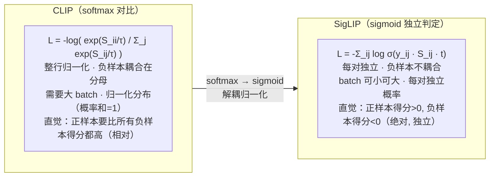

# 论文信息

- **标题**: Sigmoid Loss for Language Image Pre-Training
- **作者**: Xiaohua Zhai, Basil Mustafa, Alexander Kolesnikov, Lucas Beyer
- **机构**: Google Research, Zürich
- **发表**: ICCV 2023
- **arXiv**: [2303.15343](https://arxiv.org/abs/2303.15343)
- **代码**: [github.com/google-research/big_vision](https://github.com/google-research/big_vision)

> **一句话总结**: SigLIP 把 CLIP 的 **softmax 对比损失换成独立的 sigmoid 损失**——不再对整个 batch 做 softmax 归一化，而是把每个 (图像, 文本) 配对当作一个独立的二分类问题（"这张图和这段文字是否匹配"）。这一改动让训练**摆脱对超大 batch 的依赖、更稳定、更易扩展到极大规模**，在同等算力下零样本性能超越 CLIP，并成为 **OpenVLA 等现代 VLA/VLM 的标准视觉编码器**（SigLIP / SigLIP-2）。

---

# 1. 背景与动机

## 1.1 CLIP 的对比损失回顾

CLIP 的损失 (InfoNCE / softmax 对比损失):

- batch 内 N 个 (图像 $i$, 文本 $t$) 配对
- 算 $N\times N$ 相似度矩阵 $S_{ij} = \langle I_i, T_j\rangle$
- 图像侧：每行 softmax，让对角线（正样本）概率最大
- 文本侧：每列 softmax，让对角线（正样本）概率最大

图像侧损失（图像→文本方向）：

$$L_{\text{CLIP}}^{i2t} = -\frac{1}{N}\sum_{i}\log\frac{\exp(S_{ii}/\tau)}{\sum_{j}\exp(S_{ij}/\tau)},\quad S_{ij}=\langle I_i,T_j\rangle$$

> softmax 在整行上做，依赖所有 $N$ 个文本。

特点：

- 需要 "其他样本当负样本"（对比的本质）
- softmax 把所有负样本耦合在一起（归一化分母）
- 要效果好必须大 batch（CLIP 用 32768）→ 算力门槛极高

## 1.2 softmax 对比损失的问题

问题 1: 依赖大 batch
   负样本来自同一 batch → batch 越大负样本越多 → 越好
   CLIP 需要 32k batch, 一般实验室训不起

问题 2: 全局归一化耦合
   算某一对 $(I_i, T_i)$ 的 loss 时,
   必须看到 batch 里所有其他文本/图像
   → 计算和通信开销大, 分布式训练复杂

问题 3: 扩展性受限
   softmax 在极大 batch 下数值/梯度不稳定
   难以扩展到更大数据/更大模型

SigLIP 的反思:
   真的需要 softmax 这种 "全局归一化对比" 吗?
   能不能简化成 "每个配对独立判定"?

---

# 2. 方法：Sigmoid 损失

## 2.1 核心思想：每个配对独立二分类

SigLIP 的损失（替换 softmax → sigmoid）：

对 batch 内每一个 $(I_i, T_j)$ 配对，独立判断 "是否匹配"（二分类）。其中 logit 与 label 为：

$$z_{ij} = \langle I_i, T_j\rangle \cdot t,\qquad y_{ij}=\begin{cases}+1 & \text{若 } i=j\ (\text{正样本})\\-1 & \text{若 } i\neq j\ (\text{负样本})\end{cases}$$

每个配对独立的 sigmoid 损失：

$$L_{\text{SigLIP}} = -\frac{1}{N^2}\sum_{i=1}^{N}\sum_{j=1}^{N}\log\sigma\!\left(z_{ij}\cdot y_{ij}\right) = -\frac{1}{N^2}\sum_{i,j}\log\sigma\!\left(\langle I_i,T_j\rangle\cdot t \cdot y_{ij}\right)$$

其中 $t$ 是可学习的 logit scale（温度），$\sigma$ 是 sigmoid。

关键：**没有 $\sum$ softmax 归一化！** 每个配对独立，互不耦合。

### 2.1.1 官方代码：SigLIP sigmoid 损失

> 下方为 HuggingFace `transformers` 的 PyTorch 实现（`models/siglip/modeling_siglip.py` 的 `SiglipModel.forward` 中的 `return_loss` 分支），它直接搬运自官方 `big_vision` 的 JAX 实现（注释里给出的 [big_vision .../siglip.py#L287](https://github.com/google-research/big_vision/blob/main/big_vision/trainers/proj/image_text/siglip.py)）。整段损失只有 5 行核心计算，是 SigLIP 全文最关键的逻辑。

```python
# ===== 第一部分：图像/文本编码 + L2 归一化 + 相似度矩阵 =====
# （取自 SiglipModel.forward 的前半段，对应"双塔结构"）

image_embeds = vision_outputs.pooler_output            # 图像塔 pooled 特征 [B, D]
text_embeds  = text_outputs.pooler_output              # 文本塔 pooled 特征 [B, D]

# ① L2 归一化：把 embedding 投影到单位球面上，使内积 = 余弦相似度 ∈ [-1, 1]
image_embeds = image_embeds / image_embeds.norm(p=2, dim=-1, keepdim=True)
text_embeds  = text_embeds  / text_embeds.norm(p=2,  dim=-1, keepdim=True)

# ② 相似度矩阵 logits = <I, T>（余弦相似度），形状 [B_text, B_image]
logits_per_text = torch.matmul(text_embeds, image_embeds.t())

# ③ big_vision 的写法：logit = similarity * exp(logit_scale) + logit_bias
#    其中 logit_scale 即论文里可学习的温度 t（此处用 log-space 参数化，保证 scale > 0），
#    logit_bias 是一个额外的可学习偏置（论文 Eq.(3) 的 ±号由 label 承担，bias 让 logit 整体可平移）。
logit_scale, logit_bias = self.logit_scale, self.logit_bias
logits_per_text = logits_per_text * logit_scale.exp() + logit_bias
logits_per_image = logits_per_text.t()                 # 转置对称

# ===== 第二部分：SigLIP sigmoid 损失（全文核心 5 行）=====
if return_loss:
    eye = torch.eye(logits_per_text.size(0), device=logits_per_text.device)  # 单位阵 [B, B]，对角线=1
    # ① 构造 label 矩阵 y：对角线 +1（正样本 i==j），其余 -1（负样本 i!=j）
    #    用 "-全 1 阵 + 2·单位阵" 一行算出，等价于 y_ij = +1 if i==j else -1
    m1_diag1 = -torch.ones_like(logits_per_text) + 2 * eye                  # 即论文里的 y_ij

    # ② z * y：把 logit 乘上 label（正样本保持原 logit，负样本取反）
    #    再过 logsigmoid → 等价于 -log σ(z·y)
    #    关键：这里【没有 softmax 归一化】，每个 (i,j) 配对是【独立】的二分类，
    #    不像 CLIP 要在整行/整列上做 softmax（无全局归一化分母，负样本彼此不耦合）。
    loglik = torch.nn.functional.logsigmoid(m1_diag1 * logits_per_text)      # log σ(y_ij · z_ij)，[B, B]

    # ③ 对每行（每个文本）求和所有配对的负对数似然，再对 batch 取平均
    nll = -torch.sum(loglik, dim=-1)                                         # 每行求和：-Σ_j log σ(y·z)
    loss = nll.mean()                                                        # 再对 batch 取均值 = 论文 L_SigLIP
```

逐行要点解读：

- **没有 softmax 归一化**：`logsigmoid` 是逐元素的，`logits` 矩阵里每一个元素独立地过一次 sigmoid——`σ(z_ij·y_ij)` 是一个独立的"是否匹配"概率，**不要求一行内概率之和为 1**。这正是 SigLIP 区别于 CLIP 的本质：CLIP 在整行做 softmax，把所有负样本耦合进归一化分母；SigLIP 解开了这层耦合。
- **每对独立**：因为逐元素，所以 `(I_i, T_j)` 这一对的损失只取决于它自己的 logit `z_ij` 和标签 `y_ij`，跟 batch 里其它配对无关——这带来两个工程红利：① 小 batch 也有效（不依赖"同 batch 当负样本"的耦合强度）；② 分布式下无需通信整行分母。
- **label 矩阵 `y`**：`-1` 和 `+1` 的设计让"正样本希望 `z>0`（越大越好），负样本希望 `z<0`（越小越好）"，是一个**绝对**判据，而非 CLIP 的**相对**判据（正样本只要"比负样本高"即可）。
- **可学习温度**：`logit_scale` 用 `exp()` 参数化保证为正，初始化时 `logit_scale=0, logit_bias=-10`（见 `_init_weights`），对应论文里温度 `t≈10`、偏置 `-10` 的设置。

## 2.2 softmax vs sigmoid 损失对比



## 2.3 为什么更稳定、更易扩展

① batch 解耦:
   每个 (i,j) 配对独立 → 不需要等整个 batch
   → 小 batch 也能有效训练 (8k batch 就接近 CLIP 32k 效果)
   → 大 batch 下更稳定 (无 softmax 数值爆炸)

② 负样本不再耦合:
   sigmoid 不需要全局分母 → 通信开销小
   → 分布式训练更简单高效

③ 可学习 logit scale t:
   $t$ 直接优化（而非固定温度），自适应数据规模

④ 无需负样本数量依赖:
   不会因为 batch 小而 "对比信号弱"

## 2.4 数值细节

sigmoid 损失的标准形式（softplus，数值稳定）：

$$-\log\sigma(z) = \log(1 + e^{-z})$$

工程实现：

- 图像/文本特征 L2 归一化（球面上）
- $t$ 初始化为 $-10$（即 logit scale $\approx 10$），可学习
- 用 log-sum-exp 技巧保证数值稳定

---

# 3. 实验与结果

## 3.1 同等算力下超越 CLIP

zero-shot ImageNet 与 ImageNet 分布外 (v2/A/Sketch/R):

| 方法 | batch | 算力 | 平均 zero-shot |
|------|-------|------|----------------|
| CLIP (ViT-L) | 32k | baseline | ~70 |
| SigLIP (ViT-L) | 8-16k | 较小 | 更高 (+1~2) |
| SigLIP (ViT-SO400M) | 16k | — | 更强 |

关键：

① SigLIP 用更小 batch 达到/超越 CLIP → 更省算力
② 在 retrieval / 分类上普遍更好
③ 训练更稳定, 不需要繁琐的调参

## 3.2 batch size 的影响

- CLIP: 性能随 batch 增大持续提升, 小 batch 明显差
- SigLIP: 小 batch (8k) 已接近最优, 对 batch 大小不敏感

→ 让中等规模实验室也能训练 CLIP 级模型

## 3.3 与大数据结合 (SigLIP / SigLIP-2)

后续:
  SigLIP 训练在大规模数据上验证了 sigmoid 损失的可扩展性
  SigLIP-2 (2024) 进一步: 加入定位损失、多语言、更高分辨率
  → 成为现代 VLM/VLA 的事实标准图像编码器

---

# 4. 对 VLA / VLM 的意义

SigLIP 凭借:

- 稳定易训
- 语义对齐强 (open-vocabulary)
- 工程友好

成为现代 VLM/VLA 的标配图像编码器:

- **LLaVA-NeXT / Prismatic VLM**:
  - 视觉 = SigLIP（或 SigLIP + DINOv2 双编码器）

- **OpenVLA** (VLA 代表作):
  - 视觉 = SigLIP-SO400M + DINOv2（双编码器融合）
  - → SigLIP 提供语义, DINOv2 提供几何细节
  - → 投影到 LLaMA 词空间, 生成 action token

为什么 VLA 倾向 SigLIP 而非原版 CLIP?

① 训练成本低, 模型权重易得 (开源完善)
② 大模型 (SO400M) 语义能力更强
③ sigmoid 损失学到的 embedding 空间更平滑稳定

---

# 5. 核心要点总结

## 5.1 一句话

SigLIP = CLIP 把 **softmax 对比损失**换成 **sigmoid 独立二分类损失**
      → 解耦 batch、更稳定、更易扩展、性能更强

## 5.2 三个 takeaway

① 对比学习不必用 softmax:
   sigmoid 也能做图文对齐, 且每个配对独立

② 工程优势显著:
   小 batch 可训 / 通信少 / 大规模稳定

③ 成为现代 VLM/VLA 标准视觉编码器:
   SigLIP + DINOv2 组合是 OpenVLA 的视觉侧

## 5.3 损失对比表

| 维度 | CLIP (softmax) | SigLIP (sigmoid) |
|------|----------------|------------------|
| 归一化 | 整行 softmax（全局） | 无（每对独立） |
| 负样本 | 耦合在分母 | 不耦合 |
| batch 依赖 | 强（需 32k） | 弱（8k 即可） |
| 扩展性 | 受限 | 好 |
| 训练稳定性 | 需调温/大batch | 更稳定 |
| 同算力性能 | baseline | 略优 |

---

# 6. 参考资料

- **SigLIP 原论文**: Zhai et al., "Sigmoid Loss for Language Image Pre-Training", ICCV 2023, [arXiv:2303.15343](https://arxiv.org/abs/2303.15343)
- **官方代码 (big_vision)**: [github.com/google-research/big_vision](https://github.com/google-research/big_vision)
- **SigLIP 权重 (HuggingFace)**: [huggingface.co/google/siglip-so400m-patch14-384](https://huggingface.co/google/siglip-so400m-patch14-384)
- **SigLIP-2**: 2024 后续工作（多语言 + 定位 + 高分辨率）
- **CLIP**: Radford et al., ICML 2021, [arXiv:2103.00020](https://arxiv.org/abs/2103.00020) (softmax 对比基线)
- **ALIGN**: Jia et al., ICML 2021 (双塔图文, 规模化)
- **OpenCLIP**: [github.com/mlfoundations/open_clip](https://github.com/mlfoundations/open_clip)
- **Prismatic VLM**: Karamcheti et al., 2024 (SigLIP+DINOv2 双编码器)
- **OpenVLA**: Kim et al., 2024, [arXiv:2406.09246](https://arxiv.org/abs/2406.09246)
