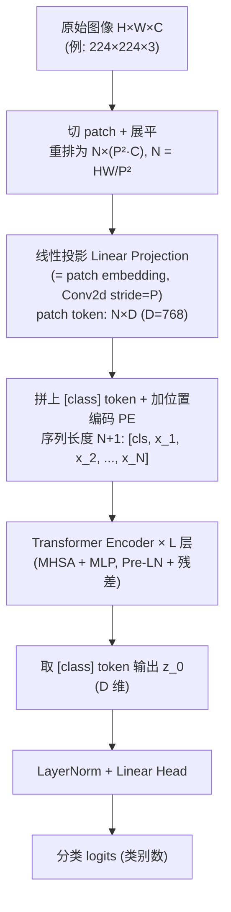
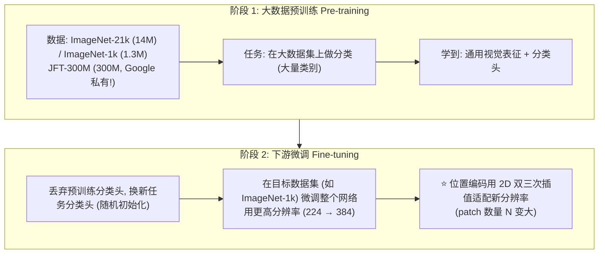
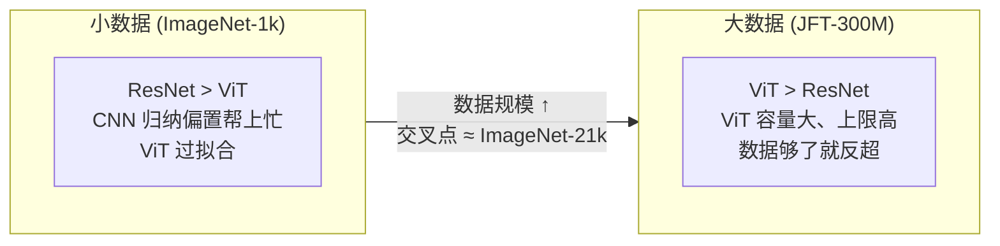
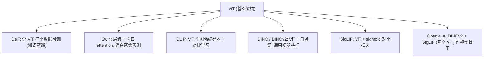
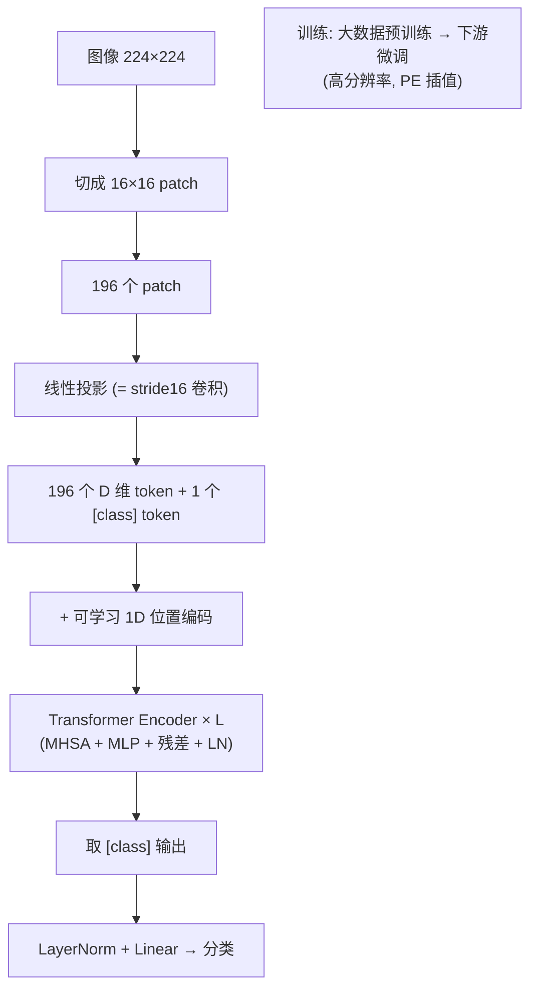

# 论文信息

- **标题**: An Image is Worth 16x16 Words: Transformers for Image Recognition at Scale
- **作者**: Alexey Dosovitskiy, Lucas Beyer, Alexander Kolesnikov, Dirk Weissenborn, Xiaohua Zhai, Thomas Unterthiner, Mostafa Dehghani, Matthias Minderer, Georg Heigold, Sylvain Gelly, Jakob Uszkoreit, Neil Houlsby
- **机构**: Google Research, Brain Team
- **发表**: ICLR 2021
- **arXiv**: [2010.11929](https://arxiv.org/abs/2010.11929)
- **代码**: [github.com/google-research/vision_transformer](https://github.com/google-research/vision_transformer)

> **一句话总结**: ViT 把 NLP 里的 Transformer 直接搬到图像上——把一张图像切成固定大小的 patch（如 16×16），每个 patch 当作一个 "词"，经过线性投影成 token，加上位置编码后送入标准 Transformer Encoder，只用一个 `[class]` token 做分类。**只要数据量足够大（如 JFT-300M），不用任何卷积归纳偏置，ViT 就能超越经典 CNN**，证明了 "大规模 + Transformer" 是视觉的通用范式，是后续 CLIP/DINO/OpenVLA 等一切视觉/多模态大模型的视觉骨干基础。

---

# 1. 引言与动机

## 1.1 Transformer 在 NLP 一统天下，视觉却仍是 CNN

```
2017  Attention Is All You Need → Transformer 成为 NLP 事实标准
        BERT, GPT 系列 → 几乎所有 NLP 任务

视觉领域:
  ResNet (2015) → VGG → EfficientNet ... 全是 CNN
  归纳偏置 (inductive bias): 平移不变性 + 局部性
  CNN 的卷积核天然适合图像, 性能强, 一直没被 Transformer 取代
```

之前也有把 Attention 用到视觉的尝试（如 ViT 之前的工作），但要么把 attention 和 CNN 混用，要么在大数据上计算太贵，**始终没能在大规模图像识别上超越 CNN**。

## 1.2 核心问题：Transformer 处理图像的难点

```
NLP: 一句话天然是 token 序列 (词)
        "An image is worth 16x16 words"  →  6 个 token

图像: 像素是 2D 网格, 没有天然的 "词" 划分
        224×224 RGB 图像 = 224×224×3 = 150528 个数值
        
  方案 A: 每个像素当一个 token → 序列长度 224×224 = 50176
          → self-attention 复杂度 O(N²) 完全不可行!
          
  方案 B (ViT 的方案): 把图像切成 patch, 每个 patch 当一个 token
          224×224 切成 16×16 patch → 14×14 = 196 个 patch
          → 序列长度 196, 和 BERT-base 序列长度一个量级, 可行!
```

> **"An Image is Worth 16x16 Words"**：标题的含义就在此——一张图像等价于若干个 16×16 的 patch "词"。这正是 ViT 把图像 token 化的方式。

## 1.3 关键假设：数据规模可以替代归纳偏置

```
CNN 的归纳偏置 (translation equivariance + locality):
  → 小数据上也 work (先验帮模型泛化)
  → 但可能限制模型在大数据上达到更高的上限

ViT 的赌注:
  丢掉所有卷积归纳偏置, 用纯 Transformer
  → 在小数据上会过拟合 (ImageNet-21k 以下不如 ResNet)
  → 但在超大数据上 (JFT-300M, 3 亿图像) 反而更强!
  
  结论: 归纳偏置不是必须的, 大数据 + 大模型可以自己学出来
```

---

# 2. 模型架构 (ViT Architecture)

## 2.1 整体流程一览



## 2.2 Patch Embedding（核心：图像如何变成 token）

### 2.2.1 三步：切 patch → 展平 → 线性投影

```
第 1 步: 切 patch
  图像 H×W×C, patch 大小 P×P
  → 得到 N = (H·W) / P² 个 patch
  例: H=W=224, P=16 → N = 224²/16² = 14² = 196 个 patch

第 2 步: 每个 patch 展平
  单个 patch: P×P×C → 向量长度 P²·C
  例: 16×16×3 = 768 维

第 3 步: 线性投影到 D 维
  x_p^(n) ∈ ℝ^(P²C)  --线性映射 E∈ℝ^(D×P²C)-->  x_n = E·x_p^(n) ∈ ℝ^D
  
  ⭐ 工程实现技巧: 这个 "切 patch + 展平 + 线性投影" 
     等价于一个 kernel_size=P, stride=P 的 2D 卷积!
     所以代码里直接用 nn.Conv2d(P²C, D, kernel=P, stride=P) 一步完成
```

### 2.2.2 patch embedding 公式

$$
\mathbf{x}_p \in \mathbb{R}^{N \times (P^2 C)}, \quad
\mathbf{z} = [\,\mathbf{x}_{class};\, \mathbf{x}_p \mathbf{E}\,] + \mathbf{E}_{pos}
$$

```
其中:
  E ∈ ℝ^{(P²C) × D}       ← patch 投影矩阵 (可学习)
  x_class ∈ ℝ^D           ← 可学习的 [class] token (随机初始化)
  E_pos ∈ ℝ^{(N+1) × D}   ← 位置编码 (可学习, 拼接到 N+1 个 token 前)

  整体: [class token ; N个投影后的patch token] + 位置编码
        = 送入 Transformer 的输入序列, 长度 N+1
```

### 2.2.3 代码对照：timm 的 PatchEmbed

> 官方 `google-research/vision_transformer` 是 JAX/Haiku 实现，故取最权威的 PyTorch 复现 **timm**（[`huggingface/pytorch-image-models`](https://github.com/huggingface/pytorch-image-models)，`timm/models/vision_transformer.py` + `timm/layers/patch_embed.py`）。注意 `PatchEmbed` 类放在 `timm/layers/patch_embed.py`。

```python
# 来源: timm/layers/patch_embed.py
# 关键: 用一个 kernel=patch, stride=patch 的 Conv2d 同时完成 "切 patch + 展平 + 线性投影"
class PatchEmbed(nn.Module):
    """ 2D Image to Patch Embedding """
    def __init__(self, img_size=224, patch_size=16, in_chans=3,
                 embed_dim=768, norm_layer=None, flatten=True):
        super().__init__()
        self.patch_size = to_2tuple(patch_size)              # patch 转 (P, P) 元组
        self.img_size, self.grid_size, self.num_patches = self._init_img_size(img_size)
        # num_patches = (H/P) * (W/P), 例 224/16 → 14*14 = 196

        # ⭐ 核心一行: 卷积核大小=步长=patch_size
        #   它对每个 P×P 区域做一次线性投影 (输出通道=embed_dim),
        #   数学上等价于 "把 patch 展平成 P²C 向量, 再乘投影矩阵 E∈ℝ^{D×P²C}"
        self.proj = nn.Conv2d(in_chans, embed_dim,
                              kernel_size=patch_size, stride=patch_size)
        self.norm = norm_layer(embed_dim) if norm_layer else nn.Identity()

    def forward(self, x):
        # x: (B, C, H, W) 原始图像
        x = self.proj(x)                       # → (B, D, H/P, W/P)  切 patch + 投影
        if self.flatten:
            x = x.flatten(2).transpose(1, 2)   # → (B, N, D)  把空间维展平成序列, N=num_patches
        x = self.norm(x)                       # 可选 LayerNorm (ViT 原版一般不用)
        return x                               # 输出 (B, N, D) 的 patch token 序列
```

## 2.3 [class] token（借鉴 BERT）

```
为什么需要 [class] token?
  分类任务需要一个 "全局表示" 来代表整张图
  
做法 (完全照搬 BERT 的 [CLS] token):
  在序列最前面加一个可学习的 token x_class
  
  Transformer 处理完, 取第 0 个位置 (即 class token 经过 self-attention
  与所有 patch 交互后的输出) 作为图像的最终表示
  
  z_L^0 = Transformer 输出的第 0 行
  → LayerNorm → Linear → 分类 logits

对比方案 (论文也讨论了):
  也可以用 Global Average Pooling (GAP) 对所有 patch token 求平均
  → 实验中 GAP 和 [class] token 效果差不多
  → 但 [class] token 更接近 NLP 惯例, 论文主用这个
```

## 2.4 位置编码 (Position Embedding)

```
问题: Transformer 本身是 permutation-invariant (对输入顺序不敏感)
     但图像 patch 是有空间顺序的 (左上/右下...) → 需要告诉模型位置

ViT 用: 可学习的 1D 位置编码
  E_pos ∈ ℝ^{(N+1) × D}  (随机初始化, 随网络一起训练)
  
  把 E_pos 的第 i 行直接加到第 i 个 token 上 (逐元素相加)

 为什么 1D 位置编码就够?

 直觉: Transformer 足够强, 能从 1D 编码里
      自己学到 2D 空间结构

 论文 Figure 3 可视化:
   学到的位置编码相似度矩阵呈现清晰的 2D 网格结构
   (对角线上 patch 与相邻 patch 相似度高)
   → 说明模型自动从 1D 编码恢复了 2D 拓扑

 也试过 2D-aware / relative PE, 效果提升很小
```

### 2.4.1 要点速记 & 常见疑问

> **一句话**：pos_embed = 给每个 patch token 一个"我在【当前 crop 的】patch 网格里排第几格"的、**学出来的**标签；机制是**绝对**的，但通过 attention 等价地表达了 patch **之间**的相对位置关系。

四个要点：

1. **一个 patch 一个 pos 向量，不是一个像素一个。** patch embedding 已经把一个 patch（如 16×16 像素）压成一个 token，patch 内部像素级位置就此抹掉（只被投影权重隐式保留）。pos_embed 只到 patch 粒度。

2. **是"绝对"位置编码，不是"相对"位置编码。** 每个 patch 拿到属于自己的一个向量，代表它在网格里的绝对位置（第 $i$ 行第 $j$ 列）；不是直接编码"patch A 相对 patch B 偏了多少"。但 self-attention 是 patch 两两交互的，模型从两个绝对 pos 之差里**自己推导出**相对关系——所以"效果上相对，实现上绝对"。（真正的相对位置编码是另一种机制：Swin 的 relative position bias、RoPE。）

3. **是学出来的，不是手写坐标。** 不是把 $(3,5)$ 塞进向量，而是训练中学到的；一串 1D 学完，内部自发呈现 2D 拓扑（见上面 Figure 3）。

4. **编码的是"当前 crop 网格"里的位置，不是原始大图的绝对位置。** 这点在 multi-crop（如 DINO）里很关键：

   - global crop 的左上 patch 和 local crop 的左上 patch，pos 编码**可以相同**（都叫"自己 crop 的 $(0,0)$"）——这不是 bug，而是 DINO 想要的：让模型抓"内容是什么"而不是"在原图哪儿"，从而能跨视角对齐。
   - 因此当 global/local 分辨率不同、patch 数不同时，**不能新造一个 pos_embed**（新造的是随机的、没学过），而是把学好的 pos_embed **双三次插值**到当前 patch 网格来复用 → 跨 crop 共享同一张"位置地图"。这块在 `DINO/repro/model.py` 的 `prepare_tokens` 里会碰到。

> 想彻底避开"插值"这套？用相对位置编码（Swin / RoPE），天生和分辨率无关。但 ViT/DINO 用的是绝对位置编码，所以多分辨率场景必须处理这个尺寸问题。

## 2.5 Transformer Encoder

标准结构，和原始 Transformer Encoder 完全一致：

```
输入: z_0 ∈ ℝ^{(N+1) × D}

for ℓ = 1 to L:
      z'_ℓ  = MHSA(LN(z_{ℓ-1})) + z_{ℓ-1}          ← 残差 + MHSA
      z_ℓ   = MLP(LN(z'_ℓ)) + z'_ℓ                  ← 残差 + MLP

其中:
  LN      = LayerNorm (前置, Pre-LN)
  MHSA    = Multi-Head Self-Attention
  MLP     = 两层全连接, 中间 GELU 激活, 隐层维度 4D
  残差连接 = 让深网络训练稳定 (类似 ResNet)
```

```
MHSA 内部 (单头简化版):
  Q = z W_Q,  K = z W_K,  V = z W_V      (都 ∈ ℝ^{(N+1)×D_h})
  
  Attention(Q,K,V) = softmax(QK^T / √D_h) · V
  
  多头: D 维切成 h 个头, 各算 attention 再拼接
```

### 2.5.1 代码对照：timm 的 Attention 与 Block

> 来源 `timm/models/vision_transformer.py`。注意 timm 把 Q/K/V 投影合并成单个 `nn.Linear(dim, dim*3)`（一次算完再切三段，比分开三次 Linear 更高效），attention 直接对应公式 $\text{softmax}(QK^{\top}/\sqrt{d})V$。

```python
# 来源: timm/models/vision_transformer.py
class Attention(nn.Module):
    def __init__(self, dim, num_heads=8, qkv_bias=False,
                 attn_drop=0., proj_drop=0.):
        super().__init__()
        assert dim % num_heads == 0
        self.num_heads = num_heads
        self.head_dim = dim // num_heads
        self.scale = self.head_dim ** -0.5              # 即 1/√d_h, 用于缩放 QK^T

        # ⭐ 一个 Linear 同时算 Q,K,V (输出 3*dim, 再切三段), 比分开 3 次更高效
        self.qkv = nn.Linear(dim, dim * 3, bias=qkv_bias)
        self.attn_drop = nn.Dropout(attn_drop)
        self.proj = nn.Linear(dim, dim)                 # 多头拼接后的输出投影 W_O
        self.proj_drop = nn.Dropout(proj_drop)

    def forward(self, x):                                # x: (B, N, dim)  N = 序列长度
        B, N, C = x.shape
        # 线性投影 → reshape 成多头: (B, N, 3, heads, head_dim) → (3, B, heads, N, head_dim)
        qkv = self.qkv(x).reshape(B, N, 3, self.num_heads, self.head_dim).permute(2, 0, 3, 1, 4)
        q, k, v = qkv.unbind(0)                          # 各为 (B, heads, N, head_dim)

        # ⭐ 核心三行: 完全对应 Attention(Q,K,V) = softmax(QK^T / √d) · V
        attn = (q @ k.transpose(-2, -1)) * self.scale    # QK^T / √d  → (B, heads, N, N)
        attn = attn.softmax(dim=-1)                      # softmax 过最后一维 (对每个 query 归一化)
        attn = self.attn_drop(attn)
        x = attn @ v                                     # 加权求和 V  → (B, heads, N, head_dim)

        x = x.transpose(1, 2).reshape(B, N, C)           # 多头拼接回 (B, N, dim)
        x = self.proj(x)                                 # 输出投影 W_O
        x = self.proj_drop(x)
        return x
```

```python
# 来源: timm/models/vision_transformer.py
# 一个 Transformer Block = Pre-LN + MHSA(残差) + Pre-LN + MLP(残差)
class Block(nn.Module):
    def __init__(self, dim, num_heads, mlp_ratio=4.,
                 qkv_bias=False, drop_path=0.,
                 act_layer=nn.GELU, norm_layer=nn.LayerNorm):
        super().__init__()
        self.norm1 = norm_layer(dim)                     # Pre-LN: 在 attention 之前归一化
        self.attn = Attention(dim, num_heads=num_heads, qkv_bias=qkv_bias)
        # ...

        self.norm2 = norm_layer(dim)                     # Pre-LN: 在 MLP 之前归一化
        # MLP: 两层全连接, 中间 GELU, 隐层 = dim * mlp_ratio (ViT 默认 mlp_ratio=4 → 4D)
        self.mlp = Mlp(in_features=dim, hidden_features=int(dim * mlp_ratio),
                       act_layer=act_layer)
        self.drop_path = DropPath(drop_path) if drop_path > 0. else nn.Identity()

    def forward(self, x):
        # ⭐ 两行残差, 完全对应论文公式:
        #   z'_l = MHSA(LN(z_{l-1})) + z_{l-1}
        #   z_l  = MLP(LN(z'_l))    + z'_l
        x = x + self.drop_path(self.attn(self.norm1(x)))    # Pre-LN + MHSA + 残差
        x = x + self.drop_path(self.mlp(self.norm2(x)))     # Pre-LN + MLP  + 残差
        return x
```

### 2.5.2 代码对照：timm 的 VisionTransformer 顶层 forward（cls token + pos embed + 分类）

> 把前面的部件串起来：`patch_embed → 拼 cls_token → + pos_embed → L 个 Block → 取 cls token → 分类头`。

```python
# 来源: timm/models/vision_transformer.py (简化)
class VisionTransformer(nn.Module):
    def __init__(self, img_size=224, patch_size=16, in_chans=3, num_classes=1000,
                 embed_dim=768, depth=12, num_heads=12, mlp_ratio=4., ...):
        super().__init__()
        self.num_features = self.embed_dim = embed_dim
        # ① Patch Embedding (即 §2.2 的 Conv2d stride=patch)
        self.patch_embed = PatchEmbed(img_size, patch_size, in_chans, embed_dim)
        num_patches = self.patch_embed.num_patches            # 例 14*14 = 196

        # ② 可学习的 [class] token (借鉴 BERT, §2.3)
        self.cls_token = nn.Parameter(torch.zeros(1, 1, embed_dim))
        # ③ 可学习的 1D 位置编码, 长度 = num_patches + 1 (含 cls)  §2.4
        self.pos_embed = nn.Parameter(torch.randn(1, num_patches + 1, embed_dim) * .02)
        self.pos_drop = nn.Dropout(p=0.)

        # ④ L 个 Transformer Block (§2.5)
        self.blocks = nn.Sequential(*[
            Block(embed_dim, num_heads, mlp_ratio, ...)
            for _ in range(depth)])
        self.norm = nn.LayerNorm(embed_dim)                  # 最终 LayerNorm
        # ⑤ 分类头
        self.head = nn.Linear(embed_dim, num_classes) if num_classes > 0 else nn.Identity()

    def forward_features(self, x):
        x = self.patch_embed(x)                              # (B, 3, H, W) → (B, N, D)
        # 拼 cls_token 到最前面, 再加位置编码
        cls_token = self.cls_token.expand(x.shape[0], -1, -1)  # (B, 1, D)
        x = torch.cat((cls_token, x), dim=1)                 # (B, N+1, D)
        x = x + self.pos_embed                               # 逐元素加位置编码
        x = self.pos_drop(x)
        x = self.blocks(x)                                   # 经过 L 层 Transformer Block
        x = self.norm(x)                                     # 最终 LayerNorm
        return x                                             # (B, N+1, D)

    def forward(self, x):
        x = self.forward_features(x)
        # ⭐ 取第 0 个位置 (即 cls token 的输出 z_L^0) 做分类 (§2.3)
        x = x[:, 0]                                          # (B, D)
        x = self.head(x)                                     # → (B, num_classes) logits
        return x
```

> 对照论文流程图 §2.1：`patch_embed` = 切 patch+投影，`cat(cls_token)`+`+pos_embed` = 拼 class token 和位置编码，`blocks` = Transformer Encoder，`x[:, 0]` = 取 class token 输出，`head` = LayerNorm+Linear 分类。timm 的实现与论文一一对应。

---

# 3. 模型规模变体 (Model Variants)

ViT 借鉴了 BERT 的命名，给出几种规模：

| 模型 | Layers | Hidden D | MLP size | Heads | Params | Patch |
|------|--------|----------|----------|-------|--------|-------|
| ViT-Tiny | 12 | 192 | 768 | 3 | 5.7M | 16 |
| ViT-Small | 12 | 384 | 1536 | 6 | 22M | 16 |
| **ViT-Base** | 12 | 768 | 3072 | 12 | 86M | 16 |
| **ViT-Large** | 24 | 1024 | 4096 | 16 | 307M | 16 |
| **ViT-Huge** | 32 | 1280 | 5120 | 16 | 632M | 14 |

```
命名约定: ViT-{规模}/{patch 大小}
  ViT-L/16 → Large, patch 16×16 (主实验配置)
  ViT-H/14 → Huge, patch 14×14

注意: patch 越小 → N 越大 → 精度略高但计算量越大
  P=16: N = 196
  P=14: N = 256
```

---

# 4. 训练流程：预训练 + 微调



### 4.1 高分辨率微调

```
预训练: 224×224 → 14×14=196 个 patch (P=16)
微调:   384×384 → 24×24=576 个 patch

位置编码如何从 196 个插值到 576 个?
  → 把 1D 位置编码 reshape 回 2D 网格 (14×14)
  → 用双三次插值 (bicubic) 放大到 24×24
  → 再 flatten 回 1D (576 个)
  
  这让 ViT 能灵活处理不同分辨率, 是一个很实用的技巧
```

---

# 5. 实验

## 5.1 与 SOTA 对比 (Table 2)

在 ImageNet-1k (验证集 top-1 accuracy) 上，**预训练数据越大 ViT 优势越明显**：

| 模型 (预训练数据) | ImageNet Top-1 |
| --- | --- |
| ResNet-152 (ImageNet-1k) | 77.7 |
| ViT-L/16 (ImageNet-1k) | 76.0 ← 小数据上不如 ResNet |
| ViT-L/16 (ImageNet-21k) | 84.4 |
| ViT-H/14 (ImageNet-21k) | 85.2 |
| ViT-L/16 (JFT-300M) | 87.8 |
| ViT-H/14 (JFT-300M) | **88.5** ← 超越所有 CNN SOTA! |
| Noisy Student (EfficientNet, ImageNet-1k) | 88.4 (当时 SOTA) |

> **核心结论**：在 JFT-300M 这种超大数据上预训练，ViT-Huge 以更少算力超越了当时最强的 CNN (Noisy Student)。

## 5.2 数据规模的影响 (Figure 3 左) —— 最关键的图



**观察：**

- ① 小数据：ResNet > ViT（CNN 归纳偏置帮上忙，ViT 过拟合）
- ② 大数据：ViT > ResNet（ViT 容量大、上限高，数据够了就反超）
- ③ 交叉点：大约在 ImageNet-21k 附近

这直接验证了论文的核心假设：**归纳偏置在小数据上是好东西，在大数据上是束缚**。

## 5.3 计算效率 (Figure 3 右)

```
在 ImageNet 上达到给定精度所需的训练算力:

  ViT (实线):  达到相同精度比 ResNet/混合模型少用 ~2-4× 算力
  
  原因:
    - ViT 没有 CNN 的密集卷积, 计算更高效
    - 大数据上 ViT 的 "性价比" 最高

  → 这也是为什么后来大家纷纷转向 ViT 架构
```

## 5.4 位置编码可视化 (Figure 7)

```
学到的 1D 位置编码相似度:
  - 对角线 (patch 与自己): 最相似
  - 对角线附近 (相邻 patch): 高相似
  - 呈现清晰的 2D 网格拓扑结构
  
  → 证明: 模型从 1D 位置编码中自动学到了 2D 空间关系
  → 所以不需要显式 2D 位置编码
```

## 5.5 Attention 可视化

```
最后一层的 attention map 显示:
  - [class] token 的注意力会聚焦到图像中语义相关的区域
    (如分类 "狗" 时, attention 集中在狗身上)
  - 类似于一种弱监督的显著性检测 (saliency)
  
  → 说明 ViT 学到了有意义的、可解释的表示
```

---

# 6. 讨论与局限

## 6.1 ViT 的优势

```
✓ 架构极简: 和 NLP 用同一套 Transformer, 易于复用/扩展
✓ 可扩展性 (scaling) 好: 加大模型/数据持续涨点, 没有明显饱和
✓ 大数据上精度超越 CNN
✓ 计算性价比高 (同等精度算力更少)
✓ 成为通用视觉骨干: 后续 CLIP/DINO/DINOv2/SigLIP/OpenVLA 都用 ViT
```

## 6.2 ViT 的局限 (论文承认 + 后续工作改进)

```
✗ 小数据上弱 (需要 JFT-300M 级数据)
  → 改进: DeiT (用蒸馏 + 强增广, ImageNet-1k 上也能训好)

✗ patch 切分丢失细粒度, 对密集预测 (检测/分割) 原生不友好
  → 改进: 多尺度特征 (ViT 用 single-scale, 后续如 Swin/Swin-ViT 引入层级)

✗ 计算量随序列长度 N 二次增长, 高分辨率图像 N 很大
  → 改进: Swin Transformer (窗口注意力), 金字塔结构

✗ 没有归纳偏置 → 需要海量数据, 部署友好性不如 CNN
  → 改进: ConvNeXt (用现代训练技巧把 CNN 拉回 SOTA)
```

## 6.3 与后续工作的关系



---

# 7. 核心要点总结

## 7.1 一张图记住 ViT



## 7.2 三个核心 takeaway

```
① 图像 = 序列: 把图像切成 patch 当 "词", 直接套用 NLP 的 Transformer
   → 一个 Conv2d(kernel=P, stride=P) 就完成 patch embedding

② [class] token + 1D 可学习位置编码: 借鉴 BERT, 极简但有效
   → 模型能从 1D 编码自动学到 2D 空间结构

③ 大数据 + 纯 Transformer > CNN:
   归纳偏置不是必须的, 数据规模能替代先验
   → 这是 "foundation model" 思想在视觉的开篇
```

## 7.3 为什么这篇论文是里程碑

```
1. 首次证明纯 Transformer 在大规模图像识别上超越 CNN SOTA
2. 统一了 NLP 和视觉的架构 (都用 Transformer)
3. 确立了 "大规模预训练 → 下游迁移" 的视觉范式
4. ViT 成为后续所有多模态/视觉大模型的事实标准骨干
   → VLA 路线里, CLIP/DINOv2/SigLIP/OpenVLA 的视觉侧都是 ViT
```

---

# 8. 参考资料

- **ViT 原论文**: Dosovitskiy et al., "An Image is Worth 16x16 Words: Transformers for Image Recognition at Scale", ICLR 2021, [arXiv:2010.11929](https://arxiv.org/abs/2010.11929)
- **官方代码**: [github.com/google-research/vision_transformer](https://github.com/google-research/vision_transformer)
- **Attention Is All You Need**: Vaswani et al., NeurIPS 2017 (Transformer 原始论文)
- **BERT**: Devlin et al., 2018 ([class] token 的来源)
- **DeiT**: Touvron et al., "Training data-efficient image transformers", ICML 2021, [arXiv:2012.12877](https://arxiv.org/abs/2012.12877) (让 ViT 在小数据可训)
- **Swin Transformer**: Liu et al., ICCV 2021 (层级 + 窗口 attention)
- **ConvNeXt**: Liu et al., CVPR 2022 (用 ViT 训练技巧复兴 CNN)
- **CLIP**: Radford et al., ICML 2021, [arXiv:2103.00020](https://arxiv.org/abs/2103.00020) (ViT 作图像编码器)
- **DINOv2**: Oquab et al., 2023, [arXiv:2304.07193](https://arxiv.org/abs/2304.07193) (ViT 自监督)
- **OpenVLA**: Kim et al., 2024, [arXiv:2406.09246](https://arxiv.org/abs/2406.09246) (用 DINOv2+SigLIP 两个 ViT)
