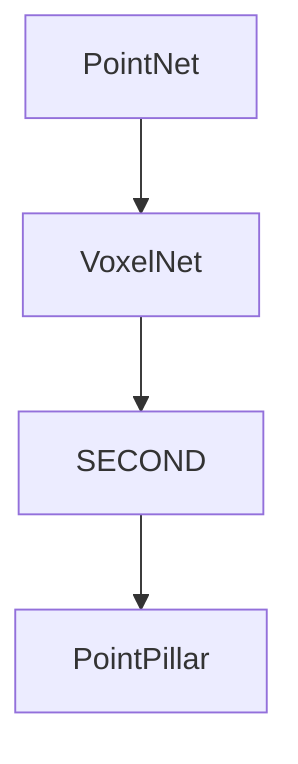
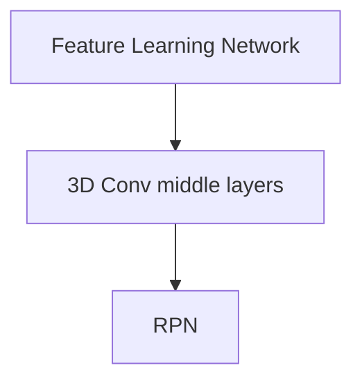
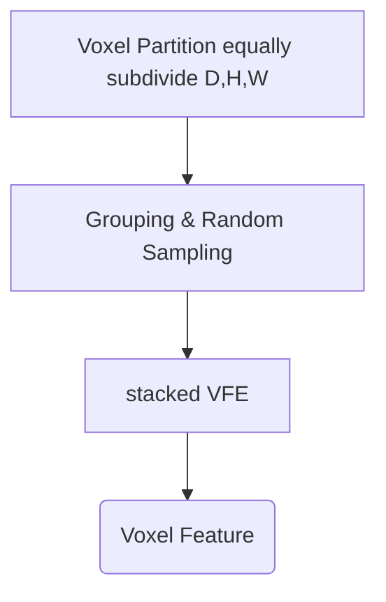
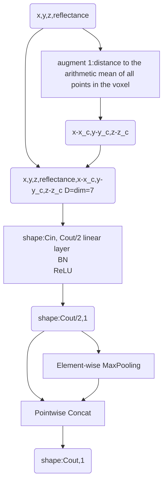

# 1. VoxelNet & History
paper:[VoxelNet: End-to-End Learning for Point Cloud Based 3D Object Detection](https://readpaper.com/pdf-annotate/note?pdfId=4498426657903370241&noteId=1957556811986596096)
Related works:
1. Several methods project point clouds into a perspective view and apply image-based feature extraction techniques.Other approaches rasterize point clouds into a 3D voxel grid and encode each voxel with handcrafted feature
2. PointNet:an end-to-end deep neural network that learns point-wise features directly from point clouds,moving from hand-crafted features to learned features.
3. RPN: Region Proposal Network
This Paper:

1. Structure:
    VFE layer: Voxel Feature Encoding layer enables inter-point interaction within a voxel;
2. Pipeline:
    1. Divides point clouds into equally spaced 3D voxels and encodes each voxel with stacked VFE layers;
    2. 3D Conv
    3. RPN
3. Advantages:This efficient algorithm benefits both from the sparse point structure and efficient parallel processing on the voxel grid.

# 2. Pipeline

## 2.1 Feature Learning Network

### 2.1.1 Voxel Fature Encoding

如何解决lidar pts不均匀的问题？
使用了element-wise max pooling，将每个voxel中的点云特征进行聚合，得到一个固定维度的特征向量。对比之下ppillar需要对每个pillar中的点云进行随机采样或者padding。
### 2.1.2 Conv middle layers
we employ three convolution middle layers sequentially as Conv3D(128, 64, 3, (2,1,1), (1,1,1)), Conv3D(64, 64, 3, (1,1,1), (0,1,1)), and Conv3D(64, 64, 3, (2,1,1), (1,1,1)), which yields a 4D tensor of size 64 × 2 × 400 × 352. After reshaping, the input to RPN is a feature map of size 128 × 400 × 352, where the dimensions correspond to channel, height, and width of the 3D tensor.
### 2.1.3 RPN

## 2.2 Loss
**Matching Assingment**:An anchor is considered as positive if it has the highest Intersection over Union (IoU) with a ground truth or its IoU with ground truth is above 0.6 (in bird's eye view). An anchor is considered as negative if the IoU between it and all ground truth boxes is less than 0.45. We treat anchors as don't care if they have0.45 ≤ IoU ≤ 0.6 with any ground truth.

**Loss Function**:We parameterize a 3D ground truth box as(xg c , yg c , zg c , lg , wg , hg , θg ), where xg c , yg c , zg c represent the center location, lg , wg , hg are length, width, height of the box, and θg is the yaw rotation around Z-axis. To retrieve the ground truth box from a matching positive anchor parameterized as (xa c , ya c , za c , la, wa, ha, θa), we define the residual vector u∗ ∈ R7 containing the 7 regression targets corresponding to center location ∆x, ∆y, ∆z, three di-mensions ∆l, ∆w, ∆h, and the rotation ∆θ, which are computed as:
$$ ∆x = \frac{x^g_c − x^a_c}{d^a} , ∆y = \frac{y^g_c − y^a_c}{d^a} , ∆z = \frac{z^g_c − z^a_c}{h^a} $$
$$∆l = log( \frac{l^g}{l^a} ), ∆w = log( \frac{w^g}{w^a} ), ∆h = log( \frac{h^g}{h^a} ) $$
$$∆θ = θ^g − θ^a $$

## 2.3 Data Augmentation
1. rotation around Z-axis and translation with respect to the center of the point cloud with collission test between two boxes;
2. random scaling [0.95, 1.05];
3. global rotation around (0,0,0);