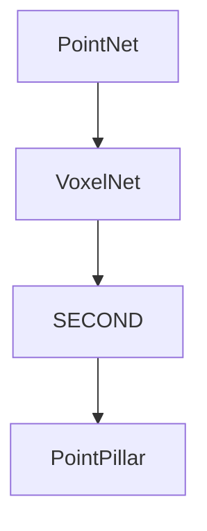

# 1. VoxelNet & History
paper:[VoxelNet: End-to-End Learning for Point Cloud Based 3D Object Detection](https://readpaper.com/pdf-annotate/note?pdfId=4498426657903370241&noteId=1957556811986596096)
Related works:
1. Several methods project point clouds into a perspective view and apply image-based feature extraction techniques.Other approaches rasterize point clouds into a 3D voxel grid and encode each voxel with handcrafted feature
2. PointNet:an end-to-end deep neural network that learns point-wise features directly from point clouds,moving from hand-crafted features to learned features.
3. RPN: Region Proposal Network
This Paper:

1. Structure:
    VFE layer: Voxel Feature Encoding layer enables inter-point interaction within a voxel;
2. Pipeline:
    1. Divides point clouds into equally spaced 3D voxels and encodes each voxel with stacked VFE layers;
    2. 3D Conv
    3. RPN
3. Advantages:This efficient algorithm benefits both from the sparse point structure and efficient parallel processing on the voxel grid.

